# Linux Services & systemd Interview Questions Deep Fundamentals

> This file is NOT for memorization. It is for building engineering thinking.

---

# How To Use This File

Do NOT memorize answers.

For every question ask yourself:

```text
Why does this exist?

↓

What problem does it solve?

↓

How does Linux implement it?

↓

How would I troubleshoot it?

↓

What breaks if it fails?
```

This is how senior engineers think.

---

# The 5 Levels Of Questions

There are 5 levels.

```text
Level 1

Definitions

---------------

Level 2

Mental Models

---------------

Level 3

Internals

---------------

Level 4

Production Systems

---------------

Level 5

Troubleshooting
```

---

# Linux Services Mindmap

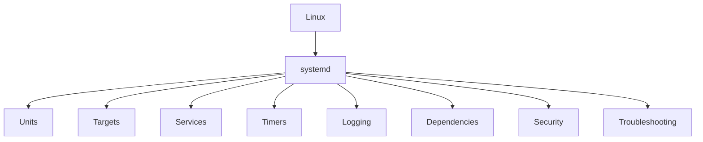

---

# SECTION 1 : First Principles Questions

---

# Q1

What is systemd?

Expected answer:

> systemd is an operating system orchestrator responsible for booting, managing, monitoring and coordinating Linux resources through dependency graphs.

Bad answer:

```text
Service manager
```

Incomplete.

---

# Q2

Why was systemd created?

Expected answer:

SysV init had problems.

```text
Sequential startup

Poor dependency management

Weak monitoring

Slow boot times

Limited observability
```

systemd solved these.

---

# Q3

What problem does systemd solve?

Expected answer:

> It transforms independent Linux components into a coordinated system.

Visual:

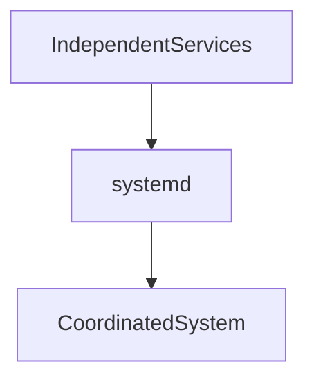

---

# Q4

Is Linux a collection of programs?

Answer:

No.

Linux is a dependency graph.

---

# Q5

Why does dependency management exist?

Answer:

Because systems have relationships.

```text
Database

↓

API

↓

Nginx
```

Without orchestration:

```text
Chaos
```

---

# SECTION 2 : Units Questions

---

# Q6

What is a unit?

Answer:

A unit is an object that systemd manages.

Examples:

```text
service

target

socket

timer

mount

swap

device

path
```

---

# Q7

What is a unit file?

Answer:

A declarative configuration file that tells Linux how a resource should behave.

---

# Q8

Where are unit files stored?

Answer:

```text
/usr/lib/systemd/system

/lib/systemd/system

/etc/systemd/system
```

---

# Q9

Difference?

```text
/usr/lib

Vendor supplied

----------------

/etc

Administrator supplied
```

---

# Q10

What are the three sections inside a service?

Answer:

```text
[Unit]

[Service]

[Install]
```

---

# Visual

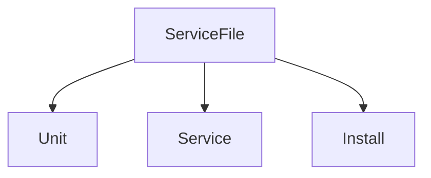

---

# SECTION 3 : Dependency Questions

---

# Q11

Difference between:

```ini
After=

Requires=
```

Answer:

```text
After

↓

Ordering

---------------

Requires

↓

Existence
```

---

# Q12

Why do engineers often write both?

```ini
Requires=postgresql.service

After=postgresql.service
```

Answer:

Because they solve different problems.

Visual:

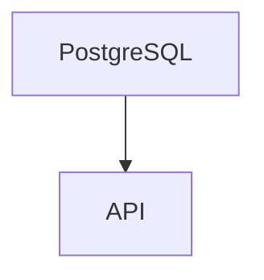

---

# Q13

Difference between Wants and Requires?

```text
Requires

Mandatory

--------------

Wants

Optional
```

---

# Q14

What is a circular dependency?

Visual:

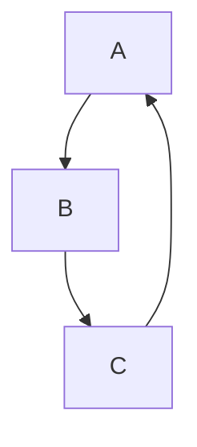

Answer:

A dependency loop that Linux cannot resolve.

---

# Q15

How can you inspect dependencies?

```bash
systemctl list-dependencies nginx
```

---

# SECTION 4 : Service Questions

---

# Q16

What is a service?

Answer:

A long-running operating system managed process.

---

# Q17

What happens when you create a service?

Answer:

An application becomes an operating system citizen.

---

# Q18

Where are custom services created?

```text
/etc/systemd/system
```

---

# Q19

Difference between process and service?

Process:

```text
Execution
```

Service:

```text
Managed execution
```

---

# Visual

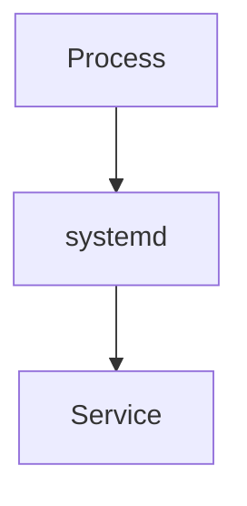

---

# Q20

Why should applications not run as root?

Answer:

Huge attack surface.

---

# SECTION 5 : systemctl Questions

---

# Q21

Difference between systemd and systemctl?

```text
systemd

↓

Brain

----------------

systemctl

↓

Control panel
```

---

# Q22

Difference between:

```bash
start

enable
```

Answer:

```text
start

Current session

--------------

enable

Future boots
```

---

# Visual

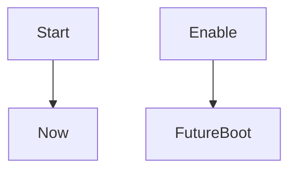

---

# Q23

What does daemon-reload do?

Answer:

systemd reloads unit definitions.

---

# Q24

When should daemon-reload be executed?

After:

```text
Creating services

Editing services

Changing unit files
```

---

# Q25

Difference between restart and reload?

Restart:

```text
Stop

↓

Start
```

Reload:

```text
Configuration update

↓

No restart
```

---

# SECTION 6 : Targets Questions

---

# Q26

What are targets?

Answer:

System states.

---

# Q27

What replaced runlevels?

```text
Targets
```

---

# Q28

What is multi-user.target?

Answer:

Server mode.

---

# Q29

What is graphical.target?

Answer:

Desktop mode.

---

# Q30

What does isolate do?

```bash
systemctl isolate rescue.target
```

Answer:

Moves the system into another state.

---

# Visual

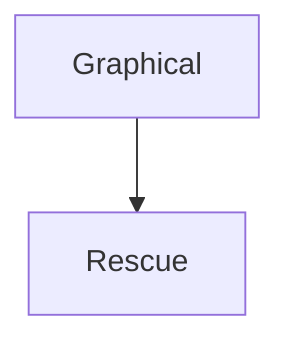

---

# SECTION 7 : Timers Questions

---

# Q31

What are timers?

Answer:

Operating system integrated schedulers.

---

# Q32

Why are timers better than cron?

Answer:

```text
Dependency aware

Persistent

Observable

Integrated
```

---

# Q33

Difference between monotonic and realtime timers?

Monotonic:

```text
Event based
```

Realtime:

```text
Clock based
```

---

# Q34

Do timers execute scripts?

No.

Timers execute services.

---

# Visual

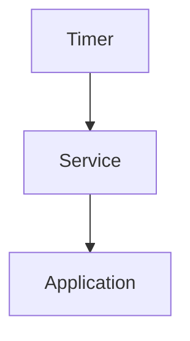

---

# SECTION 8 : Logging Questions

---

# Q35

What is journald?

Answer:

Log collector.

---

# Q36

What is journalctl?

Answer:

Log query engine.

---

# Q37

Difference?

```text
journald

Stores

------------

journalctl

Reads
```

---

# Q38

Why logs exist?

Answer:

Linux needs memory.

---

# Q39

Where are persistent journal logs stored?

```text
/var/log/journal
```

---

# Q40

How to inspect logs?

```bash
journalctl -u nginx
```

---

# SECTION 9 : rsyslog Questions

---

# Q41

Why does rsyslog still exist?

Answer:

Transportation and routing.

---

# Q42

Difference?

```text
journald

Collects

---------------

rsyslog

Transports
```

---

# Q43

What are facilities?

Examples:

```text
auth

kernel

daemon

mail
```

---

# SECTION 10 : Security Questions

---

# Q44

What is the principle of least privilege?

Answer:

Give minimum permissions necessary.

---

# Q45

Why should NoNewPrivileges=true be used?

Answer:

Prevent privilege escalation.

---

# Q46

What does ProtectSystem=strict do?

Answer:

Makes system directories read-only.

---

# Q47

What does PrivateTmp=true do?

Answer:

Creates isolated /tmp directories.

---

# SECTION 11 : Production Questions

---

# Q48

Website is down.

Where do you start?

Expected workflow:

```text
Status

↓

Logs

↓

Dependencies

↓

Resources

↓

Network

↓

Root Cause
```

---

# Visual

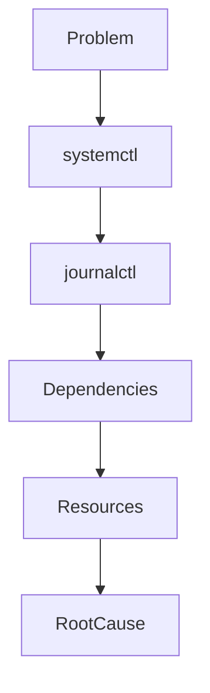

---

# Q49

A service repeatedly restarts. What do you investigate?

Answer:

```text
Logs

Memory

Dependencies

Configuration

Permissions
```

---

# Q50

Disk is full. What happens?

Possible cascade:

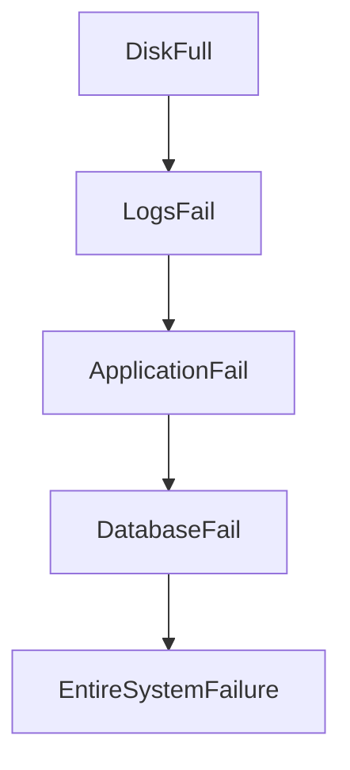

---

# SECTION 12 : Senior Engineer Questions

These are extremely important.

---

# Q51

How is systemd similar to Kubernetes?

Answer:

Both are orchestrators.

```text
systemd

↓

Services

---------------

Kubernetes

↓

Pods
```

---

# Q52

How is systemd similar to Docker?

Answer:

Both leverage Linux primitives.

```text
Namespaces

cgroups

Capabilities
```

---

# Q53

What is the biggest mistake beginners make?

Answer:

Thinking Linux starts services.

Linux actually solves dependency graphs.

---

# Q54

If you could describe systemd in one sentence?

Answer:

> systemd is a dependency graph solver for an entire operating system.

---

# Ultimate Mental Models

Remember these forever.

---

# Mental Model 1

```text
Linux

≠

Programs

Linux

=

Dependency Graph
```

---

# Mental Model 2

```text
systemd

=

Operating System Orchestrator
```

---

# Mental Model 3

```text
Services

=

Operating System Citizens
```

---

# Mental Model 4

```text
Logs

=

Memory
```

---

# Mental Model 5

```text
Troubleshooting

=

Reconstructing Reality From Evidence
```

---

# The Ultimate Visual

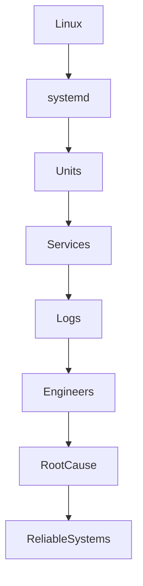

---

# Engineering Mindset

Do not prepare for interviews like this:

```text
Question

↓

Answer

↓

Memorize
```

Prepare like this:

```text
Problem

↓

Mental Model

↓

First Principles

↓

System Thinking

↓

Answer
```

---

# Mental Model To Remember Forever

```text
Junior Engineers

↓

Memorize Commands

----------------

Senior Engineers

↓

Understand Systems
```

That single idea explains how to approach Linux interviews.
