# journalctl Deep Fundamentals

> Understanding how Linux remembers its past and how engineers investigate the history of an operating system.

---

# Learning Goals

By the end of this file, you will understand:

- What journalctl is
- Why logs exist
- Why journalctl was created
- journald architecture
- Binary logging
- Log lifecycle
- Boot logging
- Service logging
- Structured logging
- Filtering logs
- Log priorities
- Persistent logging
- Production troubleshooting workflows
- Cloud observability concepts

---

# First Principles

Imagine this scenario.

Your production server crashes at:

```text
02:17 AM
```

Nobody was watching.

Question:

How do you know what happened?

The operating system needs memory.

That memory is:

```text
Logs
```

---

# The Biggest Idea

Logs are:

> Historical records of events that occurred inside an operating system.

journalctl is:

> The search engine used to reconstruct those events.

---

# The Mental Model

Think of Linux as a city.

```text
Linux = City

systemd = Mayor

Services = Workers

Events = Activities

Logs = CCTV recordings

journalctl = CCTV search system
```

---

# Questions Engineers Ask Daily

```text
Why did nginx crash?

Why is Docker failing?

Why did boot become slow?

Why is the network unavailable?

What happened at 3 AM?

Why is memory exhausted?
```

journalctl answers these questions.

---

# The Logging Problem

Without logs:

```text
Application crashes

↓

Nobody knows why
```

With logs:

```text
Application crashes

↓

Logs exist

↓

Root cause discovered
```

---

# Linux Logging Evolution

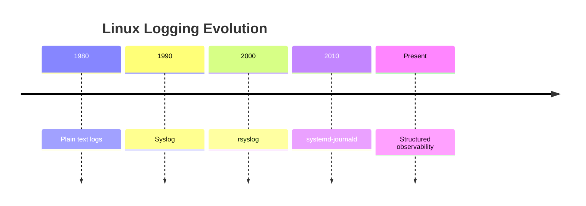

---

# Where Does journalctl Fit?

Important.

People confuse these.

```text
journalctl

↓

Tool

--------------

journald

↓

Logging daemon
```

---

# Architecture Overview

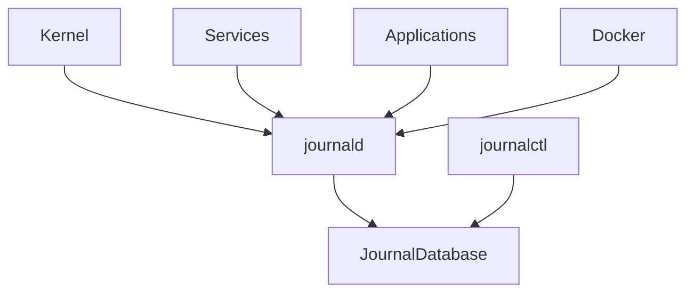

---

# Event Flow

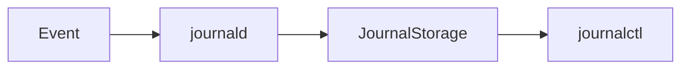

---

# What Generates Logs?

Almost everything.

Examples:

```text
Kernel

systemd

Services

Applications

Docker

Authentication

Hardware

Network
```

---

# Examples

```text
sshd

nginx

docker

postgresql

redis

kernel
```

All generate logs.

---

# What Is journald?

journald is a daemon.

Responsibilities:

```text
Collect logs

Store logs

Index logs

Tag logs

Expose logs
```

---

# journald Is A Central Hub

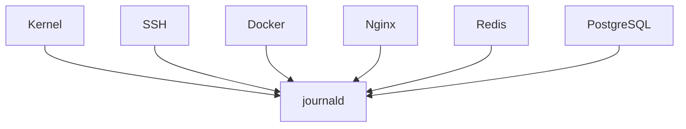

---

# Why Was journald Created?

Before:

```text
Application A

↓

File A

Application B

↓

File B

Application C

↓

File C
```

Problems:

```text
Scattered

Inconsistent

Hard to search

Hard to correlate
```

---

# journald Solves This

Everything becomes centralized.

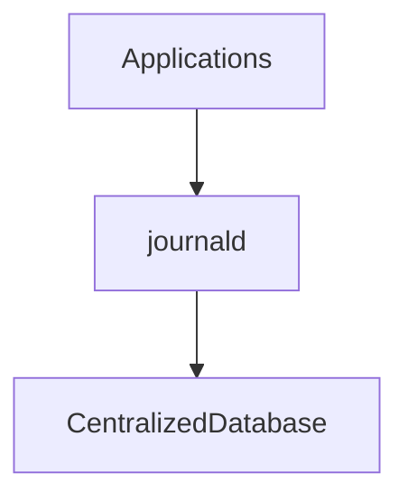

---

# Where Are Logs Stored?

Default:

```text
/run/log/journal
```

Temporary.

Persistent storage:

```text
/var/log/journal
```

Persistent across reboots.

---

# Memory vs Persistent Storage

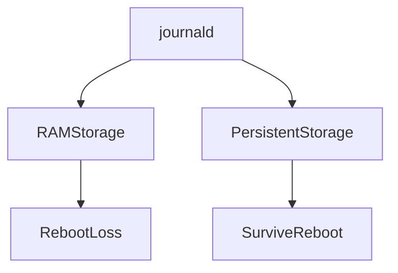

---

# Enable Persistent Logs

Create directory:

```bash
sudo mkdir -p /var/log/journal
```

Restart journald:

```bash
sudo systemctl restart systemd-journald
```

---

# Basic Command

Show all logs.

```bash
journalctl
```

---

# The Problem

Large systems produce huge logs.

```text
Millions of events
```

Filtering is essential.

---

# Most Important Filters

```text
Service

Boot

Time

Priority

PID

User

Kernel
```

---

# View Current Boot

```bash
journalctl -b
```

Meaning:

```text
Current boot only
```

---

# Visual

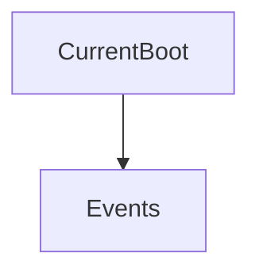

---

# View Previous Boot

```bash
journalctl -b -1
```

Boot before current.

---

# Boot Timeline

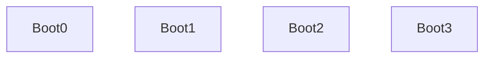

---

# View Service Logs

```bash
journalctl -u nginx
```

Visual:

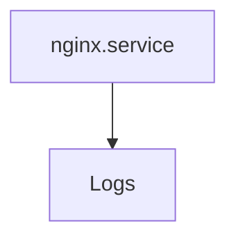

---

# Multiple Services

```bash
journalctl -u nginx -u docker
```

---

# Follow Logs

Live monitoring.

```bash
journalctl -f
```

Equivalent idea:

```text
tail -f
```

Visual:

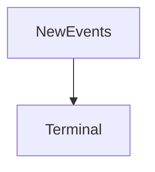

---

# Follow Specific Service

```bash
journalctl -u nginx -f
```

---

# Time Filtering

After:

```bash
journalctl --since today
```

---

# Last Hour

```bash
journalctl --since "1 hour ago"
```

---

# Specific Date

```bash
journalctl --since "2026-06-01"
```

---

# Date Range

```bash
journalctl --since yesterday --until now
```

---

# Time Filtering Visual

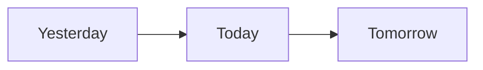

---

# Priority Levels

Linux assigns priorities.

Numbers:

```text
0 Emergency

1 Alert

2 Critical

3 Error

4 Warning

5 Notice

6 Info

7 Debug
```

---

# Priority Pyramid

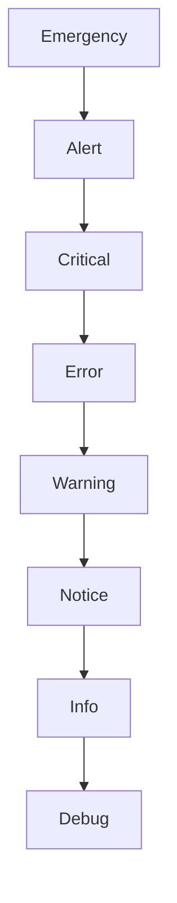

---

# Show Errors Only

```bash
journalctl -p err
```

---

# Show Warnings And Above

```bash
journalctl -p warning
```

---

# Kernel Logs

Kernel debugging.

```bash
journalctl -k
```

Visual:

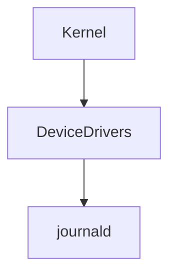

---

# PID Filtering

Show specific process.

```bash
journalctl _PID=1234
```

---

# User Filtering

```bash
journalctl _UID=1000
```

---

# Executable Filtering

```bash
journalctl /usr/bin/sshd
```

---

# Search Patterns

Use grep.

```bash
journalctl | grep error
```

---

# Reverse Order

Newest first.

```bash
journalctl -r
```

---

# Last 100 Lines

```bash
journalctl -n 100
```

---

# Disable Pager

```bash
journalctl --no-pager
```

Useful in scripts.

---

# Structured Logging

One of journald's superpowers.

Each log has metadata.

Example:

```text
Timestamp

Hostname

Unit

PID

UID

Priority

Message
```

---

# Structured Data Visual

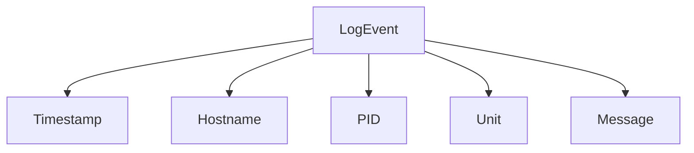

---

# Service Troubleshooting Workflow

Question:

Nginx failed.

Step 1

```bash
systemctl status nginx
```

Step 2

```bash
journalctl -u nginx
```

Step 3

```bash
journalctl -u nginx -p err
```

Step 4

```bash
journalctl -u nginx --since "1 hour ago"
```

---

# Boot Troubleshooting Workflow

Question:

Linux boot became slow.

Commands:

```bash
journalctl -b
```

and

```bash
systemd-analyze
```

Visual:

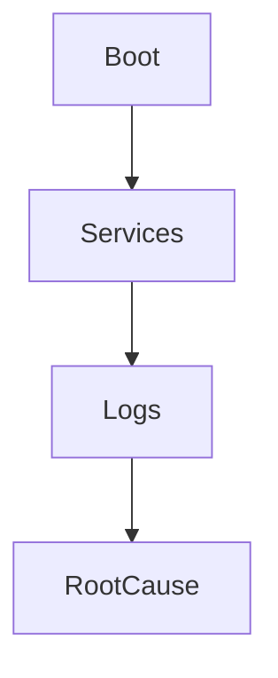

---

# Memory Troubleshooting Workflow

Question:

Server crashed.

Investigate.

```bash
journalctl -k
```

Look for:

```text
OOM Killer

Memory pressure

Kernel panic
```

---

# Authentication Troubleshooting

Investigate SSH.

```bash
journalctl -u ssh
```

Look for:

```text
Failed passwords

Authentication failures

Disconnected users
```

---

# Production Example

Web stack:

```text
Nginx

API

Redis

PostgreSQL
```

Visual:

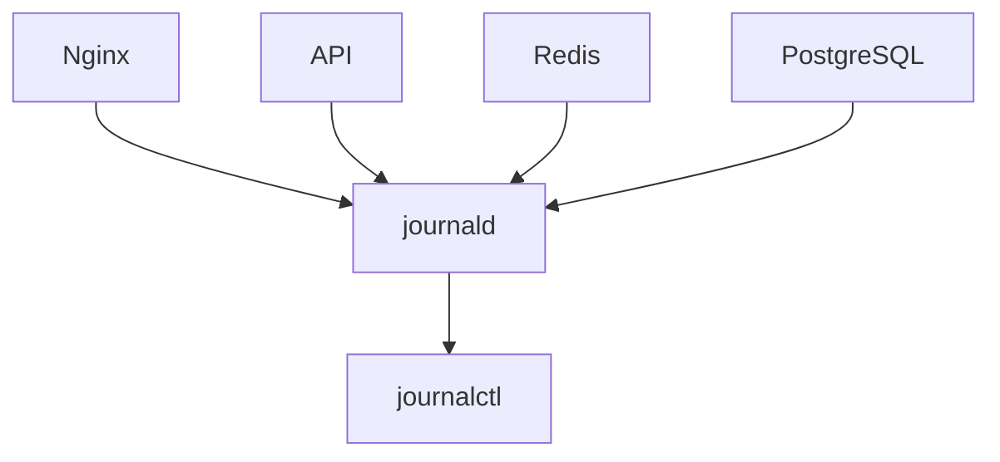

---

# Cloud Infrastructure Example

AWS VM.

Services:

```text
cloud-init

ssh

docker

monitoring
```

Everything logs centrally.

---

# Kubernetes Relationship

Nodes still use journalctl.

Visual:

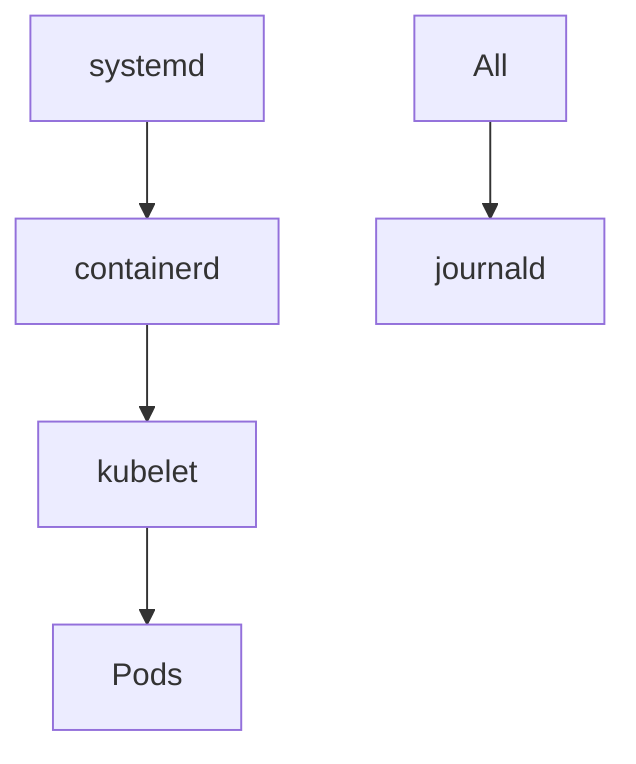

---

# journalctl vs tail

| tail | journalctl |
|------|------------|
| Plain text | Structured |
| Single file | Centralized |
| Limited filtering | Powerful filtering |
| No metadata | Metadata |
| File dependent | System aware |

---

# Production Commands Cheat Sheet

Current boot:

```bash
journalctl -b
```

Previous boot:

```bash
journalctl -b -1
```

Service:

```bash
journalctl -u nginx
```

Live:

```bash
journalctl -f
```

Errors:

```bash
journalctl -p err
```

Kernel:

```bash
journalctl -k
```

Recent:

```bash
journalctl --since "1 hour ago"
```

---

# Common Beginner Mistakes

## Mistake 1

Thinking journalctl stores logs.

Wrong.

journald stores logs.

journalctl reads them.

---

## Mistake 2

Ignoring boot logs.

Many problems start there.

---

## Mistake 3

Using only grep.

Use native filters.

---

## Mistake 4

Not enabling persistence.

Very common.

---

# Engineering Mindset

Do not think:

```text
Logs are text files
```

Think:

```text
Logs are the memory of an operating system
```

That is much more accurate.

---

# Mental Model To Remember Forever

```text
Event

↓

journald

↓

Journal Database

↓

journalctl

↓

Engineer

↓

Root Cause
```

Or even simpler:

```text
If Linux had memories,

journalctl is how engineers read them.
```

That single sentence explains the entire purpose of journalctl.
