# Linux Logging Architecture Deep Fundamentals

> Understanding how an entire operating system produces, transports, stores, indexes, searches, and analyzes information about itself.

---

# Learning Goals

By the end of this file, you will understand:

- Why logging architecture exists
- Why logs are data pipelines
- Event lifecycle
- Log producers
- Log collectors
- Log transport
- Log storage
- Log querying
- Log analysis
- Linux logging architecture
- journald architecture
- rsyslog architecture
- Cloud logging architecture
- Observability foundations

---

# First Principles

Imagine a Linux server.

Inside it:

```text
CPU

RAM

Kernel

Nginx

Docker

Redis

PostgreSQL

Applications

SSH

Users
```

Question:

> How do engineers know what these components are doing?

Answer:

```text
Logs
```

But that's not the real question.

The real question is:

> How do these logs travel through the operating system?

---

# The Biggest Misconception

Most beginners think:

```text
Application

↓

File
```

Wrong.

Logging is an architecture.

---

# The Biggest Idea

Logging is:

> An event processing pipeline that transforms system activities into searchable historical information.

---

# Think Like A Water System

Imagine a city.

```text
Homes

↓

Pipes

↓

Water Treatment Plant

↓

Reservoir

↓

Monitoring Center
```

Linux logging works similarly.

```text
Applications

↓

Collectors

↓

Storage

↓

Query Engine

↓

Engineers
```

---

# Mental Model

```text
Linux = City

Events = Water

journald = Treatment Plant

Storage = Reservoir

journalctl = Search Engine

Engineer = Investigator
```

---

# The Event Journey

Everything begins with an event.

Examples:

```text
User login

CPU overload

Docker restart

Application crash

SSH failure

Kernel panic
```

Events become logs.

---

# Event Lifecycle

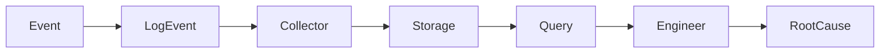

---

# Linux Logging Pipeline

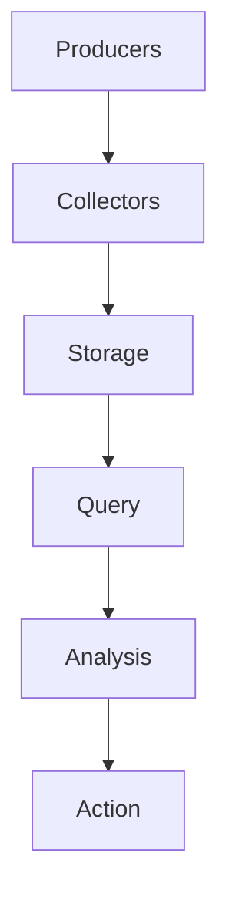

---

# The Five Components

Every logging architecture has:

```text
Producers

Collectors

Storage

Query Layer

Analysis Layer
```

---

# 1 Producers

Something creates information.

Examples:

```text
Kernel

systemd

SSH

Nginx

Docker

Redis

PostgreSQL

Applications
```

---

# Producer Visualization

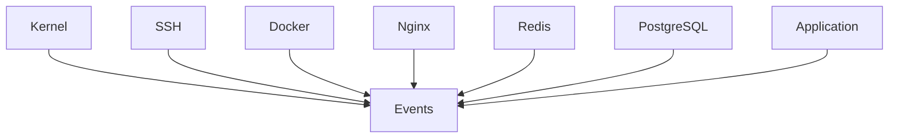

---

# 2 Collectors

Collectors gather events.

Linux uses:

```text
journald

rsyslog
```

Think:

```text
Air traffic controllers
```

---

# Collector Visualization

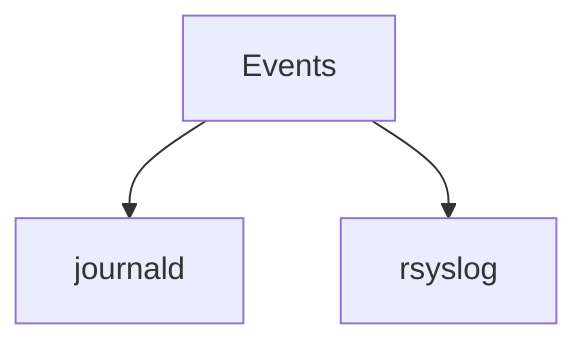

---

# 3 Storage

Logs must survive.

Storage options:

```text
RAM

Disk

Remote servers

Cloud systems
```

---

# Storage Visualization

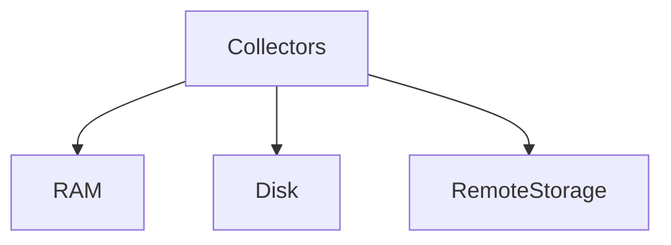

---

# 4 Query Layer

Engineers need search.

Tools:

```text
journalctl

grep

tail

less
```

---

# Query Visualization

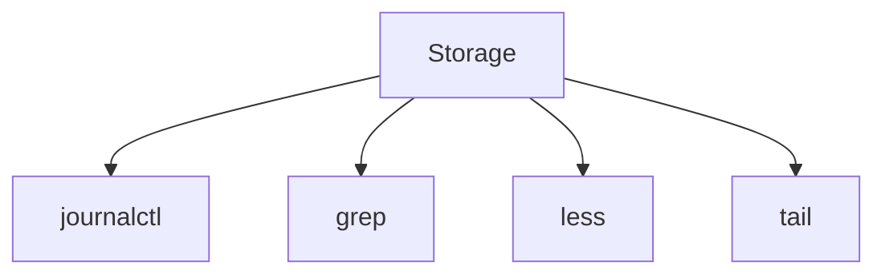

---

# 5 Analysis Layer

Humans investigate.

Questions:

```text
What happened?

When?

Why?

Where?

How?
```

---

# Linux Logging Architecture

High level.

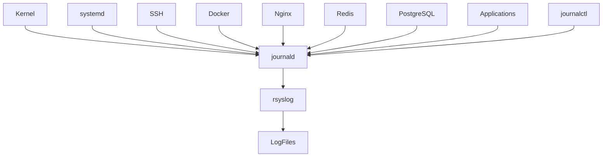

---

# Step 1 : Event Happens

Examples:

```text
SSH Login

Database Crash

Docker Restart

API Error
```

Visual:

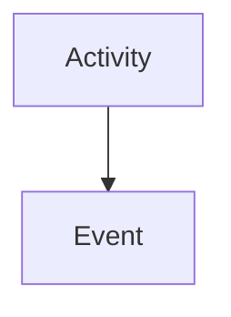

---

# Step 2 : Event Gets Metadata

Logs become rich objects.

Metadata:

```text
Timestamp

Hostname

PID

UID

Priority

Unit

Message
```

---

# Metadata Visualization

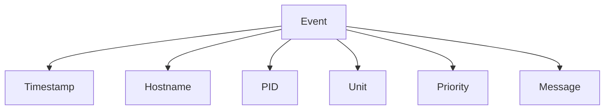

---

# Step 3 : journald Collects

journald daemon.

Responsibilities:

```text
Receive events

Index events

Store events

Tag events
```

---

# journald Architecture

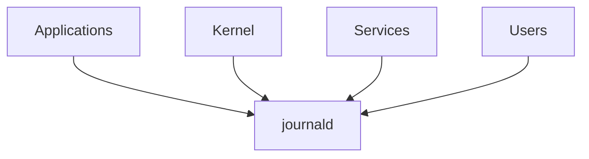

---

# journald Is NOT journalctl

People confuse these.

Wrong:

```text
journalctl stores logs
```

Correct:

```text
journald

↓

Stores

---------------

journalctl

↓

Reads
```

---

# journald Storage Locations

Temporary:

```text
/run/log/journal
```

Persistent:

```text
/var/log/journal
```

---

# Storage Architecture

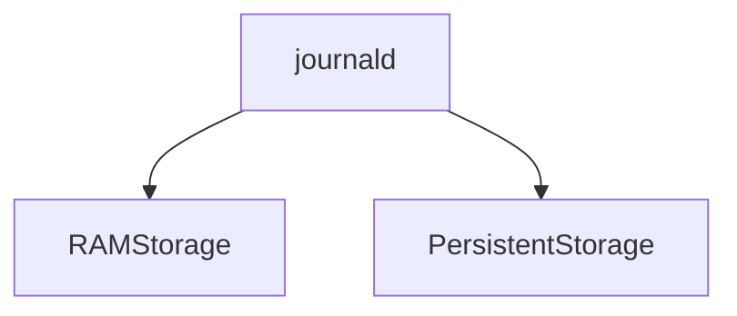

---

# Why Binary Logs?

People ask:

> Why not plain text?

Advantages:

```text
Fast

Indexed

Structured

Searchable

Metadata rich
```

Tradeoff:

```text
Not human readable
```

---

# Step 4 : rsyslog

Traditional Linux logger.

Responsibilities:

```text
Receive logs

Forward logs

Write files

Send remote logs
```

---

# rsyslog Architecture

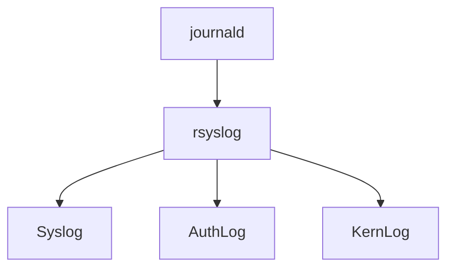

---

# Traditional Files

Ubuntu:

```text
/var/log/syslog

/var/log/auth.log

/var/log/kern.log
```

RHEL:

```text
/var/log/messages

/var/log/secure

/var/log/boot.log
```

---

# Step 5 : Query Engine

Tools:

```text
journalctl

grep

tail

less
```

Visual:

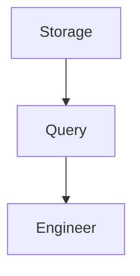

---

# Modern Linux Architecture

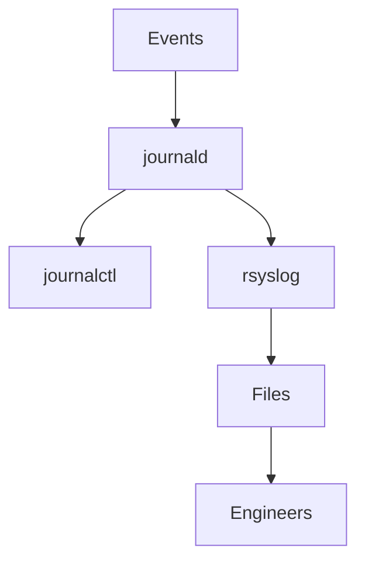

---

# Structured Logging

This changed Linux forever.

Old logging:

```text
Something failed
```

Modern logging:

```text
Timestamp

Host

PID

Unit

Priority

Message
```

---

# Example

```text
Timestamp:
2026-06-19

Host:
server-01

Unit:
nginx.service

Priority:
error

Message:
Connection timeout
```

---

# Priority Levels

```text
0 Emergency

1 Alert

2 Critical

3 Error

4 Warning

5 Notice

6 Info

7 Debug
```

---

# Priority Pyramid

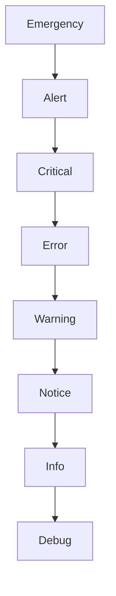

---

# Boot Logging Architecture

Boot is fully logged.

Visual:

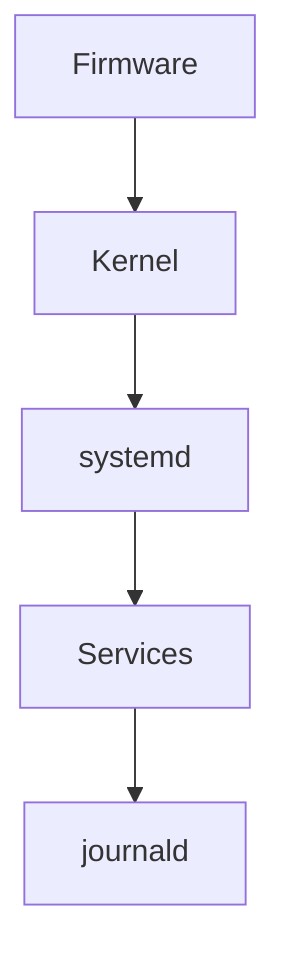

---

# Production Architecture Example

System:

```text
Nginx

API

Redis

PostgreSQL
```

Visual:

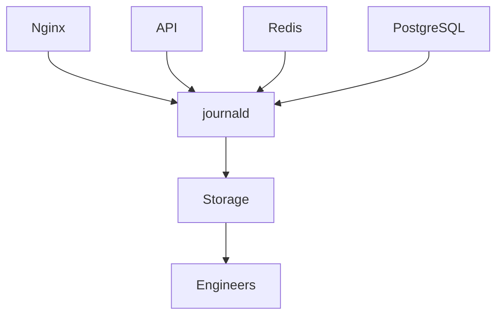

---

# Container Architecture

Containers still use Linux logging.

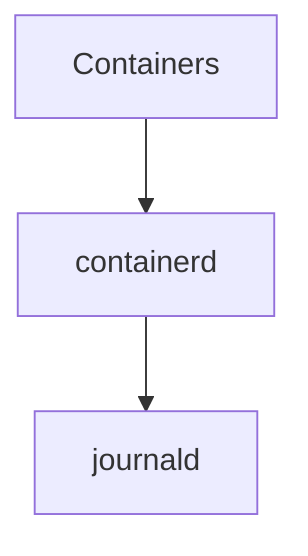

---

# Kubernetes Architecture

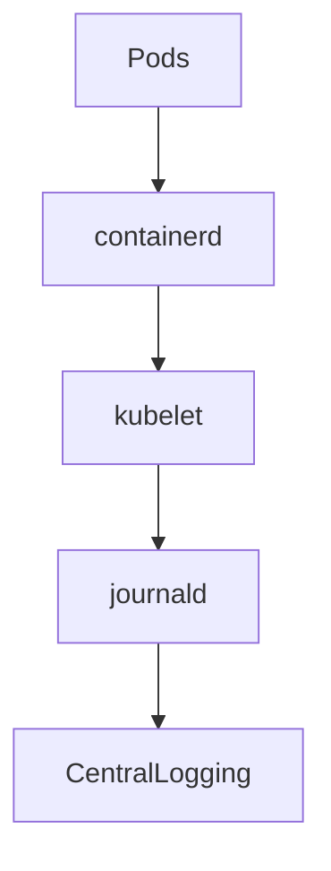

---

# Cloud Architecture

Modern companies centralize logs.

Visual:

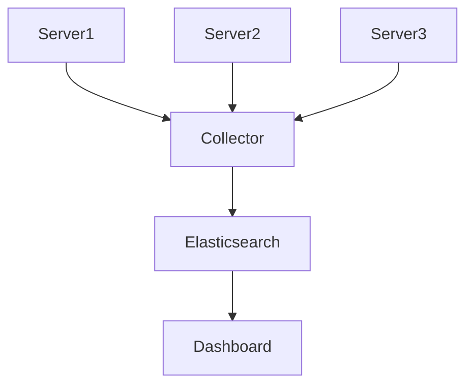

---

# Why Centralized Logging Exists

Imagine:

```text
1000 servers

↓

Millions of logs
```

Without centralization:

```text
Chaos
```

With centralization:

```text
Searchable systems
```

---

# Observability Relationship

Logs are one pillar.

```mermaid
flowchart TD

Observability

Observability --> Logs

Observability --> Metrics

Observability --> Traces
```

---

# Difference

Logs:

```text
What happened?
```

Metrics:

```text
How much?
```

Traces:

```text
Where did it happen?
```

---

# Production Incident Workflow

Alert:

```text
Website down
```

Workflow:

```mermaid
flowchart TD

Alert

Alert --> Logs

Logs --> Timeline

Timeline --> RootCause

RootCause --> Fix

Fix --> Prevention
```

---

# Production Engineer Workflow

Question:

Website is slow.

Investigate:

```text
Nginx logs

↓

API logs

↓

Redis logs

↓

Database logs

↓

Timeline

↓

Root cause
```

---

# Logging Challenges

Large systems create:

```text
Millions of logs/day
```

Problems:

```text
Storage

Noise

Cost

Search complexity
```

---

# Good Logging Principles

Logs should answer:

```text
Who?

What?

When?

Where?

Why?
```

---

# Bad Log Example

```text
Something failed
```

Worthless.

---

# Good Log Example

```text
Database connection failed

Host=api-01

Port=5432

Retry=3

Error=timeout
```

---

# Common Beginner Mistakes

## Mistake 1

Thinking logs are files.

Wrong.

Logs are pipelines.

---

## Mistake 2

Ignoring metadata.

Metadata is critical.

---

## Mistake 3

Not centralizing logs.

Bad for production.

---

## Mistake 4

Logging too much.

Creates noise.

---

# Engineering Mindset

Do not think:

```text
Applications create log files
```

Think:

```text
Operating systems generate event streams
```

That is much more accurate.

---

# Mental Model To Remember Forever

```text
Event

↓

Collector

↓

Storage

↓

Query

↓

Engineer

↓

Root Cause
```

Or even simpler:

```text
Logging is a distributed data pipeline inside an operating system.
```

That single sentence explains modern logging architecture.
