# logrotate Deep Fundamentals

> Understanding how Linux manages the lifecycle of historical information without exhausting storage resources.

---

# Learning Goals

By the end of this file, you will understand:

- What logrotate is
- Why log rotation exists
- Why logs are a storage problem
- Log lifecycle management
- Rotation architecture
- Compression
- Retention policies
- Archiving
- Deletion strategies
- Production log management
- Observability relationships
- Reliability engineering patterns

---

# First Principles

Imagine a server running nginx.

Every second:

```text
Requests arrive

↓

Access logs generated

↓

Error logs generated
```

Question:

What happens after:

```text
1 hour ?

1 day ?

1 week ?

1 year ?
```

Logs continuously grow.

Eventually:

```text
Disk full

↓

Applications fail

↓

Databases fail

↓

Operating system unstable
```

This is why log rotation exists.

---

# The Biggest Misconception

People think:

```text
logrotate

↓

Delete logs
```

Wrong.

logrotate is:

> A log lifecycle management system.

---

# The Biggest Idea

logrotate answers these questions:

```text
When should logs rotate?

↓

How long should logs live?

↓

Should logs be compressed?

↓

When should logs be deleted?

↓

Where should archives go?
```

---

# Human Analogy

Think about office documents.

Without organization:

```text
New papers

↓

Pile up

↓

Desk explodes
```

With organization:

```text
Current documents

↓

Archive documents

↓

Compress archives

↓

Delete old archives
```

Linux does exactly this.

---

# Mental Model

```text
Linux = Library

Logs = Books

logrotate = Librarian

Storage = Shelves

Engineers = Readers
```

---

# The Storage Problem

Imagine nginx.

Traffic:

```text
10,000 requests/sec
```

Log generation:

```text
1 KB/request
```

Calculation:

```text
10 MB/sec

↓

600 MB/min

↓

36 GB/hour

↓

864 GB/day
```

Logs can become huge.

---

# Log Lifecycle

Every log has a lifecycle.

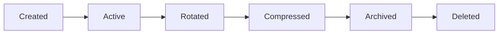

---

# Linux Logging Architecture

Review.

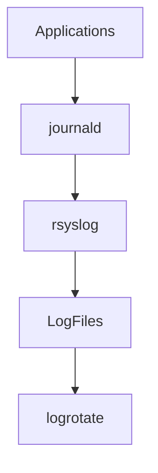

---

# Position Of logrotate

Very important.

logrotate is NOT a logger.

It is NOT a collector.

It is:

```text
Lifecycle manager
```

---

# Full Architecture

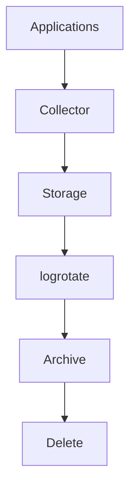

---

# Why Rotation Exists

Without rotation:

```text
Log files

↓

Grow forever
```

Problems:

```text
Disk full

Slow backups

Slow searches

Higher costs

System crashes
```

---

# How Rotation Works

Question:

What happens during rotation?

Example:

Current:

```text
access.log
```

Rotate:

```text
access.log.1
```

New file:

```text
access.log
```

created again.

---

# Visual

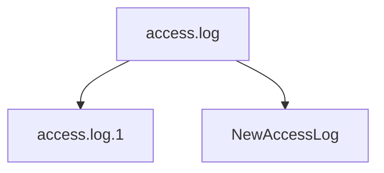

---

# Step By Step

Before:

```text
access.log
```

Rotate.

After:

```text
access.log

access.log.1

access.log.2
```

Eventually:

```text
access.log.7

↓

Delete
```

---

# Lifecycle Visualization

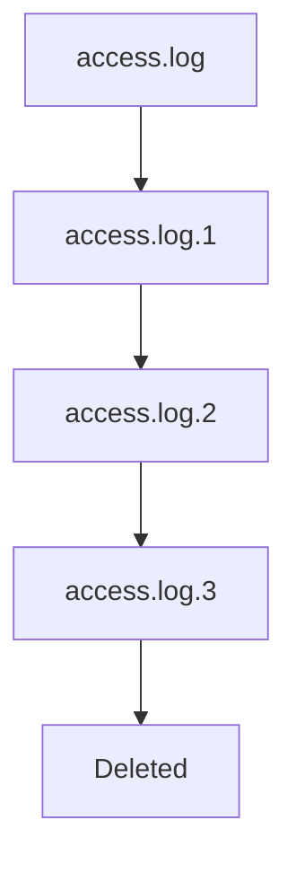

---

# Main Configuration

Location:

```text
/etc/logrotate.conf
```

Additional:

```text
/etc/logrotate.d/
```

---

# Architecture

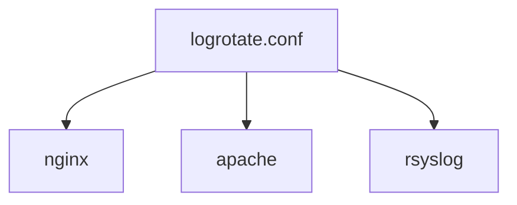

---

# Configuration Example

```conf
/var/log/nginx/*.log {

daily

rotate 7

compress

missingok

notifempty

create 0640 nginx adm

}
```

---

# Understanding Directives

---

# daily

Rotate every day.

```conf
daily
```

---

# weekly

Rotate weekly.

```conf
weekly
```

---

# monthly

Rotate monthly.

```conf
monthly
```

---

# Time Visualization


---

# rotate

How many archives to keep.

Example:

```conf
rotate 7
```

Meaning:

```text
7 old copies

↓

Delete older ones
```

---

# compress

Compress old logs.

```conf
compress
```

Example:

```text
access.log.1.gz
```

---

# Compression Visualization

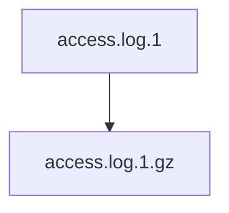

---

# delaycompress

Wait one cycle.

Example:

```text
Today

↓

Rotate

↓

Tomorrow compress
```

Useful for active applications.

---

# notifempty

Do not rotate empty logs.

```conf
notifempty
```

---

# missingok

Ignore missing files.

```conf
missingok
```

---

# create

Create new file.

Example:

```conf
create 0640 nginx adm
```

Meaning:

```text
Permissions

Owner

Group
```

---

# Rotation Triggers

Two categories exist.

```text
Time based

Size based
```

---

# Time Based

Examples:

```conf
daily

weekly

monthly
```

---

# Size Based

Examples:

```conf
size 100M
```

Rotate after:

```text
100 MB
```

---

# Visual

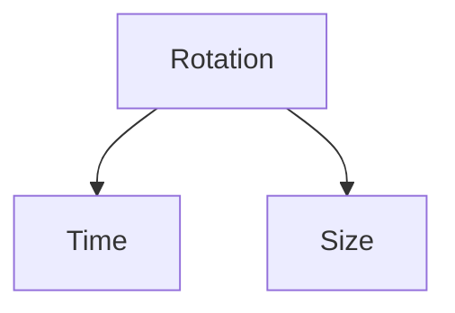

---

# Maximum Size

```conf
maxsize 500M
```

---

# Minimum Size

```conf
minsize 10M
```

---

# Date Extension

```conf
dateext
```

Instead of:

```text
access.log.1
```

You get:

```text
access.log-20260619
```

---

# Archive Visualization

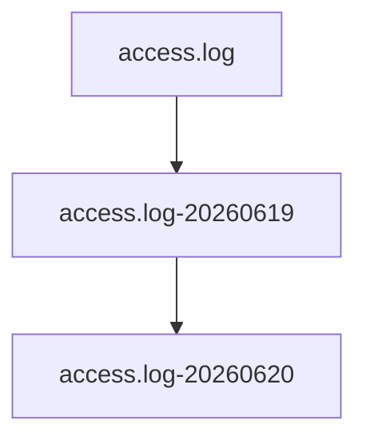

---

# What Happens Internally?

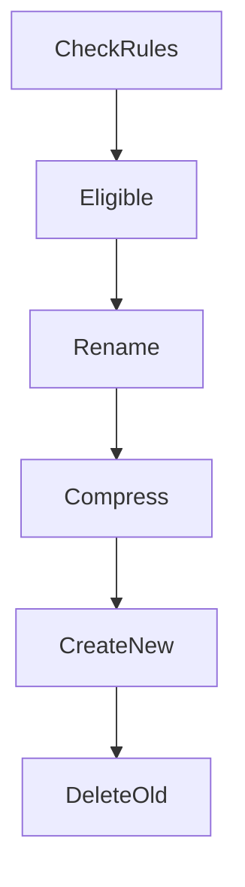

---

# Who Executes logrotate?

Usually:

```text
cron

or

systemd timer
```

Modern systems:

```text
logrotate.timer
```

---

# Visual

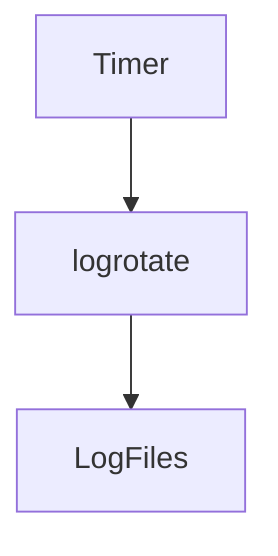

---

# Check Timer

```bash
systemctl status logrotate.timer
```

---

# View Schedule

```bash
systemctl list-timers
```

---

# Force Rotation

Useful for testing.

```bash
sudo logrotate -f /etc/logrotate.conf
```

---

# Debug Mode

Very useful.

```bash
sudo logrotate -d /etc/logrotate.conf
```

No changes happen.

---

# Verbose Mode

```bash
sudo logrotate -v /etc/logrotate.conf
```

Shows execution details.

---

# State File

logrotate remembers history.

Location:

```text
/var/lib/logrotate/status
```

---

# State Visualization

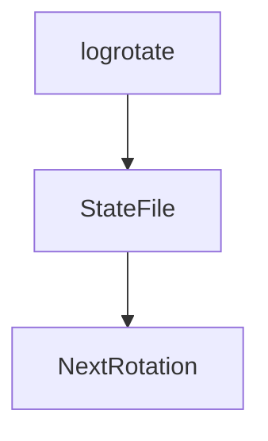

---

# Production Example

Nginx server.

Current:

```text
access.log

error.log
```

After one week:

```text
access.log

access.log.1.gz

access.log.2.gz

access.log.3.gz
```

---

# Enterprise Architecture

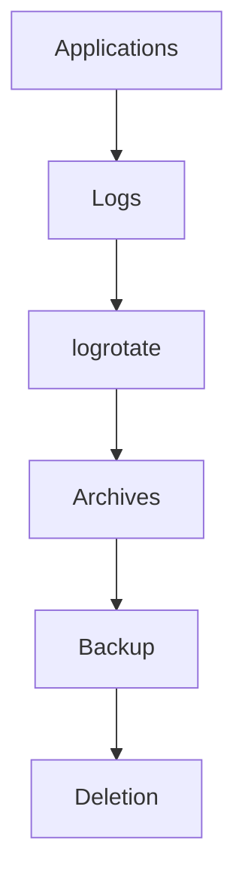

---

# Storage Engineering Relationship

This file connects directly to storage management.

Question:

What are we optimizing?

```text
Disk space

Performance

Retention

Compliance

Costs
```

---

# Cloud Example

AWS EC2.

Services:

```text
Nginx

Docker

API

Monitoring
```

All need retention policies.

---

# Kubernetes Relationship

Containers generate enormous logs.

Visual:

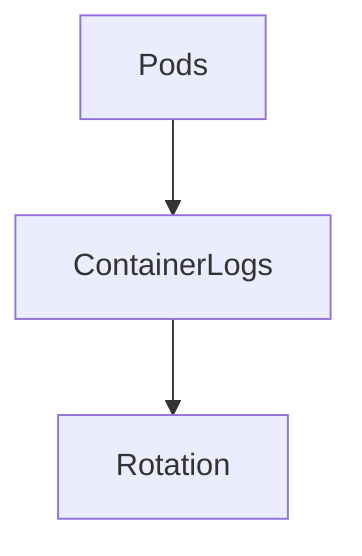

---

# Production Policies

Different systems need different retention.

Example:

Authentication:

```text
90 days
```

Application:

```text
30 days
```

Debug:

```text
7 days
```

---

# Common Enterprise Strategy

```text
7 days

↓

30 days compressed

↓

90 days archived

↓

Delete
```

---

# Production Workflow

Question:

Disk is full.

Investigate.

Step 1

Check usage.

```bash
df -h
```

Step 2

Find huge logs.

```bash
du -sh /var/log/*
```

Step 3

Inspect logrotate.

```bash
cat /etc/logrotate.conf
```

Step 4

Inspect application configs.

```bash
ls /etc/logrotate.d/
```

---

# Common Beginner Mistakes

## Mistake 1

Thinking logs are infinite.

Storage is finite.

---

## Mistake 2

Never compressing logs.

Wasteful.

---

## Mistake 3

Keeping logs forever.

Very expensive.

---

## Mistake 4

Using the same retention everywhere.

Bad practice.

---

# Engineering Mindset

Do not think:

```text
logrotate manages files
```

Think:

```text
logrotate manages the lifecycle of historical information
```

That is much more accurate.

---

# Mental Model To Remember Forever

```text
Events

↓

Logs

↓

Storage

↓

Rotation

↓

Archive

↓

Deletion
```

Or even simpler:

```text
logrotate is Linux's garbage collector for historical information.
```

That single sentence explains the entire purpose of logrotate.
