# Linux Logs Deep Fundamentals

> Understanding how Linux remembers, explains, and tells the story of everything happening inside an operating system.

---

# Learning Goals

By the end of this file, you will understand:

- Why logs exist
- Why logging is one of the most important engineering disciplines
- Linux logging architecture
- Event lifecycle
- Log producers
- Log consumers
- Logging pipelines
- Logging storage
- journald
- rsyslog
- Log rotation
- Structured logging
- Observability fundamentals
- Production debugging methodologies
- Cloud logging systems

---

# First Principles

Imagine a server crashes at:

```text
02:17 AM
```

Nobody is watching.

Questions:

```text
What happened?

Why did it happen?

When did it happen?

Who caused it?

What broke first?

What failed next?

How can we prevent it?
```

How do engineers answer these questions?

The answer:

```text
Logs
```

---

# The Biggest Idea

Logs are not text files.

Logs are:

> Historical records that describe everything an operating system experiences.

Think:

```text
Logs = Memory
```

Without logs:

```text
Operating system

↓

Amnesia
```

---

# Human Brain Analogy

Imagine humans without memory.

```text
Conversation happens

↓

Immediately forgotten
```

Impossible to learn.

Linux would be the same.

---

# The Mental Model

Think of Linux as a city.

```text
Linux = City

systemd = Mayor

Services = Workers

Events = Activities

Logs = CCTV Cameras

Engineers = Detectives
```

---

# Questions Engineers Ask Daily

```text
Why is nginx down?

Why is Docker failing?

Who logged in?

Why is memory full?

Why did boot become slow?

Why did Kubernetes fail?

Why did database connections disappear?
```

Logs answer all these questions.

---

# Event → Log

Everything starts with an event.

Examples:

```text
User login

SSH failure

Application crash

CPU spike

Network failure

Database restart
```

Events become logs.

---

# Event Lifecycle

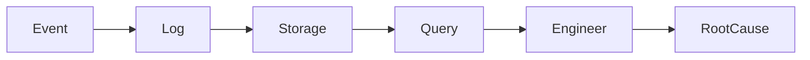

---

# Logging Is A Pipeline

Linux logging is not a file.

Linux logging is a pipeline.

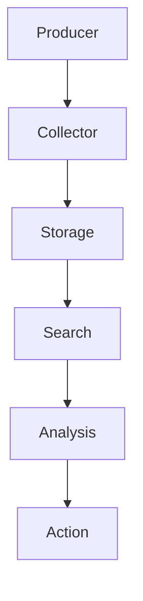

---

# The Logging Pipeline

Every logging system has 5 components.

```text
Producer

Collector

Storage

Query

Analysis
```

---

# 1 Producer

Something creates an event.

Examples:

```text
Kernel

Nginx

Docker

SSH

Redis

PostgreSQL
```

---

# 2 Collector

Something gathers logs.

Examples:

```text
journald

rsyslog
```

---

# 3 Storage

Something stores logs.

Examples:

```text
/var/log

/var/log/journal
```

---

# 4 Query

Something searches logs.

Examples:

```text
journalctl

grep

tail

less
```

---

# 5 Analysis

Engineers investigate.

Questions:

```text
Root cause

Patterns

Failures

Trends
```

---

# Linux Logging Architecture

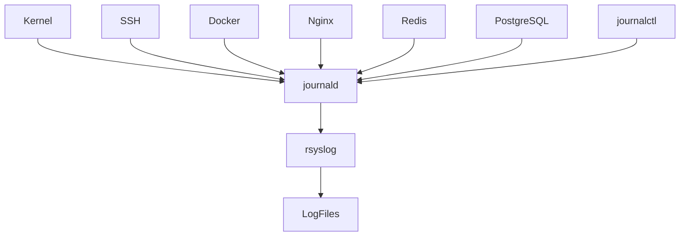

---

# Where Logs Come From

Linux has many producers.

---

# Kernel Logs

Generated by:

```text
Device drivers

Memory manager

Scheduler

Hardware events
```

Example:

```text
USB attached

Network card failure

OOM Killer
```

---

# Authentication Logs

Generated by:

```text
SSH

sudo

PAM

Login systems
```

Examples:

```text
Failed password

Successful login

Privilege escalation
```

---

# Service Logs

Generated by:

```text
nginx

docker

postgresql

redis
```

---

# Application Logs

Generated by:

```text
NodeJS

Python

Java

Go

Rust
```

---

# System Logs

Generated by:

```text
systemd

boot process

hardware
```

---

# Network Logs

Generated by:

```text
firewall

network stack

dns
```

---

# Visualizing Log Sources

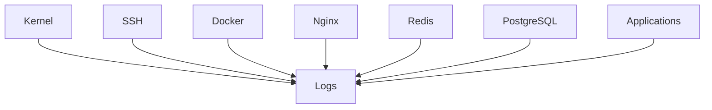

---

# Modern Linux Logging Architecture

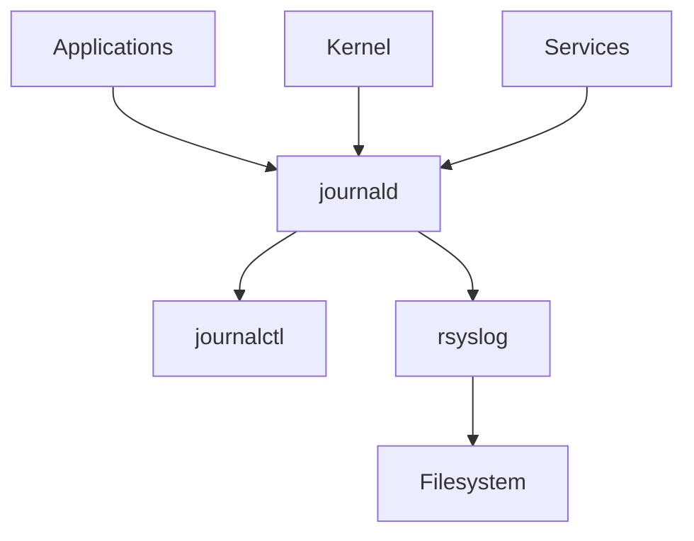

---

# journald

journald is a daemon.

Responsibilities:

```text
Collect logs

Tag logs

Store logs

Index logs

Expose logs
```

---

# journalctl

journalctl is NOT a logger.

It is a reader.

Responsibilities:

```text
Query logs

Filter logs

Analyze logs
```

---

# rsyslog

Traditional log router.

Responsibilities:

```text
Receive logs

Forward logs

Write files

Send logs remotely
```

---

# Log Filesystem Locations

Traditional locations.

```text
/var/log
```

Contains:

```text
syslog

auth.log

kern.log

messages

boot.log
```

---

# Common Log Files

Ubuntu:

```text
/var/log/syslog

/var/log/auth.log

/var/log/kern.log
```

RHEL:

```text
/var/log/messages

/var/log/secure

/var/log/boot.log
```

---

# Persistent Journal

Default location:

```text
/var/log/journal
```

Temporary:

```text
/run/log/journal
```

---

# Storage Visualization

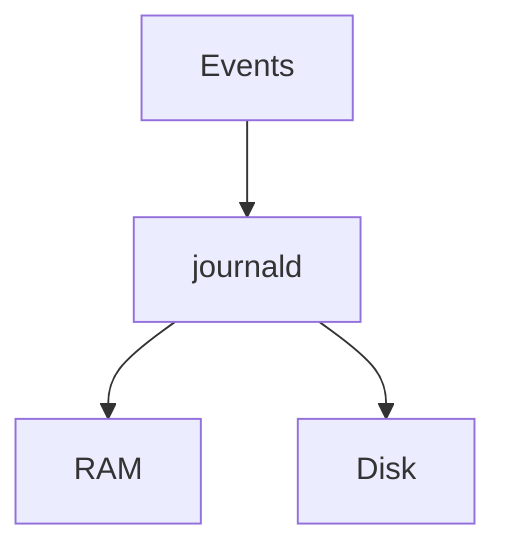

---

# Structured Logging

Old logging:

```text
Application crashed
```

Modern logging:

```text
Timestamp

Hostname

PID

UID

Unit

Priority

Message
```

---

# Structured Log Example

```text
Timestamp:
2026-06-19

Unit:
nginx.service

Priority:
error

Message:
Connection failed
```

---

# Structured Data Visualization

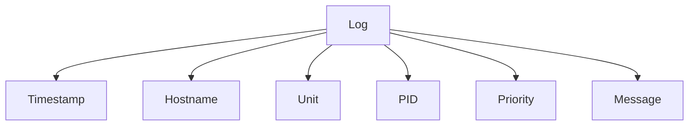

---

# Log Priorities

Linux uses severity levels.

```text
0 Emergency

1 Alert

2 Critical

3 Error

4 Warning

5 Notice

6 Info

7 Debug
```

---

# Priority Pyramid

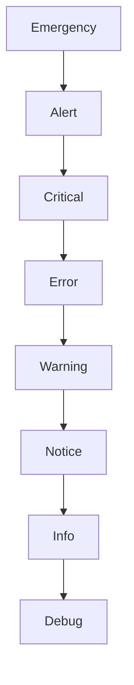

---

# The Three Pillars Of Observability

This is extremely important.

Modern systems use:

```text
Logs

Metrics

Traces
```

---

# Visual

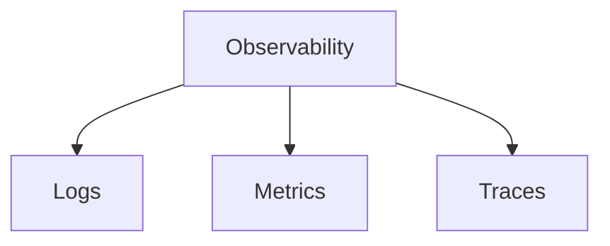

---

# Difference

## Logs

Historical events.

Question:

```text
What happened?
```

---

## Metrics

Numerical measurements.

Question:

```text
How much?
```

---

## Traces

Request journeys.

Question:

```text
Where?
```

---

# Production Example

Imagine:

```text
Nginx

↓

API

↓

Redis

↓

PostgreSQL
```

Visual:

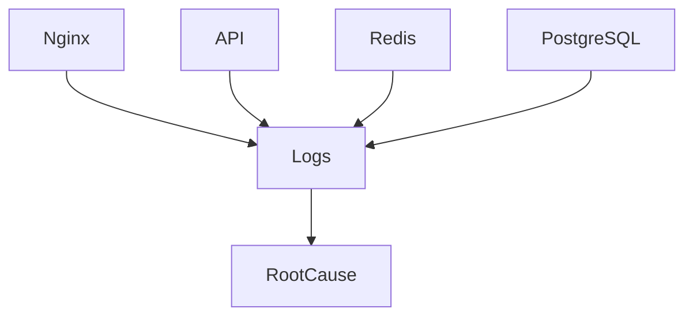

---

# Production Incident Example

User says:

```text
Website down
```

Investigation:

Step 1

```text
Nginx logs
```

Step 2

```text
API logs
```

Step 3

```text
Database logs
```

Step 4

```text
Root cause found
```

Visual:

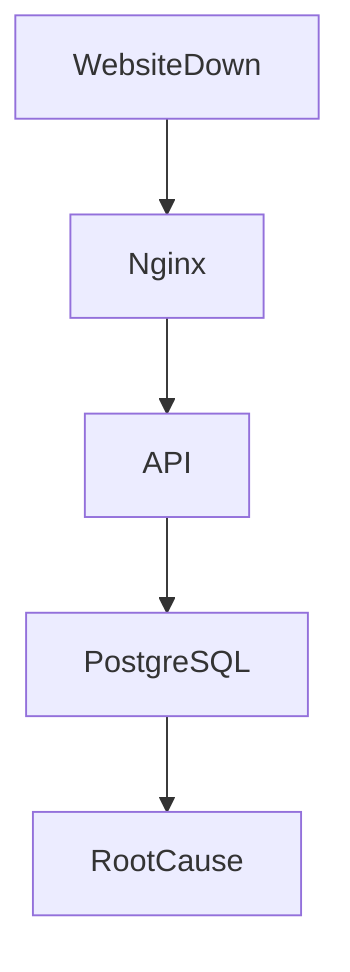

---

# Log Analysis Workflow

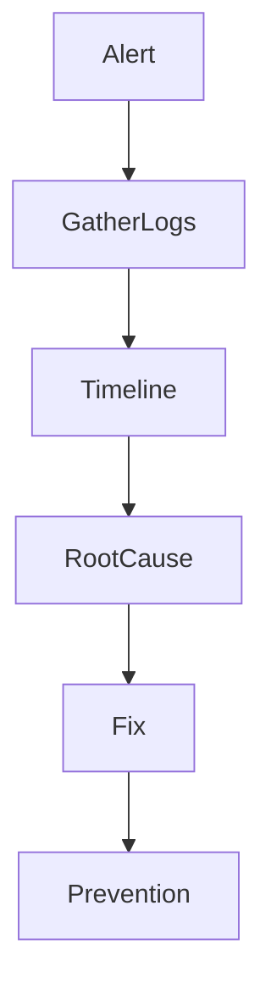

---

# Cloud Infrastructure Example

AWS VM.

Components:

```text
cloud-init

docker

ssh

monitoring
```

Everything generates logs.

---

# Kubernetes Example

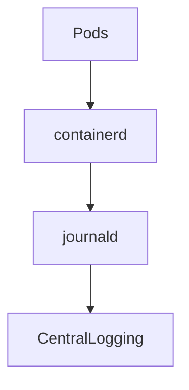

---

# Logging Challenges

Large systems create huge volumes.

Example:

```text
100 servers

↓

1000 containers

↓

Millions of logs/day
```

Problems:

```text
Storage

Search

Noise

Cost
```

---

# Good Logging Principles

Logs should answer:

```text
Who?

What?

When?

Where?

Why?
```

---

# Good Log Example

Bad:

```text
Something failed
```

Good:

```text
Database connection failed

Host=api-server-01

Port=5432

Retry=3
```

---

# Common Beginner Mistakes

## Mistake 1

Thinking logs are text files.

Wrong.

Logs are event histories.

---

## Mistake 2

Ignoring logs until production.

Too late.

---

## Mistake 3

Not enabling persistence.

---

## Mistake 4

Logging everything.

Creates noise.

---

# Engineering Mindset

Do not think:

```text
Logs are for debugging
```

Think:

```text
Logs are how engineers reconstruct reality
```

That is much more accurate.

---

# Mental Model To Remember Forever

```text
Event

↓

Log

↓

Storage

↓

Query

↓

Analysis

↓

Root Cause
```

Or even simpler:

```text
Logs are the memory of Linux.

Engineers use that memory to solve problems.
```

That single sentence explains the entire purpose of logging.
