# Linux Services & systemd Mind Maps Deep Fundamentals

> This file connects every concept inside this folder into one giant engineering mental model.

---

# How To Use This File

Do NOT memorize diagrams.

Read them in this order.

```text
Big Picture

↓

systemd Architecture

↓

Dependency Graph

↓

Boot Process

↓

Services

↓

Observability

↓

Production Infrastructure
```

Eventually you'll realize:

> Linux is not a collection of commands.

It is an orchestrated ecosystem.

---

# The Master Mental Model

This is the most important diagram in this entire folder.

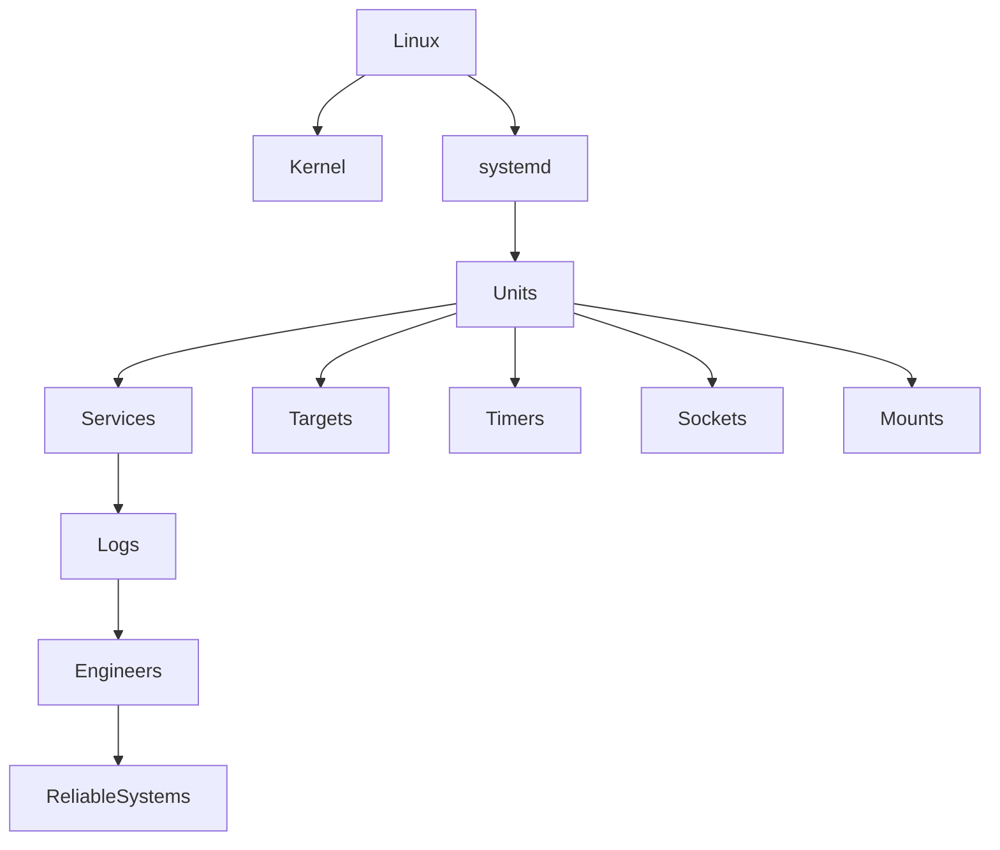

---

# The Big Picture

Linux is layers.

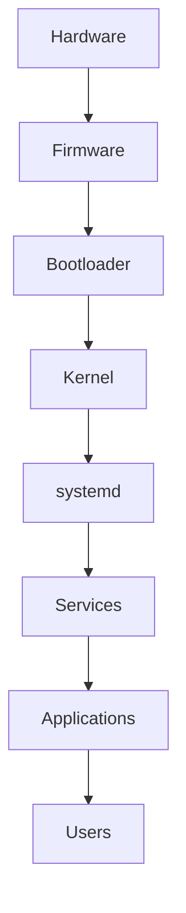

---

# Linux Operating System Stack

```text
Users

↓

Applications

↓

Services

↓

systemd

↓

Kernel

↓

Hardware
```

---

# Boot Process Mindmap

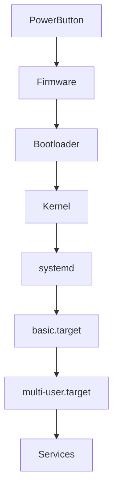

---

# Boot Process Deep View

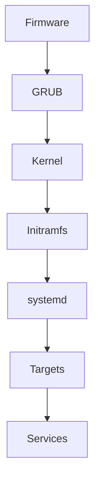

---

# systemd Mindmap

```mermaid
mindmap

root((systemd))

Boot Manager

Service Manager

Dependency Solver

Logging Integration

Security Layer

Scheduler

Resource Manager

Observability Hub
```

---

# systemd Architecture

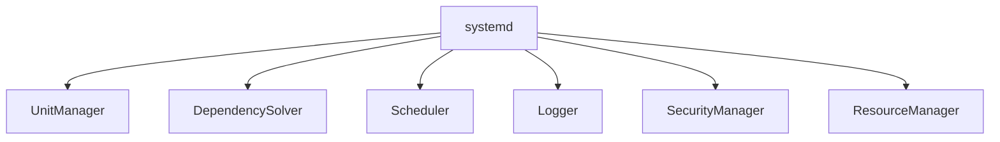

---

# Unit Mindmap

```mermaid
mindmap

root((Units))

Service

Target

Timer

Socket

Mount

Path

Swap

Device

Slice

Scope
```

---

# Unit Relationships

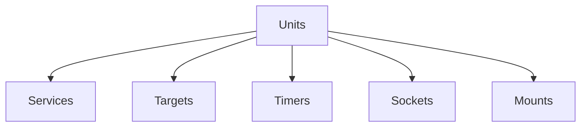

---

# Dependency Graph

This is one of the most important concepts.

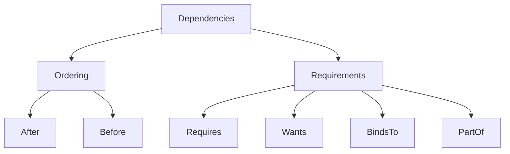

---

# Linux Is A Dependency Graph

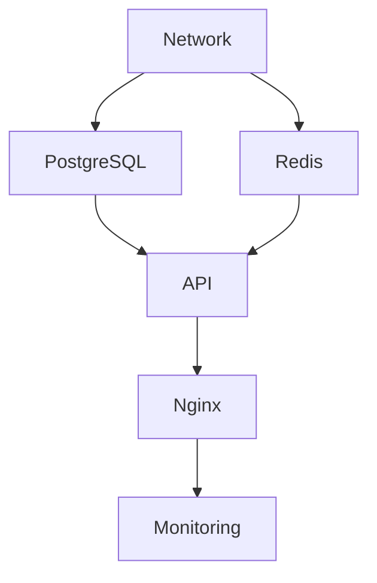

---

# Dependency Failure Map

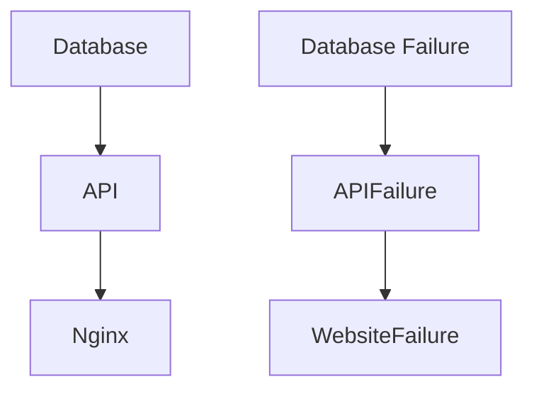

---

# Target Mindmap

```mermaid
mindmap

root((Targets))

basic.target

network.target

multi-user.target

graphical.target

rescue.target

emergency.target

reboot.target

poweroff.target
```

---

# Target Hierarchy

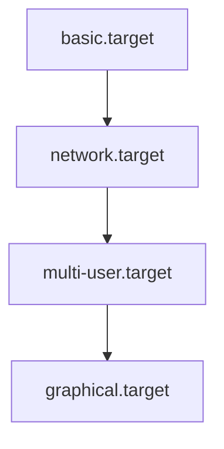

---

# Service Mindmap

```mermaid
mindmap

root((Services))

User

Group

ExecStart

Restart

Environment

Dependencies

Logging

Security
```

---

# Service Architecture

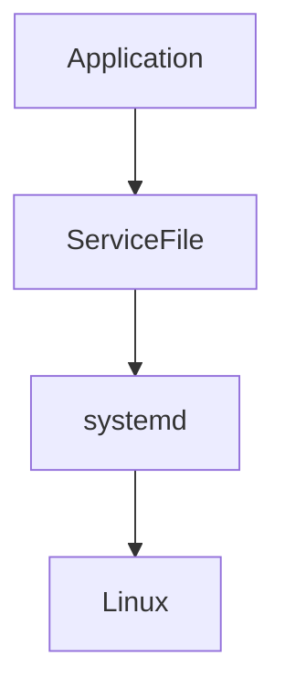

---

# Service Lifecycle

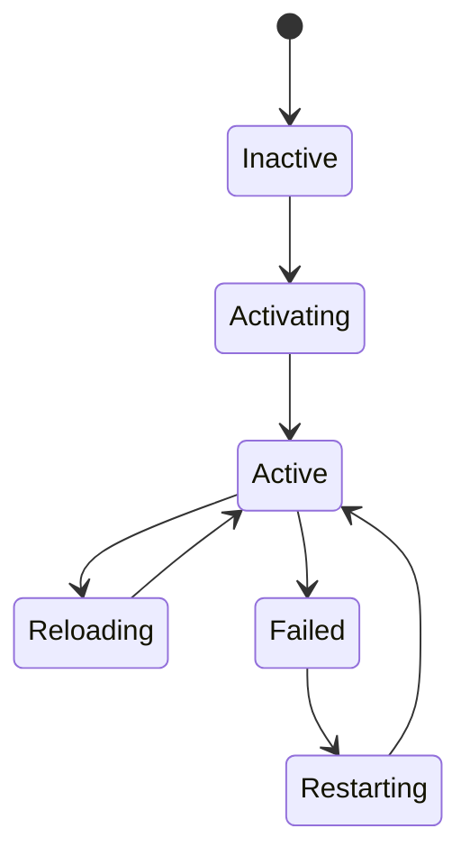

---

# Timer Mindmap

```mermaid
mindmap

root((Timers))

Monotonic

Realtime

Persistent

Calendar

Boot Aware

Observability
```

---

# Timer Architecture

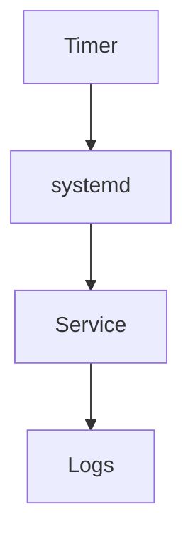

---

# Logging Mindmap

```mermaid
mindmap

root((Logging))

Events

Collectors

Storage

Query

Analysis
```

---

# Logging Architecture

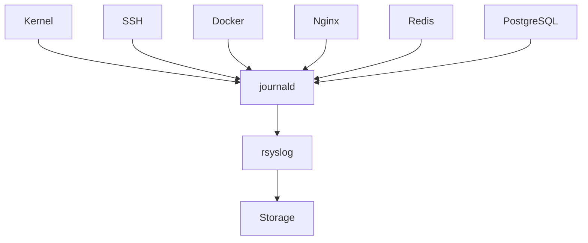

---

# journald Relationship

```mermaid
flowchart TD

Events

Events --> journald

journald --> JournalDatabase

journalctl --> JournalDatabase
```

---

# journald vs journalctl

```mermaid
flowchart TD

Events

Events --> journald

journald --> Storage

Storage --> journalctl

journalctl --> Engineers
```

---

# rsyslog Architecture

```mermaid
flowchart TD

journald

journald --> rsyslog

rsyslog --> LocalStorage

rsyslog --> RemoteStorage
```

---

# logrotate Lifecycle

```mermaid
flowchart LR

Created

Created --> Active

Active --> Rotated

Rotated --> Compressed

Compressed --> Archived

Archived --> Deleted
```

---

# Service Creation Pipeline

```mermaid
flowchart TD

Application

Application --> Dependencies

Dependencies --> Security

Security --> ServiceFile

ServiceFile --> systemd

systemd --> ProductionService
```

---

# Security Mindmap

```mermaid
mindmap

root((Security))

User Isolation

Filesystem Isolation

Capabilities

Namespaces

Resource Limits

Privilege Control
```

---

# Security Layers

```mermaid
flowchart TD

Application

Application --> UserBoundary

UserBoundary --> FilesystemBoundary

FilesystemBoundary --> CapabilityBoundary

CapabilityBoundary --> NamespaceBoundary

NamespaceBoundary --> Kernel
```

---

# Troubleshooting Mindmap

```mermaid
mindmap

root((Troubleshooting))

Status

Logs

Dependencies

Resources

Network

Permissions

Root Cause
```

---

# Troubleshooting Workflow

```mermaid
flowchart TD

Problem

Problem --> Evidence

Evidence --> Timeline

Timeline --> RootCause

RootCause --> Fix

Fix --> Prevention
```

---

# Production Investigation Workflow

```mermaid
flowchart TD

Alert

Alert --> systemctl

systemctl --> journalctl

journalctl --> Dependencies

Dependencies --> Resources

Resources --> RootCause
```

---

# Observability Mindmap

```mermaid
mindmap

root((Observability))

Logs

Metrics

Traces
```

---

# Observability Architecture

```mermaid
flowchart TD

Applications

Applications --> Logs

Applications --> Metrics

Applications --> Traces

Logs --> Engineers

Metrics --> Engineers

Traces --> Engineers
```

---

# Modern Production Infrastructure

Imagine:

```text
Users

↓

Nginx

↓

API

↓

Redis

↓

PostgreSQL
```

Visual:

```mermaid
flowchart TD

Users

Users --> Nginx

Nginx --> API

API --> Redis

API --> PostgreSQL

All --> Logs

Logs --> Engineers
```

---

# Cloud Infrastructure Mindmap

```mermaid
mindmap

root((Cloud))

systemd

Docker

containerd

Kubelet

Pods

Monitoring

Logging
```

---

# Kubernetes Relationship

```mermaid
flowchart TD

systemd

systemd --> containerd

containerd --> kubelet

kubelet --> Pods
```

---

# The Ultimate Systems Engineering Diagram

This is the diagram I want you to remember forever.

```mermaid
flowchart TD

Hardware

Hardware --> Kernel

Kernel --> systemd

systemd --> DependencyGraph

DependencyGraph --> Services

Services --> Logs

Logs --> Engineers

Engineers --> ReliableSystems
```

---

# Ultimate Mental Models

Remember these forever.

### Mental Model 1

```text
Linux

≠

Programs

Linux

=

Coordinated System
```

---

### Mental Model 2

```text
systemd

=

Operating System Orchestrator
```

---

### Mental Model 3

```text
Services

=

Operating System Citizens
```

---

### Mental Model 4

```text
Logs

=

Operating System Memory
```

---

### Mental Model 5

```text
Troubleshooting

=

Reconstructing Reality
```

---

# The Final Mental Model

```text
Hardware

↓

Kernel

↓

systemd

↓

Dependency Graph

↓

Services

↓

Logs

↓

Engineers

↓

Reliable Systems
```

Or even simpler:

```text
Linux is a dependency graph.

systemd is the graph solver.

Services are operating system citizens.

Logs are memory.

Engineers build reliability.
```

That is the entire story of this folder.
