# Production Debugging Playbook Deep Fundamentals

> Understanding how production engineers investigate incidents, reconstruct reality, and restore reliable systems.

---

# Learning Goals

By the end of this file, you will understand:

- Production debugging philosophy
- Incident response mindset
- Scientific debugging
- Evidence collection
- Root cause analysis
- Timeline reconstruction
- Failure patterns
- Dependency investigation
- Debugging workflows
- Production case studies
- Reliability engineering concepts

---

# First Principles

Imagine this.

It is:

```text
02:17 AM
```

Your phone rings.

Alert:

```text
🚨 Website Down
```

Question:

What broke?

Possibilities:

```text
Nginx

API

Redis

PostgreSQL

DNS

Docker

Network

Disk

Memory

Hardware
```

You do not know.

This uncertainty is normal.

Production debugging exists because complex systems hide their failures.

---

# The Biggest Misconception

Beginners think:

```text
Debugging

↓

Finding errors
```

Wrong.

Production debugging is:

> Reconstructing reality from incomplete evidence.

---

# Human Analogy

Imagine a detective.

The detective arrives after the event happened.

They investigate.

Linux debugging is the same.

---

# Mental Model

```text
Linux = City

Services = Citizens

Logs = CCTV

Metrics = Sensors

Engineers = Detectives
```

---

# The Golden Rule

Never do this:

```text
Restart

↓

Hope
```

Always do:

```text
Observe

↓

Investigate

↓

Hypothesize

↓

Verify

↓

Fix
```

---

# Production Debugging Loop

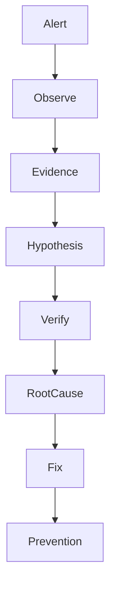

---

# The Four Questions

Always ask:

```text
What happened?

↓

When did it happen?

↓

Why did it happen?

↓

What changed?
```

"What changed?" solves a huge percentage of incidents.

---

# The Five Pillars Of Production Debugging

```text
State

Logs

Dependencies

Resources

Timeline
```

---

# Pillar Visualization

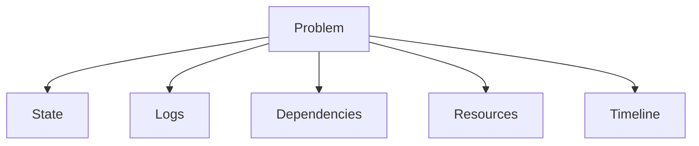

---

# The Layer Cake Investigation

Never jump randomly.

Always debug layer by layer.

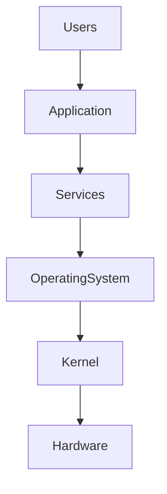

---

# The Universal Debugging Algorithm

This algorithm works for almost everything.

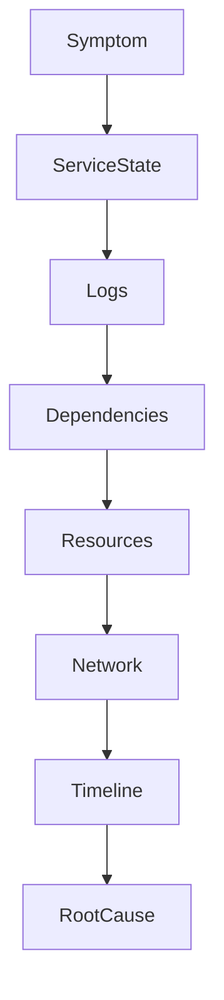

---

# Step 1 : Define The Symptom

Question:

What is actually broken?

Bad:

```text
Website broken
```

Good:

```text
500 errors

Started at 02:17 AM

Only API requests affected
```

---

# Step 2 : Check Service State

Commands:

```bash
systemctl status nginx

systemctl status api

systemctl status redis

systemctl status postgresql
```

Possible states:

```text
active

inactive

failed

activating

deactivating
```

---

# State Visualization

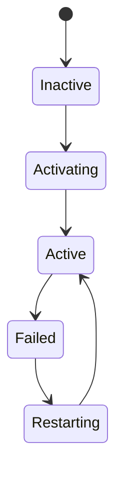

---

# Step 3 : Read Logs

Logs are evidence.

Commands:

```bash
journalctl -u nginx

journalctl -u api

journalctl -u postgresql
```

Recent:

```bash
journalctl -u api -n 100
```

Live:

```bash
journalctl -u api -f
```

---

# Evidence Pipeline

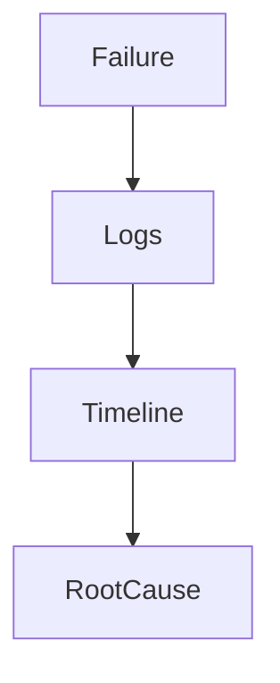

---

# Step 4 : Investigate Dependencies

Question:

Did something upstream fail?

Commands:

```bash
systemctl list-dependencies api

systemctl --failed
```

---

# Example

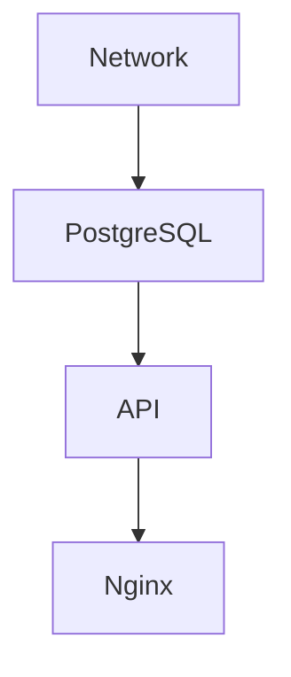

---

# Cascading Failures

This is extremely common.

Visual:

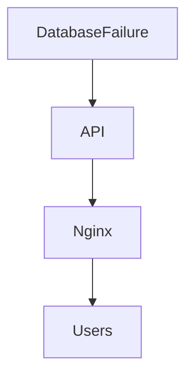

Symptom:

```text
Website down
```

Root cause:

```text
Database unavailable
```

---

# Step 5 : Verify Resources

Resources kill systems.

Investigate:

```bash
top

htop

free -h

df -h

df -i
```

---

# Resource Visualization

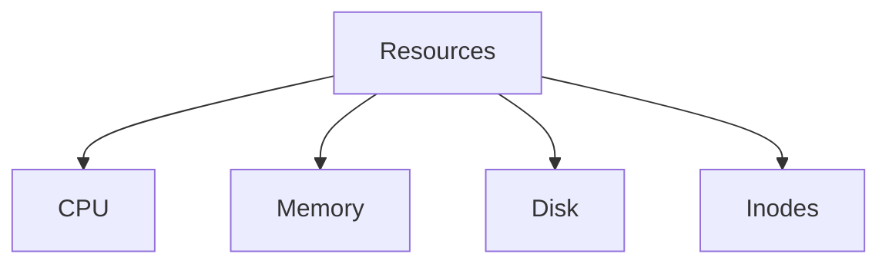

---

# Memory Problems

Question:

Did Linux kill the process?

Investigate:

```bash
journalctl -k
```

Look for:

```text
OOM Killer
```

Visual:

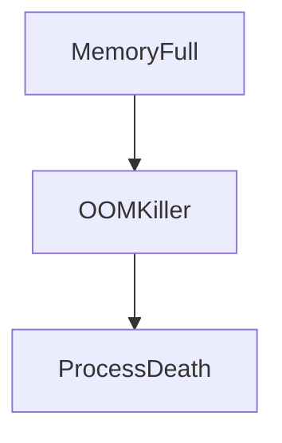

---

# Disk Problems

One of the most common incidents.

```text
Disk Full

↓

Logs fail

↓

Applications fail

↓

Databases fail

↓

Entire system unstable
```

Commands:

```bash
df -h

du -sh /var/log/*
```

---

# Step 6 : Verify Network

Questions:

```text
Can services communicate?

Can DNS resolve?

Can routes work?
```

Commands:

```bash
ping

ss

ip addr

ip route

resolvectl status
```

---

# Network Architecture

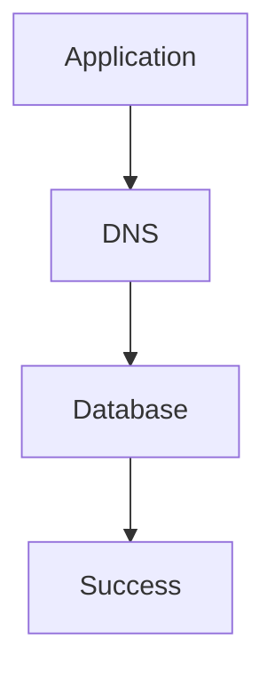

---

# Step 7 : Reconstruct Timeline

This is extremely important.

Question:

What happened first?

Example:

```text
02:10 Deployment

02:12 Memory spike

02:13 PostgreSQL timeout

02:15 API crash

02:17 Website down
```

Visual:

```mermaid
timeline

title Production Incident Timeline

02:10 : Deploy

02:12 : Memory spike

02:13 : DB timeout

02:15 : API crash

02:17 : Website down
```

---

# The Production Detective Workflow

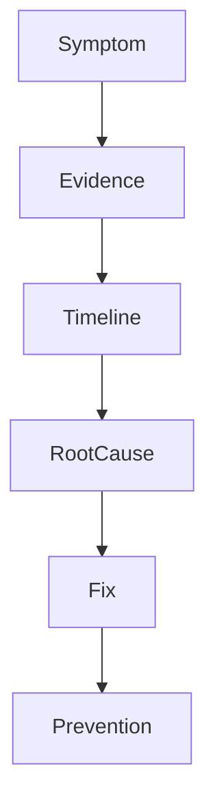

---

# Case Study 1 : Website Down

Symptom:

```text
500 Internal Server Error
```

Workflow:

```bash
systemctl status nginx

journalctl -u nginx

systemctl status api

journalctl -u api

systemctl status postgresql
```

Visual:

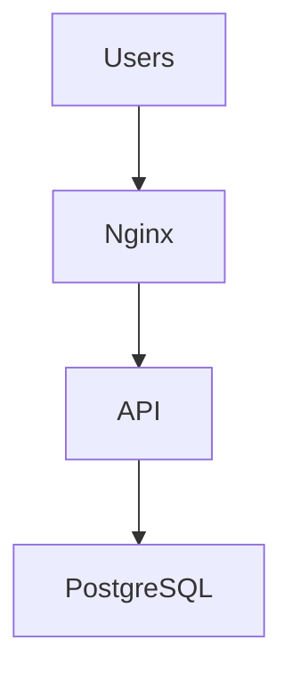

---

# Case Study 2 : API Keeps Restarting

Symptoms:

```text
Restart loop
```

Investigate:

```bash
systemctl status api

journalctl -u api

free -h

systemctl show api
```

Possible causes:

```text
Memory leaks

Bad configuration

Dependency failures
```

---

# Case Study 3 : Entire Server Slow

Investigate:

```bash
top

iostat

free -h

df -h
```

Questions:

```text
CPU?

Memory?

Disk?

IO?
```

---

# Case Study 4 : Service Won't Start

Commands:

```bash
systemd-analyze verify app.service

journalctl -u app

ls -la

id appuser
```

Common causes:

```text
Permissions

Wrong paths

Bad environment variables

Missing files
```

---

# Production Debugging Matrix

| Symptom | First Check |
|---------|-------------|
| Website down | nginx |
| API failing | logs |
| Database timeout | network |
| Service restarting | memory |
| Slow server | CPU + IO |
| Login failure | auth logs |
| Boot issue | journalctl -b |

---

# The 80/20 Rule

Many incidents come from:

```text
Bad deployments

Configuration mistakes

Resource exhaustion

Dependency failures

DNS failures
```

---

# Golden Command Set

### State

```bash
systemctl status
```

### Logs

```bash
journalctl -u app
```

### Failures

```bash
systemctl --failed
```

### Dependencies

```bash
systemctl list-dependencies app
```

### Resources

```bash
top

free -h

df -h
```

### Network

```bash
ss

ip addr

ip route
```

---

# Production Anti-Patterns

Avoid these.

---

## Anti-pattern 1

Random restarts.

---

## Anti-pattern 2

Ignoring logs.

---

## Anti-pattern 3

Treating symptoms.

---

## Anti-pattern 4

Ignoring dependencies.

---

## Anti-pattern 5

Skipping timeline reconstruction.

---

# The Incident Pyramid

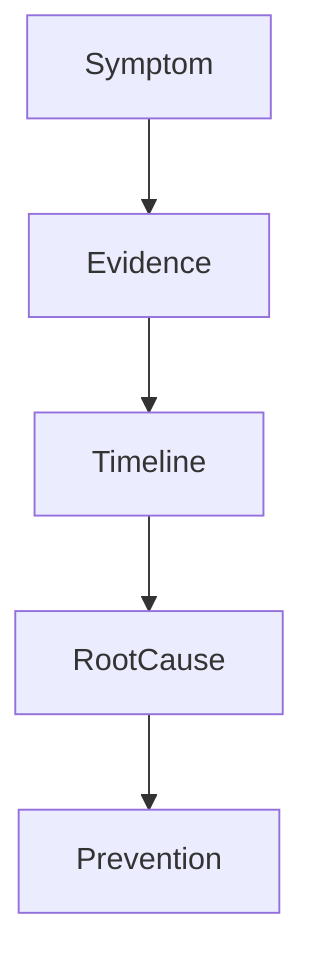

---

# SRE Concepts

Very important.

### MTTD

```text
Mean Time To Detect
```

### MTTR

```text
Mean Time To Recover
```

### MTBF

```text
Mean Time Between Failures
```

Goal:

```text
Lower MTTD

Lower MTTR

Increase MTBF
```

---

# Production Engineer Mindset

Do not ask:

```text
What command fixes this?
```

Ask:

```text
What evidence explains reality?
```

That is the senior engineer mindset.

---

# Mental Models To Remember Forever

### Model 1

```text
Production

=

Uncertainty
```

---

### Model 2

```text
Logs

=

Evidence
```

---

### Model 3

```text
Timelines

=

Truth
```

---

### Model 4

```text
Systems

=

Dependency Graphs
```

---

# Ultimate Mental Model

```text
Symptom

↓

Evidence

↓

Timeline

↓

Root Cause

↓

Fix

↓

Prevention
```

Or even simpler:

```text
Production debugging is reconstructing reality from incomplete evidence.
```

That single sentence explains the entire discipline.
