# Production Service Template Deep Fundamentals

> Understanding how to build production-grade Linux services that are secure, observable, recoverable, and maintainable.

---

# Learning Goals

By the end of this file, you will understand:

- Why production templates exist
- Production service architecture
- Universal service design patterns
- Security patterns
- Recovery patterns
- Resource management
- Logging integration
- Environment management
- Dependency management
- Production deployment workflow

---

# First Principles

Imagine you built:

```text
NodeJS API

Python AI Service

Go Worker

Java Application
```

Question:

How do we convert this:

```text
Application

↓

Executable

↓

Manual startup
```

Into:

```text
Production Infrastructure
```

We need a contract.

That contract is:

```text
systemd service file
```

---

# The Biggest Idea

Production services answer these questions.

```text
Who are you?

↓

How do I start you?

↓

Who owns you?

↓

What do you depend on?

↓

What resources can you consume?

↓

How secure should you be?

↓

What happens when you crash?
```

---

# Mental Model

```text
Application = Employee

Service File = Employment Contract

systemd = Manager

Linux = Company
```

---

# Production Architecture

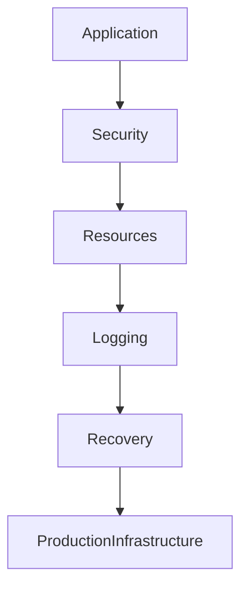

---

# The 7 Layers Of A Production Service

Every production service should have these layers.

```text
Identity

Dependencies

Runtime

Recovery

Security

Resources

Observability
```

---

# Layer Visualization

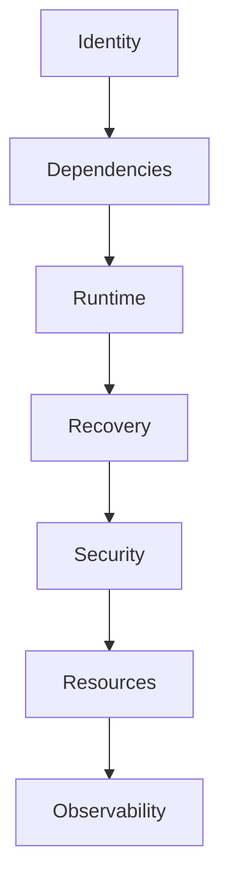

---

# The Universal Template

```ini
[Unit]

Description=Production Application

Documentation=https://docs.example.com

Wants=network-online.target

After=network-online.target

# ------------------------------------------------

[Service]

# Identity

User=myapp

Group=myapp

# Runtime

Type=simple

WorkingDirectory=/opt/myapp

ExecStart=/opt/myapp/bin/application

ExecReload=/bin/kill -HUP $MAINPID

# Environment

Environment=APP_ENV=production

EnvironmentFile=/etc/myapp/myapp.env

# Recovery

Restart=on-failure

RestartSec=5

StartLimitBurst=5

StartLimitIntervalSec=60

# Timeouts

TimeoutStartSec=30

TimeoutStopSec=20

# Resources

CPUQuota=70%

MemoryMax=1G

TasksMax=500

# Logging

StandardOutput=journal

StandardError=journal

SyslogIdentifier=myapp

# Security

NoNewPrivileges=true

PrivateTmp=true

ProtectSystem=strict

ProtectHome=true

ProtectKernelTunables=true

ProtectKernelModules=true

ProtectControlGroups=true

LockPersonality=true

RestrictNamespaces=true

RestrictSUIDSGID=true

# Install

[Install]

WantedBy=multi-user.target
```

---

# Service Anatomy

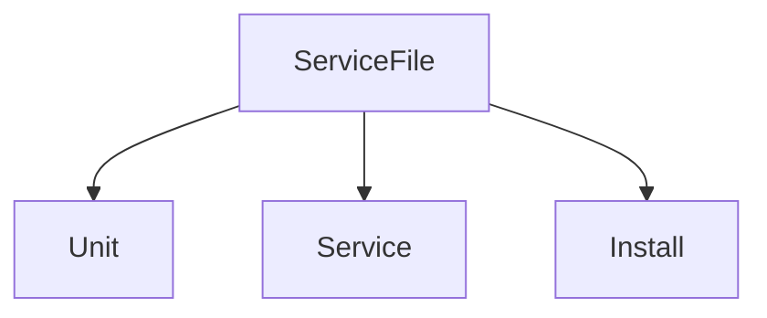

---

# Layer 1 : Identity

Question:

Who owns this process?

Never use:

```text
root
```

Always create:

```bash
sudo useradd -r -s /usr/sbin/nologin myapp
```

Visual:

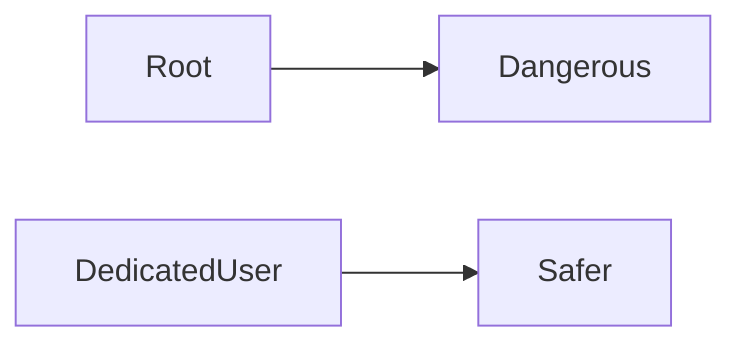

---

# Layer 2 : Dependencies

Question:

What must exist before startup?

Example:

```ini
Wants=network-online.target

After=network-online.target
```

---

# Dependency Visualization

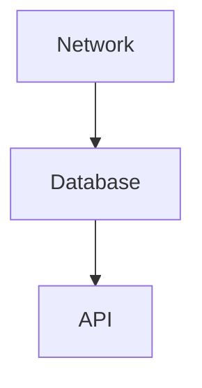

---

# Layer 3 : Runtime

Runtime tells Linux:

```text
Where to execute

How to execute

How to reload
```

Examples:

```ini
WorkingDirectory=/opt/myapp

ExecStart=/opt/myapp/bin/application
```

---

# Layer 4 : Environment Variables

Never hardcode configuration.

Wrong:

```ini
Environment=DB_PASSWORD=123456
```

Correct:

```ini
EnvironmentFile=/etc/myapp/myapp.env
```

---

# Example Environment File

```text
APP_ENV=production

PORT=8080

DB_HOST=localhost
```

---

# Environment Visualization

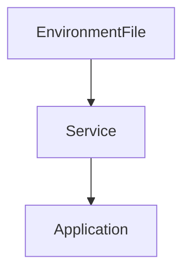

---

# Layer 5 : Recovery

Applications crash.

Recovery is mandatory.

Example:

```ini
Restart=on-failure

RestartSec=5
```

Visual:

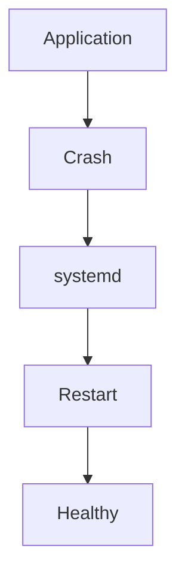

---

# Prevent Restart Storms

Very important.

```ini
StartLimitBurst=5

StartLimitIntervalSec=60
```

Meaning:

```text
5 crashes

↓

1 minute

↓

Stop restarting
```

---

# Layer 6 : Resource Management

Every service should have limits.

Without limits:

```text
Application

↓

Consumes everything

↓

Entire server suffers
```

---

# Resource Isolation

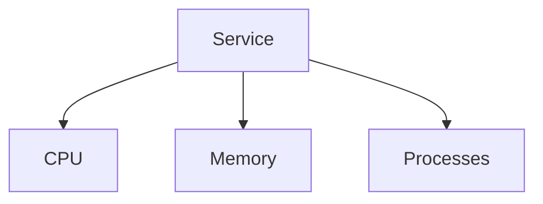

---

# CPU Limits

```ini
CPUQuota=70%
```

---

# Memory Limits

```ini
MemoryMax=1G
```

---

# Process Limits

```ini
TasksMax=500
```

---

# Layer 7 : Logging

All logs should go here.

```text
Application

↓

journald

↓

journalctl

↓

Engineer
```

Visual:

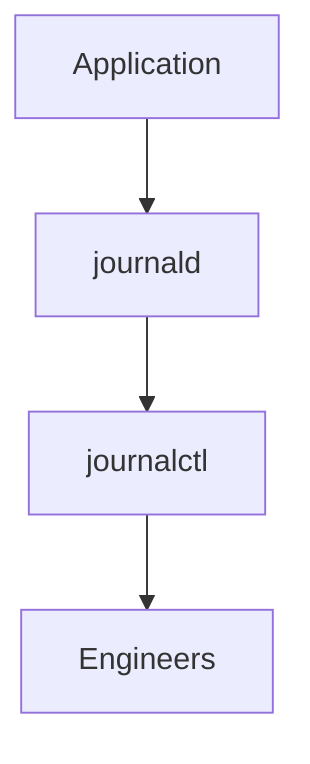

---

# Logging Configuration

```ini
StandardOutput=journal

StandardError=journal

SyslogIdentifier=myapp
```

---

# Layer 8 : Security

This is where most tutorials fail.

Every production service should have protections.

---

# No New Privileges

```ini
NoNewPrivileges=true
```

Prevents:

```text
Privilege escalation
```

---

# Private Tmp

```ini
PrivateTmp=true
```

Creates isolated:

```text
/tmp
```

---

# Protect System

```ini
ProtectSystem=strict
```

Makes system directories read-only.

---

# Protect Home

```ini
ProtectHome=true
```

Blocks user home access.

---

# Security Architecture

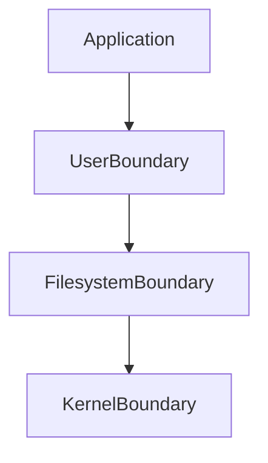

---

# Recommended Directory Structure

```text
/opt/myapp/

├── bin/
│
├── config/
│
├── data/
│
├── scripts/
│
└── logs/
```

---

# Configuration Structure

```text
/etc/myapp/

myapp.env

config.yaml
```

---

# Production Deployment Workflow

Step 1

Create user.

```bash
sudo useradd -r -s /usr/sbin/nologin myapp
```

Step 2

Create directories.

```bash
sudo mkdir -p /opt/myapp
```

Step 3

Copy application.

Step 4

Create service.

```bash
sudo nano /etc/systemd/system/myapp.service
```

Step 5

Reload.

```bash
sudo systemctl daemon-reload
```

Step 6

Enable.

```bash
sudo systemctl enable myapp
```

Step 7

Start.

```bash
sudo systemctl start myapp
```

Step 8

Verify.

```bash
sudo systemctl status myapp
```

---

# Deployment Visualization

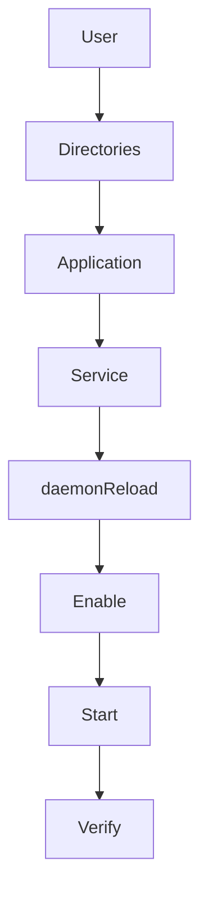

---

# Troubleshooting Workflow

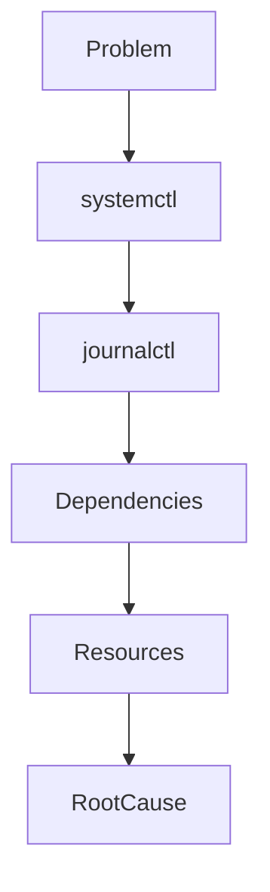

Commands:

```bash
systemctl status myapp

journalctl -u myapp

systemctl list-dependencies myapp

systemd-analyze verify myapp.service
```

---

# Universal Production Checklist

Before deployment ask:

### Identity

```text
Dedicated user?
```

### Security

```text
Sandboxed?
```

### Recovery

```text
Restart policy?
```

### Resources

```text
Memory limits?
```

### Logging

```text
Observable?
```

### Dependencies

```text
Ordered correctly?
```

### Environment

```text
Secrets externalized?
```

---

# Production Anti-Patterns

Avoid these.

---

## Anti-pattern 1

Running as root.

---

## Anti-pattern 2

No restart policy.

---

## Anti-pattern 3

No resource limits.

---

## Anti-pattern 4

Hardcoded secrets.

---

## Anti-pattern 5

No logs.

---

## Anti-pattern 6

No security hardening.

---

# Gold Standard Architecture

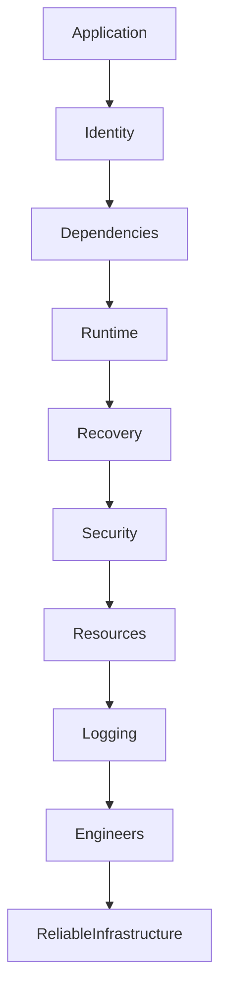

---

# Engineering Mindset

Do not think:

```text
A service file starts applications
```

Think:

```text
A service file defines the contract between an application and an operating system
```

That is much closer to reality.

---

# Mental Models To Remember Forever

### Model 1

```text
Applications

=

Programs
```

### Model 2

```text
Services

=

Managed Programs
```

### Model 3

```text
Production Services

=

Reliable Managed Programs
```

---

# Ultimate Mental Model

```text
Application

↓

Service Contract

↓

systemd

↓

Reliable Infrastructure
```

Or even simpler:

```text
Production services are contracts between applications and operating systems.
```

That single sentence explains this entire file.
