# rsyslog Deep Fundamentals

> Understanding how Linux transports, routes, filters, stores, and forwards logs across entire infrastructures.

---

# Learning Goals

By the end of this file, you will understand:

- What rsyslog is
- Why rsyslog exists
- Why journald is not enough
- The history of syslog
- Evolution into rsyslog
- Log transportation architecture
- Log routing
- Log forwarding
- Facilities and priorities
- Rules engine
- Remote logging
- Production logging architectures
- Cloud logging patterns

---

# First Principles

Imagine 1000 Linux servers.

Each server creates:

```text
Kernel logs

SSH logs

Docker logs

Application logs

Database logs

Network logs
```

Question:

> How do engineers gather all these logs in one place?

This is not a storage problem.

This is a transportation problem.

That is where rsyslog exists.

---

# The Biggest Misconception

People think:

```text
rsyslog = log file writer
```

Wrong.

rsyslog is:

> A log routing engine.

Think:

```text
Internet Router

↓

Routes packets

-----------------

rsyslog

↓

Routes logs
```

---

# The Biggest Idea

rsyslog is:

> A high-performance event transportation and routing system.

Its job is:

```text
Receive logs

↓

Filter logs

↓

Transform logs

↓

Store logs

↓

Forward logs
```

---

# Human Analogy

Imagine a postal system.

```text
People write letters

↓

Post office sorts letters

↓

Letters delivered

↓

Archives created
```

Linux logging works similarly.

---

# Mental Model

```text
Linux = Country

Applications = Citizens

Logs = Letters

rsyslog = Postal System

Storage = Archives

Engineers = Investigators
```

---

# The Logging Problem

Imagine:

```text
1000 servers

↓

Millions of logs/day
```

Without transportation:

```text
Chaos
```

You need infrastructure.

---

# Logging Architecture Overview

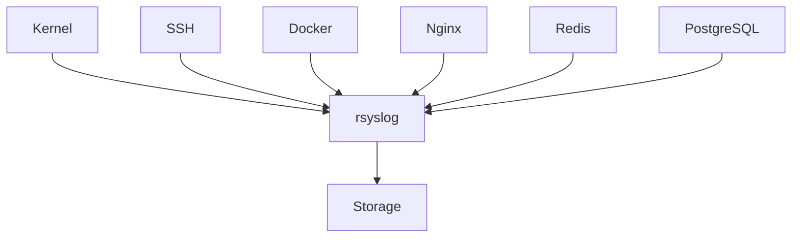

---

# Evolution Of Linux Logging

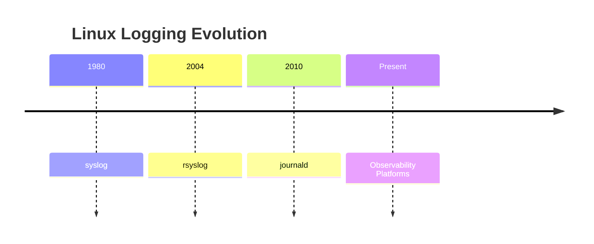

---

# Understanding syslog First

Before understanding rsyslog.

We must understand syslog.

syslog is:

> A logging protocol and concept.

Not necessarily software.

Think:

```text
Rules

↓

Formats

↓

Transportation
```

---

# Evolution

```text
syslog

↓

rsyslog

↓

journald

↓

Cloud Logging
```

---

# Why rsyslog Was Created

Original syslog was limited.

Problems:

```text
Slow

Single threaded

Limited filtering

Weak scalability
```

rsyslog solved these.

---

# rsyslog Superpowers

```text
Multi-threading

Queues

Remote forwarding

Filtering

Transformations

High performance
```

---

# The Big Picture

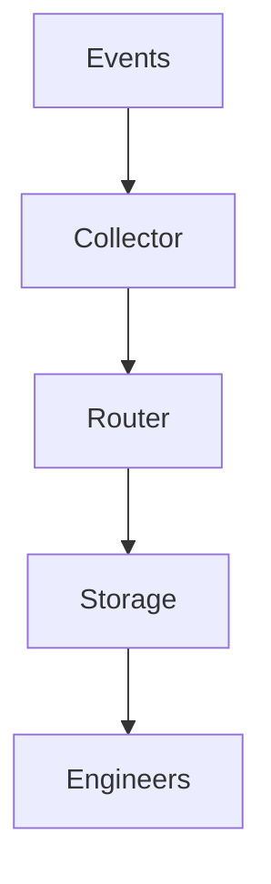

---

# Position In Linux Architecture

Modern systems:

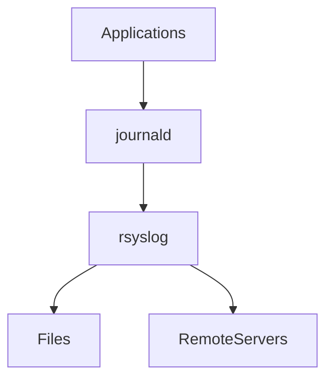

---

# journald vs rsyslog

This is extremely important.

| journald | rsyslog |
|----------|---------|
| Collector | Router |
| Binary logs | Text logs |
| Local machine | Local + Remote |
| Metadata rich | Transport focused |
| Search optimized | Routing optimized |

---

# Relationship

Think:

```text
journald

↓

Captures

---------------

rsyslog

↓

Distributes
```

---

# Event Flow


---

# rsyslog Components

Five major pieces exist.

```text
Input

Parser

Filter

Action

Output
```

---

# Pipeline Visualization

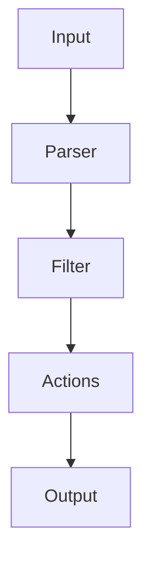

---

# Input Modules

Question:

Where do logs come from?

Examples:

```text
Kernel

journald

Network

Files

Applications
```

---

# Input Visualization

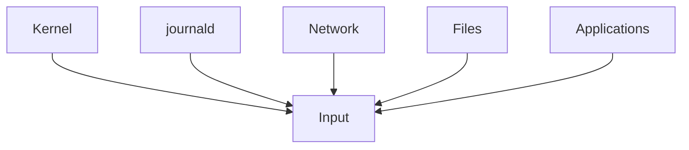

---

# Parser Stage

Responsibilities:

```text
Read messages

Extract metadata

Normalize events
```

---

# Filter Stage

Question:

Should we keep this log?

Examples:

```text
Errors only

Authentication only

Nginx only
```

---

# Action Stage

What should happen?

Examples:

```text
Save file

Forward remotely

Discard

Transform
```

---

# Output Stage

Where should logs go?

Examples:

```text
File

Database

Cloud

Remote server
```

---

# Facilities

This concept is extremely important.

Facilities categorize logs.

Examples:

```text
auth

cron

daemon

kernel

mail

syslog

user

local0-local7
```

---

# Facility Visualization

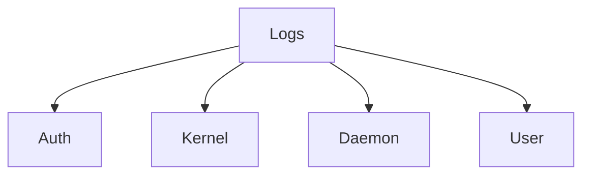

---

# Priorities

Linux assigns severities.

```text
0 Emergency

1 Alert

2 Critical

3 Error

4 Warning

5 Notice

6 Info

7 Debug
```

---

# Priority Pyramid

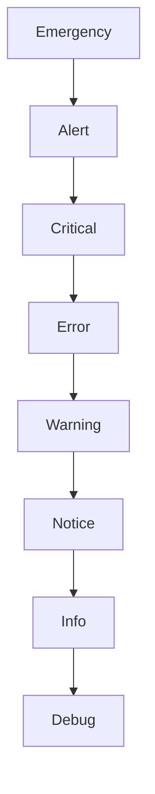

---

# Rules Engine

This is rsyslog's superpower.

Think:

```text
IF

↓

THEN
```

Examples:

```text
IF nginx

↓

Store separately

---------------

IF authentication

↓

Forward to SIEM
```

---

# Example Rule

```conf
auth.* /var/log/auth.log
```

Meaning:

```text
Authentication facility

↓

Write to auth.log
```

---

# Another Example

```conf
*.err /var/log/errors.log
```

Meaning:

```text
All errors

↓

errors.log
```

---

# Configuration Files

Main:

```text
/etc/rsyslog.conf
```

Additional:

```text
/etc/rsyslog.d/
```

---

# Configuration Architecture

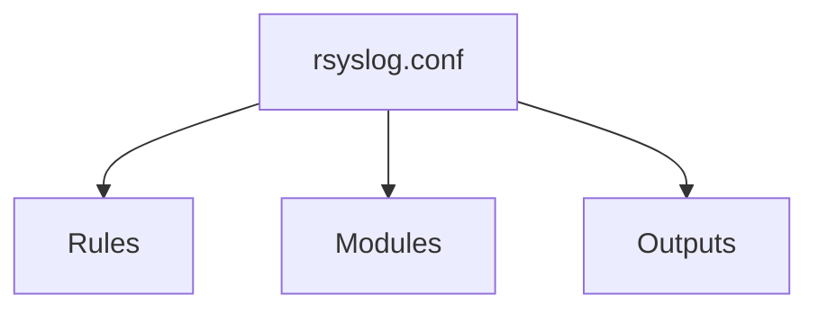

---

# Remote Logging

One of the biggest reasons rsyslog exists.

Architecture:

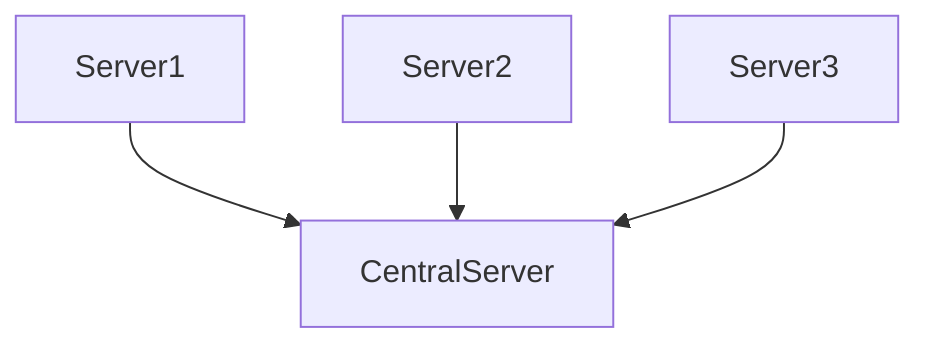

---

# Why Centralize Logs?

Question:

If a server dies.

Do logs disappear?

Possibly.

Centralization solves this.

Benefits:

```text
Retention

Security

Searchability

Compliance
```

---

# Forward Logs

Example:

```conf
*.* @@10.0.0.100:514
```

Meaning:

```text
All logs

↓

Remote server

↓

TCP

↓

Port 514
```

---

# UDP vs TCP

UDP:

```text
Fast

May lose logs
```

TCP:

```text
Reliable

Slightly slower
```

---

# Visualization

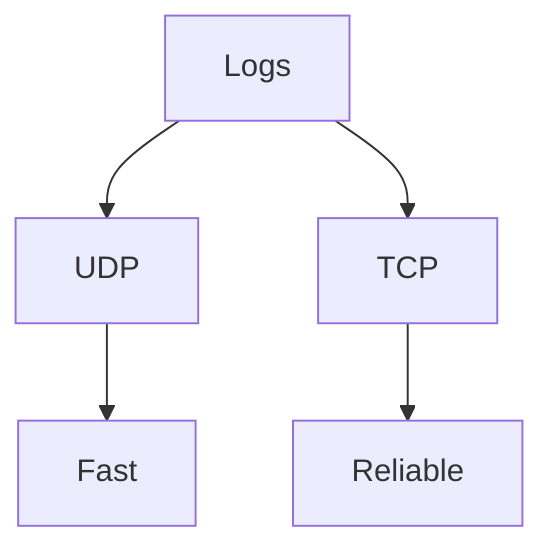

---

# Queues

One of rsyslog's best features.

Question:

What if network is down?

Without queues:

```text
Logs lost
```

With queues:

```text
Store temporarily

↓

Retry later
```

---

# Queue Visualization

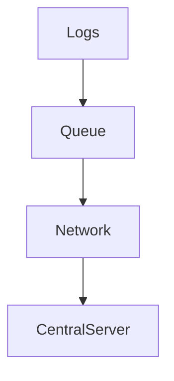

---

# Production Architecture

Example:

```text
100 Servers
```

Visual:

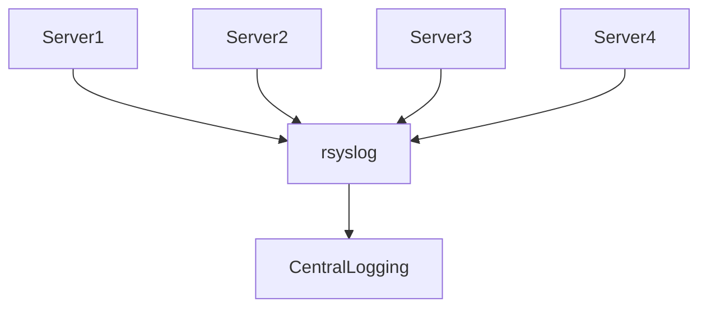

---

# Cloud Architecture

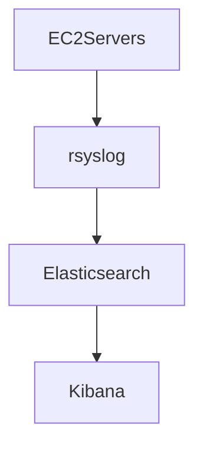

---

# Kubernetes Relationship

Containers still use Linux logging.

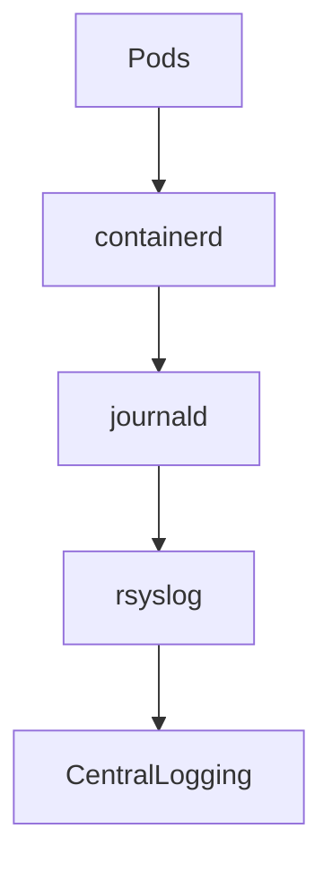

---

# Modern Enterprise Architecture

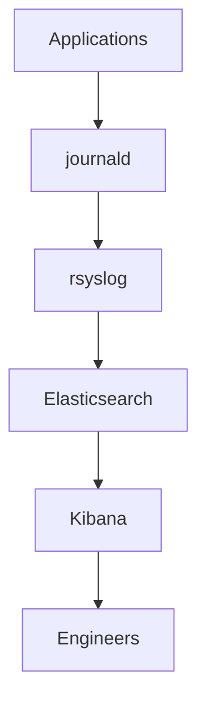

---

# Inspect rsyslog

Check service:

```bash
systemctl status rsyslog
```

---

# View logs

```bash
journalctl -u rsyslog
```

---

# Restart

```bash
sudo systemctl restart rsyslog
```

---

# Validate Configuration

```bash
sudo rsyslogd -N1
```

Very useful.

Always do this before restarting.

---

# Production Workflow

Question:

Logs are not reaching central server.

Step 1

Check service.

```bash
systemctl status rsyslog
```

Step 2

Check configuration.

```bash
rsyslogd -N1
```

Step 3

Check network.

```bash
ss -tulnp
```

Step 4

Inspect logs.

```bash
journalctl -u rsyslog
```

---

# Common Beginner Mistakes

## Mistake 1

Thinking rsyslog stores all logs.

Wrong.

It routes logs.

---

## Mistake 2

Thinking journald replaced rsyslog.

Wrong.

They often work together.

---

## Mistake 3

Ignoring queues.

Very dangerous.

---

## Mistake 4

Sending logs over UDP in critical systems.

Risky.

---

# Engineering Mindset

Do not think:

```text
rsyslog writes files
```

Think:

```text
rsyslog transports information across infrastructure
```

That is much closer to reality.

---

# Mental Model To Remember Forever

```text
Events

↓

journald

↓

rsyslog

↓

Storage

↓

Engineers
```

Or even simpler:

```text
journald collects.

rsyslog transports.
```

That single sentence explains their relationship.
