# Linux Service Failure Recovery Deep Fundamentals

> Understanding how Linux systems survive, recover from, and minimize the impact of failures.

---

# Learning Goals

By the end of this file, you will understand:

- Why failures are inevitable
- Failure recovery philosophy
- Self-healing systems
- Recovery patterns
- Automatic restart mechanisms
- Failure isolation
- Cascading failures
- Graceful degradation
- Recovery strategies
- Reliability engineering fundamentals
- Production incident recovery

---

# First Principles

Imagine a server.

Inside it:

```text
Nginx

API

Redis

PostgreSQL
```

Question:

Will these services eventually fail?

The answer:

```text
Yes
```

Every system fails.

The question is not:

```text
Will failures happen?
```

The real question is:

```text
How quickly can the system recover?
```

---

# The Biggest Misconception

People think:

```text
Good systems never fail
```

Wrong.

Good systems:

```text
Fail

↓

Recover quickly
```

---

# The Biggest Idea

Reliability is not:

```text
Preventing failure
```

Reliability is:

> Designing systems that continue operating despite failures.

---

# Human Analogy

Imagine a city.

Will accidents happen?

Yes.

Cities are not designed to eliminate accidents.

Cities are designed to recover.

Linux works similarly.

---

# Mental Model

```text
Linux = City

Services = Citizens

systemd = Emergency Response System

Logs = CCTV

Engineers = Operators
```

---

# The Failure Lifecycle

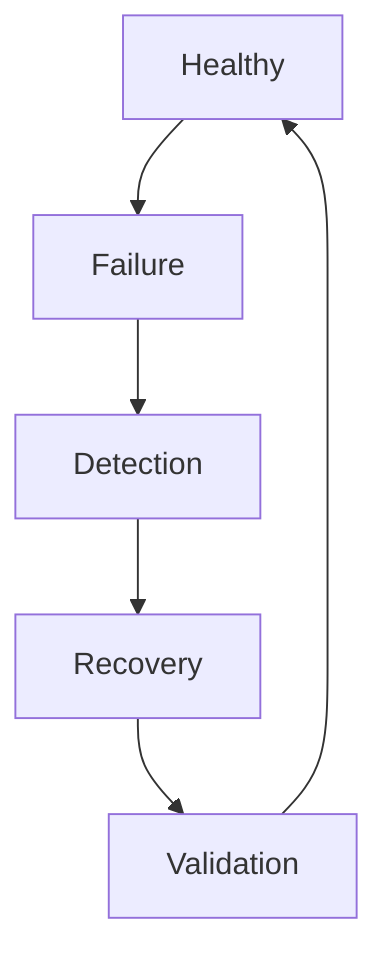

---

# Reliability Loop

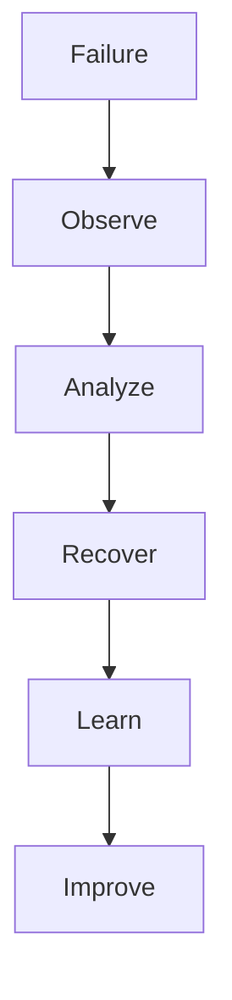

---

# Types Of Failures

Almost all failures belong here.

```text
Application Failure

Dependency Failure

Resource Failure

Configuration Failure

Network Failure

Storage Failure

Security Failure
```

---

# Failure Architecture

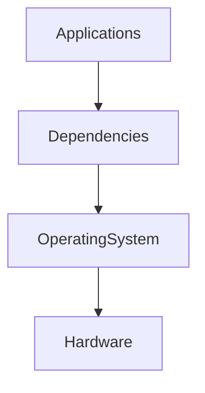

Failures can occur anywhere.

---

# The Layers Of Reliability

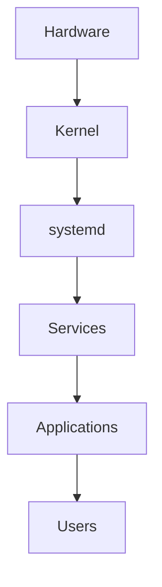

Each layer needs recovery mechanisms.

---

# Failure Detection Pipeline

Question:

How does Linux know something broke?

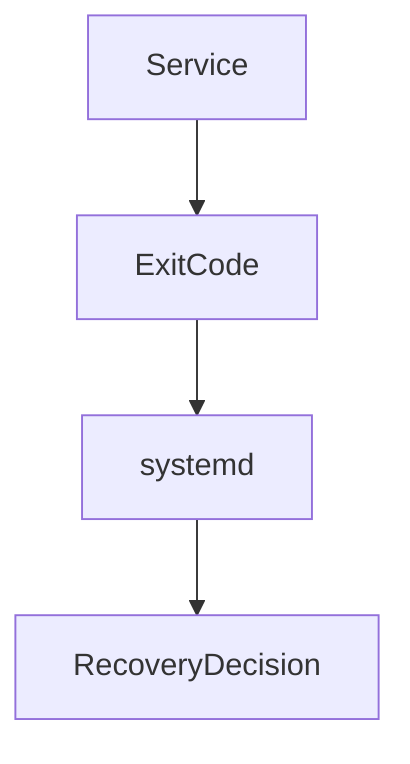

---

# How systemd Detects Failure

systemd monitors:

```text
Process state

Exit codes

Timeouts

Watchdogs

Dependencies
```

---

# Process Monitoring

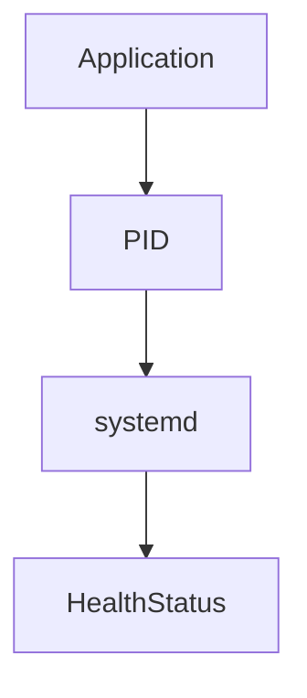

---

# Exit Codes

Extremely important.

```text
0

Success

--------------

Non-zero

Failure
```

Examples:

```text
1

General error

2

Misuse

126

Permission denied

127

Command not found
```

---

# Recovery Strategies

Linux uses several strategies.

```text
Restart

Retry

Delay

Isolate

Degrade

Alert
```

---

# Recovery Pyramid

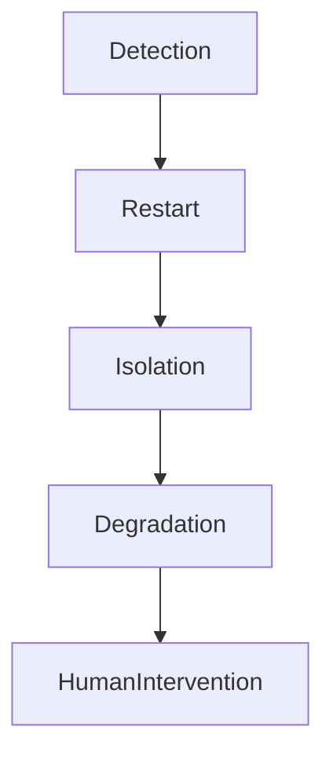

---

# Automatic Restart

Most common strategy.

Example:

```ini
Restart=on-failure
```

Visual:

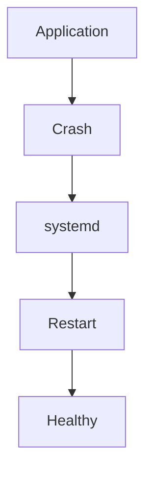

---

# Restart Policies

```text
no

always

on-success

on-failure

on-abnormal

on-watchdog

on-abort
```

---

# Which One To Use?

Most production applications:

```ini
Restart=on-failure
```

---

# Restart Delay

Never restart instantly forever.

Example:

```ini
RestartSec=5
```

Visual:

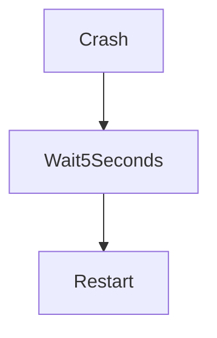

---

# Restart Storms

Dangerous problem.

Imagine:

```text
Crash

↓

Restart

↓

Crash

↓

Restart

↓

Crash
```

Visual:

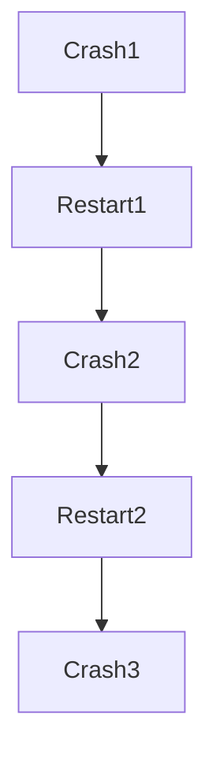

This is called:

```text
Restart Loop
```

---

# Start Limit Protection

Protects systems.

Example:

```ini
StartLimitBurst=5

StartLimitIntervalSec=60
```

Meaning:

```text
5 failures

↓

60 seconds

↓

Stop restarting
```

---

# Visual

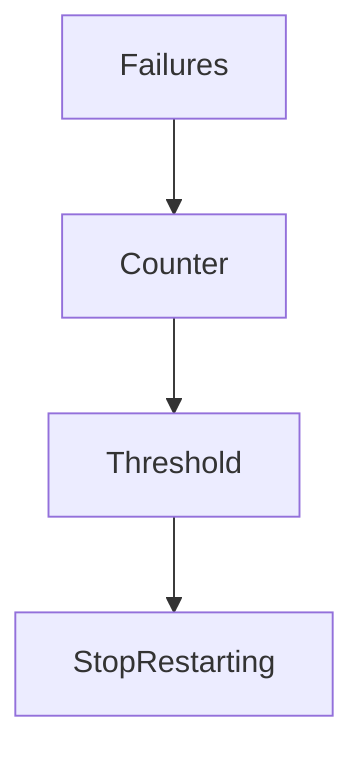

---

# Timeouts

Never wait forever.

```ini
TimeoutStartSec=30

TimeoutStopSec=20
```

---

# Why Timeouts Exist

Imagine:

```text
Database hangs forever
```

Without timeout:

```text
Entire dependency chain blocks
```

With timeout:

```text
Recover faster
```

---

# Dependency Failures

Very common.

Example:

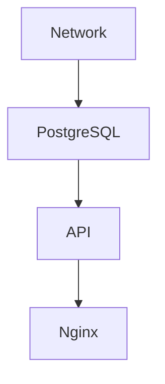

---

# Cascading Failure

Question:

What if PostgreSQL dies?

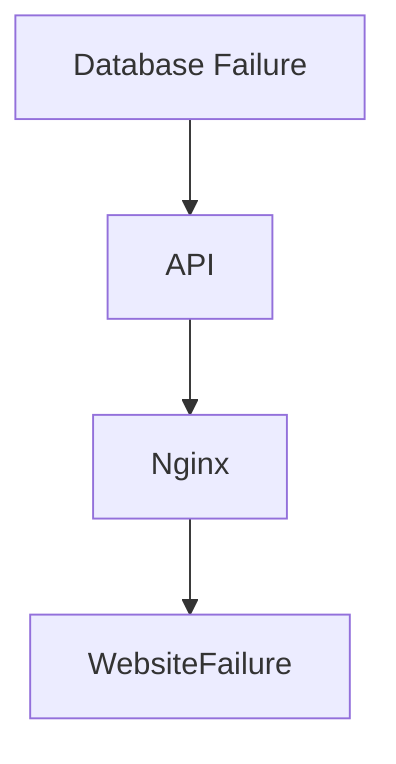

---

# How To Prevent Cascading Failures

Strategies:

```text
Loose coupling

Retries

Graceful degradation

Health checks

Isolation
```

---

# Failure Isolation

One service should not destroy everything.

Visual:

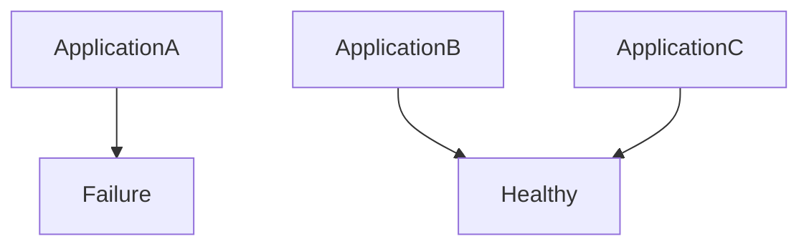

---

# cgroups Help Isolation

systemd uses cgroups.

Benefits:

```text
Memory isolation

CPU isolation

Process isolation
```

---

# Resource Protection

Example:

```ini
MemoryMax=1G

CPUQuota=50%

TasksMax=200
```

Visual:

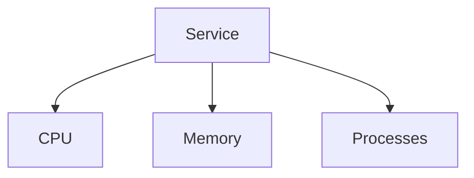

---

# Graceful Degradation

One of the most important concepts.

Question:

Can the system partially work?

Instead of:

```text
Entire website dead
```

Do:

```text
Recommendations unavailable

↓

Website still works
```

---

# Visualization

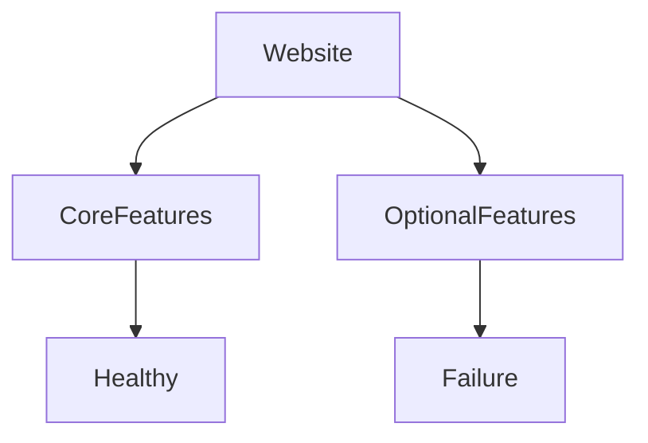

---

# Watchdogs

Watchdogs detect hung services.

Example:

```ini
WatchdogSec=30
```

Visual:

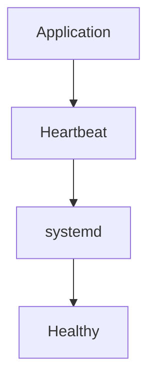

No heartbeat:

```text
Restart
```

---

# Health Checks

Services should answer:

```text
Am I alive?

Am I healthy?

Am I ready?
```

---

# Health Check Architecture

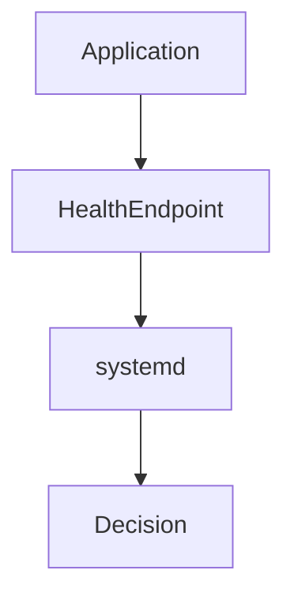

---

# Logging During Recovery

Every recovery action creates logs.

Visual:

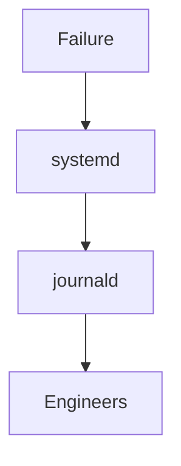

Useful commands:

```bash
journalctl -u app

systemctl status app
```

---

# Production Example 1

NodeJS API crashes.

Configuration:

```ini
[Service]

ExecStart=/usr/bin/node server.js

Restart=on-failure

RestartSec=5

StartLimitBurst=5

StartLimitIntervalSec=60
```

---

# Production Example 2

Python AI Service.

```ini
[Service]

ExecStart=/usr/bin/python3 app.py

Restart=always

MemoryMax=2G

WatchdogSec=30
```

---

# Production Example 3

Background Worker.

```ini
[Service]

ExecStart=/opt/worker/worker

Restart=on-failure

CPUQuota=50%
```

---

# Production Recovery Workflow

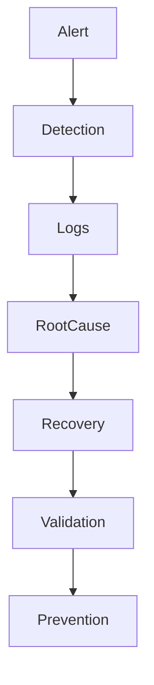

---

# Mean Time Metrics

Very important reliability concepts.

### MTTD

```text
Mean Time To Detect
```

### MTTR

```text
Mean Time To Recover
```

### MTBF

```text
Mean Time Between Failures
```

---

# Goal

Reduce:

```text
MTTD

MTTR
```

Increase:

```text
MTBF
```

---

# Reliability Formula

Very simplified.

```text
Reliable System

=

Fast Detection

+

Fast Recovery

+

Good Isolation
```

---

# Production Stack Example

```mermaid
flowchart TD

Users

Users --> Nginx

Nginx --> API

API --> Redis

API --> PostgreSQL

All --> systemd

systemd --> RecoveryEngine
```

---

# The Golden Recovery Workflow

```text
Failure

↓

Detect

↓

Isolate

↓

Recover

↓

Validate

↓

Learn
```

---

# Troubleshooting vs Recovery

This distinction is important.

Troubleshooting:

```text
Find the problem
```

Recovery:

```text
Survive the problem
```

---

# Common Beginner Mistakes

## Mistake 1

Thinking failures are rare.

Wrong.

Failures are normal.

---

## Mistake 2

Using:

```ini
Restart=always
```

everywhere.

Can create restart storms.

---

## Mistake 3

Ignoring timeouts.

Very dangerous.

---

## Mistake 4

Ignoring dependency chains.

---

## Mistake 5

Designing tightly coupled systems.

Fragile systems break easily.

---

# Engineering Mindset

Do not think:

```text
How do I prevent failures?
```

Think:

```text
How do I recover quickly?
```

That is much closer to modern reliability engineering.

---

# Mental Models To Remember Forever

### Model 1

```text
Failures

=

Normal
```

---

### Model 2

```text
Reliable Systems

≠

Perfect Systems
```

---

### Model 3

```text
Reliable Systems

=

Fast Recovery Systems
```

---

# Ultimate Mental Model

```text
Failure

↓

Detection

↓

Recovery

↓

Validation

↓

Healthy System
```

Or even simpler:

```text
Modern Linux systems are designed to survive failures, not avoid them.
```

That single sentence explains service failure recovery.
