# Service Security Hardening Deep Fundamentals

> Understanding how systemd can transform ordinary applications into isolated, production-grade, security-hardened services.

---

# Learning Goals

By the end of this file, you will understand:

- Why service hardening exists
- The principle of least privilege
- Threat modeling services
- Attack surfaces
- Running services without root
- Filesystem protection
- User isolation
- Process isolation
- Namespace isolation
- Linux capabilities
- Privilege escalation prevention
- Resource abuse prevention
- Production security patterns
- Docker and Kubernetes relationships

---

# First Principles

Imagine a NodeJS API server.

Question:

If someone compromises it, what can they access?

Worst case:

```text
Entire operating system

↓

Home directories

↓

SSH keys

↓

Databases

↓

System files

↓

Secrets

↓

Other applications
```

That is catastrophic.

Question:

Can we reduce the damage?

Yes.

That is hardening.

---

# The Biggest Idea

Most beginners think:

```text
Security

↓

Firewall

↓

Done
```

Wrong.

Production security is layers.

```text
Application

↓

User Permissions

↓

Filesystem Restrictions

↓

Capabilities

↓

Namespaces

↓

Resource Limits

↓

Kernel Security
```

systemd can control many of these layers.

---

# Security Philosophy

The goal is:

> Even if an application is compromised, the attacker should have extremely limited power.

Think:

```text
Castle

↓

Walls

↓

Locked Doors

↓

Security Guards

↓

Restricted Rooms
```

systemd helps build those walls.

---

# Security Layers

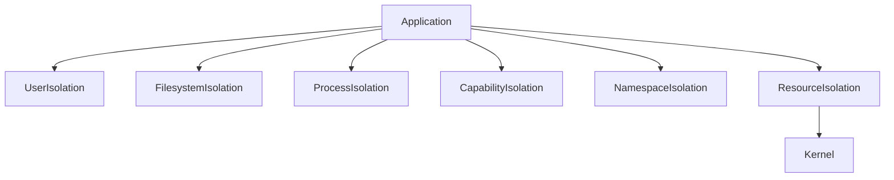

---

# Threat Model

Question:

What can attackers abuse?

Common targets:

```text
Filesystem

Memory

Processes

Devices

Network

Secrets

SSH Keys

System Files
```

---

# Example Scenario

Imagine:

```text
NodeJS API

↓

Remote Code Execution

↓

Attacker gains shell
```

If running as root:

```text
Attacker owns server
```

If hardened:

```text
Attacker trapped inside sandbox
```

---

# Principle Of Least Privilege

Golden rule:

> Give only the permissions absolutely necessary.

Wrong:

```text
Everything

↓

Root
```

Correct:

```text
Minimal access

↓

Minimal damage
```

---

# The Security Pyramid

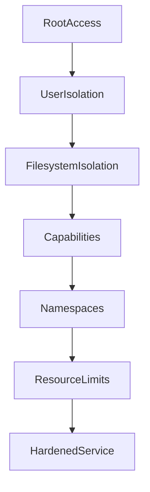

---

# Rule 1 : Never Run As Root

This is the most important rule.

Bad:

```ini
ExecStart=/usr/bin/myapp
```

Running as root.

Good:

```ini
User=myapp
```

---

# Visual

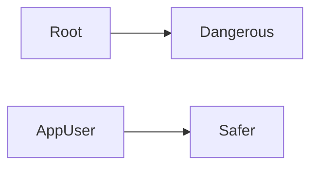

---

# Create Dedicated User

Example:

```bash
sudo useradd -r -s /usr/sbin/nologin myapp
```

Options:

```text
-r

System account

-s

No login shell
```

---

# Service Example

```ini
[Service]

User=myapp

Group=myapp
```

---

# Rule 2 : Disable Privilege Escalation

Directive:

```ini
NoNewPrivileges=true
```

Meaning:

```text
Service cannot gain new privileges
```

Blocks:

```text
sudo

setuid attacks

Privilege escalation
```

---

# Visual

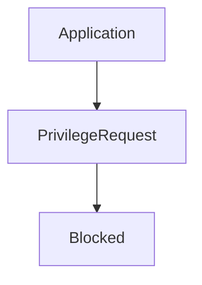

---

# Rule 3 : Protect The System Filesystem

Directive:

```ini
ProtectSystem=strict
```

Protects:

```text
/usr

/boot

/etc
```

Makes them read-only.

---

# Visual

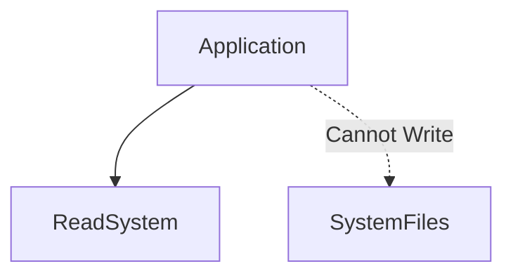

---

# Rule 4 : Protect Home Directories

Directive:

```ini
ProtectHome=true
```

Blocks access to:

```text
/home

/root

/run/user
```

---

# Visual

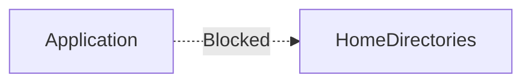

---

# Rule 5 : Private Temporary Directory

Problem:

Applications share:

```text
/tmp
```

Risk:

```text
Data leakage

Race attacks

Collisions
```

Solution:

```ini
PrivateTmp=true
```

Each service gets its own temporary directory.

---

# Visual

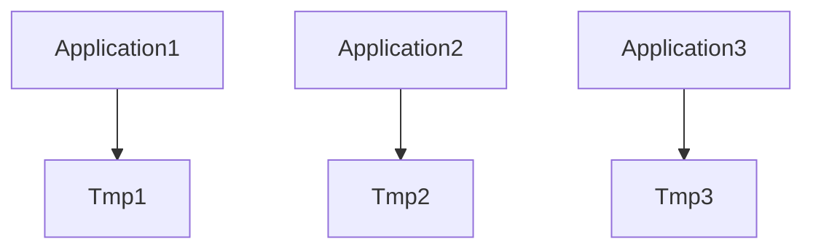

---

# Rule 6 : Restrict Device Access

Directive:

```ini
PrivateDevices=true
```

Blocks access to:

```text
/ dev

USB

Storage devices

Kernel devices
```

---

# Visual

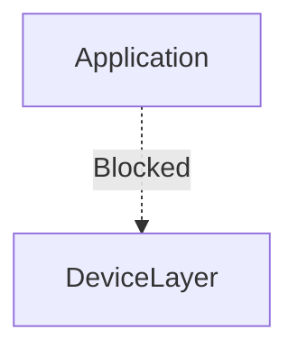

---

# Rule 7 : Restrict Kernel Access

Directive:

```ini
ProtectKernelModules=true

ProtectKernelTunables=true

ProtectControlGroups=true
```

Blocks:

```text
Kernel modules

Kernel parameters

cgroups
```

---

# Visual

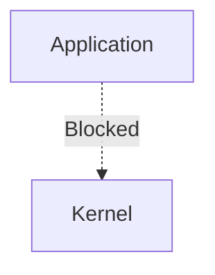

---

# Rule 8 : Restrict Network Families

Example:

```ini
RestrictAddressFamilies=AF_INET AF_INET6
```

Allowed:

```text
IPv4

IPv6
```

Blocked:

```text
Bluetooth

Raw sockets

Others
```

---

# Rule 9 : Remove Linux Capabilities

This is extremely important.

Root normally has many powers.

Examples:

```text
Mount filesystems

Kill processes

Change network

Load kernel modules
```

Applications rarely need all of them.

---

# Capability Visual

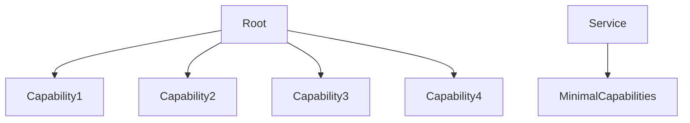

---

# Drop Capabilities

Example:

```ini
CapabilityBoundingSet=
```

Drops all.

Or:

```ini
CapabilityBoundingSet=CAP_NET_BIND_SERVICE
```

Allow only:

```text
Bind to low ports
```

---

# Common Capabilities

| Capability | Meaning |
|-----------|---------|
| CAP_NET_BIND_SERVICE | Bind ports <1024 |
| CAP_SYS_ADMIN | System administration |
| CAP_NET_ADMIN | Network management |
| CAP_SYS_TIME | Change clock |
| CAP_SYS_MODULE | Load modules |

---

# Rule 10 : Restrict System Calls

Directive:

```ini
SystemCallFilter=
```

Example:

```ini
SystemCallFilter=@system-service
```

Blocks dangerous syscalls.

---

# Visual

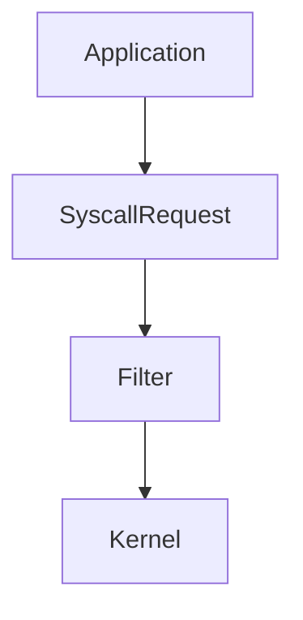

---

# Rule 11 : Memory Execution Protection

Directive:

```ini
MemoryDenyWriteExecute=true
```

Blocks:

```text
Writable executable memory
```

Helps against:

```text
Code injection

Shellcode attacks
```

---

# Rule 12 : Restrict Namespace Creation

Directive:

```ini
RestrictNamespaces=true
```

Blocks:

```text
Mount namespaces

PID namespaces

Network namespaces
```

---

# Rule 13 : Restrict Realtime Scheduling

Directive:

```ini
RestrictRealtime=true
```

Blocks CPU abuse.

---

# Rule 14 : Lock Personality

Directive:

```ini
LockPersonality=true
```

Prevents execution environment manipulation.

---

# Secure Service Example

NodeJS API.

```ini
[Unit]

Description=Production API

After=network.target

[Service]

ExecStart=/usr/bin/node app.js

User=nodeapp

Group=nodeapp

NoNewPrivileges=true

PrivateTmp=true

PrivateDevices=true

ProtectSystem=strict

ProtectHome=true

ProtectKernelModules=true

ProtectKernelTunables=true

ProtectControlGroups=true

MemoryDenyWriteExecute=true

RestrictNamespaces=true

RestrictRealtime=true

LockPersonality=true

CapabilityBoundingSet=

Restart=on-failure

[Install]

WantedBy=multi-user.target
```

---

# Secure Service Architecture

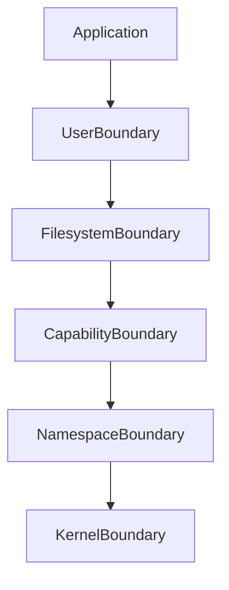

---

# Analyze Security Score

Amazing command:

```bash
systemd-analyze security nginx.service
```

Example:

```text
Overall exposure level

5.8 MEDIUM
```

This command is incredibly useful.

---

# Security Audit Workflow

Step 1

Analyze.

```bash
systemd-analyze security service-name
```

Step 2

Inspect.

```bash
systemctl cat service-name
```

Step 3

Add restrictions.

```text
User

ProtectSystem

ProtectHome

PrivateTmp

Capabilities
```

Step 4

Retest.

---

# Production Layering Example

Imagine:

```text
Node API

Redis

PostgreSQL

Nginx
```

Visual:

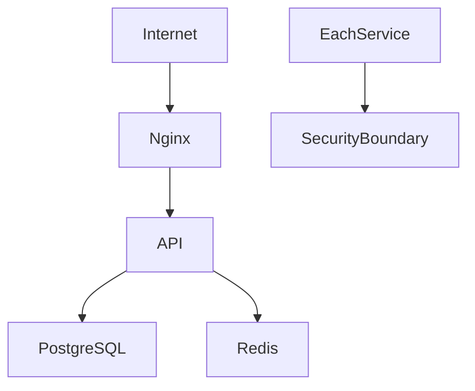

---

# Docker Relationship

Containers did not invent isolation.

Many container ideas come from Linux primitives.

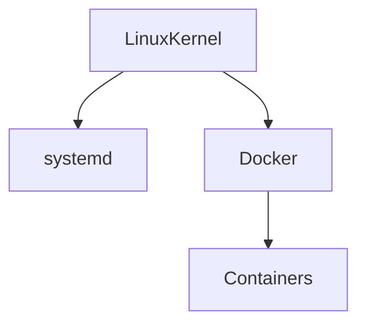

Shared technologies:

```text
Namespaces

Capabilities

cgroups

Filesystem isolation
```

---

# Kubernetes Relationship

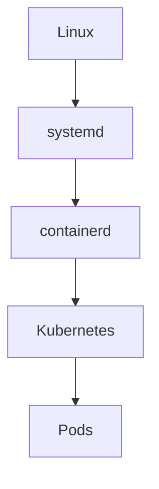

Same principles apply.

---

# Production Hardening Checklist

Never deploy production services without checking:

```text
☑ User

☑ Group

☑ NoNewPrivileges

☑ ProtectSystem

☑ ProtectHome

☑ PrivateTmp

☑ PrivateDevices

☑ CapabilityBoundingSet

☑ MemoryDenyWriteExecute

☑ RestrictNamespaces

☑ Restart policies
```

---

# Common Beginner Mistakes

## Mistake 1

Running everything as root.

Very dangerous.

---

## Mistake 2

Ignoring capabilities.

Huge attack surface.

---

## Mistake 3

Thinking Docker alone is security.

Wrong.

Security starts at Linux.

---

## Mistake 4

Never auditing services.

Always analyze them.

---

# Engineering Mindset

Do not think:

```text
systemd starts applications
```

Think:

```text
systemd builds security boundaries around applications
```

That is much closer to reality.

---

# Mental Model To Remember Forever

```text
Application

↓

Security Layers

↓

systemd

↓

Kernel

↓

Hardware
```

Or:

```text
Compromised Application

≠

Compromised Server
```

That is the ultimate goal of service hardening.
