# systemctl Deep Fundamentals

> Understanding the control plane that manages an entire Linux operating system.

---

# Learning Goals

By the end of this file, you will understand:

- What systemctl is
- Why systemctl exists
- systemctl architecture
- systemctl vs systemd
- Unit management
- Service management
- Boot management
- Target management
- Timer management
- Dependency inspection
- Production workflows
- Troubleshooting methodologies
- Cloud infrastructure usage

---

# First Principles

Imagine Linux has booted.

Question:

How do humans communicate with systemd?

Remember:

```text
systemd = Operating System Orchestrator
```

But humans need a control panel.

That control panel is:

```text
systemctl
```

---

# The Biggest Misconception

Many beginners think:

```text
systemctl = systemd
```

Wrong.

They are different.

```text
systemd

↓

Operating System Manager

-----------------

systemctl

↓

Management Interface
```

---

# Mental Model

Think of Linux as a city.

```text
Linux = City

systemd = Mayor

Services = Buildings

Targets = City Modes

Timers = Schedules

systemctl = Mayor's Control Panel
```

---

# Architecture Overview

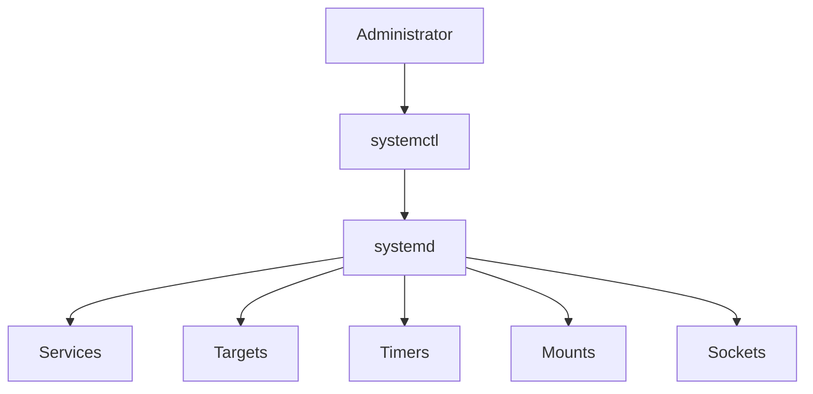

---

# Linux Communication Path

Without systemctl:

```text
Human

↓

Cannot directly manage Linux orchestration
```

With systemctl:

```text
Human

↓

systemctl

↓

systemd

↓

Operating System
```

---

# systemctl Is NOT A Service Manager

This is extremely important.

People say:

```text
systemctl manages services
```

Partially true.

It manages:

```text
Services

Targets

Timers

Sockets

Mounts

Dependencies

Users

Boot states
```

---

# systemctl Architecture

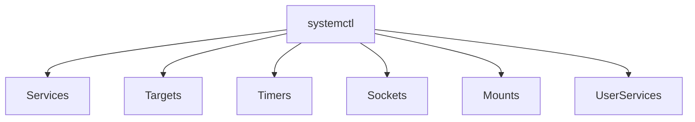

---

# Categories Of Operations

There are 7 major categories.

```text
1 Status Operations

2 Lifecycle Operations

3 Boot Operations

4 Dependency Operations

5 Configuration Operations

6 Inspection Operations

7 Troubleshooting Operations
```

---

# Category 1 : Status Operations

Question:

> What is happening right now?

---

# Status

```bash
systemctl status nginx
```

Example:

```text
● nginx.service

Loaded: loaded

Active: active (running)

PID: 2341
```

---

# Visual

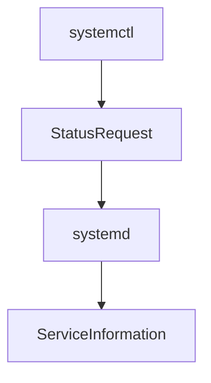

---

# What Does Status Show?

Many things.

```text
Load state

Active state

PID

Logs

Dependencies

Resource usage

Recent events
```

---

# Category 2 : Lifecycle Operations

These change service state.

---

# Start

```bash
systemctl start nginx
```

Meaning:

```text
Start now
```

---

# Stop

```bash
systemctl stop nginx
```

Meaning:

```text
Stop gracefully
```

---

# Restart

```bash
systemctl restart nginx
```

Meaning:

```text
Stop

↓

Start again
```

---

# Reload

```bash
systemctl reload nginx
```

Meaning:

```text
Apply configuration

↓

Keep running
```

---

# Lifecycle Visualization

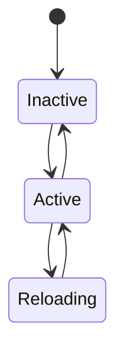

---

# Restart vs Reload

Very important.

Restart:

```text
Stop process

↓

Start new process
```

Reload:

```text
Keep process alive

↓

Apply configuration
```

---

# Visual

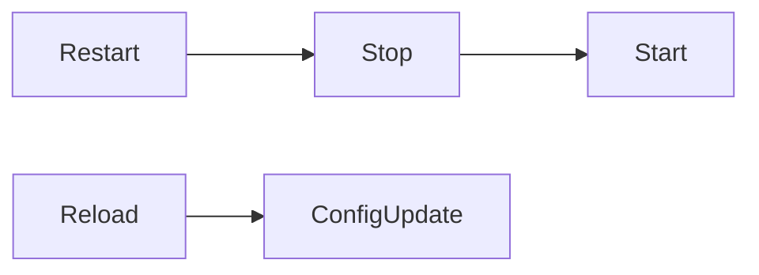

---

# Category 3 : Boot Operations

Question:

> What should happen after reboot?

---

# Enable

```bash
systemctl enable nginx
```

This does NOT start nginx.

It means:

```text
Run during boot
```

---

# Disable

```bash
systemctl disable nginx
```

Meaning:

```text
Do not run during boot
```

---

# Boot Visualization

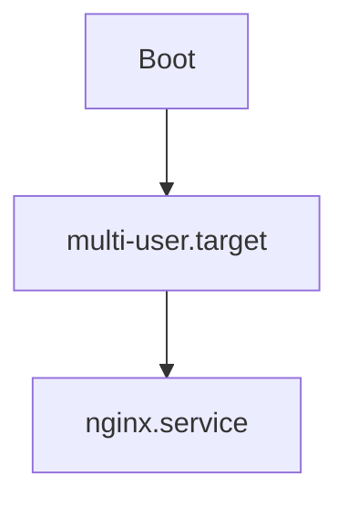

---

# Start vs Enable

This confuses everyone.

Start:

```text
Current session
```

Enable:

```text
Future boot
```

Visual:

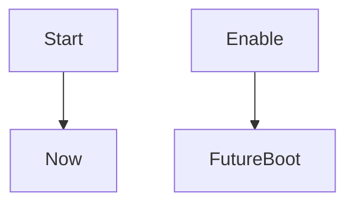

---

# How Enable Works

systemd creates symbolic links.

Visual:

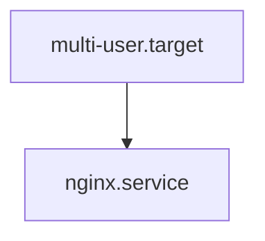

---

# Reenable

Useful command.

```bash
sudo systemctl reenable nginx
```

Recreates symbolic links.

---

# Category 4 : Dependency Operations

Question:

> What does this service need?

Command:

```bash
systemctl list-dependencies nginx
```

---

# Dependency Visual

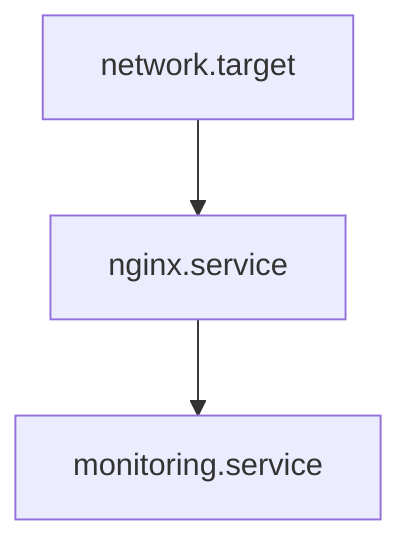

---

# Reverse Dependencies

Question:

> Who depends on me?

```bash
systemctl list-dependencies --reverse nginx
```

---

# Visual

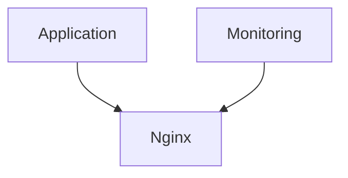

---

# Category 5 : Configuration Operations

Question:

> What configuration is systemd using?

---

# Show Unit File

```bash
systemctl cat nginx
```

Shows:

```text
Unit definition

Overrides

Drop-ins
```

---

# Show Properties

```bash
systemctl show nginx
```

Shows:

```text
Memory

CPU

PID

Dependencies

Restart policies
```

---

# Edit Units

```bash
sudo systemctl edit nginx
```

Creates override files.

---

# Reload Daemon

Very important.

```bash
sudo systemctl daemon-reload
```

Meaning:

```text
Re-read all unit files
```

Visual:

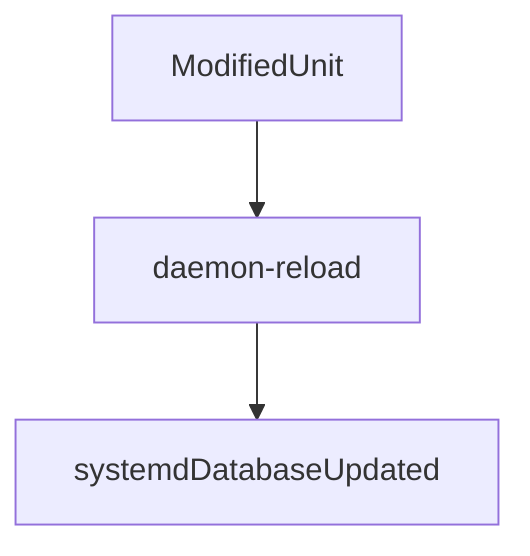

---

# Category 6 : Inspection Operations

List active units.

```bash
systemctl list-units
```

---

# List Unit Files

```bash
systemctl list-unit-files
```

---

# List Services

```bash
systemctl list-units --type=service
```

---

# List Timers

```bash
systemctl list-timers
```

---

# List Targets

```bash
systemctl list-units --type=target
```

---

# Visual

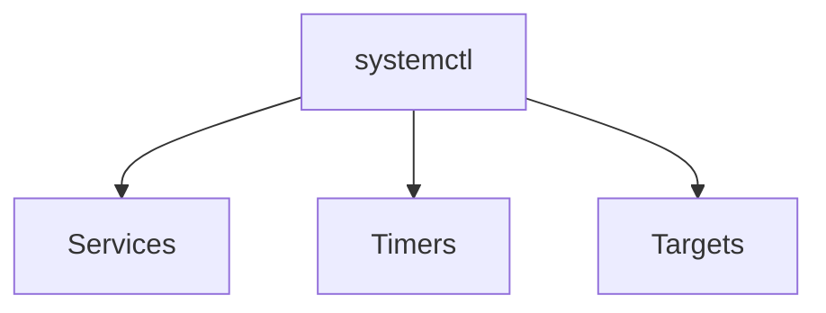

---

# Category 7 : Troubleshooting Operations

This is where engineers spend most of their time.

---

# Failed Services

```bash
systemctl --failed
```

Shows:

```text
Broken units
```

---

# Check Health

```bash
systemctl is-active nginx
```

Outputs:

```text
active
```

or

```text
inactive
```

---

# Is Enabled

```bash
systemctl is-enabled nginx
```

Outputs:

```text
enabled

disabled
```

---

# Boot State

```bash
systemctl get-default
```

Example:

```text
multi-user.target
```

---

# Change Boot State

```bash
sudo systemctl set-default graphical.target
```

or

```bash
sudo systemctl set-default multi-user.target
```

---

# Isolate System State

```bash
sudo systemctl isolate rescue.target
```

Visual:

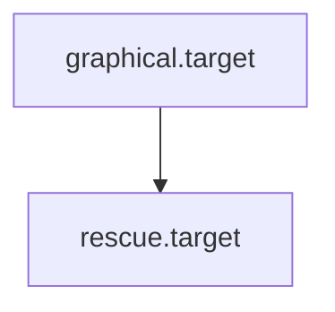

---

# Emergency Operations

Power off.

```bash
sudo systemctl poweroff
```

---

# Reboot.

```bash
sudo systemctl reboot
```

---

# Suspend.

```bash
sudo systemctl suspend
```

---

# Hibernate.

```bash
sudo systemctl hibernate
```

---

# Shutdown State Machine

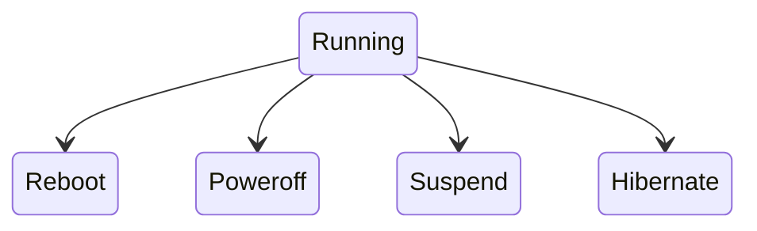

---

# Production Workflow

Imagine:

```text
Ubuntu Server

↓

Docker

↓

PostgreSQL

↓

Redis

↓

Nginx

↓

API
```

Visual:

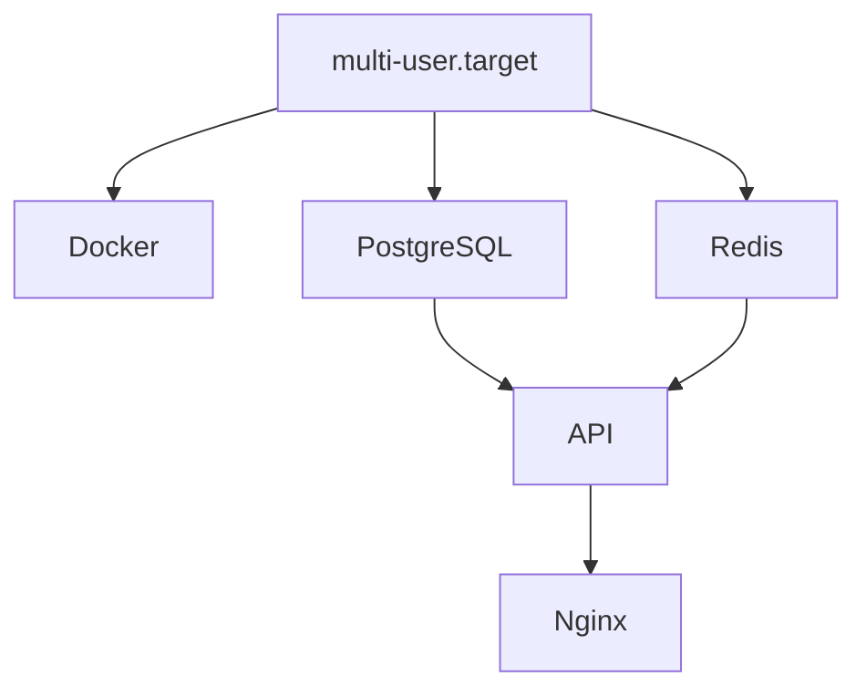

---

# Real Engineer Workflow

Question:

Website is down.

Workflow:

Step 1

```bash
systemctl status nginx
```

Step 2

```bash
systemctl --failed
```

Step 3

```bash
systemctl list-dependencies nginx
```

Step 4

```bash
systemctl status postgresql
```

Step 5

```bash
journalctl -u nginx
```

---

# Cloud Infrastructure Example

AWS VM boots.

systemctl manages:

```text
cloud-init

ssh

docker

monitoring
```

Visual:

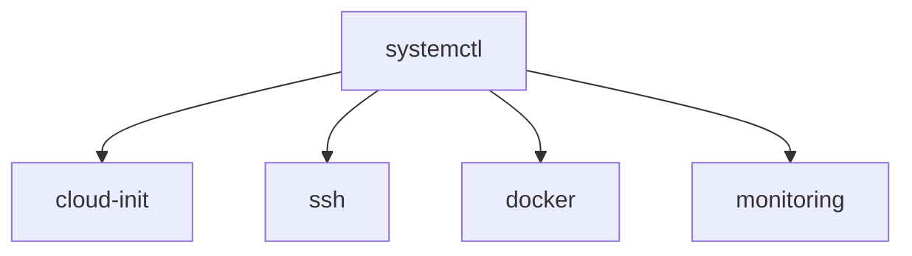

---

# Kubernetes Relationship

Many Kubernetes nodes rely on systemctl.

Visual:

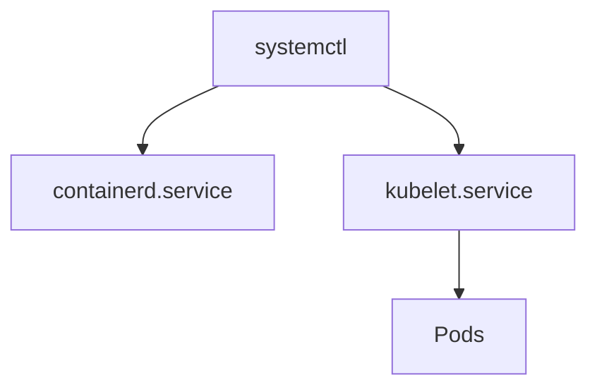

---

# Command Cheat Sheet

## Lifecycle

```bash
systemctl start nginx

systemctl stop nginx

systemctl restart nginx

systemctl reload nginx
```

---

## Boot

```bash
systemctl enable nginx

systemctl disable nginx

systemctl reenable nginx
```

---

## Inspection

```bash
systemctl status nginx

systemctl show nginx

systemctl cat nginx
```

---

## Troubleshooting

```bash
systemctl --failed

systemctl list-dependencies nginx

systemctl is-active nginx

systemctl is-enabled nginx
```

---

# Common Beginner Mistakes

## Mistake 1

Thinking:

```text
systemctl = systemd
```

Wrong.

---

## Mistake 2

Confusing:

```text
start

enable
```

---

## Mistake 3

Forgetting:

```bash
daemon-reload
```

after editing files.

---

## Mistake 4

Ignoring dependencies.

---

# Engineering Mindset

Do not think:

```text
systemctl starts nginx
```

Think:

```text
systemctl controls an entire operating system orchestrator
```

That is much closer to reality.

---

# Mental Model To Remember Forever

```text
Human

↓

systemctl

↓

systemd

↓

Dependency Graph

↓

Linux
```

Or even simpler:

```text
systemd is the brain.

systemctl is the keyboard.
```

That single sentence explains the entire relationship.
