# Target Units Deep Fundamentals

> Understanding how systemd groups and orchestrates an entire Linux operating system into desired states.

---

# Learning Goals

By the end of this file, you will understand:

- What target units are
- Why target units exist
- Why Linux needs system states
- How targets replaced runlevels
- How targets orchestrate services
- Boot targets
- Special targets
- Multi-user environments
- Graphical environments
- Dependency relationships
- Isolating targets
- Custom targets
- Production examples
- Cloud and Kubernetes relationships

---

# First Principles

Imagine you're building an operating system.

Question:

How do you tell Linux:

> "Bring the machine into a server state."

or

> "Bring the machine into a desktop state."

or

> "Bring the machine into a recovery state."

You need a mechanism.

That mechanism is:

```text
Target Units
```

---

# The Biggest Idea

Targets are NOT applications.

Targets are NOT processes.

Targets are NOT services.

Targets are:

> Collections of units that together create a desired system state.

---

# Think Like A City Planner

Imagine a city.

You don't manually say:

```text
Turn on streetlights

↓

Open schools

↓

Start buses

↓

Open hospitals
```

Instead, you say:

```text
Start Day Mode
```

Everything automatically starts.

Linux works the same way.

---

# Mental Model

```text
Linux = City

systemd = Mayor

Services = Buildings

Dependencies = Roads

Target = City Mode
```

Examples:

```text
Day Mode

Night Mode

Emergency Mode
```

Linux equivalent:

```text
multi-user.target

graphical.target

rescue.target
```

---

# Linux Is State Driven

The operating system constantly moves between states.

Examples:

```text
Power Off

↓

Booting

↓

Multi User

↓

Graphical

↓

Rescue

↓

Shutdown
```

Targets represent these states.

---

# High Level Architecture

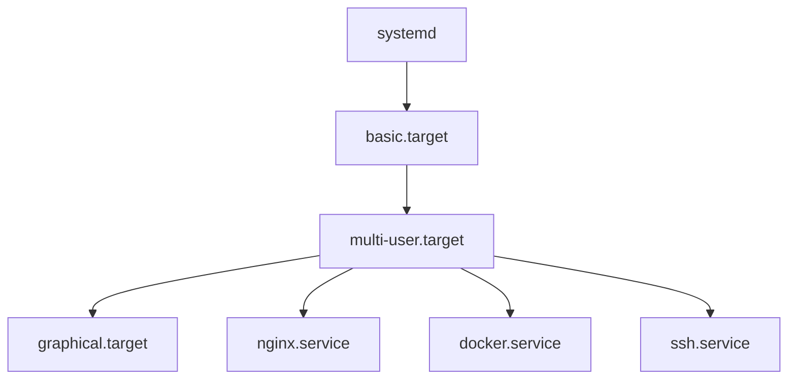

---

# Why Targets Exist

Before systemd there were runlevels.

SysVinit used numbers.

Example:

```text
0

1

3

5

6
```

Problems:

```text
Not descriptive

Difficult to customize

Rigid architecture
```

systemd replaced them.

---

# Runlevels vs Targets

| SysV | systemd |
|------|---------|
| 0 | poweroff.target |
| 1 | rescue.target |
| 3 | multi-user.target |
| 5 | graphical.target |
| 6 | reboot.target |

---

# Evolution

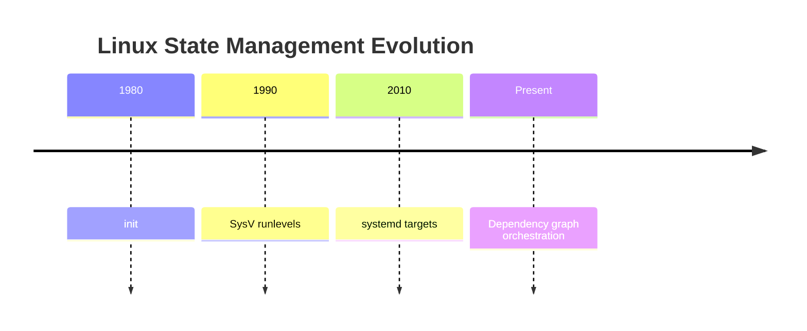

---

# What Is A Target?

A target is a special unit.

Extension:

```text
.target
```

Examples:

```text
multi-user.target

graphical.target

network.target

rescue.target

reboot.target
```

---

# Target Architecture

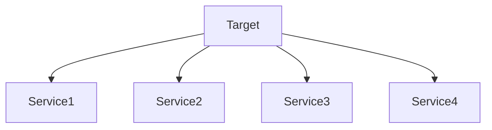

Targets group units.

---

# How Targets Work

Question:

What happens when Linux reaches:

```text
multi-user.target
```

systemd asks:

```text
What services belong here?

↓

What dependencies exist?

↓

What order should they start?
```

Then it executes them.

---

# Visualizing Boot

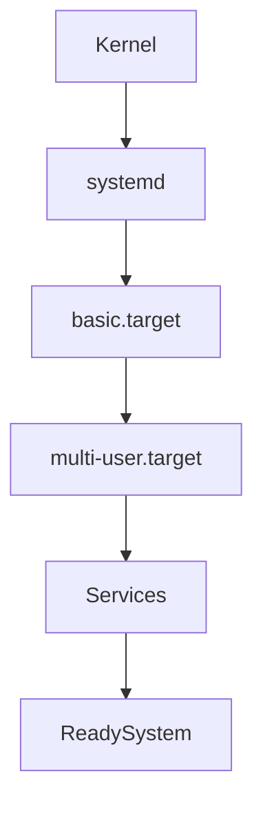

---

# Important Built-In Targets

---

# basic.target

Foundation.

Starts essential components.

Examples:

```text
Filesystem

Sockets

Basic services
```

Visual:

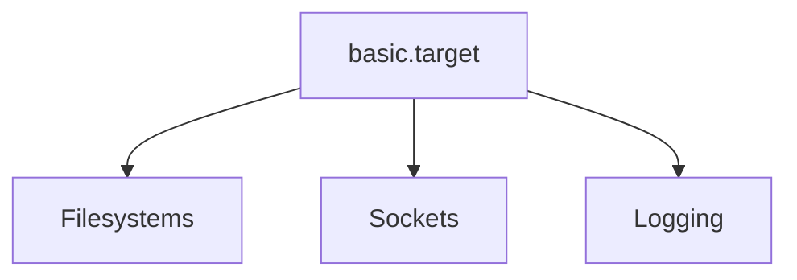

---

# network.target

Networking availability.

Provides:

```text
Network stack
```

Visual:

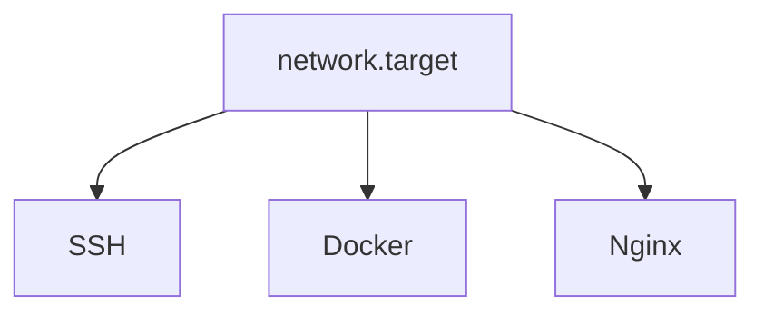

---

# multi-user.target

Very important.

Represents:

```text
Server mode
```

Characteristics:

```text
Networking

SSH

Services

No graphical desktop
```

Visual:

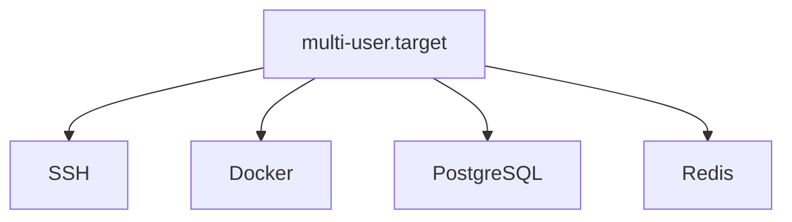

---

# graphical.target

Desktop environment.

Everything in:

```text
multi-user.target
```

plus:

```text
GUI
```

Visual:

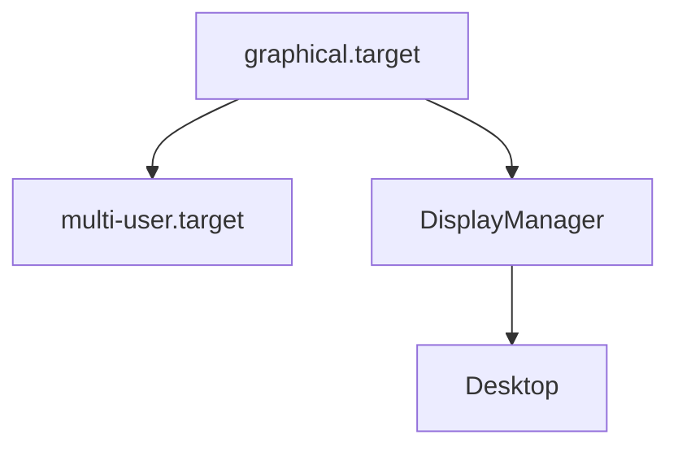

---

# rescue.target

Single user recovery mode.

Purpose:

```text
Troubleshooting
```

Characteristics:

```text
Minimal services

Root shell

Repair environment
```

Visual:

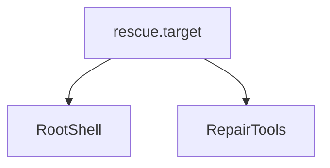

---

# emergency.target

Even smaller.

Characteristics:

```text
Almost nothing running
```

Used for severe failures.

Visual:

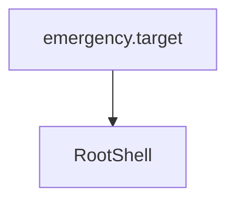

---

# reboot.target

Purpose:

```text
Reboot machine
```

Visual:

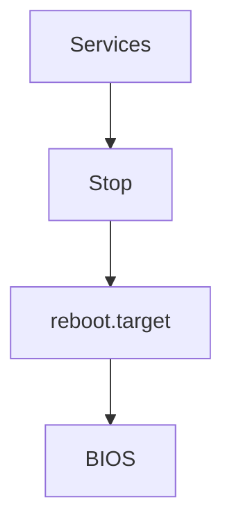

---

# poweroff.target

Purpose:

```text
Shutdown machine
```

Visual:

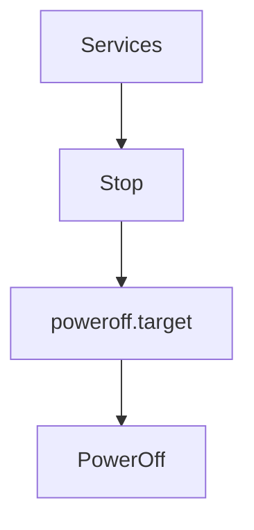

---

# Linux Boot State Machine

```mermaid
stateDiagram-v2

[*] --> basic.target

basic.target --> multi-user.target

multi-user.target --> graphical.target

graphical.target --> reboot.target

graphical.target --> poweroff.target

multi-user.target --> rescue.target
```

---

# Target Dependencies

Targets are dependency graphs too.

Example:

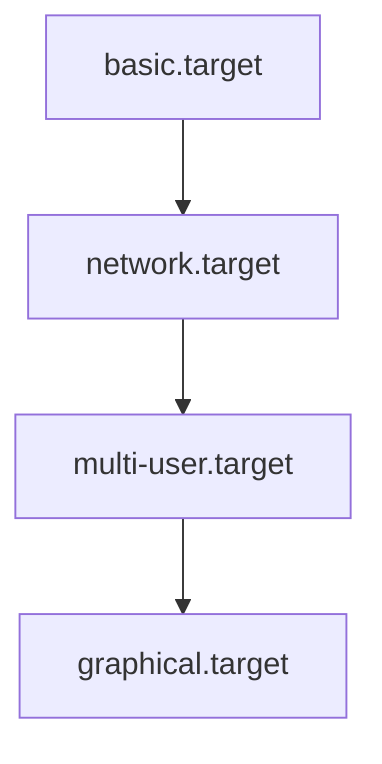

---

# Target File Example

```ini
[Unit]

Description=My Stack

Requires=docker.service

Wants=monitoring.service

After=network.target
```

Notice:

No:

```ini
[Service]
```

section exists.

Targets don't execute processes.

---

# Where Targets Live

Usually:

```text
/usr/lib/systemd/system
```

or

```text
/lib/systemd/system
```

Custom targets:

```text
/etc/systemd/system
```

---

# Default Target

Question:

Which target should Linux boot into?

Check:

```bash
systemctl get-default
```

Example:

```text
graphical.target
```

---

# Change Default Target

Server:

```bash
sudo systemctl set-default multi-user.target
```

Desktop:

```bash
sudo systemctl set-default graphical.target
```

---

# Visual

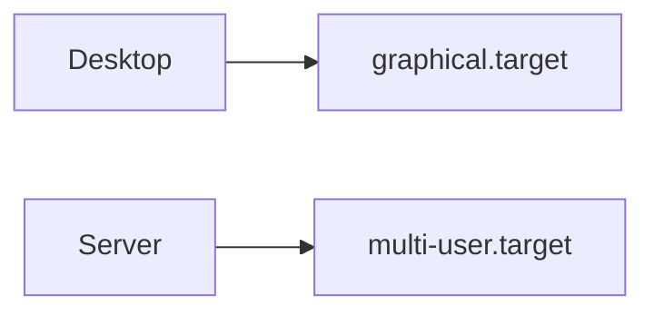

---

# Isolating Targets

This is powerful.

Command:

```bash
sudo systemctl isolate rescue.target
```

Meaning:

```text
Move operating system

↓

Into rescue state

↓

Stop unnecessary services
```

---

# Isolation Visual

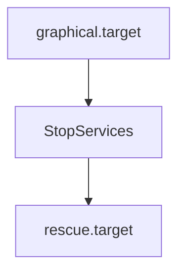

---

# View Dependencies

```bash
systemctl list-dependencies multi-user.target
```

---

# List Targets

```bash
systemctl list-units --type=target
```

Example:

```text
basic.target

multi-user.target

graphical.target

network.target
```

---

# Custom Target Example

Suppose we own:

```text
API

Redis

PostgreSQL

Monitoring
```

Create:

```text
my-stack.target
```

Visual:

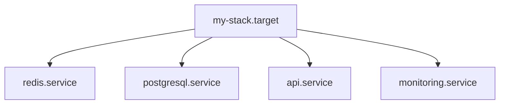

---

# Example Configuration

```ini
[Unit]

Description=My Application Stack

Requires=redis.service

Requires=postgresql.service

Requires=api.service

Requires=monitoring.service

After=network.target

AllowIsolate=true
```

---

# Cloud Infrastructure Example

AWS VM.

Boot flow:

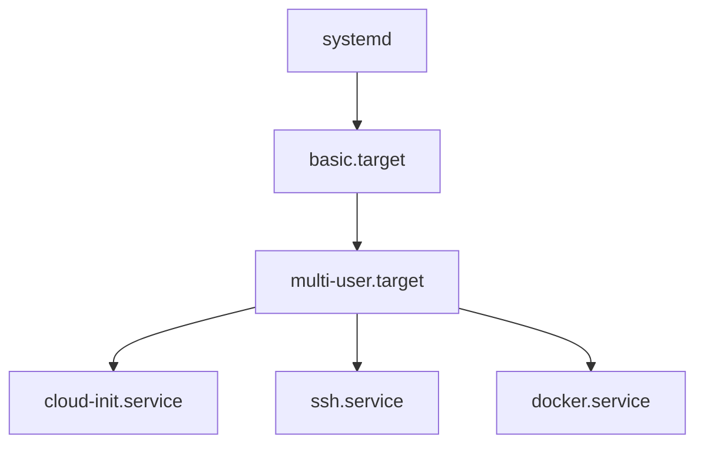

---

# Kubernetes Example

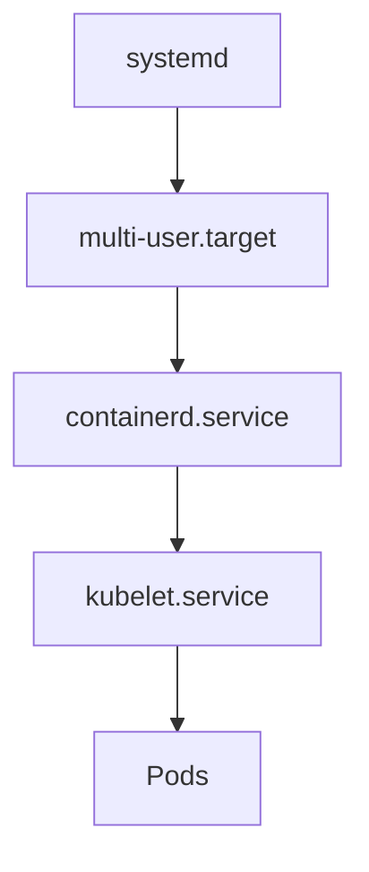

---

# Production Example

Imagine Ubuntu server.

Services:

```text
Nginx

Docker

PostgreSQL

Redis

Prometheus
```

Grouped under:

```text
multi-user.target
```

Visual:

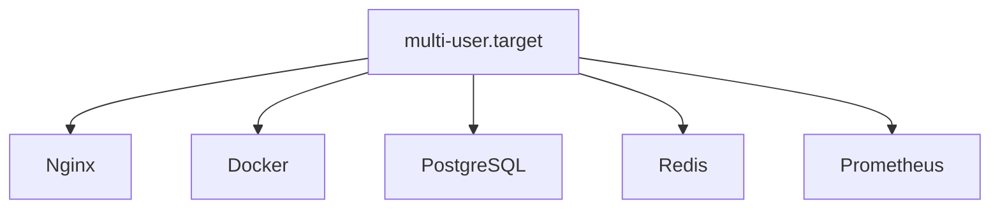

---

# Troubleshooting Workflow

Question:

System booted incorrectly.

Step 1

Check default target.

```bash
systemctl get-default
```

Step 2

Inspect dependencies.

```bash
systemctl list-dependencies multi-user.target
```

Step 3

Inspect failed services.

```bash
systemctl --failed
```

Step 4

Inspect logs.

```bash
journalctl -b
```

---

# Common Beginner Mistakes

## Mistake 1

Thinking targets are services.

Wrong.

Targets orchestrate services.

---

## Mistake 2

Thinking graphical.target is separate from multi-user.target.

Wrong.

It builds on top of it.

---

## Mistake 3

Memorizing runlevels.

Learn target philosophy instead.

---

# Engineering Mindset

Do not think:

```text
Linux starts services
```

Think:

```text
Linux moves between system states
```

Targets define those states.

---

# Mental Model To Remember Forever

```text
Kernel

↓

systemd

↓

Targets

↓

Services

↓

Operating System
```

Or:

```text
Targets are operating system destinations.

Services are the roads that get you there.
```

That single sentence explains target units.
