# systemd Timers Deep Fundamentals

> Understanding how Linux schedules work using event-driven, operating system integrated automation.

---

# Learning Goals

By the end of this file, you will understand:

- What timers are
- Why timers exist
- Why cron is limited
- Why systemd timers were created
- Timer architecture
- Timer lifecycle
- Monotonic timers
- Realtime timers
- Calendar expressions
- Timer persistence
- Boot-aware scheduling
- Event driven scheduling
- Production scheduling patterns
- Cloud infrastructure scheduling

---

# First Principles

Imagine you own a server.

Every day you need to:

```text
Backup database

Rotate logs

Clean temporary files

Sync files

Refresh caches

Generate reports
```

Question:

Who should remember all these tasks?

Humans?

No.

The operating system should.

This is scheduling.

---

# The Biggest Idea

Timers are NOT cron jobs.

Timers are:

> Operating system aware event schedulers.

Timers integrate with:

```text
Services

↓

Boot process

↓

Dependencies

↓

Logging

↓

Recovery

↓

Observability
```

---

# The Mental Model

Think of Linux as a city.

```text
Linux = City

systemd = Mayor

Services = Workers

Timers = Schedules

Logs = Newspapers
```

The mayor says:

```text
At 2 AM

↓

Run backup service

At 5 AM

↓

Cleanup logs

Every hour

↓

Refresh cache
```

---

# The Scheduling Problem

Without scheduling:

```text
Human

↓

Remember tasks

↓

Execute tasks

↓

Forget tasks

↓

Server problems
```

Automation solves this.

---

# Evolution Of Linux Scheduling

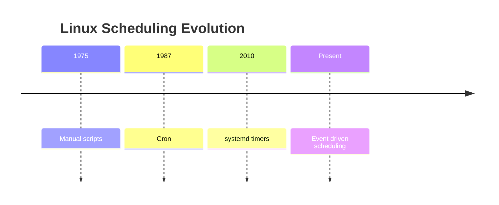

---

# Cron Architecture

Old Linux:

```text
Cron Daemon

↓

Reads crontab

↓

Runs commands
```

Visual:

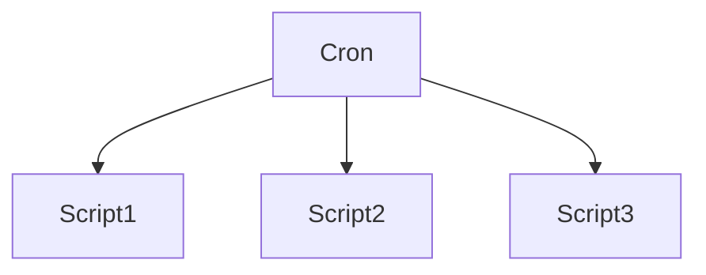

Problems exist.

---

# Problems With Cron

Cron is simple.

But limited.

Problems:

```text
No dependency awareness

No boot awareness

No recovery

No observability

No integration with services

No unified logging
```

---

# Example Problem

Imagine:

```text
2 AM

↓

Backup starts

↓

Server was off

↓

Backup missed forever
```

Cron simply misses it.

Timers can recover.

---

# Why systemd Timers Exist

Timers integrate with the OS.

Architecture:

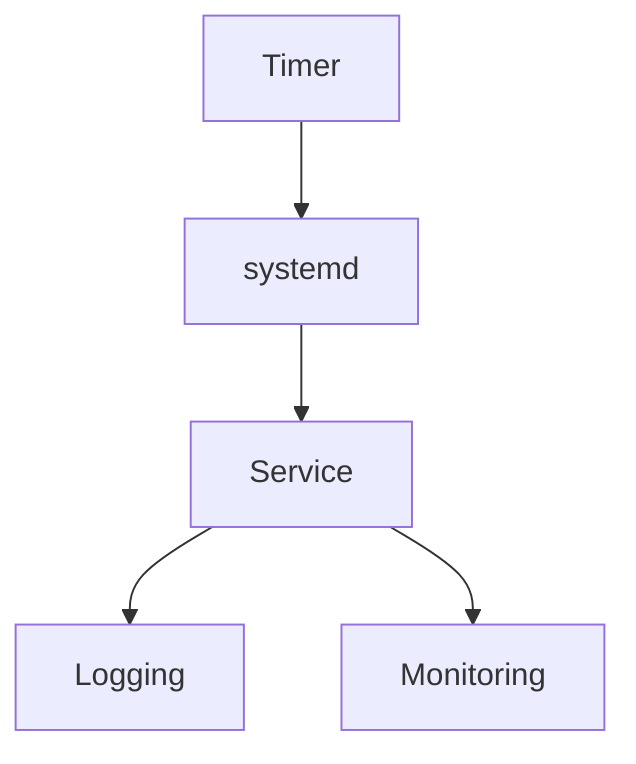

---

# The Biggest Difference

Cron:

```text
Time

↓

Command
```

Timer:

```text
Event

↓

Service

↓

Monitoring

↓

Logging
```

---

# Timer Philosophy

Timers never execute commands directly.

This is extremely important.

Timers execute:

```text
Services
```

Think:

```text
Timer

↓

Service

↓

Application
```

---

# Architecture Overview

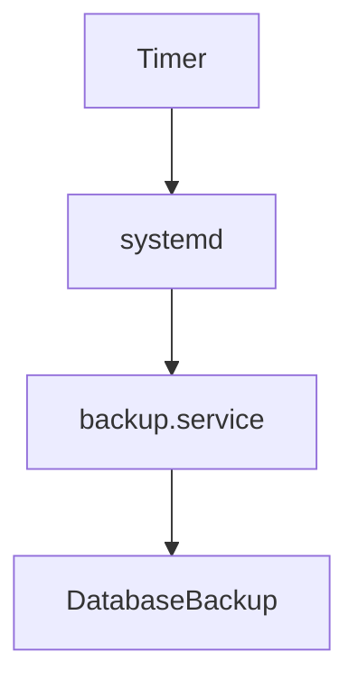

---

# Example Pair

Every timer usually has a matching service.

```text
backup.timer

backup.service
```

Relationship:


---

# Timer Unit Naming

Convention:

```text
name.timer
```

Examples:

```text
backup.timer

cleanup.timer

cache.timer

reports.timer
```

---

# Timer Lifecycle

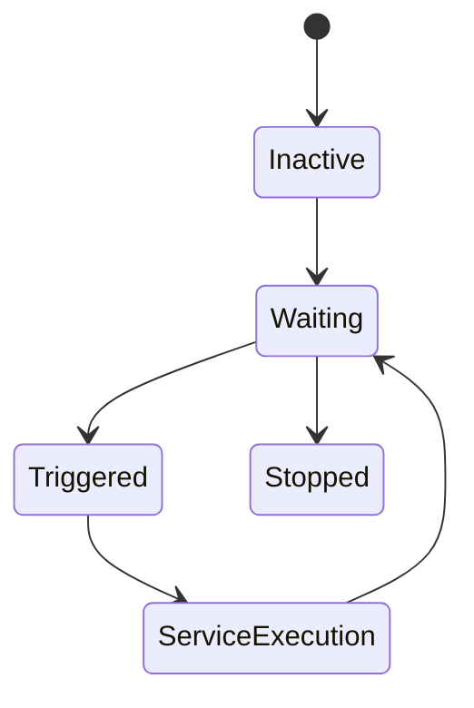

---

# Timer File Structure

Example:

```ini
[Unit]

Description=Database Backup Timer

[Timer]

OnCalendar=02:00

Persistent=true

[Install]

WantedBy=timers.target
```

Three sections exist.

---

# Section 1 : Unit

Metadata.

Example:

```ini
[Unit]

Description=Backup Timer
```

---

# Section 2 : Timer

Scheduling logic.

Example:

```ini
[Timer]

OnCalendar=02:00
```

---

# Section 3 : Install

Boot integration.

Example:

```ini
[Install]

WantedBy=timers.target
```

---

# timers.target

Question:

Who manages all timers?

Answer:

```text
timers.target
```

Visual:

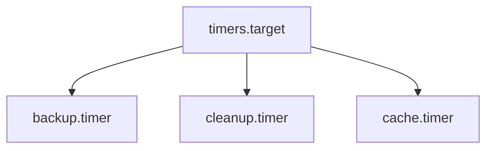

---

# Two Types Of Timers

Extremely important.

There are two families.

```text
Monotonic

Realtime
```

---

# Monotonic Timers

Relative to events.

Examples:

```text
After boot

After startup

After previous execution
```

Think:

```text
Event based time
```

---

# Realtime Timers

Wall clock time.

Examples:

```text
2 AM

8 PM

Monday

January
```

Think:

```text
Calendar time
```

---

# Timer Family Visualization

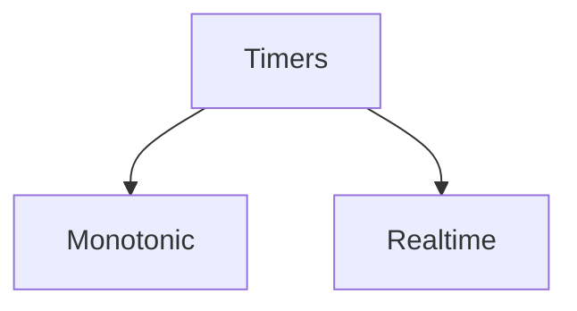

---

# Monotonic Timers Deep Dive

These depend on system events.

---

# OnBootSec

Meaning:

```text
Run after boot
```

Example:

```ini
OnBootSec=5m
```

Visual:


---

# OnStartupSec

Meaning:

```text
Run after systemd starts
```

Example:

```ini
OnStartupSec=2m
```

---

# OnUnitActiveSec

Meaning:

```text
Run after previous execution
```

Example:

```ini
OnUnitActiveSec=1h
```

Visual:


---

# OnUnitInactiveSec

Meaning:

```text
Run after completion
```

Example:

```ini
OnUnitInactiveSec=30m
```

---

# Realtime Timers

The most common timer.

Directive:

```ini
OnCalendar=
```

Examples:

```ini
OnCalendar=02:00
```

Daily at 2 AM.

---

# Every Day

```ini
OnCalendar=daily
```

---

# Every Hour

```ini
OnCalendar=hourly
```

---

# Every Week

```ini
OnCalendar=weekly
```

---

# Every Month

```ini
OnCalendar=monthly
```

---

# Calendar Examples

Every Monday:

```ini
OnCalendar=Mon *-*-* 09:00:00
```

Every 15 minutes:

```ini
OnCalendar=*:0/15
```

Every Sunday:

```ini
OnCalendar=Sun *-*-* 03:00:00
```

---

# Calendar Visualization

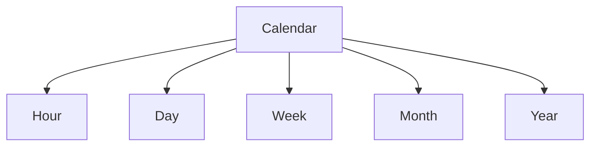

---

# Persistent Timers

This is one of the biggest advantages over cron.

Example:

```ini
Persistent=true
```

Question:

What if server was off?

Timer remembers.

Visual:

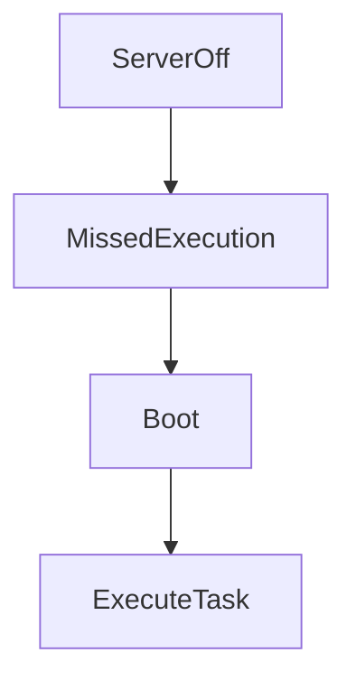

---

# Randomized Delay

Useful for clusters.

Directive:

```ini
RandomizedDelaySec=300
```

Prevents:

```text
1000 servers

↓

All executing simultaneously
```

---

# Visual

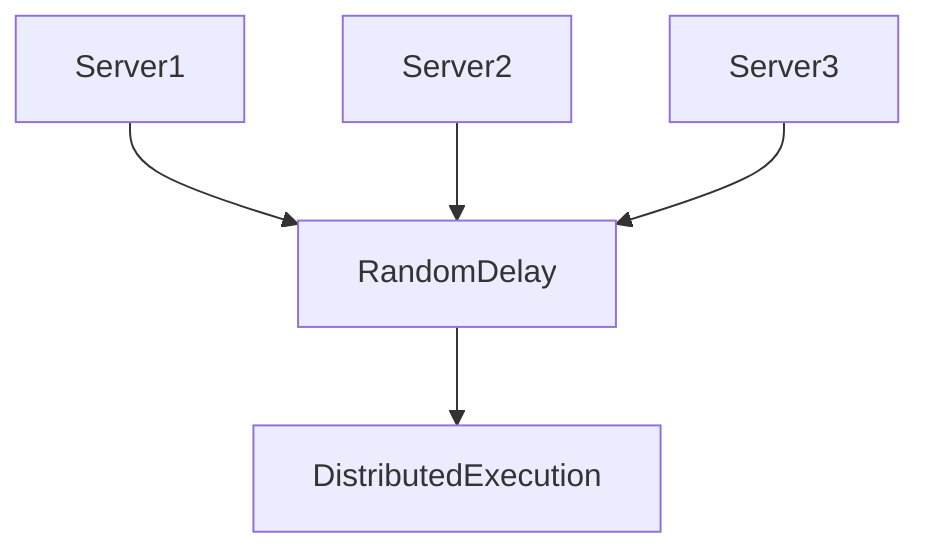

---

# Accuracy

Directive:

```ini
AccuracySec=1m
```

Allows batching.

Improves efficiency.

---

# Wake System

Directive:

```ini
WakeSystem=true
```

Can wake sleeping systems.

---

# Production Example

Database backup.

Service:

```ini
[Unit]

Description=Database Backup

[Service]

Type=oneshot

ExecStart=/usr/local/bin/backup.sh
```

Timer:

```ini
[Unit]

Description=Nightly Backup

[Timer]

OnCalendar=02:00

Persistent=true

[Install]

WantedBy=timers.target
```

---

# Execution Flow

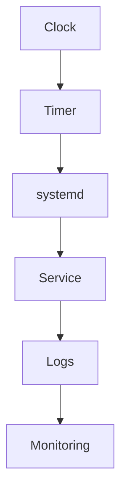

---

# Enable Timer

```bash
sudo systemctl enable backup.timer
```

Start timer:

```bash
sudo systemctl start backup.timer
```

---

# View Timers

```bash
systemctl list-timers
```

Example:

```text
NEXT

LEFT

LAST

PASSED

UNIT

ACTIVATES
```

---

# Inspect Timer

```bash
systemctl status backup.timer
```

---

# Logs

```bash
journalctl -u backup.service
```

---

# Check Calendar Expression

Very useful:

```bash
systemd-analyze calendar "Mon 09:00"
```

Example:

```text
Normalized form

Next elapse
```

---

# Production Scenario

Imagine:

```text
Nightly backup

Hourly cache refresh

Daily reports

Weekly cleanup
```

Visual:

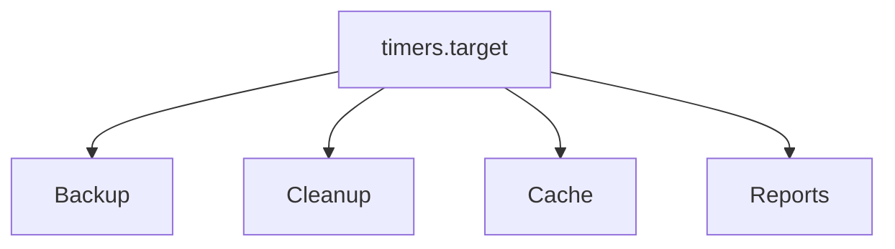

---

# Cloud Infrastructure Example

AWS VM.

Tasks:

```text
Log cleanup

Metrics collection

Snapshots

Cache refresh
```

Visual:

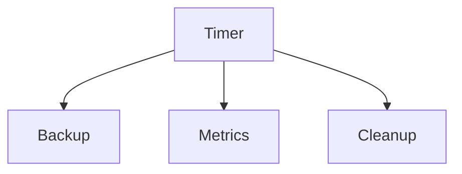

---

# Kubernetes Relationship

Kubernetes has CronJobs.

Similar idea.

Visual:

```mermaid
flowchart TD

systemd Timer

systemd Timer --> Service

Kubernetes CronJob

Kubernetes CronJob --> Pod
```

---

# When To Use Cron vs Timers

| Cron | Timers |
|------|--------|
| Simple | Advanced |
| Standalone | OS integrated |
| No dependencies | Dependency aware |
| Weak logging | Unified logging |
| No persistence | Persistence |
| Legacy | Modern |

---

# Troubleshooting Workflow

Question:

Timer not executing.

Step 1

List timers.

```bash
systemctl list-timers
```

Step 2

Inspect.

```bash
systemctl status backup.timer
```

Step 3

Inspect service.

```bash
systemctl status backup.service
```

Step 4

Logs.

```bash
journalctl -u backup.service
```

---

# Common Beginner Mistakes

## Mistake 1

Thinking timers execute scripts.

Wrong.

Timers execute services.

---

## Mistake 2

Putting business logic inside timer.

Wrong.

Business logic belongs in services.

---

## Mistake 3

Ignoring Persistent=true.

---

## Mistake 4

Ignoring logs.

Always use journalctl.

---

# Engineering Mindset

Do not think:

```text
Timers replace cron
```

Think:

```text
Timers integrate scheduling into the operating system itself
```

That is much more accurate.

---

# Mental Model To Remember Forever

```text
Time

↓

Timer

↓

systemd

↓

Service

↓

Logs

↓

Observability
```

Or even simpler:

```text
Cron runs commands.

Timers orchestrate services.
```

That single sentence explains why systemd timers exist.
