# Troubleshooting Linux Services Deep Fundamentals

> Understanding how engineers investigate, diagnose, and repair failures inside a Linux operating system.

---

# Learning Goals

By the end of this file, you will understand:

- Why troubleshooting exists
- Why systems fail
- The troubleshooting mindset
- Scientific debugging
- Evidence gathering
- Root cause analysis
- Service troubleshooting workflow
- Production debugging patterns
- Cascading failures
- Dependency failures
- Resource failures
- Real-world debugging scenarios

---

# First Principles

Imagine this.

Your website is down.

Users report:

```text
500 Internal Server Error
```

Question:

What broke?

Was it:

```text
Nginx?

API?

Redis?

PostgreSQL?

Network?

Disk?

Memory?

DNS?
```

You don't know.

Troubleshooting is how engineers answer this question.

---

# The Biggest Misconception

Beginners think:

```text
Troubleshooting

↓

Memorizing commands
```

Wrong.

Troubleshooting is:

> Reconstructing reality from evidence.

---

# The Biggest Idea

Production engineers do not guess.

They investigate.

---

# Human Analogy

Imagine being a detective.

You arrive at a crime scene.

You do NOT do this:

```text
Guess murderer
```

You collect evidence.

```text
Footprints

↓

Cameras

↓

Witnesses

↓

Timeline

↓

Root cause
```

Linux troubleshooting works the same way.

---

# Mental Model

```text
Linux = City

Services = Citizens

Logs = CCTV

Metrics = Sensors

Engineer = Detective
```

---

# The Scientific Method

Always follow this.

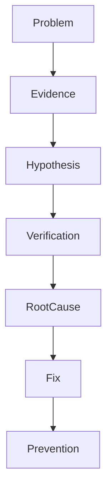

---

# Golden Rule

Never do this:

```text
Restart randomly
```

Always ask:

```text
What changed?
```

That question solves many incidents.

---

# Every Service Failure Falls Into Categories

Most failures belong here.

```text
Configuration

Dependencies

Permissions

Resources

Network

Application

Security

Storage
```

---

# Service Architecture

Everything is connected.

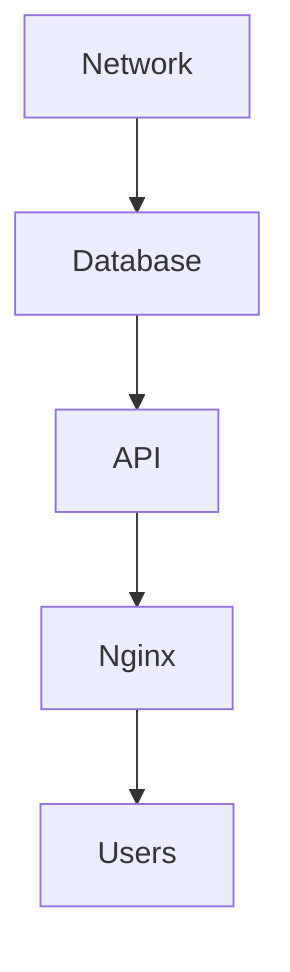

Question:

Where did failure begin?

---

# Layered Investigation

Always investigate layer by layer.

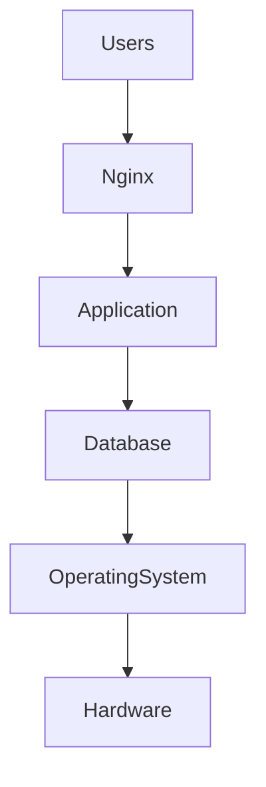

---

# The Golden Workflow

Every production engineer follows this.

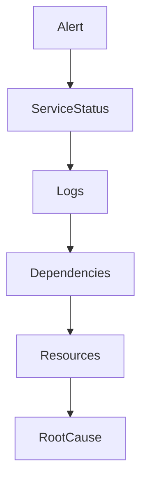

---

# Step 1 : Verify The Problem

Question:

Is the service actually down?

Check:

```bash
systemctl status nginx
```

Possible states:

```text
active

inactive

failed

activating

deactivating
```

---

# Visual

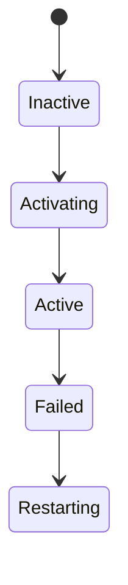

---

# Step 2 : Read The Error

This is where many beginners fail.

They ignore errors.

Read them.

```bash
systemctl status nginx
```

Example:

```text
Active: failed

Result: exit-code
```

---

# Step 3 : Inspect Logs

Most important tool.

```bash
journalctl -u nginx
```

Recent logs:

```bash
journalctl -u nginx -n 50
```

Live logs:

```bash
journalctl -u nginx -f
```

Errors only:

```bash
journalctl -u nginx -p err
```

---

# Evidence Collection Pipeline

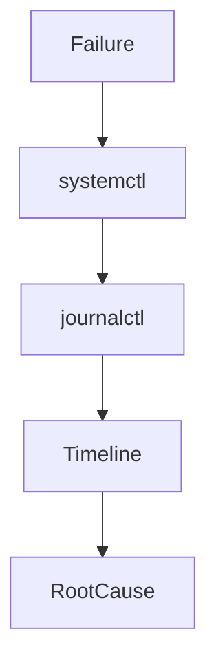

---

# Step 4 : Check Dependencies

Question:

Did something else fail?

```bash
systemctl list-dependencies nginx
```

Check failures.

```bash
systemctl --failed
```

Visual:

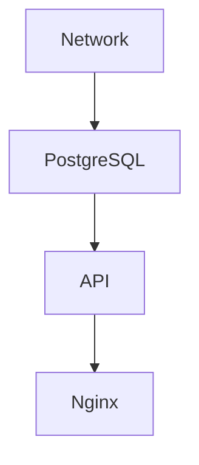

---

# Dependency Failure Example

Imagine PostgreSQL dies.

Visual:

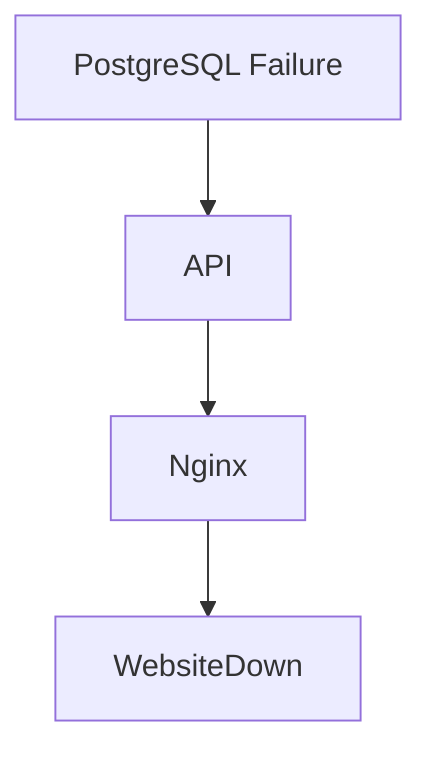

The visible symptom isn't always the root cause.

---

# Step 5 : Verify Resources

Question:

Did the machine run out of resources?

---

# CPU

```bash
top

htop
```

---

# Memory

```bash
free -h
```

---

# Disk

```bash
df -h
```

---

# Inodes

```bash
df -i
```

---

# Resource Investigation

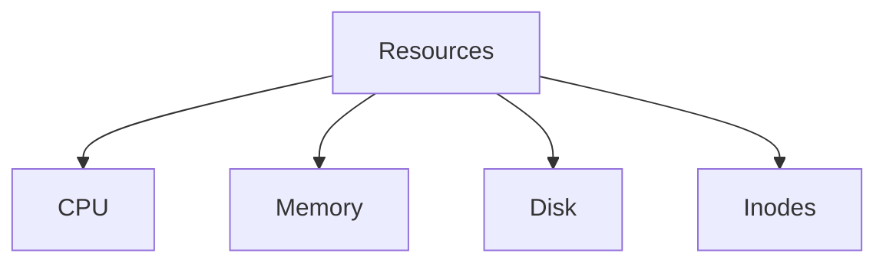

---

# The Hidden Disk Problem

Many production outages are this.

```text
Disk 100%

↓

Logs cannot write

↓

Applications fail

↓

Databases fail

↓

Entire system unstable
```

---

# Memory Problems

Look for:

```bash
journalctl -k
```

Search:

```text
OOM Killer
```

Visual:

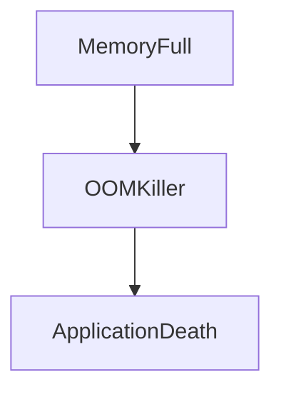

---

# Step 6 : Verify Network

Question:

Can systems communicate?

Check.

```bash
ping

ss

ip addr

ip route
```

---

# Network Investigation

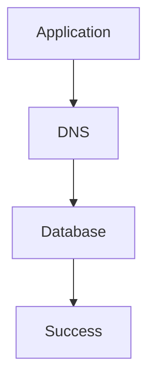

---

# DNS Problems

Extremely common.

Check.

```bash
resolvectl status
```

or

```bash
cat /etc/resolv.conf
```

---

# Step 7 : Verify Permissions

Question:

Can the application access required resources?

Examples:

```text
Files

Directories

Ports

Sockets
```

Inspect.

```bash
ls -la
```

Check user.

```bash
id
```

---

# Permission Failure Example

Visual:

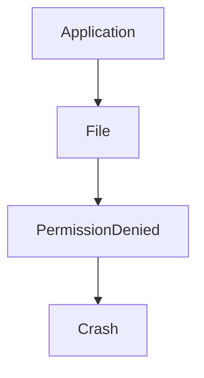

---

# Step 8 : Verify Configuration

Very common issue.

Question:

Did someone edit configs?

Examples:

```text
Nginx

PostgreSQL

Redis

Applications
```

---

# Verify Before Restarting

Examples:

Nginx:

```bash
nginx -t
```

Apache:

```bash
apachectl configtest
```

Systemd:

```bash
systemd-analyze verify myapp.service
```

---

# The Service Failure Pyramid

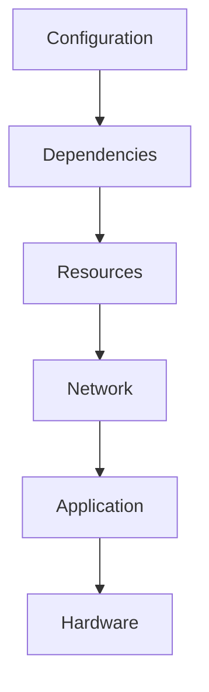

---

# Troubleshooting By Category

---

# Category 1 : Service Won't Start

Questions:

```text
Bad config?

Wrong path?

Wrong permissions?

Missing dependencies?
```

Commands:

```bash
systemctl status app

journalctl -u app

systemd-analyze verify app.service
```

---

# Category 2 : Service Crashes Repeatedly

Questions:

```text
Memory leak?

Application bug?

Resource exhaustion?
```

Inspect:

```bash
journalctl -u app

free -h
```

---

# Category 3 : Service Is Slow

Questions:

```text
CPU?

Memory?

Database?

Network?
```

Inspect:

```bash
top

htop

ss

iostat
```

---

# Category 4 : Service Is Running But Website Is Down

Question:

Where is the dependency chain broken?

Visual:

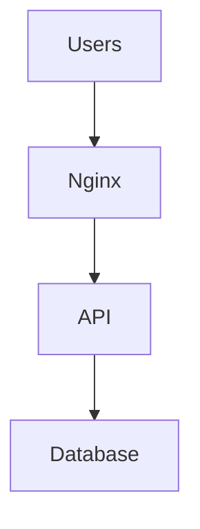

Inspect every layer.

---

# Root Cause Analysis Workflow

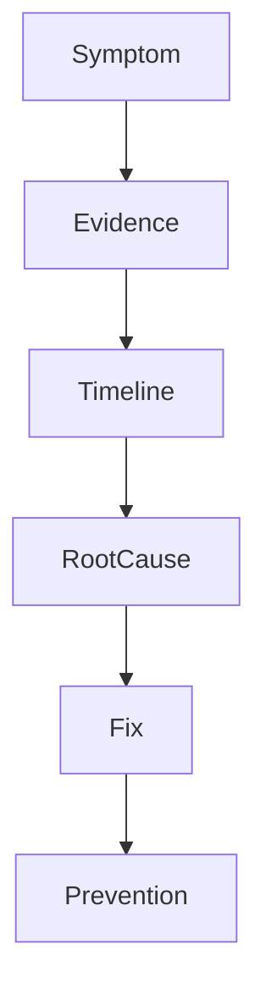

---

# Timeline Reconstruction

Question:

What changed?

Examples:

```text
02:10 Deploy

02:12 Memory spike

02:13 Database disconnect

02:15 API crash

02:17 Website down
```

Timeline is incredibly important.

---

# Production Example 1

Website down.

Workflow:

```bash
systemctl status nginx

journalctl -u nginx

systemctl status api

journalctl -u api

systemctl status postgresql
```

---

# Production Example 2

API won't start.

Check:

```bash
systemd-analyze verify api.service

journalctl -u api

ls -la

id apiuser
```

---

# Production Example 3

Disk full.

Investigate:

```bash
df -h

du -sh /var/log/*

journalctl --disk-usage
```

---

# Service Investigation Cheat Sheet

## Service State

```bash
systemctl status app
```

---

## Logs

```bash
journalctl -u app
```

---

## Recent Logs

```bash
journalctl -u app -n 100
```

---

## Live Logs

```bash
journalctl -u app -f
```

---

## Failed Units

```bash
systemctl --failed
```

---

## Dependencies

```bash
systemctl list-dependencies app
```

---

## Resources

```bash
top

free -h

df -h
```

---

## Network

```bash
ss -tulnp

ip addr

ip route
```

---

## Validation

```bash
systemd-analyze verify app.service
```

---

# The Production Engineer Mindset

Never do:

```text
Restart

↓

Hope
```

Always do:

```text
Observe

↓

Investigate

↓

Hypothesize

↓

Verify

↓

Fix
```

---

# Common Beginner Mistakes

## Mistake 1

Immediately restarting services.

Wrong.

Gather evidence first.

---

## Mistake 2

Ignoring logs.

Logs are your timeline.

---

## Mistake 3

Investigating only one service.

Systems are connected.

---

## Mistake 4

Treating symptoms instead of root causes.

---

## Mistake 5

Skipping timeline reconstruction.

---

# Engineering Mindset

Do not think:

```text
Troubleshooting fixes systems
```

Think:

```text
Troubleshooting reconstructs reality from evidence
```

That is much more accurate.

---

# Mental Model To Remember Forever

```text
Symptom

↓

Evidence

↓

Timeline

↓

Root Cause

↓

Fix

↓

Prevention
```

Or even simpler:

```text
Production engineers are detectives.

Logs are their evidence.
```

That single sentence explains troubleshooting.
