# Linux Services & systemd Visual Atlas

> A visual-first guide to understanding how Linux orchestrates an entire operating system.

---

# How To Use This File

Do NOT memorize visuals.

For every diagram ask:

```text
What is this?

↓

Why does it exist?

↓

What problem does it solve?

↓

What breaks if it fails?

↓

How does it connect to the whole system?
```

---

# Visual 1 : The Linux Layer Cake

This is the first visual every engineer should remember.

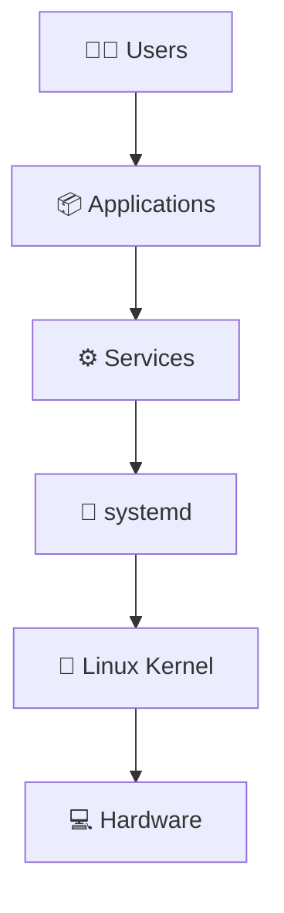

Mental Model:

```text
Hardware

↓

Kernel

↓

systemd

↓

Services

↓

Applications

↓

Users
```

---

# Visual 2 : Linux Boot Process

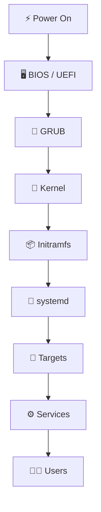

---

# Visual 3 : systemd Architecture

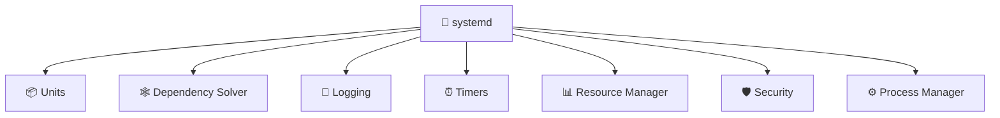

---

# Visual 4 : Linux Is A Dependency Graph

This is one of the most important diagrams.

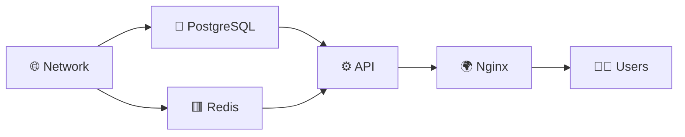

---

# Visual 5 : systemd Unit Ecosystem

```mermaid
mindmap

root((systemd Units))

Service

Target

Timer

Socket

Mount

Path

Swap

Device

Slice

Scope
```

---

# Visual 6 : Unit Relationships

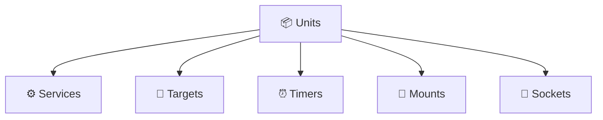

---

# Visual 7 : Dependency Directives

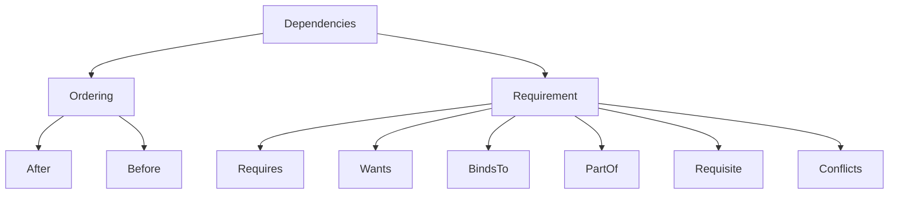

---

# Visual 8 : Boot Targets

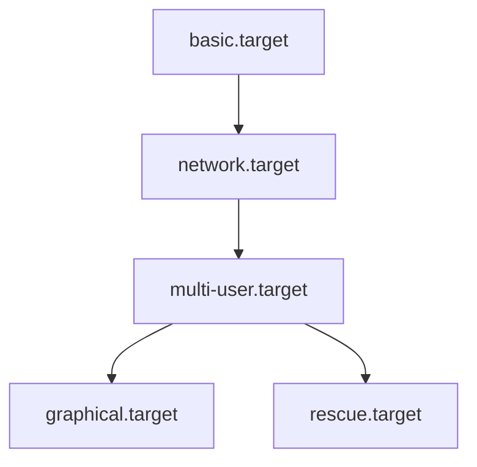

---

# Visual 9 : Service Anatomy

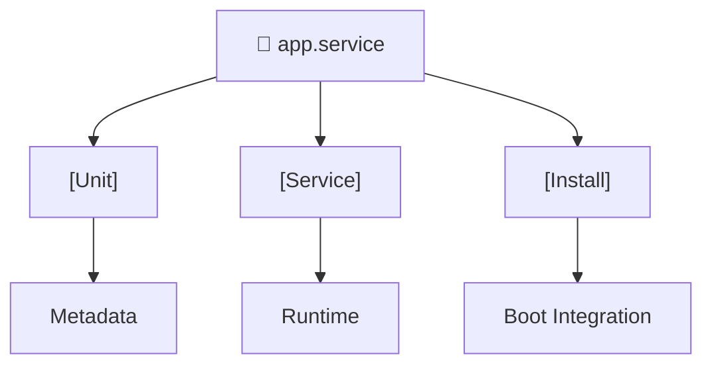

---

# Visual 10 : Service Lifecycle

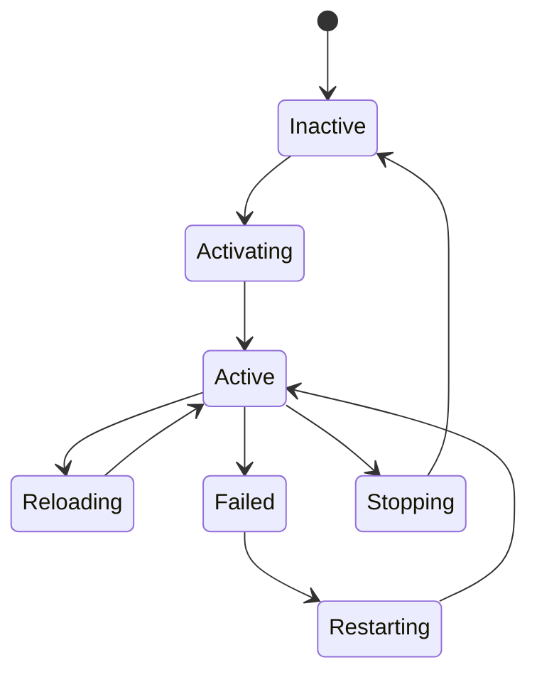

---

# Visual 11 : How systemctl Works

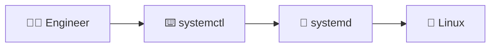

---

# Visual 12 : Start vs Enable

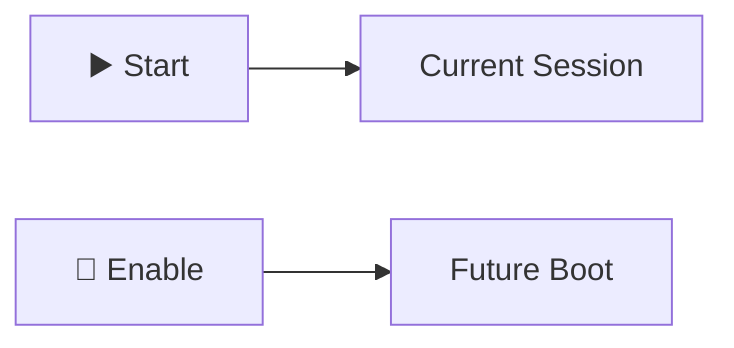

---

# Visual 13 : Timer Architecture

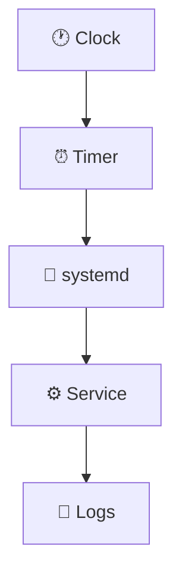

---

# Visual 14 : Logging Architecture

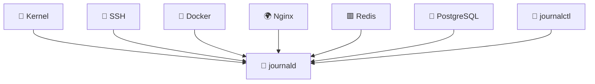

---

# Visual 15 : journald vs journalctl


---

# Visual 16 : journald + rsyslog

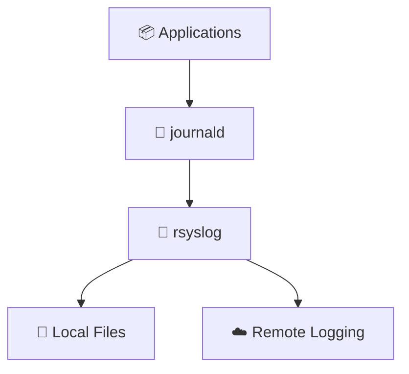

---

# Visual 17 : Log Lifecycle


---

# Visual 18 : Troubleshooting Pyramid

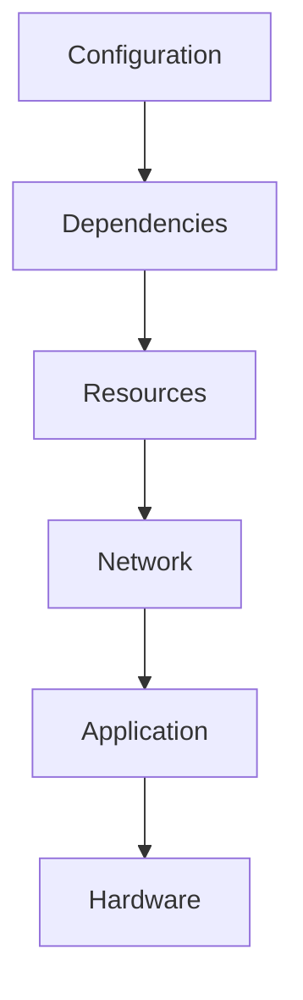

---

# Visual 19 : Production Investigation Workflow

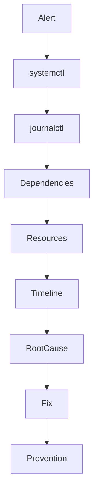

---

# Visual 20 : Cascading Failures

This diagram is extremely important.

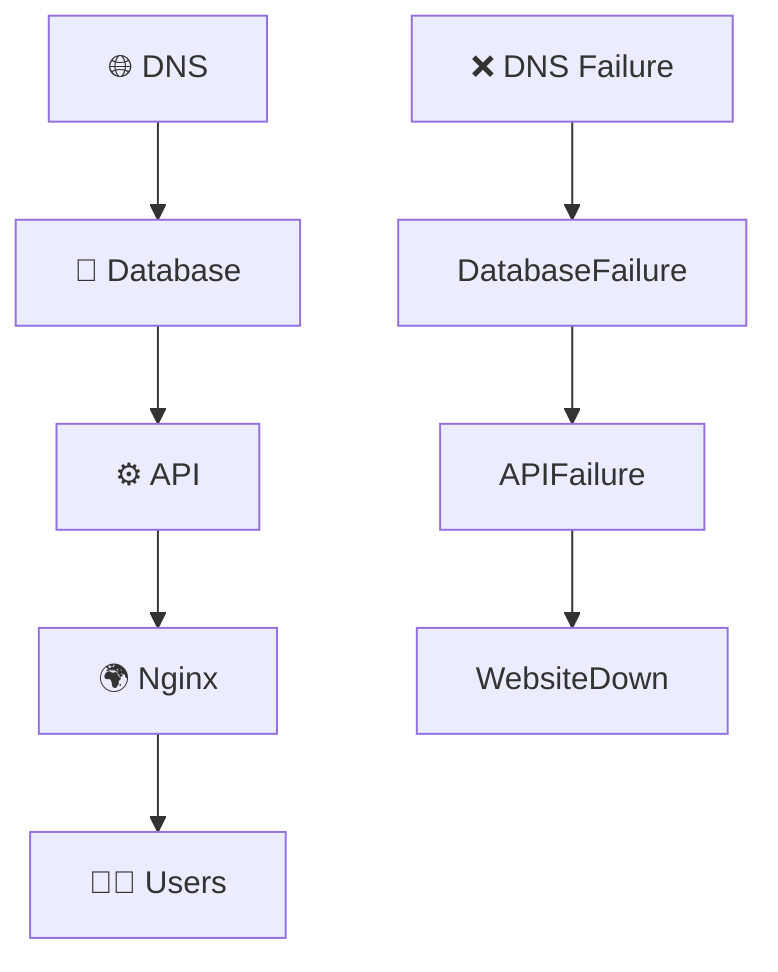

---

# Visual 21 : Service Security Layers

```mermaid
flowchart TD

Application

Application --> UserIsolation

UserIsolation --> FilesystemIsolation

FilesystemIsolation --> Capabilities

Capabilities --> Namespaces

Namespaces --> cgroups

cgroups --> Kernel
```

---

# Visual 22 : Resource Management

```mermaid
flowchart TD

Service

Service --> CPU

Service --> Memory

Service --> Processes

Service --> IO

Service --> Network
```

---

# Visual 23 : Cloud Infrastructure Relationship

```mermaid
flowchart TD

systemd

systemd --> Docker

Docker --> containerd

containerd --> kubelet

kubelet --> Pods

Pods --> Applications
```

---

# Visual 24 : The Complete Production System

This is the most important visual in this folder.

```mermaid
flowchart TD

Users

Users --> Nginx

Nginx --> API

API --> Redis

API --> PostgreSQL

AllServices["⚙️ Services"]

Nginx --> AllServices

API --> AllServices

Redis --> AllServices

PostgreSQL --> AllServices

AllServices --> systemd

systemd --> journald

journald --> Engineers

Engineers --> ReliableSystems
```

---

# Visual 25 : The Entire Story

This is the final diagram.

```mermaid
flowchart TD

Hardware

Hardware --> Kernel

Kernel --> systemd

systemd --> DependencyGraph

DependencyGraph --> Services

Services --> Logs

Logs --> Engineers

Engineers --> Reliability

Reliability --> ProductionSystems
```

---

# The 5 Mental Models To Remember Forever

### 1

```text
Linux

≠

Programs

Linux

=

Coordinated System
```

---

### 2

```text
systemd

=

Operating System Orchestrator
```

---

### 3

```text
Services

=

Operating System Citizens
```

---

### 4

```text
Logs

=

Operating System Memory
```

---

### 5

```text
Troubleshooting

=

Reconstructing Reality
```

---

# The Ultimate One-Line Mental Model

```text
Hardware

↓

Kernel

↓

systemd

↓

Dependency Graph

↓

Services

↓

Logs

↓

Engineers

↓

Reliable Systems
```

That is the entire story of `10-services-systemd`.
