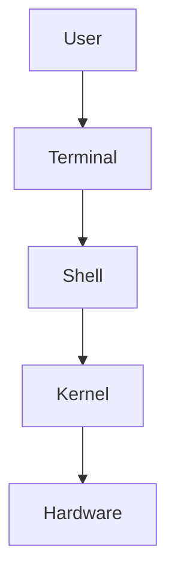
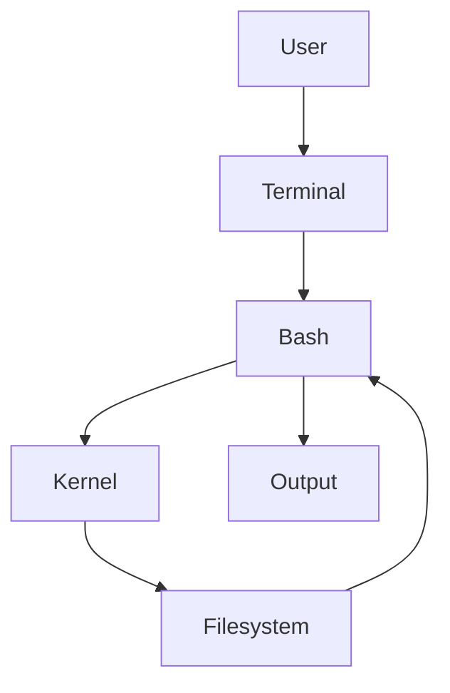
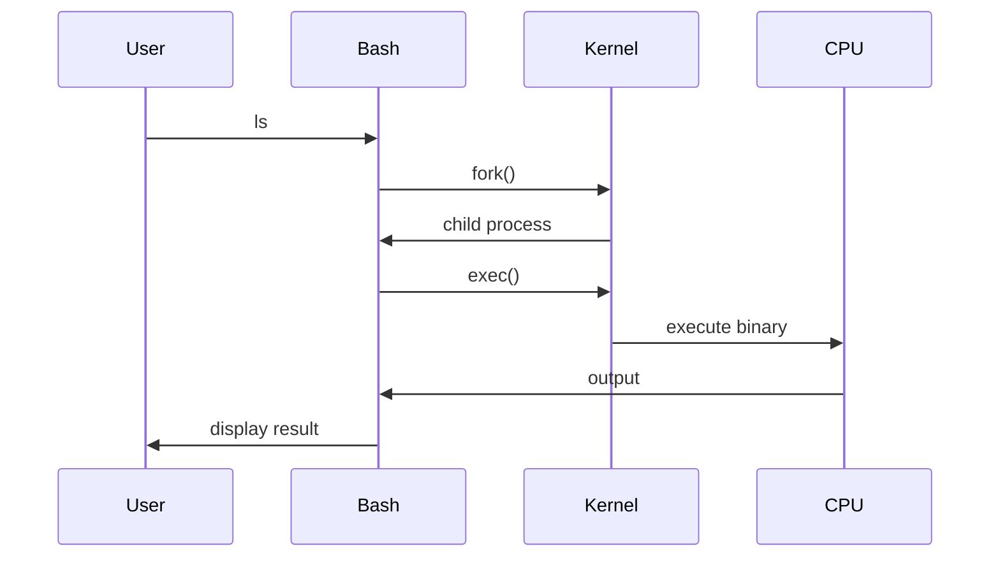

# 01 - Shell Basics

# Linux Fundamentals Mastery

# Bash Scripting Engineering Handbook

---

# Introduction

Most beginners think:

```text
Linux = Terminal
```

or

```text
Linux = Commands
```

This is incorrect.

There is an entire system working behind the scenes.

Linux itself is not the terminal.

Linux itself is not Bash.

Linux itself is not commands.

Linux is an operating system kernel.

The shell is a bridge that allows humans to communicate with Linux.

Think of this file as learning how humans talk to computers.

---

# Learning Objectives

After completing this file, you should understand:

✅ What a shell is

✅ Why shells exist

✅ Difference between Linux, Kernel, Terminal and Shell

✅ How Bash works internally

✅ How commands are executed

✅ What happens after pressing Enter

✅ Why shell scripting exists

✅ How shell connects to modern engineering systems

---

# The Biggest Misconception

Many people think:

```text
Terminal = Shell = Linux
```

Wrong.

These are different components.

```text
Terminal

↓

Shell

↓

Kernel

↓

Hardware
```

Each has a different responsibility.

---

# Mental Model: Human Translator

Imagine Linux only understands machine language.

You only understand English.

How do you communicate?

You need a translator.

```text
Human

↓

Translator

↓

Linux

↓

Hardware
```

The translator is the shell.

---

# What Is A Shell?

A shell is a program that provides an interface between humans and the operating system.

Its job is:

```text
Receive Instructions

↓

Interpret Instructions

↓

Ask Linux To Execute Them

↓

Return Results
```

Officially:

```text
Shell = Command Interpreter
```

But engineers should think:

```text
Shell = Operating System Interface Layer
```

---

# Why Does Shell Exist?

Imagine Linux without a shell.

```text
Human

↓

Machine Code

↓

Kernel

↓

Hardware
```

This would be impossible for humans.

The shell abstracts complexity.

Instead of:

```text
1010101001101010
```

We write:

```bash
ls
```

---

# The Linux Stack



---

# Understanding Each Component

## User

The person interacting with the system.

Example:

```text
You
```

---

## Terminal

A graphical window.

Examples:

```text
GNOME Terminal

Windows Terminal

iTerm2

Alacritty

Kitty
```

Terminal only displays text.

It does not execute commands.

---

## Shell

The command interpreter.

Examples:

```text
Bash

Zsh

Fish

Ksh

Sh
```

The shell executes commands.

---

## Kernel

The operating system core.

Responsible for:

```text
CPU

Memory

Storage

Networking

Processes

Security
```

---

## Hardware

Physical components.

```text
CPU

RAM

SSD

GPU

NIC
```

---

# Terminal vs Shell

This is one of the most important concepts.

## Terminal

Think:

```text
Display Device
```

It shows information.

## Shell

Think:

```text
Interpreter
```

It executes instructions.

Example:

```text
Keyboard

↓

Terminal

↓

Bash

↓

Kernel

↓

Hardware
```

---

# What Is Bash?

Bash stands for:

```text
Bourne Again SHell
```

It was created as an improved version of Bourne Shell.

Today it is the default shell in many Linux systems.

Bash is:

```text
Command Interpreter

+

Programming Language

+

Automation Engine

+

System Orchestrator
```

---

# Popular Linux Shells

| Shell | Description |
|------|-------------|
| sh | Original Bourne shell |
| bash | Most popular shell |
| zsh | Modern shell with plugins |
| fish | Beginner friendly shell |
| ksh | Korn shell |

---

# How Command Execution Works

Suppose you type:

```bash
ls -la
```

You press Enter.

What happens?

## High Level Flow



---

# Internal Workflow

Step 1

Receive command

```text
ls -la
```

↓

Step 2

Bash parses it

```text
Command = ls

Argument = -la
```

↓

Step 3

Bash searches executable

```text
PATH directories
```

↓

Step 4

Kernel creates process

↓

Step 5

Kernel executes binary

↓

Step 6

Results returned

↓

Step 7

Terminal displays output

---

# Where Does Bash Find Commands?

Consider:

```bash
ls
```

How does Bash know where ls exists?

It uses PATH.

Check:

```bash
echo $PATH
```

Example:

```text
/usr/local/bin

/usr/bin

/bin

/usr/sbin
```

Bash searches these directories.

Visual:

```text
User Types ls

↓

Search PATH

↓

/usr/local/bin

↓

/usr/bin

↓

Found ls

↓

Execute
```

---

# Which Command Is Actually Running?

Use:

```bash
which ls
```

or

```bash
type ls
```

Example:

```bash
which python
```

Output:

```text
/usr/bin/python
```

---

# Important Shell Concepts

You will learn these throughout this module.

```text
Commands

↓

Arguments

↓

Variables

↓

Expansion

↓

Conditions

↓

Loops

↓

Functions

↓

Pipelines

↓

Automation
```

---

# Shell As An Automation Engine

Without shell:

```text
Check CPU

↓

Check Memory

↓

Check Disk

↓

Restart Service

↓

Backup Database

↓

Compress Files

↓

Send Notification
```

Manually every day.

With shell:

```bash
./health-check.sh
```

Everything happens automatically.

---

# Modern Engineering Connections

Bash is everywhere.

```text
Linux

↓

Docker

↓

Kubernetes

↓

Cloud

↓

CI/CD

↓

Distributed Systems
```

---

# Bash In Docker

```text
Container Starts

↓

Entrypoint Script

↓

Environment Variables

↓

Application Launches
```

Example:

```bash
docker-entrypoint.sh
```

---

# Bash In Kubernetes

```text
Pod

↓

Init Containers

↓

Startup Scripts

↓

Health Checks
```

---

# Bash In DevOps

```text
Git Pull

↓

Install Dependencies

↓

Build Project

↓

Deploy

↓

Verify

↓

Notify Team
```

---

# Bash In Cloud Engineering

```text
Provision Server

↓

Install Packages

↓

Configure Firewall

↓

Configure Users

↓

Start Services
```

---

# Linux Internals Deep Dive

When Bash executes a command:

```text
User

↓

Bash

↓

fork()

↓

Create Child Process

↓

exec()

↓

Replace Child Process

↓

Kernel Scheduler

↓

CPU Execution

↓

Output
```

Visual:



---

# Common Beginner Mistakes

## Mistake 1

Thinking terminal is Linux.

Wrong:

```text
Terminal = Linux
```

Correct:

```text
Terminal = Display
```

---

## Mistake 2

Thinking Bash is Linux.

Wrong:

```text
Bash = Linux
```

Correct:

```text
Bash = Interface
```

---

## Mistake 3

Memorizing commands.

Wrong:

```text
Learn commands only
```

Correct:

```text
Understand systems
```

---

# Production Engineering Mindset

Do not think:

```text
How do I run commands?
```

Think:

```text
How do I automate infrastructure?
```

Do not think:

```text
How do I learn Bash?
```

Think:

```text
How do I control Linux systems?
```

---

# Troubleshooting Section

## Problem

Command not found.

Example:

```bash
python
```

Output:

```text
command not found
```

Root Cause:

```text
PATH issue
```

Diagnose:

```bash
echo $PATH
```

Verify:

```bash
which python
```

Fix:

```bash
export PATH=$PATH:/new/path
```

---

# Best Practices

Always:

Use absolute paths in scripts.

```bash
/usr/bin/python
```

Use quotes.

```bash
"$variable"
```

Use meaningful names.

```bash
backup_database.sh
```

Not:

```bash
a.sh
```

---

# Interview Questions

## Beginner

What is a shell?

What is Bash?

Difference between terminal and shell?

What is PATH?

What is command interpreter?

---

## Intermediate

How does Bash execute commands?

How does PATH work?

Difference between which and type?

What happens when Enter is pressed?

---

## Advanced

Explain fork() and exec().

How does Bash communicate with the kernel?

How does process creation work?

How does Linux schedule commands?

---

## Scenario Based

Your script says:

```text
command not found
```

How would you debug it?

How would you automate a daily backup system?

How would you execute commands across 1000 servers?

---

# Knowledge Map

```text
Shell

↓

Commands

↓

Processes

↓

Automation

↓

Infrastructure

↓

Containers

↓

Cloud

↓

Distributed Systems

↓

Systems Thinking
```

# Key Takeaway

Do not learn Bash as a scripting language.

Learn Bash as a way to control and automate Linux systems.

That is how engineers think.
