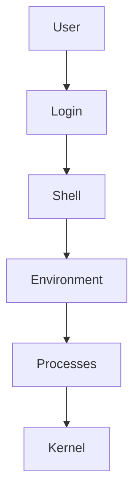
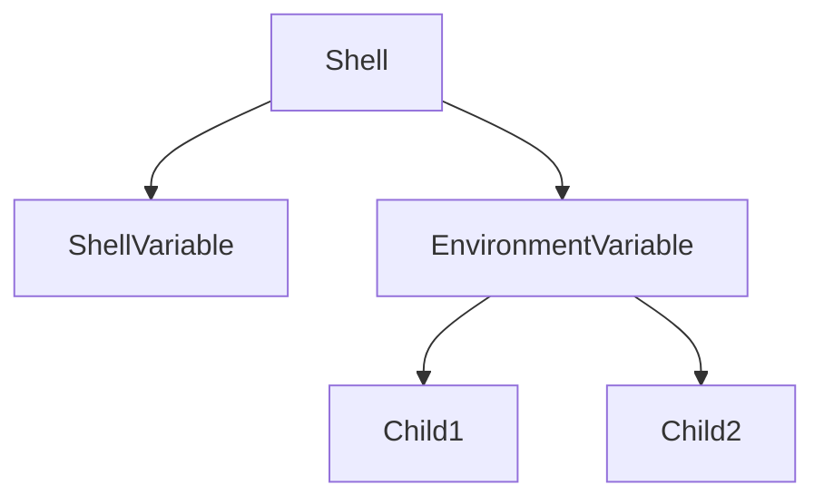
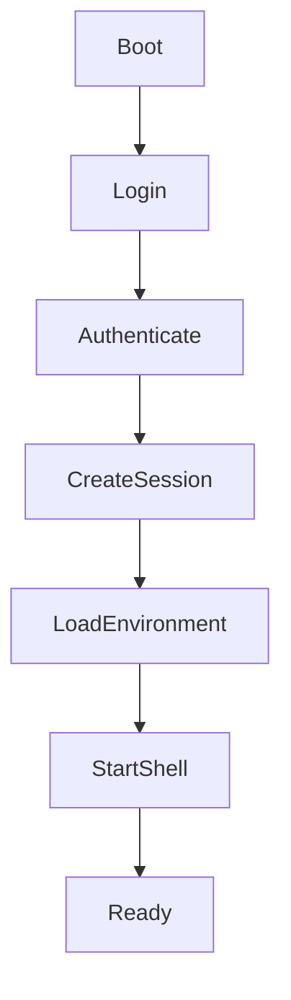
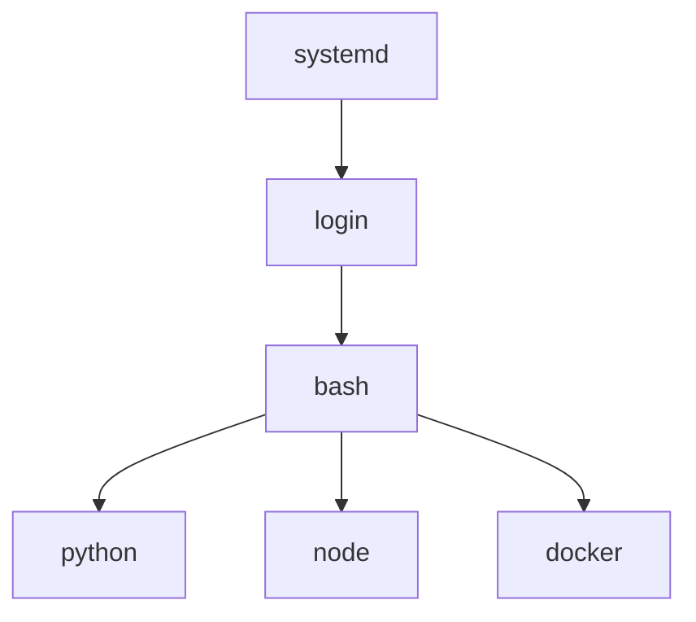
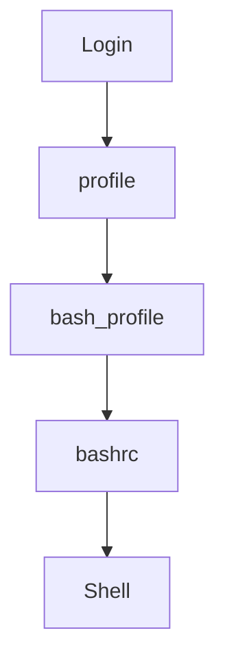

# 02 - Shell Environment

# Linux Fundamentals Mastery

# Bash Scripting Engineering Handbook

---

# Introduction

When beginners open a terminal, they often think:

```text
I opened Bash.

↓

I can execute commands.
```

This is only a small part of what happened.

The moment a shell starts, Linux creates an entire working world around it.

This world is called:

```text
Shell Environment
```

Everything you do inside Bash depends on this environment.

Without it:

- Commands won't work
- Programs won't know where to execute
- Users won't have identities
- Scripts will fail
- Applications won't know how to configure themselves

Modern software engineering heavily relies on environments.

The same concept powers:

```text
Linux

↓

Bash

↓

Docker

↓

Kubernetes

↓

Cloud

↓

CI/CD

↓

Distributed Systems
```

Understanding environments is one of the most important concepts in Linux engineering.

---

# Learning Objectives

After completing this file, you should understand:

✅ What a shell environment is

✅ Why environments exist

✅ Environment variables

✅ Shell variables

✅ Process inheritance

✅ Login shells

✅ Non-login shells

✅ Interactive shells

✅ Startup files

✅ How environments work internally

✅ Why Docker and Kubernetes depend on them

---

# Why Does Shell Environment Exist?

Imagine Linux without environments.

You log in.

How would Linux know:

```text
Who are you?

Where is your home directory?

What shell should be used?

Where are executable programs?

Which language should be displayed?

Which editor should open?

Which user permissions should apply?
```

Linux needs a context.

Environment provides that context.

---

# Mental Model: Your Personal Workspace

Imagine entering an office.

Linux prepares your workspace.

```text
Employee

↓

Desk

↓

Computer

↓

Permissions

↓

Tools

↓

Files

↓

Configurations
```

Your shell environment is your digital workspace.

---

# What Is A Shell Environment?

Definition:

A shell environment is a collection of information and configurations that the shell uses while running.

Think of it as:

```text
Runtime Context
```

It contains:

```text
Variables

↓

Settings

↓

Configurations

↓

User Information

↓

Paths

↓

Permissions
```

---

# High Level Architecture



---

# Components Of A Shell Environment

A shell environment contains:

```text
User Information

↓

System Information

↓

Shell Variables

↓

Environment Variables

↓

Aliases

↓

Functions

↓

PATH

↓

Startup Configurations
```

---

# Visualizing The Environment

```text
Shell Environment

├── User = vip

├── Home = /home/vip

├── Shell = /bin/bash

├── PATH

├── Editor

├── Language

├── Aliases

├── Functions

└── Variables
```

---

# Shell Variables vs Environment Variables

This is one of the most important concepts.

Many beginners confuse them.

---

# Shell Variables

Only exist inside the current shell.

Example:

```bash
course="Linux Mastery"
```

Access:

```bash
echo $course
```

Output:

```text
Linux Mastery
```

---

# Environment Variables

Can be inherited by child processes.

Example:

```bash
export COURSE="Linux Mastery"
```

Now other programs can access it.

---

# Mental Model

Think of shell variables as private notes.

```text
Current Shell

↓

Private Information
```

Environment variables are public announcements.

```text
Current Shell

↓

Children

↓

Grandchildren

↓

Other Programs
```

---

# Visual Example



---

# Example

## Create shell variable

```bash
name="vip"
```

View:

```bash
echo $name
```

---

## Create environment variable

```bash
export name="vip"
```

Verify:

```bash
env | grep name
```

---

# Where Do Environment Variables Come From?

Many sources create them.

```text
System Startup

↓

Login System

↓

Shell Startup Files

↓

Manual Exports

↓

Applications
```

---

# Major Environment Variables

## USER

Current user.

```bash
echo $USER
```

Example:

```text
vip
```

---

## HOME

Home directory.

```bash
echo $HOME
```

Example:

```text
/home/vip
```

---

## PATH

Executable search paths.

```bash
echo $PATH
```

---

## SHELL

Current shell.

```bash
echo $SHELL
```

---

## PWD

Current directory.

```bash
echo $PWD
```

---

## LANG

Language settings.

```bash
echo $LANG
```

---

# PATH Deep Dive

PATH is extremely important.

Suppose you type:

```bash
python
```

How does Bash know where Python exists?

PATH answers this.

Example:

```bash
echo $PATH
```

Output:

```text
/usr/local/bin

/usr/bin

/bin
```

Bash searches each directory.

Visual:

```text
python

↓

Search PATH

↓

/usr/local/bin

↓

/usr/bin

↓

Found

↓

Execute
```

---

# Internals: What Happens During Login?

Suppose you log into Linux.

Linux performs many steps.



---

# Process Inheritance

Environment inheritance is a core Linux concept.

Suppose:

```bash
export DATABASE_URL=localhost
```

Then run:

```bash
python app.py
```

Python automatically receives it.

Visual:

```text
Shell

↓

Python

↓

Database Connection
```

This mechanism powers modern systems.

---

# Linux Internals

Every process has:

```text
PID

Memory

File Descriptors

Environment Variables

Current Directory

Permissions
```

Environment variables are stored in process memory.

Each process owns its own copy.

---

# Internal Process Tree



Environment flows downward.

---

# Login Shell vs Non Login Shell

## Login Shell

Created when a user logs in.

Examples:

```text
SSH

TTY Login

Console Login
```

Loads:

```text
/etc/profile

~/.bash_profile

~/.profile
```

---

# Non Login Shell

Opened from an existing shell.

Example:

```bash
bash
```

Loads:

```text
~/.bashrc
```

---

# Interactive Shell

Human controlled.

Example:

```bash
terminal

↓

bash
```

---

# Non Interactive Shell

Script controlled.

Example:

```bash
./backup.sh
```

---

# Startup File Architecture



---

# Important Startup Files

## /etc/profile

Global configuration.

Affects everyone.

---

## ~/.bash_profile

User login configuration.

---

## ~/.profile

Fallback login configuration.

---

## ~/.bashrc

Interactive shell configuration.

---

# How Engineers Use Environments

## Backend Systems

```text
Application

↓

Database URL

↓

API Keys

↓

Secrets
```

---

# Docker

```dockerfile
ENV NODE_ENV=production
```

---

# Kubernetes

```yaml
env:

- name: DATABASE_URL

  value: postgres
```

---

# CI/CD

```text
GitHub Actions

↓

Secrets

↓

Environment Variables

↓

Deployments
```

---

# Production Example

Backend application:

```text
Frontend

↓

API

↓

Database

↓

Redis

↓

Storage
```

Environment variables connect everything.

```text
DATABASE_URL

REDIS_URL

JWT_SECRET

AWS_BUCKET
```

---

# Security Considerations

Never store secrets inside code.

Wrong:

```javascript
password="123456"
```

Correct:

```text
Environment Variables
```

Use:

```bash
export DB_PASSWORD=*****
```

---

# Common Beginner Mistakes

## Mistake 1

Hardcoding secrets.

Wrong:

```python
password="mypassword"
```

---

## Mistake 2

Modifying PATH incorrectly.

Wrong:

```bash
PATH=/custom/bin
```

Correct:

```bash
PATH=$PATH:/custom/bin
```

---

## Mistake 3

Confusing shell and environment variables.

Wrong:

```text
Both are same
```

Correct:

```text
Shell Variable

↓

Current Shell Only

Environment Variable

↓

Inherited By Children
```

---

# Troubleshooting

## Problem

Command not found.

Diagnose:

```bash
echo $PATH
```

Verify:

```bash
which python
```

---

## Problem

Environment variable missing.

Diagnose:

```bash
printenv
```

Verify:

```bash
env
```

---

## Problem

Wrong shell.

Diagnose:

```bash
echo $SHELL
```

---

# Engineering Mindset

Do not think:

```text
Environment Variables = Configuration
```

Think:

```text
Environment Variables = Runtime Communication System
```

Because modern infrastructure depends on them.

```text
Linux

↓

Docker

↓

Kubernetes

↓

Cloud

↓

Distributed Systems
```

---

# Interview Questions

## Beginner

What is a shell environment?

What is PATH?

What is HOME?

Difference between shell and environment variables?

---

## Intermediate

How are environment variables inherited?

Difference between login and non-login shells?

Difference between interactive and non-interactive shells?

---

## Advanced

How are environments stored in process memory?

How do child processes inherit environments?

How do Docker and Kubernetes use environments?

---

# Knowledge Map

```text
Shell Environment

↓

Processes

↓

Applications

↓

Containers

↓

Cloud

↓

Distributed Systems

↓

Systems Thinking
```

# Key Takeaway

The shell environment is not just a set of variables.

It is the runtime world that Linux creates around every process.

Modern infrastructure engineering is built on top of this idea.
