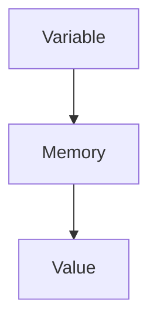
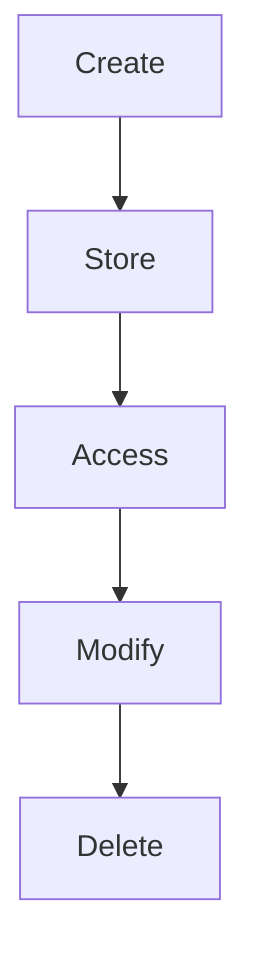
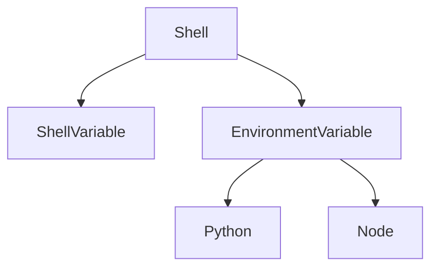
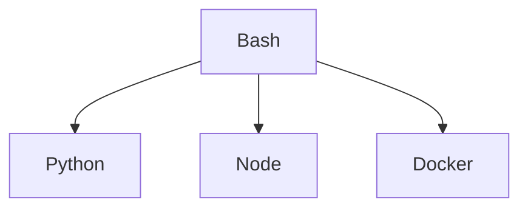

# 03 - Variables

# Linux Fundamentals Mastery

# Bash Scripting Engineering Handbook

---

# Introduction

Most beginners think variables are simply containers that store data.

Example:

```bash
name="vip"

echo $name
```

And then they move on.

This is incomplete.

Variables are much bigger than that.

Variables are one of the most fundamental concepts in all of computer science.

Everything in modern systems depends on variables.

```text
Bash

↓

Applications

↓

Docker

↓

Kubernetes

↓

Cloud

↓

Distributed Systems
```

If you truly understand variables, many technologies become easier to learn.

---

# Learning Objectives

After completing this file, you should understand:

✅ What variables are

✅ Why variables exist

✅ How Bash stores variables

✅ Variable types

✅ Environment variables

✅ Scope

✅ Expansion

✅ Process inheritance

✅ Production usage

✅ Security considerations

---

# Why Do Variables Exist?

Imagine running a company.

Without variables:

```text
Employee Name = Rahul

Employee ID = 101

Department = Engineering

Salary = 100000
```

You would have to repeatedly type this information everywhere.

Variables solve this problem.

They allow us to give names to information.

```text
Name

↓

Reference

↓

Value
```

---

# First Principles Thinking

Computers operate on data.

Data constantly changes.

Instead of hardcoding values, we create references.

```text
Variable

↓

Reference

↓

Data
```

Variables provide flexibility.

Without variables:

```text
Static Systems
```

With variables:

```text
Dynamic Systems
```

---

# Mental Model: Sticky Notes

Imagine your desk.

Without sticky notes:

```text
Memorize Everything
```

Impossible.

With sticky notes:

```text
Server Name

Database URL

Backup Directory

API Key
```

Variables are sticky notes for computers.

---

# What Is A Variable?

Definition:

A variable is a named reference to a value.

Think:

```text
Variable Name

↓

Memory Location

↓

Value
```

---

# Visual Architecture



Example:

```bash
name="vip"
```

```text
name

↓

Memory Address

↓

vip
```

---

# Variable Lifecycle



---

# Creating Variables

Syntax:

```bash
variable_name=value
```

Example:

```bash
name="vip"

course="linux"

age=25
```

Access:

```bash
echo $name

echo $course

echo $age
```

---

# Important Rule

No spaces.

Wrong:

```bash
name = vip
```

Correct:

```bash
name=vip
```

Because Bash interprets spaces differently.

---

# How Bash Sees Variables

Suppose:

```bash
server=production
```

Bash stores:

```text
Name = server

Value = production
```

Inside shell memory.

---

# Visual Example

```text
Shell Memory

┌───────────────────┐

server=production

port=5432

env=staging

└───────────────────┘
```

---

# Display Variables

## Display one variable

```bash
echo $server
```

---

## Display all shell variables

```bash
set
```

---

## Display environment variables

```bash
env
```

or

```bash
printenv
```

---

# Variable Naming Rules

Allowed:

```bash
username

server_name

DATABASE_URL

APP_PORT
```

---

# Invalid Names

Wrong:

```bash
1name

server-name

user name
```

---

# Recommended Naming

```text
snake_case

UPPER_CASE

Descriptive Names
```

Good:

```bash
backup_directory

database_host

api_base_url
```

Bad:

```bash
a

x

temp1
```

---

# Shell Variables

Local to the current shell.

Example:

```bash
city="lucknow"
```

Accessible only here.

---

# Environment Variables

Inherited by child processes.

Example:

```bash
export city="lucknow"
```

---

# Visual Difference



---

# Internal Working

Suppose:

```bash
export APP_ENV=production
```

Then:

```bash
python app.py
```

Python automatically receives it.

Visual:

```text
Shell

↓

APP_ENV

↓

Python

↓

Application
```

---

# Variable Expansion

Bash replaces variables with values.

Example:

```bash
name="vip"

echo $name
```

Bash transforms:

```bash
echo $name
```

Into:

```bash
echo vip
```

Then executes.

---

# Visual

```text
echo $name

↓

Expansion

↓

echo vip

↓

Execution

↓

vip
```

---

# Curly Brace Expansion

Sometimes variables become ambiguous.

Wrong:

```bash
file=test

echo $file_backup
```

Bash thinks:

```text
file_backup
```

is a variable.

Correct:

```bash
echo ${file}_backup
```

Output:

```text
test_backup
```

---

# Readonly Variables

Protect values from modification.

Example:

```bash
readonly APP_NAME="LinuxMastery"
```

Try changing:

```bash
APP_NAME="new"
```

Error occurs.

---

# Unset Variables

Delete variables.

Example:

```bash
unset APP_NAME
```

Verify:

```bash
echo $APP_NAME
```

---

# Default Values

Very important in production.

Syntax:

```bash
${VAR:-default}
```

Example:

```bash
echo ${PORT:-3000}
```

Output:

```text
3000
```

if PORT doesn't exist.

---

# Required Variables

Fail if missing.

```bash
${DATABASE_URL:?Database required}
```

---

# Production Example

Instead of:

```javascript
database="localhost"
```

Use:

```bash
DATABASE_URL=localhost
```

---

# Docker Example

```dockerfile
ENV NODE_ENV=production
```

---

# Kubernetes Example

```yaml
env:

- name: DATABASE_URL

  value: postgres
```

---

# CI/CD Example

```text
GitHub Actions

↓

Environment Variables

↓

Deployments
```

---

# Linux Internals

Every process stores:

```text
PID

↓

Memory

↓

Environment

↓

File Descriptors

↓

Current Directory
```

Variables are stored inside process memory.

Every child process gets a copy.

---

# Variable Inheritance Flow



---

# Security Considerations

Never hardcode secrets.

Wrong:

```python
password="123456"
```

Correct:

```text
Environment Variables
```

Example:

```bash
export DB_PASSWORD=*****
```

---

# Common Mistakes

## Mistake 1

Spaces around =

Wrong:

```bash
name = vip
```

Correct:

```bash
name=vip
```

---

## Mistake 2

Confusing shell and environment variables.

Wrong:

```text
Both are same
```

Correct:

```text
Shell Variables

↓

Current Shell

Environment Variables

↓

Inherited
```

---

## Mistake 3

Hardcoding values.

Wrong:

```text
Static Systems
```

Correct:

```text
Dynamic Systems
```

---

# Troubleshooting

## Problem

Variable empty.

Diagnose:

```bash
echo $VAR
```

Verify:

```bash
env | grep VAR
```

---

## Problem

Child process cannot access variable.

Diagnose:

```bash
export VAR=value
```

---

# Production Engineering Mindset

Do not think:

```text
Variables = Data Storage
```

Think:

```text
Variables = Runtime Configuration System
```

Because modern systems depend on them.

```text
Linux

↓

Containers

↓

Cloud

↓

Distributed Systems
```

---

# Interview Questions

## Beginner

What is a variable?

What is variable expansion?

Difference between shell and environment variables?

---

## Intermediate

How are variables stored?

How are variables inherited?

What is export?

---

## Advanced

How are variables stored in process memory?

How do child processes inherit environments?

Why are variables heavily used in cloud systems?

---

# Learning Checklist

```text
☐ Create variables

☐ Read variables

☐ Modify variables

☐ Delete variables

☐ Export variables

☐ Use defaults

☐ Understand inheritance
```

---

# Mind Map

```text
Variables

├── Fundamentals

│

├── Why Variables Exist

│

├── Naming Rules

│

├── Shell Variables

│

├── Environment Variables

│

├── Expansion

│

├── Inheritance

│

├── Production Usage

│   ├── Docker

│   ├── Kubernetes

│   ├── CI/CD

│   └── Cloud

│

├── Security

│

└── Troubleshooting
```

---

# Golden Rules

### Rule 1

Never hardcode secrets.

---

### Rule 2

Use meaningful names.

---

### Rule 3

Always export values that child processes need.

---

### Rule 4

Use defaults whenever possible.

```bash
${PORT:-3000}
```

---

### Rule 5

Think of variables as runtime configuration systems.

---

### Rule 6

Variables power modern infrastructure.

```text
Linux

↓

Docker

↓

Kubernetes

↓

Cloud

↓

Distributed Systems
```

---

# First Principles Recap

```text
Data

↓

References

↓

Variables

↓

Processes

↓

Applications

↓

Containers

↓

Cloud

↓

Distributed Systems
```

---

# Next File Preview

```text
04-quoting.md
```

You will learn:

```text
Single Quotes

↓

Double Quotes

↓

Escaping

↓

Word Splitting

↓

Globbing Problems

↓

Production Safe Scripting
```

# Key Takeaway

Variables are not Bash syntax.

Variables are one of the foundational building blocks of all modern computing systems.
