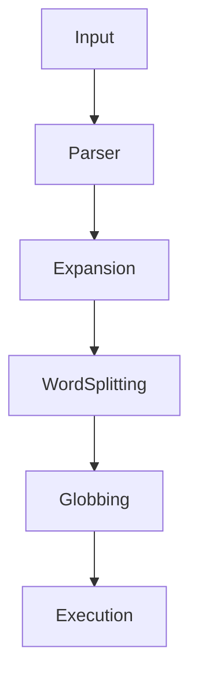

# 04 - Quoting

# Linux Fundamentals Mastery

# Bash Scripting Engineering Handbook

---

# Introduction

Many beginners think quoting is just syntax.

They learn:

```bash
'Hello'

"Hello"

\Hello
```

and move on.

This is wrong.

Quoting is one of the most important Bash concepts.

Quoting controls how Bash interprets your commands.

Without understanding quoting:

- Scripts break
- Spaces cause errors
- Variables behave unexpectedly
- Wildcards become dangerous
- Security vulnerabilities appear

Quoting is not syntax.

Quoting is a safety mechanism.

---

# Learning Objectives

After completing this file, you should understand:

✅ Why quoting exists

✅ Single quotes

✅ Double quotes

✅ Escape characters

✅ Word splitting

✅ Filename expansion

✅ Variable expansion

✅ Command substitution

✅ Security implications

✅ Production best practices

---

# The Problem Quoting Solves

Suppose we have a file:

```text
My Documents/report.txt
```

You type:

```bash
cat My Documents/report.txt
```

Bash sees:

```text
cat

↓

My

↓

Documents/report.txt
```

Three separate words.

This is wrong.

Bash doesn't understand your intention.

Quoting tells Bash:

```text
Treat this as one thing.
```

Correct:

```bash
cat "My Documents/report.txt"
```

---

# First Principles Thinking

Bash reads text.

Bash does not understand human intention.

Bash only follows rules.

Without quoting:

```text
Bash Interprets Everything
```

With quoting:

```text
You Control Interpretation
```

---

# Mental Model: Protective Glass Box

Imagine every value is inside a box.

Without a box:

```text
Words

Spaces

Special Characters

Wildcards

Variables
```

can escape.

With a box:

```text
Treat As Single Unit
```

Quoting is that box.

---

# High Level Flow

```mermaid
flowchart TD

User

Bash Parser

Expansion Engine

Executor

Output

User --> Bash Parser

Bash Parser --> Expansion Engine

Expansion Engine --> Executor

Executor --> Output
```

Quoting influences every stage.

---

# Bash Parsing Pipeline

When Bash sees a command:

```bash
echo "$name"
```

It does not immediately execute.

Bash performs many steps.

```text
Read Input

↓

Parse Command

↓

Expand Variables

↓

Expand Wildcards

↓

Split Words

↓

Execute
```

Quoting changes this behavior.

---

# Types Of Quoting

There are three major mechanisms.

```text
Single Quotes

↓

Double Quotes

↓

Escape Characters
```

---

# Single Quotes

Syntax:

```bash
'text'
```

Single quotes are the strongest protection.

Rule:

```text
Treat Everything Literally
```

Nothing is expanded.

---

# Example

```bash
name="vip"

echo '$name'
```

Output:

```text
$name
```

Not:

```text
vip
```

because expansion is disabled.

---

# Visual

```text
$name

↓

Single Quotes

↓

Protected

↓

Literal Text
```

---

# Double Quotes

Syntax:

```bash
"text"
```

Double quotes are flexible.

They allow some expansions.

Allowed:

```text
Variables

Command Substitution
```

Prevented:

```text
Word Splitting

Filename Expansion
```

---

# Example

```bash
name="vip"

echo "$name"
```

Output:

```text
vip
```

---

# Visual

```text
$name

↓

Double Quotes

↓

Expand Variable

↓

vip
```

---

# Escape Character

Syntax:

```bash
\
```

It protects the next character.

Example:

```bash
echo \$HOME
```

Output:

```text
$HOME
```

instead of:

```text
/home/vip
```

---

# Visual

```text
\

↓

Protect Next Character
```

---

# Comparison Table

| Feature | No Quotes | Single Quotes | Double Quotes |
|---------|-----------|---------------|---------------|
| Variable Expansion | ✅ | ❌ | ✅ |
| Command Substitution | ✅ | ❌ | ✅ |
| Word Splitting | ✅ | ❌ | ❌ |
| Wildcard Expansion | ✅ | ❌ | ❌ |

---

# Word Splitting Deep Dive

This is one of the most dangerous Bash behaviors.

Suppose:

```bash
folder="My Documents"

rm $folder
```

Bash sees:

```text
rm

↓

My

↓

Documents
```

Two arguments.

Wrong.

Correct:

```bash
rm "$folder"
```

---

# Visual

Wrong:

```text
"My Documents"

↓

Remove Quotes

↓

My

↓

Documents
```

Correct:

```text
"My Documents"

↓

Single Argument

↓

Safe
```

---

# Filename Expansion (Globbing)

Suppose:

```bash
echo *
```

Bash expands it.

```text
file1

file2

file3
```

This is called globbing.

---

# Dangerous Example

Suppose:

```bash
files="*"

rm $files
```

Bash expands:

```text
*

↓

All Files
```

Potential disaster.

Correct:

```bash
rm "$files"
```

---

# Variable Expansion Deep Dive

Suppose:

```bash
name="vip"

echo $name
```

Bash transforms:

```bash
echo $name
```

into:

```bash
echo vip
```

before execution.

---

# Command Substitution

Suppose:

```bash
echo $(pwd)
```

Bash executes:

```bash
pwd
```

first.

Then:

```text
Current Directory
```

is inserted.

---

# Double Quotes With Command Substitution

Correct:

```bash
echo "$(pwd)"
```

This prevents future problems.

---

# Nested Example

```bash
user="vip"

echo "Welcome $(whoami)"
```

Execution flow:

```text
whoami

↓

Expansion

↓

Welcome vip
```

---

# Linux Internals

Bash processing order:



Quoting controls multiple stages.

---

# Why Production Engineers Always Quote Variables

Bad:

```bash
cp $source $destination
```

Problems:

```text
Spaces

Empty Variables

Wildcards
```

can break scripts.

Good:

```bash
cp "$source" "$destination"
```

---

# Security Considerations

This is extremely important.

Suppose:

```bash
filename="*.txt"

rm $filename
```

Could delete many files.

Correct:

```bash
rm "$filename"
```

---

# Another Example

Wrong:

```bash
mkdir $directory
```

Correct:

```bash
mkdir "$directory"
```

---

# Docker Connection

Environment variables:

```dockerfile
ENV APP_NAME="backend"
```

Quoting prevents parsing problems.

---

# Kubernetes Connection

```yaml
env:

- name: DATABASE_URL

  value: "postgres://db"
```

Quoting protects values.

---

# CI/CD Connection

GitHub Actions:

```yaml
run: echo "$DATABASE_URL"
```

Production pipelines heavily rely on proper quoting.

---

# Common Mistakes

## Mistake 1

Never quoting variables.

Wrong:

```bash
echo $name
```

Better:

```bash
echo "$name"
```

---

## Mistake 2

Using single quotes with variables.

Wrong:

```bash
echo '$name'
```

Expected:

```text
vip
```

Actual:

```text
$name
```

---

## Mistake 3

Trusting spaces.

Wrong:

```bash
rm $file
```

Correct:

```bash
rm "$file"
```

---

## Mistake 4

Trusting wildcards.

Wrong:

```bash
rm $path
```

Correct:

```bash
rm "$path"
```

---

# Troubleshooting

## Problem

Variable not expanding.

Diagnose:

```bash
echo '$name'
```

Cause:

```text
Single Quotes
```

---

## Problem

Unexpected extra arguments.

Diagnose:

```bash
set -x
```

Cause:

```text
Word Splitting
```

---

## Problem

Unexpected file deletions.

Cause:

```text
Globbing
```

---

# Production Best Practices

Always quote variables.

```bash
"$variable"
```

Always quote paths.

```bash
"$path"
```

Always quote command substitution.

```bash
"$(pwd)"
```

Never trust user input.

Always protect filenames.

---

# Engineering Mindset

Do not think:

```text
Quotes = Syntax
```

Think:

```text
Quotes = Controlling Bash Interpretation
```

Because Bash is an interpreter.

Your job is to control its behavior.

---

# Interview Questions

## Beginner

What is quoting?

Difference between single and double quotes?

What is escaping?

---

## Intermediate

What is word splitting?

What is globbing?

Why do engineers always quote variables?

---

## Advanced

Explain Bash parsing order.

Why is quoting important in production?

How does improper quoting create security risks?

---

# Learning Checklist

```text
☐ Understand single quotes

☐ Understand double quotes

☐ Understand escape characters

☐ Understand word splitting

☐ Understand globbing

☐ Understand variable expansion

☐ Write safe scripts
```

---

# Mind Map

```text
Quoting

├── Why Quoting Exists

│

├── Single Quotes

│

├── Double Quotes

│

├── Escape Characters

│

├── Variable Expansion

│

├── Word Splitting

│

├── Filename Expansion

│

├── Command Substitution

│

├── Security

│

├── Production Usage

│

└── Troubleshooting
```

---

# Golden Rules

### Rule 1

Always quote variables.

```bash
"$variable"
```

---

### Rule 2

Always quote paths.

```bash
"$path"
```

---

### Rule 3

Use single quotes for literal text.

---

### Rule 4

Use double quotes for variables.

---

### Rule 5

Never trust spaces.

---

### Rule 6

Never trust wildcards.

---

### Rule 7

Think of quoting as a safety mechanism.

---

# First Principles Recap

```text
Input

↓

Parser

↓

Expansion

↓

Word Splitting

↓

Globbing

↓

Execution

↓

Output
```

Quoting exists to control this pipeline.

# Key Takeaway

**Professional Bash engineers have a simple habit:**

```text
When in doubt,

Quote it.
```

Because most Bash bugs are interpretation bugs, not syntax bugs.
