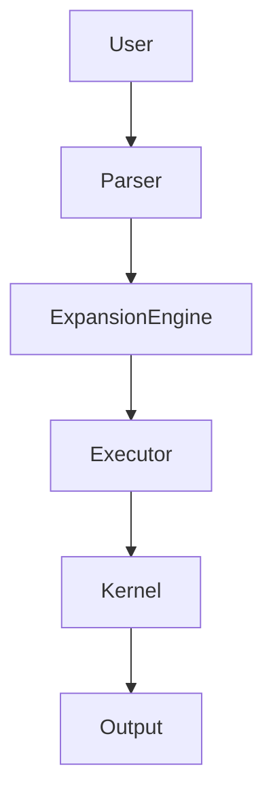
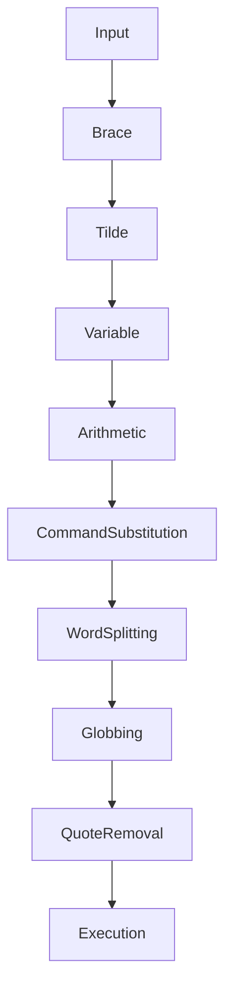
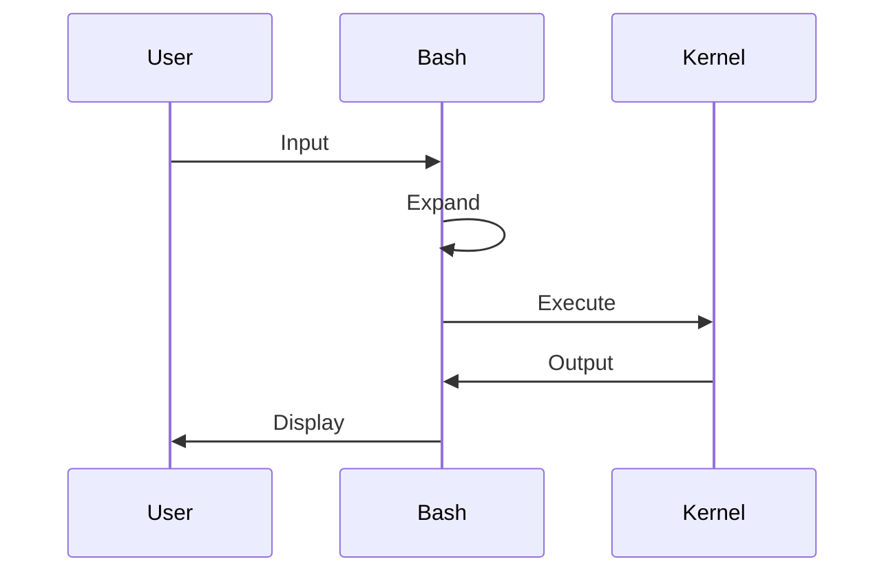

# 05 - Expansion

# Linux Fundamentals Mastery

# Bash Scripting Engineering Handbook

---

# Introduction

Expansion is one of the most misunderstood Bash concepts.

Most beginners think:

```text
Bash

↓

Execute Commands
```

This is incorrect.

Bash does NOT directly execute what you type.

Bash first transforms your command.

Then it executes the transformed version.

This transformation process is called:

```text
Expansion
```

This is one of the biggest mental shifts in learning Bash.

---

# Learning Objectives

After completing this file, you should understand:

✅ What expansion is

✅ Why expansion exists

✅ Expansion order

✅ Brace expansion

✅ Tilde expansion

✅ Variable expansion

✅ Parameter expansion

✅ Command substitution

✅ Arithmetic expansion

✅ Word splitting

✅ Filename expansion

✅ Production pitfalls

---

# The Most Important Mental Model

Bash is an interpreter.

Interpreters transform instructions.

Think:

```text
User Input

↓

Transformation Engine

↓

Execution Engine
```

Expansion is the transformation engine.

---

# First Principles Thinking

Computers prefer explicit instructions.

Humans prefer shortcuts.

Expansion bridges this gap.

Humans:

```text
Give short instructions
```

Bash:

```text
Converts them into explicit instructions
```

---

# Example

You type:

```bash
echo $HOME
```

Bash does NOT execute:

```bash
echo $HOME
```

It transforms it into:

```bash
echo /home/vip
```

Then executes it.

---

# High Level Architecture



---

# Bash Is A Transformation Machine

Think:

```text
Input

↓

Expansion

↓

Execution
```

Everything passes through expansion first.

---

# Example

Input:

```bash
echo *.txt
```

Expansion:

```bash
echo notes.txt report.txt app.txt
```

Execution:

```text
notes.txt report.txt app.txt
```

---

# Bash Expansion Pipeline

Bash follows a specific order.

This order is extremely important.

```text
1. Brace Expansion

↓

2. Tilde Expansion

↓

3. Parameter Expansion

↓

4. Variable Expansion

↓

5. Arithmetic Expansion

↓

6. Command Substitution

↓

7. Word Splitting

↓

8. Filename Expansion (Globbing)

↓

9. Quote Removal

↓

Execute
```

Professional engineers memorize this order.

---

# Visual Pipeline



---

# 1. Brace Expansion

Brace expansion generates multiple values.

Example:

```bash
echo {1..5}
```

Output:

```text
1 2 3 4 5
```

---

# Example

```bash
mkdir project-{frontend,backend,database}
```

Bash transforms:

```bash
mkdir project-frontend

mkdir project-backend

mkdir project-database
```

---

# Visual

```text
{frontend,backend,database}

↓

frontend

backend

database
```

---

# Sequence Expansion

```bash
echo {1..10}
```

Output:

```text
1 2 3 4 5 6 7 8 9 10
```

---

# Step Increment

```bash
echo {0..20..5}
```

Output:

```text
0 5 10 15 20
```

---

# 2. Tilde Expansion

Tilde means:

```text
Home Directory
```

Example:

```bash
echo ~
```

Expansion:

```text
/home/vip
```

---

# Example

Input:

```bash
cd ~/Downloads
```

Expansion:

```bash
cd /home/vip/Downloads
```

---

# User Home Expansion

```bash
echo ~root
```

Expansion:

```text
/root
```

---

# 3. Variable Expansion

Suppose:

```bash
name="vip"

echo $name
```

Expansion:

```text
vip
```

---

# Visual

```text
$name

↓

vip
```

---

# Curly Braces

```bash
file=test

echo ${file}_backup
```

Output:

```text
test_backup
```

---

# 4. Parameter Expansion

This is advanced variable manipulation.

---

# Default Values

```bash
echo ${PORT:-3000}
```

If PORT is missing:

```text
3000
```

---

# Assign Default

```bash
echo ${PORT:=3000}
```

Assigns value.

---

# Required Variable

```bash
echo ${DATABASE_URL:?Required}
```

Stops execution if missing.

---

# Alternate Value

```bash
echo ${VAR:+exists}
```

---

# Remove Prefix

```bash
path=/home/vip/file.txt

echo ${path#/home/}
```

Output:

```text
vip/file.txt
```

---

# Remove Suffix

```bash
echo ${path%.txt}
```

Output:

```text
/home/vip/file
```

---

# String Length

```bash
echo ${#path}
```

Output:

```text
18
```

---

# 5. Arithmetic Expansion

Bash can perform calculations.

Syntax:

```bash
$(( ))
```

Example:

```bash
echo $((5+10))
```

Output:

```text
15
```

---

# Example

```bash
count=5

echo $((count+1))
```

Output:

```text
6
```

---

# Visual

```text
$count

↓

5

↓

5+1

↓

6
```

---

# 6. Command Substitution

Run a command and insert its output.

Syntax:

```bash
$(command)
```

Example:

```bash
echo $(pwd)
```

---

# Internal Flow

```text
pwd

↓

Execute

↓

Output

↓

Insert
```

---

# Example

```bash
today=$(date)
```

---

# Nested Example

```bash
echo "Current User: $(whoami)"
```

---

# 7. Word Splitting

This is dangerous.

Suppose:

```bash
folder="My Documents"

echo $folder
```

Bash sees:

```text
My

Documents
```

Two words.

---

# Safe Version

```bash
echo "$folder"
```

---

# 8. Filename Expansion (Globbing)

Suppose:

```bash
echo *
```

Bash expands.

```text
file1

file2

file3
```

---

# Examples

All txt files:

```bash
*.txt
```

---

# Single Character

```bash
?
```

---

# Multiple Patterns

```bash
*.{jpg,png}
```

---

# Quote Removal

This is the final stage.

Example:

```bash
echo "$HOME"
```

Expansion:

```text
"/home/vip"
```

Quote removal:

```text
/home/vip
```

---

# Linux Internals

Bash performs these steps before execution.



---

# Why Engineers Care About Expansion

Everything depends on expansion.

```text
Scripts

↓

Docker

↓

Kubernetes

↓

Cloud

↓

CI/CD
```

---

# Docker Example

```dockerfile
ENV APP_ENV=production
```

---

# Kubernetes Example

```yaml
env:

- name: PORT

  value: "3000"
```

---

# CI/CD Example

```yaml
run: echo "$DATABASE_URL"
```

---

# Production Example

Create backups.

Instead of:

```bash
mkdir backup1

mkdir backup2

mkdir backup3
```

Use:

```bash
mkdir backup-{1..3}
```

---

# Common Mistakes

## Mistake 1

Thinking Bash executes input directly.

Wrong:

```text
Input

↓

Execute
```

Correct:

```text
Input

↓

Expand

↓

Execute
```

---

## Mistake 2

Ignoring quotes.

Wrong:

```bash
echo $folder
```

Correct:

```bash
echo "$folder"
```

---

## Mistake 3

Ignoring expansion order.

Wrong assumptions create bugs.

---

# Troubleshooting

## Problem

Unexpected extra arguments.

Cause:

```text
Word Splitting
```

Diagnose:

```bash
set -x
```

---

## Problem

Unexpected file deletions.

Cause:

```text
Globbing
```

---

## Problem

Variable missing.

Diagnose:

```bash
echo $VAR
```

---

# Engineering Mindset

Do not think:

```text
Bash = Command Runner
```

Think:

```text
Bash = Text Transformation Engine
```

---

# Interview Questions

## Beginner

What is expansion?

Why does expansion exist?

What is variable expansion?

---

## Intermediate

What is command substitution?

What is arithmetic expansion?

What is globbing?

---

## Advanced

Explain Bash expansion order.

How does Bash internally process commands?

Why is expansion dangerous in production?

---

# Learning Checklist

```text
☐ Understand brace expansion

☐ Understand tilde expansion

☐ Understand variable expansion

☐ Understand parameter expansion

☐ Understand arithmetic expansion

☐ Understand command substitution

☐ Understand word splitting

☐ Understand globbing

☐ Understand quote removal
```

---

# Mind Map

```text
Expansion

├── Why Expansion Exists

│

├── Brace Expansion

│

├── Tilde Expansion

│

├── Variable Expansion

│

├── Parameter Expansion

│

├── Arithmetic Expansion

│

├── Command Substitution

│

├── Word Splitting

│

├── Globbing

│

├── Quote Removal

│

├── Production Usage

│

├── Security

│

└── Troubleshooting
```

---

# Golden Rules

### Rule 1

Bash expands before executing.

---

### Rule 2

Always quote variables.

```bash
"$variable"
```

---

### Rule 3

Memorize expansion order.

---

### Rule 4

Treat globbing carefully.

---

### Rule 5

Expansion is powerful but dangerous.

---

### Rule 6

Never trust user input.

---

### Rule 7

Think of Bash as a transformation engine.

---

# First Principles Recap

```text
Human Intent

↓

Short Commands

↓

Expansion

↓

Explicit Commands

↓

Execution

↓

Output
```

# Key Takeaway

**Bash is not an execution engine.**

**Bash is a transformation engine that eventually executes commands.**
