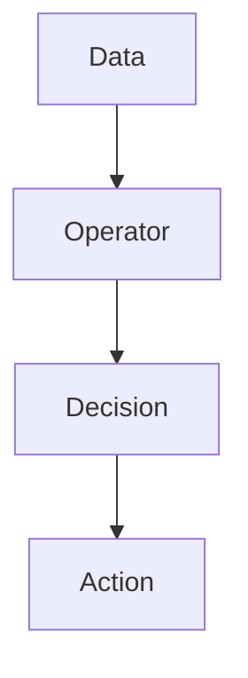
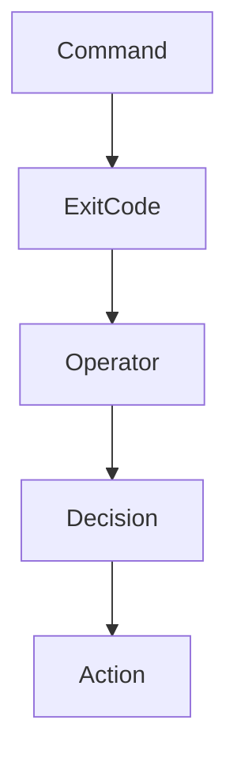

# 06 - Operators

# Linux Fundamentals Mastery

# Bash Scripting Engineering Handbook

---

# Introduction

Most Bash tutorials teach operators as symbols.

They teach:

```bash
==

!=

-eq

-ne

&&

||
```

and move on.

This is a very shallow way to learn operators.

Operators are not symbols.

Operators are decision-making tools.

Without operators, computers cannot make decisions.

Without decisions, automation cannot exist.

Without automation:

```text
No Bash Scripts

↓

No CI/CD

↓

No Infrastructure Automation

↓

No Monitoring Systems

↓

No Self Healing Systems
```

Operators are one of the foundations of computing.

---

# Learning Objectives

After completing this file, you should understand:

✅ Why operators exist

✅ Arithmetic operators

✅ Assignment operators

✅ Comparison operators

✅ String operators

✅ File operators

✅ Logical operators

✅ Shell operators

✅ Exit codes

✅ Production usage

---

# Why Do Operators Exist?

Computers process information.

But processing information is not enough.

Computers must answer questions.

Examples:

```text
Is CPU usage high?

Is memory full?

Does this file exist?

Is this user admin?

Should deployment continue?

Did backup succeed?
```

Operators help answer these questions.

---

# Mental Model

Think of operators as decision engines.

```text
Data

↓

Operator

↓

Result

↓

Decision
```

---

# First Principles Thinking

Every automation system follows this pattern.

```text
Observe

↓

Compare

↓

Decide

↓

Act
```

Operators perform the comparison step.

---

# Visual Architecture



---

# Operator Categories

There are multiple operator families.

```text
Operators

├── Arithmetic

├── Assignment

├── Comparison

├── String

├── File

├── Logical

└── Shell Control Operators
```

---

# Bash Decision Pipeline

```text
Variables

↓

Operators

↓

Conditions

↓

Execution

↓

Automation
```

---

# Arithmetic Operators

Used for calculations.

| Operator | Meaning |
|----------|---------|
| + | Addition |
| - | Subtraction |
| * | Multiplication |
| / | Division |
| % | Modulus |

---

# Example

```bash
echo $((10+5))
```

Output:

```text
15
```

---

# Example

```bash
count=10

echo $((count+1))
```

Output:

```text
11
```

---

# Visual

```text
10

↓

+1

↓

11
```

---

# Assignment Operators

Assign values.

Example:

```bash
name="vip"

port=3000
```

---

# Example

```bash
counter=5

counter=$((counter+1))
```

Output:

```text
6
```

---

# Comparison Operators

Comparison operators answer questions.

```text
Equal?

Greater?

Smaller?

Different?
```

---

# Numeric Operators

| Operator | Meaning |
|----------|---------|
| -eq | Equal |
| -ne | Not Equal |
| -gt | Greater Than |
| -lt | Less Than |
| -ge | Greater Or Equal |
| -le | Less Or Equal |

---

# Example

```bash
age=20

if [ "$age" -ge 18 ]
then

echo "Adult"

fi
```

---

# Visual

```text
20

↓

>=18

↓

True
```

---

# String Operators

String comparisons.

| Operator | Meaning |
|----------|---------|
| = | Equal |
| == | Equal |
| != | Not Equal |
| -z | Empty |
| -n | Not Empty |

---

# Example

```bash
name="vip"

if [ "$name" = "vip" ]
then

echo "Match"

fi
```

---

# Empty Check

```bash
if [ -z "$username" ]
then

echo "Empty"

fi
```

---

# Non Empty Check

```bash
if [ -n "$username" ]
then

echo "Exists"

fi
```

---

# File Operators

Very important in Linux automation.

These answer:

```text
Does this file exist?

Is this directory?

Can I read this file?

Can I execute it?
```

---

# Common File Operators

| Operator | Meaning |
|----------|---------|
| -e | Exists |
| -f | Regular File |
| -d | Directory |
| -r | Readable |
| -w | Writable |
| -x | Executable |
| -s | File Not Empty |

---

# Example

```bash
if [ -f "/etc/passwd" ]
then

echo "Exists"

fi
```

---

# Example

```bash
if [ -d "/home/vip" ]
then

echo "Directory Found"

fi
```

---

# Logical Operators

These combine decisions.

| Operator | Meaning |
|----------|---------|
| && | AND |
| \|\| | OR |
| ! | NOT |

---

# AND Operator

```bash
command1 && command2
```

Rule:

```text
If command1 succeeds

↓

Execute command2
```

---

# Visual

```text
True

↓

True

↓

Execute
```

---

# Example

```bash
mkdir backup && cd backup
```

---

# OR Operator

```bash
command1 || command2
```

Rule:

```text
If command1 fails

↓

Execute command2
```

---

# Example

```bash
ping google.com || echo "Internet Down"
```

---

# NOT Operator

Invert results.

Example:

```bash
if ! ping google.com
then

echo "Offline"

fi
```

---

# Shell Control Operators

These control execution flow.

---

# Semicolon

```bash
command1 ; command2
```

Always execute both.

Example:

```bash
pwd ; date
```

---

# AND

```bash
command1 && command2
```

Execute second only if first succeeds.

---

# OR

```bash
command1 || command2
```

Execute second only if first fails.

---

# Background Operator

```bash
&
```

Run in background.

Example:

```bash
python app.py &
```

---

# Pipeline Operator

```bash
|
```

Pass output to another command.

Example:

```bash
ps aux | grep nginx
```

---

# Visual

```text
Command1

↓

Output

↓

Command2
```

---

# Exit Codes

Operators heavily depend on exit codes.

Every Linux command returns a value.

```text
0

↓

Success
```

```text
1-255

↓

Failure
```

---

# Example

```bash
ls

echo $?
```

Output:

```text
0
```

---

# Internal Flow



---

# Linux Internals

Suppose:

```bash
mkdir backup && cd backup
```

Internally:

```text
mkdir

↓

Kernel Executes

↓

Exit Code 0

↓

&& Checks Result

↓

cd Executes
```

---

# Production Example

Backup System.

```text
Create Backup

↓

Compress Files

↓

Upload

↓

Verify

↓

Delete Temporary Files
```

Code:

```bash
backup && compress && upload && cleanup
```

---

# Docker Connection

Health checks.

```dockerfile
HEALTHCHECK CMD curl localhost || exit 1
```

---

# Kubernetes Connection

Readiness probes.

```text
Request

↓

Check

↓

Operator

↓

Healthy?

↓

Decision
```

---

# CI/CD Connection

```text
Build

↓

Test

↓

Deploy
```

Code:

```bash
npm test && npm run deploy
```

---

# Security Considerations

Always quote variables.

Wrong:

```bash
[ $name = vip ]
```

Correct:

```bash
[ "$name" = "vip" ]
```

---

# Common Mistakes

## Mistake 1

Using = instead of -eq.

Wrong:

```bash
[ "$age" = 18 ]
```

Correct:

```bash
[ "$age" -eq 18 ]
```

---

## Mistake 2

Ignoring exit codes.

Wrong:

```bash
mkdir backup

cd backup
```

Correct:

```bash
mkdir backup && cd backup
```

---

## Mistake 3

Not quoting variables.

Wrong:

```bash
[ $name = vip ]
```

Correct:

```bash
[ "$name" = "vip" ]
```

---

# Troubleshooting

## Problem

Unexpected comparison failure.

Diagnose:

```bash
set -x
```

---

## Problem

Pipeline not behaving correctly.

Diagnose:

```bash
echo $?
```

---

## Problem

Second command never executes.

Diagnose:

```bash
Check exit code
```

---

# Production Best Practices

Always:

```bash
Quote variables

Check exit codes

Use && carefully

Use || carefully

Validate files
```

---

# Engineering Mindset

Do not think:

```text
Operators = Symbols
```

Think:

```text
Operators = Decision Engines
```

Because all automation systems rely on decisions.

---

# Interview Questions

## Beginner

What are operators?

Difference between && and || ?

What are file operators?

---

## Intermediate

Difference between = and -eq ?

What are exit codes?

How do operators use exit codes?

---

## Advanced

Explain how Linux commands interact with operators.

Why is && heavily used in CI/CD?

Why are file operators important in production?

---

# Learning Checklist

```text
☐ Arithmetic operators

☐ Assignment operators

☐ Numeric operators

☐ String operators

☐ File operators

☐ Logical operators

☐ Shell operators

☐ Exit codes

☐ Production usage
```

---

# Mind Map

```text
Operators

├── Why Operators Exist

│

├── Arithmetic

│

├── Assignment

│

├── Numeric Comparison

│

├── String Comparison

│

├── File Operators

│

├── Logical Operators

│

├── Shell Operators

│

├── Exit Codes

│

├── Automation

│

├── Production Usage

│

├── Security

│

└── Troubleshooting
```

---

# Golden Rules

### Rule 1

Operators create decisions.

---

### Rule 2

Decisions create automation.

---

### Rule 3

Always quote variables.

---

### Rule 4

Use `-eq` for numbers.

---

### Rule 5

Use `=` for strings.

---

### Rule 6

Always check exit codes.

---

### Rule 7

Think of operators as infrastructure building blocks.

```text
Variables

↓

Operators

↓

Conditions

↓

Automation

↓

Infrastructure
```

---

# First Principles Recap

```text
Data

↓

Operators

↓

Decisions

↓

Actions

↓

Automation

↓

Systems
```

# Key Takeaway

**Operators are not symbols.**

**Operators are the decision-making language that powers all automation systems.**
