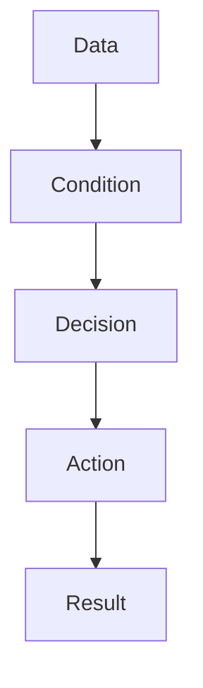
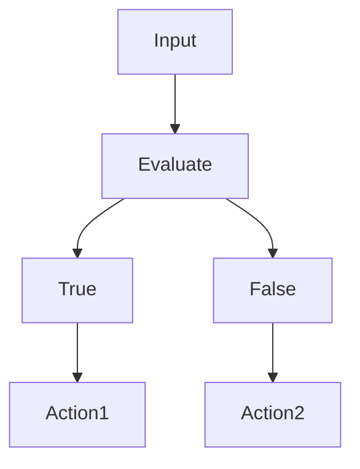
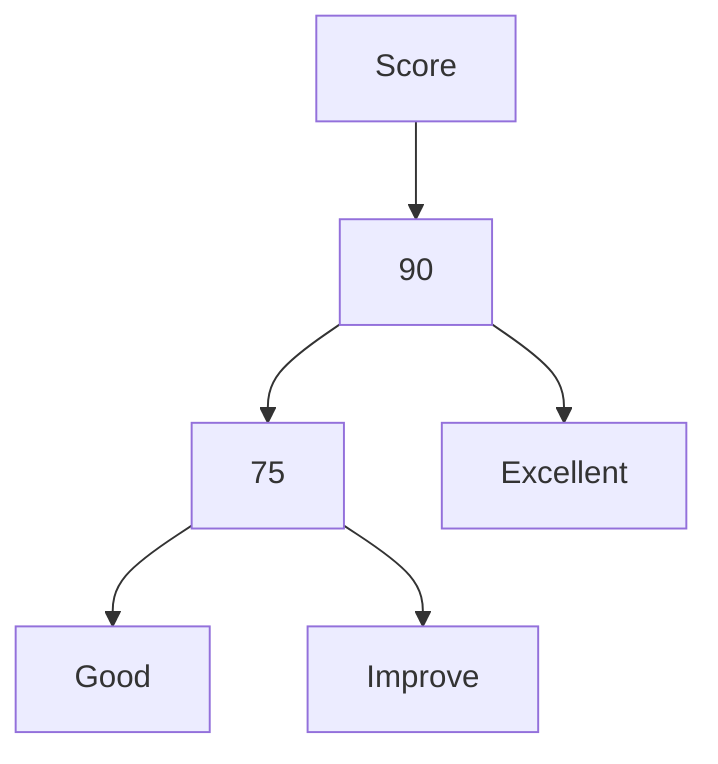

#  Conditions
---

# Introduction

Most Bash tutorials teach conditions as syntax.

They teach:

```bash
if

elif

else

case
```

and move on.

This is not how engineers think.

Conditions are not syntax.

Conditions are decision systems.

Conditions allow computers to answer questions.

Examples:

```text
Is CPU usage too high?

Is disk full?

Did backup succeed?

Is the server healthy?

Should deployment continue?

Should an alert be sent?
```

Without conditions, computers cannot make intelligent decisions.

Conditions are the brain of automation.

---

# Learning Objectives

After completing this file, you should understand:

✅ Why conditions exist

✅ How computers make decisions

✅ if statements

✅ if else statements

✅ elif chains

✅ nested conditions

✅ case statements

✅ production decision trees

✅ exit code driven automation

✅ production usage patterns

---

# Why Do Conditions Exist?

Computers execute instructions.

But intelligent systems need more.

They need to decide.

Think about humans.

We constantly ask questions.

```text
If raining

↓

Carry umbrella

If battery low

↓

Charge laptop

If hungry

↓

Eat food
```

Computers work the same way.

---

# First Principles Thinking

Every intelligent system follows this pattern.

```text
Observe

↓

Evaluate

↓

Decide

↓

Act
```

Conditions perform the decision step.

---

# Mental Model: Traffic Police

Imagine a traffic police officer.

Inputs arrive.

```text
Traffic Light

↓

Observe

↓

Red?

↓

Stop

↓

Green?

↓

Go
```

Conditions are traffic controllers.

---

# The Automation Pipeline

```text
Data

↓

Variables

↓

Operators

↓

Conditions

↓

Actions

↓

Automation
```

---

# High Level Architecture



---

# What Is A Condition?

Definition:

A condition is a statement that evaluates to:

```text
True

or

False
```

Every decision in Bash depends on this.

---

# Bash Conditional Flow



---

# The if Statement

Syntax:

```bash
if [ condition ]
then

commands

fi
```

Example:

```bash
age=20

if [ "$age" -ge 18 ]
then

echo "Adult"

fi
```

---

# Internal Thinking

```text
20

↓

>=18

↓

True

↓

Execute
```

---

# Visual

```text
Condition

↓

True

↓

Run Code
```

---

# if else Statement

Syntax:

```bash
if [ condition ]
then

commands

else

commands

fi
```

---

# Example

```bash
cpu=90

if [ "$cpu" -gt 80 ]
then

echo "High CPU"

else

echo "Normal"

fi
```

---

# Visual

```text
CPU

↓

80?

↓

True

↓

Alert

False

↓

Continue
```

---

# if elif else

Useful for multiple decisions.

Example:

```bash
score=85

if [ "$score" -ge 90 ]
then

echo "Excellent"

elif [ "$score" -ge 75 ]
then

echo "Good"

else

echo "Improve"

fi
```

---

# Visual



---

# Nested Conditions

Conditions inside conditions.

Example:

```bash
cpu=90

memory=85

if [ "$cpu" -gt 80 ]
then

if [ "$memory" -gt 80 ]
then

echo "Critical"

fi

fi
```

---

# Visual

```text
CPU High?

↓

Memory High?

↓

Critical Alert
```

---

# Case Statements

Useful when there are many possible values.

Syntax:

```bash
case variable in

value)

commands

;;

esac
```

---

# Example

```bash
env="production"

case "$env" in

production)

echo "Production Mode"

;;

staging)

echo "Staging Mode"

;;

development)

echo "Development Mode"

;;

*)

echo "Unknown"

;;

esac
```

---

# Visual

```text
Environment

├── Production

├── Staging

├── Development

└── Unknown
```

---

# Why Engineers Love case

Without case:

```bash
if

elif

elif

elif

elif
```

Very difficult to maintain.

With case:

```text
Cleaner

Readable

Scalable
```

---

# Condition Operators Review

## Numeric

```bash
-eq

-ne

-gt

-lt

-ge

-le
```

---

# String

```bash
=

==

!=

-z

-n
```

---

# File

```bash
-f

-d

-e

-r

-w

-x
```

---

# Multiple Conditions

AND

```bash
if [ "$cpu" -gt 80 ] && [ "$memory" -gt 80 ]
then

echo "Critical"

fi
```

---

# OR

```bash
if [ "$cpu" -gt 80 ] || [ "$memory" -gt 80 ]
then

echo "Warning"

fi
```

---

# Exit Code Driven Conditions

This is heavily used in production.

Example:

```bash
if ping google.com
then

echo "Online"

else

echo "Offline"

fi
```

Bash uses exit codes.

```text
0

↓

True

1

↓

False
```

---

# Visual

```text
Command

↓

Exit Code

↓

Condition

↓

Decision
```

---

# Linux Internals

Suppose:

```bash
if ping google.com
```

Internally:

```text
Bash

↓

Kernel Executes ping

↓

Returns Exit Code

↓

Condition Evaluates

↓

Decision Made
```

---

# Production Example 1

Disk Monitor

```bash
disk=95

if [ "$disk" -gt 90 ]
then

echo "Disk Full"

fi
```

---

# Production Example 2

Health Check

```bash
if systemctl is-active nginx
then

echo "Healthy"

else

echo "Restart"

fi
```

---

# Production Example 3

Backup Automation

```bash
if backup
then

upload

else

notify_admin

fi
```

---

# Docker Connection

Entrypoint scripts.

```bash
if [ "$APP_ENV" = "production" ]
then

start_prod

fi
```

---

# Kubernetes Connection

Startup scripts.

```text
Environment

↓

Condition

↓

Container Configuration
```

---

# CI/CD Connection

```text
Build

↓

Tests

↓

Condition

↓

Deploy
```

Example:

```bash
if npm test
then

deploy

fi
```

---

# Security Considerations

Always quote variables.

Wrong:

```bash
if [ $name = vip ]
```

Correct:

```bash
if [ "$name" = "vip" ]
```

---

# Common Mistakes

## Mistake 1

Forgetting spaces.

Wrong:

```bash
if["$age"-gt18]
```

Correct:

```bash
if [ "$age" -gt 18 ]
```

---

## Mistake 2

Using = for numbers.

Wrong:

```bash
[ "$age" = 18 ]
```

Correct:

```bash
[ "$age" -eq 18 ]
```

---

## Mistake 3

Not quoting variables.

Wrong:

```bash
[ $name = vip ]
```

Correct:

```bash
[ "$name" = "vip" ]
```

---

## Mistake 4

Too many elif blocks.

Prefer:

```bash
case
```

for multiple values.

---

# Troubleshooting

## Problem

Condition always false.

Diagnose:

```bash
echo "$variable"
```

---

## Problem

Unexpected syntax error.

Diagnose:

```bash
set -x
```

---

## Problem

Command not entering if block.

Diagnose:

```bash
echo $?
```

Check exit code.

---

# Production Best Practices

Always:

```text
Quote variables

Keep conditions simple

Prefer case for many branches

Use exit codes

Avoid deep nesting
```

---

# Engineering Mindset

Do not think:

```text
Conditions = if else
```

Think:

```text
Conditions = Decision Trees
```

Because all intelligent systems are built from decisions.

---

# Interview Questions

## Beginner

What is a condition?

Why do conditions exist?

Difference between if and case?

---

## Intermediate

How do exit codes work?

When should we use case?

What is nested if?

---

## Advanced

How do Linux commands integrate with conditions?

How are conditions used in CI/CD?

How are conditions used in production systems?

---

# Learning Checklist

```text
☐ Understand if

☑ Understand if else

☑ Understand elif

☑ Understand nested conditions

☑ Understand case

☑ Understand AND

☑ Understand OR

☑ Understand exit codes

☑ Understand production usage
```

---

# Mind Map

```text
Conditions

├── Why Conditions Exist

│

├── if

│

├── if else

│

├── elif

│

├── Nested Conditions

│

├── case

│

├── AND

│

├── OR

│

├── Exit Codes

│

├── Automation

│

├── Production Systems

│

├── Security

│

└── Troubleshooting
```

---

# Golden Rules

### Rule 1

Conditions are decision systems.

---

### Rule 2

Simple conditions are better than complex conditions.

---

### Rule 3

Always quote variables.

---

### Rule 4

Use case for many branches.

---

### Rule 5

Use exit codes whenever possible.

---

### Rule 6

Avoid deep nesting.

---

### Rule 7

Think in decision trees.

---

# First Principles Recap

```text
Observe

↓

Compare

↓

Decide

↓

Act

↓

Automate

↓

Scale
```

# Key Takeaway

**Conditions are not Bash syntax.**

**Conditions are the brain that transforms scripts into intelligent automation systems.**
