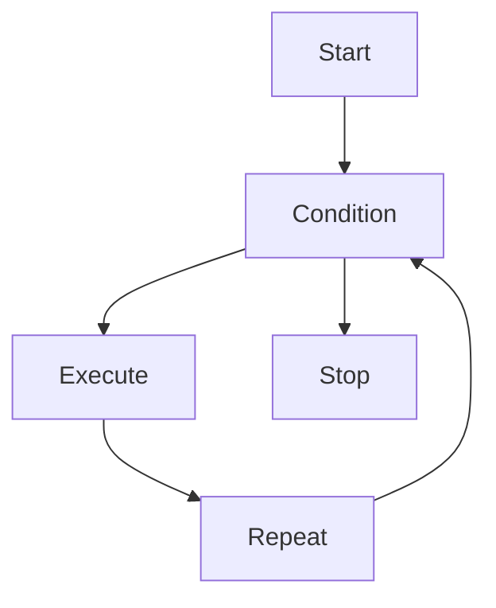
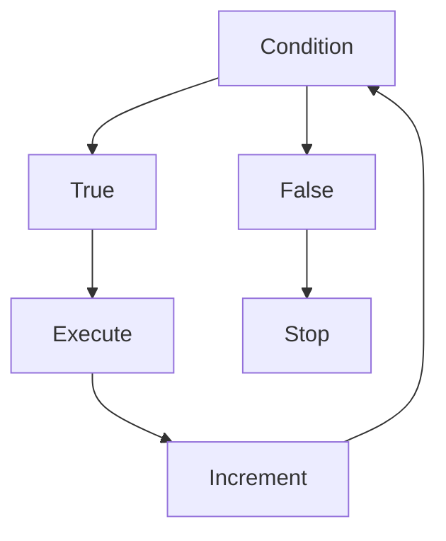

# 08 - Loops

---

# Where This Topic Sits In Systems Engineering

```text
Variables

↓

Operators

↓

Conditions

↓

Loops

↓

Automation

↓

Infrastructure Engineering

↓

Distributed Systems
```

Conditions answer:

```text
Should I do this?
```

Loops answer:

```text
How many times should I do this?
```

Together they create automation.

---

# Why Engineers Care About Loops

Imagine you manage:

```text
1 server
```

No problem.

Now imagine:

```text
100 servers
```

or

```text
1000 servers
```

Without loops:

```bash
ping server1

ping server2

ping server3

ping server4

...
```

Impossible.

Loops solve this problem.

---

# Learning Objectives

After completing this file, you should understand:

✅ Why loops exist

✅ How loops work

✅ for loops

✅ while loops

✅ until loops

✅ nested loops

✅ break

✅ continue

✅ infinite loops

✅ production automation patterns

✅ infrastructure use cases

---

# Introduction

Most Bash tutorials teach:

```bash
for

while

until
```

and stop.

This is incomplete.

Loops are one of the biggest reasons automation exists.

Loops transform:

```text
Single Action

↓

Multiple Actions

↓

Automation

↓

Scale
```

Loops allow engineers to think at system scale.

---

# First Principles Thinking

Humans hate repetition.

Computers are good at repetition.

Loops allow us to delegate repetitive work.

Without loops:

```text
Repeat Manually
```

With loops:

```text
Describe Once

↓

Execute Many Times
```

---

# Mental Model: Factory Conveyor Belt

Imagine a factory.

Instead of manually processing every item.

```text
Item 1

↓

Item 2

↓

Item 3

↓

Item N
```

A conveyor belt processes everything automatically.

Loops are conveyor belts.

---

# The Automation Pipeline

```text
Data

↓

Decision

↓

Loop

↓

Execution

↓

Automation

↓

Scale
```

---

# What Is A Loop?

Definition:

A loop repeatedly executes code until a condition changes.

Think:

```text
Input

↓

Check

↓

Execute

↓

Repeat

↓

Stop
```

---

# High Level Architecture



---

# Types Of Loops

Bash has three primary loops.

```text
Loops

├── for

├── while

└── until
```

---

# for Loop

Used when you already know what to iterate over.

Syntax:

```bash
for variable in values
do

commands

done
```

---

# Example

```bash
for server in server1 server2 server3
do

echo "$server"

done
```

Output:

```text
server1

server2

server3
```

---

# Visual

```text
server1

↓

server2

↓

server3

↓

Done
```

---

# Range Loop

```bash
for number in {1..5}
do

echo "$number"

done
```

Output:

```text
1

2

3

4

5
```

---

# Step Range

```bash
for number in {0..20..5}
do

echo "$number"

done
```

Output:

```text
0

5

10

15

20
```

---

# Array Style Loop

```bash
servers="api db cache"

for server in $servers
do

echo "$server"

done
```

---

# File Iteration

Very common in Linux.

```bash
for file in *.txt
do

echo "$file"

done
```

---

# while Loop

Used when a condition controls repetition.

Syntax:

```bash
while condition
do

commands

done
```

---

# Example

```bash
count=1

while [ "$count" -le 5 ]
do

echo "$count"

count=$((count+1))

done
```

---

# Visual

```text
1

↓

2

↓

3

↓

4

↓

5

↓

Stop
```

---

# Internal Flow



---

# Reading Files With while

Very common in production.

Example:

```bash
while read line
do

echo "$line"

done < servers.txt
```

Suppose:

```text
servers.txt

api

db

cache
```

Output:

```text
api

db

cache
```

---

# until Loop

Opposite of while.

while:

```text
Run while true
```

until:

```text
Run until true
```

Syntax:

```bash
until condition
do

commands

done
```

---

# Example

```bash
count=1

until [ "$count" -gt 5 ]
do

echo "$count"

count=$((count+1))

done
```

---

# Visual

```text
Condition False

↓

Execute

↓

Condition False

↓

Execute

↓

Condition True

↓

Stop
```

---

# Infinite Loops

Sometimes useful.

Syntax:

```bash
while true
do

commands

done
```

---

# Example

```bash
while true
do

date

sleep 5

done
```

---

# Production Use Case

Continuous health checker.

```text
Check CPU

↓

Wait

↓

Check Again

↓

Wait

↓

Repeat
```

---

# break Statement

Stop the loop immediately.

Example:

```bash
for number in {1..10}
do

if [ "$number" -eq 5 ]
then

break

fi

echo "$number"

done
```

Output:

```text
1

2

3

4
```

---

# continue Statement

Skip current iteration.

Example:

```bash
for number in {1..5}
do

if [ "$number" -eq 3 ]
then

continue

fi

echo "$number"

done
```

Output:

```text
1

2

4

5
```

---

# Nested Loops

Loop inside loop.

Example:

```bash
for region in us eu
do

for server in api db
do

echo "$region-$server"

done

done
```

Output:

```text
us-api

us-db

eu-api

eu-db
```

---

# Visual

```text
Region

├── Server

│

└── Server
```

---

# Linux Internals

Bash does not create magic.

Internally:

```text
Loop

↓

Condition

↓

Execute Commands

↓

Update State

↓

Repeat
```

CPU repeatedly executes instructions.

---

# Production Example 1

Bulk Ping Servers

```bash
for server in server1 server2 server3
do

ping -c 1 "$server"

done
```

---

# Production Example 2

Backup Multiple Databases

```bash
for db in users orders inventory
do

backup "$db"

done
```

---

# Production Example 3

Health Monitoring

```bash
while true
do

check_cpu

check_memory

sleep 60

done
```

---

# Docker Connection

Loop over containers.

```bash
for container in $(docker ps -q)
do

echo "$container"

done
```

---

# Kubernetes Connection

Loop over pods.

```bash
for pod in $(kubectl get pods -o name)
do

echo "$pod"

done
```

---

# Cloud Connection

Loop over cloud resources.

```text
EC2

↓

S3

↓

RDS

↓

Security Groups
```

Automation tools heavily depend on loops.

---

# CI/CD Connection

Deploy multiple services.

```text
Frontend

↓

Backend

↓

Database

↓

Cache
```

---

# Security Considerations

Always quote variables.

Wrong:

```bash
echo $server
```

Correct:

```bash
echo "$server"
```

---

# Common Mistakes

## Mistake 1

Infinite loops without sleep.

Wrong:

```bash
while true
do

check

done
```

This will consume CPU.

Correct:

```bash
while true
do

check

sleep 5

done
```

---

## Mistake 2

Not quoting variables.

Wrong:

```bash
echo $file
```

Correct:

```bash
echo "$file"
```

---

## Mistake 3

Using loops for tasks that tools already solve.

Bad:

```text
Reinventing existing utilities
```

---

# Troubleshooting

## Problem

Infinite loop.

Diagnose:

```bash
set -x
```

Check:

```bash
Condition never changes
```

---

## Problem

Loop never executes.

Diagnose:

```bash
echo "$variable"
```

Check initial state.

---

## Problem

High CPU usage.

Check:

```bash
sleep missing
```

---

# Production Best Practices

Always:

```text
Keep loops simple

Avoid unnecessary nesting

Use sleep in infinite loops

Quote variables

Validate inputs
```

---

# Engineering Mindset

Do not think:

```text
Loops = Repetition
```

Think:

```text
Loops = Automation Multipliers
```

Because infrastructure engineering is impossible without them.

---

# Interview Questions

## Beginner

What is a loop?

Difference between for and while?

What is until?

---

## Intermediate

When should we use while?

What is break?

What is continue?

---

## Advanced

How are loops used in infrastructure automation?

Why are loops dangerous without sleep?

How do loops scale systems?

---

# Learning Checklist

```text
☐ Understand for loops

☐ Understand while loops

☑ Understand until loops

☑ Understand break

☑ Understand continue

☑ Understand nested loops

☑ Understand infinite loops

☑ Understand production usage
```

---

# Mind Map

```text
Loops

├── Why Loops Exist

│

├── for

│

├── while

│

├── until

│

├── break

│

├── continue

│

├── nested loops

│

├── infinite loops

│

├── infrastructure automation

│

├── production usage

│

├── security

│

└── troubleshooting
```

---

# Golden Rules

### Rule 1

Loops exist to eliminate manual repetition.

---

### Rule 2

Use for when data is known.

---

### Rule 3

Use while when conditions control execution.

---

### Rule 4

Always put sleep inside infinite loops.

---

### Rule 5

Avoid deep nested loops.

---

### Rule 6

Always quote variables.

---

### Rule 7

Think of loops as automation multipliers.

---

# First Principles Recap

```text
Task

↓

Repeat

↓

Automate

↓

Scale

↓

Infrastructure

↓

Systems Engineering
```

# Key Takeaway

**Loops are not repetition tools.**

**Loops are scaling tools that transform manual work into automation.**
