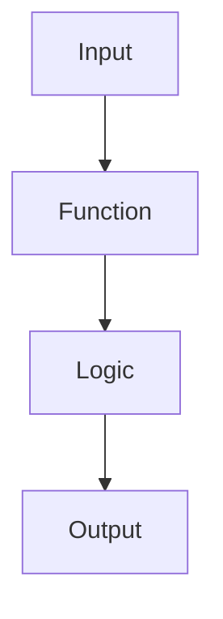
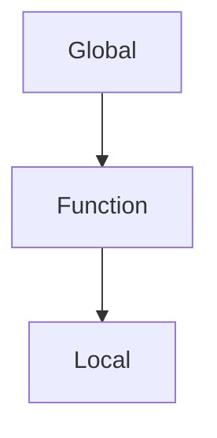

# 09 - Functions

---

# Where This Topic Sits In Systems Engineering

```text
Variables

↓

Conditions

↓

Loops

↓

Functions

↓

Reusable Automation

↓

Infrastructure Engineering

↓

Platform Engineering

↓

Distributed Systems
```

Until now, we learned how Bash thinks.

Functions teach Bash how to organize thinking.

This is where scripts become systems.

---

# Why Engineers Care About Functions

Imagine this script.

```bash
check_cpu

check_memory

check_disk

check_network

check_cpu

check_memory

check_disk

check_network
```

Now imagine:

```text
1000 lines

↓

3000 lines

↓

5000 lines
```

Without functions:

```text
Huge Scripts

↓

Duplicate Code

↓

Maintenance Problems

↓

Production Bugs
```

Functions solve this.

---

# Learning Objectives

After completing this file, you should understand:

✅ Why functions exist

✅ Function anatomy

✅ Creating functions

✅ Parameters

✅ Return values

✅ Scope

✅ Local variables

✅ Exit codes

✅ Reusable automation

✅ Production design patterns

---

# Introduction

Most Bash tutorials teach:

```bash
function hello(){

echo hello

}
```

and stop.

This is incomplete.

Functions are not code blocks.

Functions are reusable units of work.

Functions allow engineers to organize automation.

Think:

```text
Task

↓

Package It

↓

Reuse It

↓

Scale It
```

---

# First Principles Thinking

Imagine building a house.

Without functions:

```text
Build Door

↓

Build Door Again

↓

Build Door Again

↓

Build Door Again
```

Very inefficient.

With functions:

```text
Door Blueprint

↓

Reuse Many Times
```

Functions are blueprints.

---

# Mental Model: Machines In A Factory

Imagine a factory.

Instead of one giant machine.

You build smaller machines.

```text
Machine A

↓

Machine B

↓

Machine C
```

Each machine has one responsibility.

Functions are machines.

---

# What Is A Function?

Definition:

A function is a reusable block of code that performs a specific task.

Think:

```text
Input

↓

Process

↓

Output
```

---

# High Level Architecture



---

# Why Functions Exist

Functions solve several engineering problems.

```text
Code Duplication

↓

Poor Readability

↓

Poor Maintainability

↓

Large Scripts

↓

Human Errors
```

---

# Function Anatomy

Basic syntax:

```bash
function_name(){

commands

}
```

or

```bash
function function_name(){

commands

}
```

Both work.

---

# Example

```bash
say_hello(){

echo "Hello"

}

say_hello
```

Output:

```text
Hello
```

---

# Internal Flow

```text
Call Function

↓

Locate Function

↓

Execute Code

↓

Return Control
```

---

# Visual

```text
say_hello()

↓

Execute

↓

Output

↓

Return
```

---

# Reusing Functions

Example:

```bash
say_hello(){

echo "Hello"

}

say_hello

say_hello

say_hello
```

Output:

```text
Hello

Hello

Hello
```

---

# Functions With Parameters

Functions can receive data.

Syntax:

```bash
function_name(){

echo "$1"

}
```

---

# Example

```bash
greet(){

echo "Hello $1"

}

greet vip
```

Output:

```text
Hello vip
```

---

# Parameter Positions

| Variable | Meaning |
|----------|---------|
| $0 | Script Name |
| $1 | First Argument |
| $2 | Second Argument |
| $3 | Third Argument |
| $# | Total Arguments |
| $@ | All Arguments |
| $* | All Arguments |

---

# Example

```bash
show(){

echo "$1"

echo "$2"

}

show linux bash
```

Output:

```text
linux

bash
```

---

# Visual

```text
show linux bash

↓

$1=linux

↓

$2=bash
```

---

# Multiple Parameters

Example:

```bash
create_user(){

echo "User: $1"

echo "Role: $2"

}

create_user vip admin
```

---

# Special Variables

Total arguments.

```bash
echo $#
```

---

# All arguments.

```bash
echo "$@"
```

---

# Difference Between $@ and $*

This is important.

Use:

```bash
"$@"
```

in production.

Avoid:

```bash
"$*"
```

unless necessary.

---

# Visual

```text
"$@"

↓

Argument1

Argument2

Argument3
```

---

# Returning Values

Bash functions don't return values like Python.

They return exit codes.

```text
0

↓

Success
```

```text
1-255

↓

Failure
```

---

# Example

```bash
check(){

return 0

}

check

echo $?
```

Output:

```text
0
```

---

# Returning Data

Usually done using echo.

Example:

```bash
get_date(){

echo "$(date)"

}

today=$(get_date)

echo "$today"
```

---

# Visual

```text
Function

↓

Echo

↓

Capture

↓

Store
```

---

# Local Variables

Avoid polluting global scope.

Wrong:

```bash
name="vip"

function greet(){

name="admin"

}
```

This changes global data.

---

# Correct

```bash
greet(){

local name="admin"

echo "$name"

}
```

---

# Visual

```text
Function

↓

Private Variable

↓

Destroyed
```

after function execution.

---

# Variable Scope



---

# Nested Functions

Possible but avoid overusing.

Example:

```bash
outer(){

inner(){

echo "Hello"

}

inner

}

outer
```

---

# Linux Internals

Functions are stored in shell memory.

Bash builds an internal function table.

```text
Function Name

↓

Memory Reference

↓

Code Block
```

---

# Visual

```text
Bash Memory

├── Variables

├── Functions

├── Aliases

└── Environment
```

---

# View Functions

```bash
declare -f
```

Specific function:

```bash
declare -f greet
```

---

# Production Example 1

Health Checker

```bash
check_cpu(){

echo "CPU"

}

check_memory(){

echo "Memory"

}

check_disk(){

echo "Disk"

}
```

---

# Production Example 2

Deployment Pipeline

```bash
build(){}

test(){}

deploy(){}

verify(){}
```

---

# Production Example 3

Backup System

```bash
backup(){}

compress(){}

upload(){}

cleanup(){}
```

---

# Docker Connection

Entrypoint scripts use functions.

```text
Validate

↓

Configure

↓

Start Application
```

---

# Kubernetes Connection

Startup scripts.

```text
Load Environment

↓

Configure

↓

Launch Services
```

---

# Cloud Connection

Infrastructure scripts.

```text
Create VM

↓

Configure Firewall

↓

Deploy Application
```

Functions organize these tasks.

---

# CI/CD Connection

```text
Build

↓

Test

↓

Deploy

↓

Verify
```

Each stage often becomes a function.

---

# Designing Functions Like Engineers

Good function:

```text
One Responsibility
```

Bad function:

```text
Do Everything
```

---

# Single Responsibility Principle

Bad:

```bash
deploy_everything(){}
```

Good:

```bash
build(){}

test(){}

deploy(){}

verify(){}
```

---

# Common Mistakes

## Mistake 1

Huge functions.

Wrong:

```text
500 line function
```

Correct:

```text
Small focused functions
```

---

## Mistake 2

Using global variables everywhere.

Wrong:

```bash
username="vip"
```

inside every function.

Correct:

```bash
local username
```

---

## Mistake 3

Ignoring exit codes.

Wrong:

```bash
deploy
```

Correct:

```bash
deploy || exit 1
```

---

# Troubleshooting

## Problem

Function not found.

Check:

```bash
declare -f
```

---

## Problem

Wrong parameter.

Check:

```bash
echo "$1"
```

---

## Problem

Variable unexpectedly changed.

Cause:

```text
Global Variable Pollution
```

Use:

```bash
local
```

---

# Production Best Practices

Always:

```text
One responsibility per function

Use local variables

Keep functions small

Use meaningful names

Check exit codes

Reuse logic
```

---

# Engineering Mindset

Do not think:

```text
Functions = Reusable Code
```

Think:

```text
Functions = System Components
```

Because large automation systems are built from smaller reusable systems.

---

# Interview Questions

## Beginner

What is a function?

Why do functions exist?

What is a parameter?

---

## Intermediate

Difference between local and global variables?

How do Bash functions return values?

What is $# ?

---

## Advanced

How are functions stored internally?

Why are functions heavily used in CI/CD?

How should engineers design functions?

---

# Learning Checklist

```text
☑ Create functions

☑ Use parameters

☑ Use local variables

☑ Understand return values

☑ Understand exit codes

☑ Design reusable systems

☑ Build production automation
```

---

# Mind Map

```text
Functions

├── Why Functions Exist

│

├── Function Anatomy

│

├── Parameters

│

├── Return Values

│

├── Exit Codes

│

├── Local Variables

│

├── Scope

│

├── Reusable Automation

│

├── Production Usage

│

├── CI/CD

│

├── Infrastructure

│

├── Security

│

└── Troubleshooting
```

---

# Golden Rules

### Rule 1

One function = One responsibility.

---

### Rule 2

Keep functions small.

---

### Rule 3

Always use meaningful names.

---

### Rule 4

Prefer local variables.

---

### Rule 5

Check exit codes.

---

### Rule 6

Reuse logic instead of duplicating code.

---

### Rule 7

Think of functions as system components.

---

# First Principles Recap

```text
Task

↓

Package

↓

Reuse

↓

Automate

↓

Scale

↓

Systems Engineering
```

# Key Takeaway

**Loops scale actions.**

**Functions scale systems.**

This is the point where Bash stops being scripting and starts becoming engineering.
