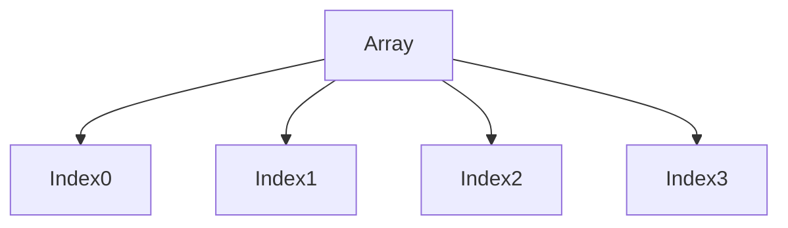

# 10 - Arrays

---

# Where This Topic Sits In Systems Engineering

```text
Variables

↓

Conditions

↓

Loops

↓

Functions

↓

Arrays

↓

Data Management

↓

Infrastructure Automation

↓

Distributed Systems
```

Until now, we automated actions.

Arrays teach us how to automate data.

---

# Why Engineers Care About Arrays

Imagine managing:

```text
1 Server
```

Easy.

Now imagine:

```text
100 Servers

1000 Containers

500 Databases

200 Users

10000 Files
```

Without arrays:

```bash
server1=api

server2=db

server3=cache

server4=auth
```

This quickly becomes impossible.

Arrays solve this problem.

---

# Learning Objectives

After completing this file, you should understand:

✅ Why arrays exist

✅ How arrays work

✅ Creating arrays

✅ Accessing elements

✅ Updating arrays

✅ Deleting elements

✅ Array length

✅ Iterating arrays

✅ Associative arrays

✅ Production patterns

---

# Introduction

Most Bash tutorials teach:

```bash
servers=("api" "db")
```

and move on.

That's shallow.

Arrays are one of the foundations of systems engineering.

Without arrays:

```text
No Bulk Management

↓

No Fleet Management

↓

No Resource Management

↓

No Infrastructure Automation
```

Arrays organize data.

---

# First Principles Thinking

Humans organize things into groups.

Examples:

```text
Bookshelf

↓

Library

↓

Warehouse

↓

Inventory
```

Computers do the same thing.

Arrays group related data together.

---

# Mental Model: Warehouse Shelves

Imagine a warehouse.

```text
Shelf 0

Shelf 1

Shelf 2

Shelf 3
```

Every shelf stores something.

Arrays work exactly like this.

---

# What Is An Array?

Definition:

An array is a collection of related values stored under a single name.

Think:

```text
Array Name

↓

Multiple Values

↓

Accessible By Position
```

---

# High Level Architecture



---

# Why Arrays Exist

Arrays solve several engineering problems.

```text
Duplicate Variables

↓

Hard To Scale

↓

Difficult To Maintain

↓

Poor Automation
```

---

# Creating Arrays

Syntax:

```bash
array_name=(value1 value2 value3)
```

Example:

```bash
servers=(api db cache auth)
```

---

# Visual

```text
servers

↓

0 → api

1 → db

2 → cache

3 → auth
```

---

# Accessing Elements

Syntax:

```bash
${array[index]}
```

Example:

```bash
echo ${servers[0]}
```

Output:

```text
api
```

---

# Access Multiple Elements

Syntax:

```bash
${array[@]}
```

Example:

```bash
echo ${servers[@]}
```

Output:

```text
api db cache auth
```

---

# Visual

```text
servers[@]

↓

api

db

cache

auth
```

---

# Get Array Length

Syntax:

```bash
${#array[@]}
```

Example:

```bash
echo ${#servers[@]}
```

Output:

```text
4
```

---

# Length Of Single Element

Example:

```bash
echo ${#servers[0]}
```

Output:

```text
3
```

Because:

```text
api
```

contains three characters.

---

# Update Elements

Example:

```bash
servers[1]="database"
```

Visual:

Before:

```text
1 → db
```

After:

```text
1 → database
```

---

# Add New Elements

Example:

```bash
servers+=(monitoring)
```

Visual:

```text
api

db

cache

auth

monitoring
```

---

# Delete Elements

Syntax:

```bash
unset array[index]
```

Example:

```bash
unset servers[2]
```

---

# Visual

Before:

```text
0 api

1 db

2 cache

3 auth
```

After:

```text
0 api

1 db

3 auth
```

Indexes remain unchanged.

---

# Array Iteration

Very common in production.

Syntax:

```bash
for item in "${array[@]}"
do

echo "$item"

done
```

---

# Visual

```text
api

↓

db

↓

cache

↓

auth
```

---

# Array Expansion

Important.

Wrong:

```bash
echo ${servers[@]}
```

Correct:

```bash
echo "${servers[@]}"
```

Always quote arrays.

---

# Difference Between * and @

This is important.

### *

```bash
"${servers[*]}"
```

Returns:

```text
Single String
```

---

### @

```bash
"${servers[@]}"
```

Returns:

```text
Separate Elements
```

Production scripts prefer:

```bash
"${array[@]}"
```

---

# Associative Arrays

Think dictionaries.

Syntax:

```bash
declare -A server_ips
```

Example:

```bash
server_ips[api]=10.0.0.1

server_ips[db]=10.0.0.2
```

---

# Visual

```text
api

↓

10.0.0.1


db

↓

10.0.0.2
```

---

# Access Associative Arrays

Example:

```bash
echo ${server_ips[api]}
```

Output:

```text
10.0.0.1
```

---

# Iterate Associative Arrays

```bash
for key in "${!server_ips[@]}"
do

echo "$key"

echo "${server_ips[$key]}"

done
```

---

# Linux Internals

Arrays are stored in shell memory.

Bash builds an internal table.

```text
Array Name

↓

Indexes

↓

Values
```

---

# Visual

```text
Shell Memory

├── Variables

├── Arrays

├── Functions

├── Aliases

└── Environment
```

---

# Production Example 1

Manage Servers

```bash
servers=(api db cache auth)

for server in "${servers[@]}"
do

ping "$server"

done
```

---

# Production Example 2

Deploy Multiple Services

```bash
services=(frontend backend database redis)

for service in "${services[@]}"
do

deploy "$service"

done
```

---

# Production Example 3

Backup Multiple Databases

```bash
databases=(users orders inventory analytics)

for db in "${databases[@]}"
do

backup "$db"

done
```

---

# Docker Connection

Containers become collections.

```text
Container List

↓

Array

↓

Operations
```

Example:

```bash
containers=($(docker ps -q))
```

---

# Kubernetes Connection

Pods become collections.

```bash
pods=($(kubectl get pods -o name))
```

---

# Cloud Connection

Resources become collections.

```text
EC2

↓

S3

↓

RDS

↓

Load Balancers
```

Infrastructure as Code relies heavily on this mindset.

---

# CI/CD Connection

```text
Frontend

↓

Backend

↓

Database

↓

Cache
```

Each becomes deployable units.

---

# Security Considerations

Always quote arrays.

Wrong:

```bash
for item in ${servers[@]}
```

Correct:

```bash
for item in "${servers[@]}"
```

---

# Common Mistakes

## Mistake 1

Not quoting arrays.

Wrong:

```bash
echo ${servers[@]}
```

Correct:

```bash
echo "${servers[@]}"
```

---

## Mistake 2

Using many variables.

Wrong:

```bash
server1

server2

server3
```

Correct:

```bash
servers=()
```

---

## Mistake 3

Using * instead of @.

Wrong:

```bash
"${array[*]}"
```

when individual elements are needed.

Correct:

```bash
"${array[@]}"
```

---

## Mistake 4

Ignoring associative arrays.

Associative arrays make scripts cleaner.

---

# Troubleshooting

## Problem

Unexpected spaces.

Diagnose:

```bash
echo "${array[@]}"
```

Check quoting.

---

## Problem

Missing elements.

Diagnose:

```bash
echo "${#array[@]}"
```

---

## Problem

Wrong indexes.

Diagnose:

```bash
declare -p array
```

---

# Production Best Practices

Always:

```text
Use meaningful names

Quote arrays

Prefer associative arrays

Avoid duplicate variables

Keep data grouped
```

---

# Engineering Mindset

Do not think:

```text
Arrays = Multiple Variables
```

Think:

```text
Arrays = Data Management Systems
```

Because infrastructure engineering is impossible without managing collections of data.

---

# Interview Questions

## Beginner

What is an array?

Why do arrays exist?

How do you access elements?

---

## Intermediate

Difference between * and @ ?

How do associative arrays work?

How do you iterate arrays?

---

## Advanced

How are arrays used in infrastructure automation?

Why are arrays important in CI/CD?

How are arrays stored internally?

---

# Learning Checklist

```text
☑ Create arrays

☑ Access elements

☑ Update elements

☑ Delete elements

☑ Iterate arrays

☑ Use associative arrays

☑ Build production automation
```

---

# Mind Map

```text
Arrays

├── Why Arrays Exist

│

├── Create Arrays

│

├── Access Elements

│

├── Update Elements

│

├── Delete Elements

│

├── Iterate Arrays

│

├── Associative Arrays

│

├── Infrastructure Automation

│

├── Production Usage

│

├── CI/CD

│

├── Security

│

└── Troubleshooting
```

---

# Golden Rules

### Rule 1

Arrays organize data.

---

### Rule 2

Always quote arrays.

```bash
"${array[@]}"
```

---

### Rule 3

Prefer meaningful names.

---

### Rule 4

Use associative arrays for mappings.

---

### Rule 5

Avoid creating many duplicate variables.

---

### Rule 6

Think in collections, not individual items.

---

### Rule 7

Think of arrays as data management systems.

---

# First Principles Recap

```text
Data

↓

Group

↓

Organize

↓

Manage

↓

Automate

↓

Scale

↓

Systems Engineering
```

# Key Takeaway

**Functions organize logic.**

**Arrays organize data.**

Large-scale infrastructure automation requires both.
