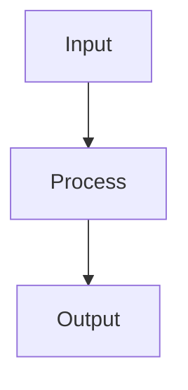
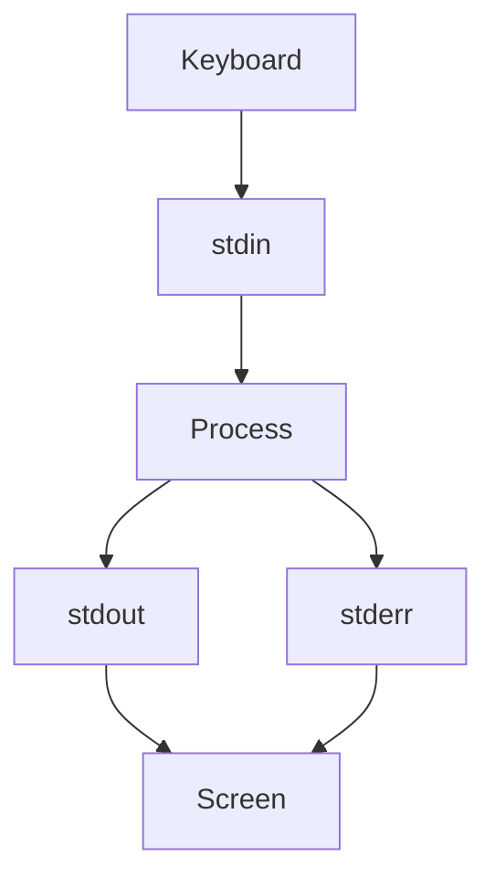
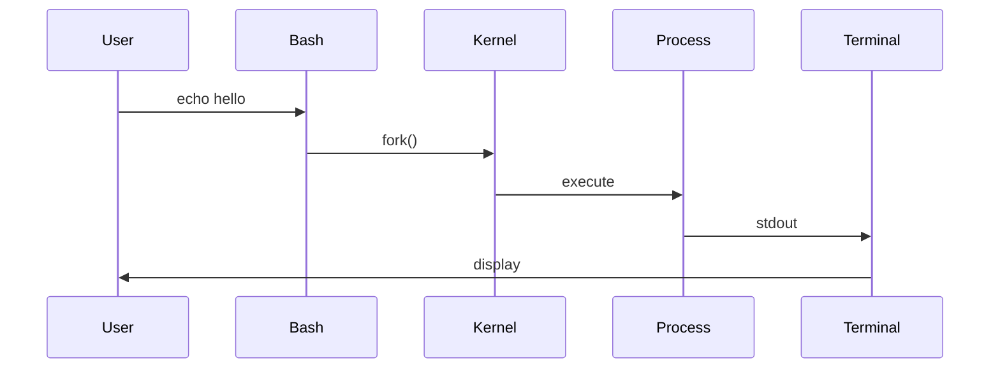

# 11 - Input Output (I/O)

---

# Where This Topic Sits In Systems Engineering

```text
Commands

↓

Input

↓

Processing

↓

Output

↓

Data Streams

↓

Processes

↓

Pipes

↓

Networks

↓

Distributed Systems
```

If there is one Linux philosophy you should remember forever, it is this:

```text
Everything is data flowing through systems.
```

Linux is a giant data movement engine.

---

# Why Engineers Care About I/O

Every system in the world performs the same three steps.

```text
Receive Data

↓

Process Data

↓

Produce Data
```

Examples:

Browser:

```text
Request

↓

Server

↓

Response
```

Database:

```text
Query

↓

Processing

↓

Result
```

Docker:

```text
Configuration

↓

Container

↓

Logs
```

Human Brain:

```text
Input

↓

Thinking

↓

Output
```

Everything is I/O.

---

# Learning Objectives

After completing this file, you should understand:

✅ Why I/O exists

✅ Standard Input

✅ Standard Output

✅ Standard Error

✅ File Descriptors

✅ Data Streams

✅ Input Commands

✅ Output Commands

✅ Interactive Input

✅ Production Logging

✅ Modern Infrastructure Connections

---

# Introduction

Most Bash tutorials teach:

```bash
echo

read

>

>>

<
```

and stop.

This is wrong.

I/O is much bigger.

Linux itself is built around I/O.

Everything is a stream of information.

---

# First Principles Thinking

Every system follows this pattern.

```text
Input

↓

Transform

↓

Output
```

This is true for:

```text
Humans

↓

Programs

↓

Servers

↓

Networks

↓

Containers

↓

Cloud
```

Everything follows this pattern.

---

# Mental Model: Water Pipeline System

Imagine a city.

```text
Water Source

↓

Pipe

↓

Treatment Plant

↓

Pipe

↓

House
```

Linux works the same way.

```text
Input

↓

Process

↓

Output
```

---

# What Is Input?

Input is incoming information.

Examples:

```text
Keyboard

Files

User Data

Network Requests

APIs

Databases
```

---

# What Is Output?

Output is produced information.

Examples:

```text
Screen

Files

Logs

API Responses

Network Packets
```

---

# High Level Architecture



---

# Linux Is A Data Stream Engine

Linux programs do one thing:

```text
Receive Data

↓

Transform Data

↓

Send Data
```

Examples:

```text
cat

grep

awk

sort

uniq

sed
```

These are data transformers.

---

# The Three Standard Streams

Every Linux process automatically gets three communication channels.

```text
0

↓

stdin
```

```text
1

↓

stdout
```

```text
2

↓

stderr
```

These are called file descriptors.

---

# Visual

```text
Keyboard

↓

stdin (0)

↓

Process

↓

stdout (1)

↓

Terminal
```

Errors:

```text
Process

↓

stderr (2)

↓

Terminal
```

---

# High Level Architecture



---

# File Descriptors

Think of them as communication channels.

| Descriptor | Name | Purpose |
|-----------|------|---------|
| 0 | stdin | Input |
| 1 | stdout | Normal Output |
| 2 | stderr | Errors |

---

# Why File Descriptors Exist

Imagine thousands of programs running.

Linux needs a way to separate communication.

Without descriptors:

```text
Everything Mixed Together
```

With descriptors:

```text
Input

↓

Output

↓

Errors
```

remain organized.

---

# Standard Input (stdin)

Descriptor:

```text
0
```

Default source:

```text
Keyboard
```

---

# read Command

Used to collect input.

Example:

```bash
read name

echo "$name"
```

---

# Better Example

```bash
read -p "Enter name: " name

echo "$name"
```

---

# Multiple Inputs

```bash
read first last

echo "$first"

echo "$last"
```

---

# Standard Output (stdout)

Descriptor:

```text
1
```

Default destination:

```text
Terminal
```

---

# echo

Example:

```bash
echo "Hello Linux"
```

---

# printf

Preferred for formatting.

Example:

```bash
printf "User: %s\n" "$USER"
```

---

# Difference

echo

```text
Simple
```

printf

```text
Precise
```

---

# Standard Error (stderr)

Descriptor:

```text
2
```

Used for:

```text
Errors

Warnings

Failures
```

---

# Example

```bash
ls missingfile
```

Output:

```text
No such file
```

This comes from stderr.

---

# Visual

```text
Process

├── stdout

└── stderr
```

---

# Redirecting Streams

stdout

```bash
echo "hello" > output.txt
```

stderr

```bash
ls missing 2> errors.txt
```

Both

```bash
command > output.txt 2>&1
```

---

# Visual

```text
Command

├── stdout → output.txt

└── stderr → errors.txt
```

---

# Input Redirection

Instead of keyboard input.

Use file input.

Example:

```bash
sort < names.txt
```

---

# Visual

```text
File

↓

stdin

↓

sort

↓

stdout
```

---

# Interactive Input

Example:

```bash
read -p "Username: " username

read -sp "Password: " password
```

Options:

```text
-p Prompt

-s Silent

-r Raw Input
```

---

# Data Stream Thinking

Think of Linux as LEGO blocks.

```text
Input

↓

Command

↓

Output

↓

Another Command

↓

Output
```

This philosophy powers pipelines.

---

# Linux Internals

Suppose:

```bash
echo hello
```

Internally:

```text
Bash

↓

fork()

↓

exec()

↓

stdout

↓

Terminal
```

---

# Internal Architecture



---

# Modern World Connections

This concept powers everything.

---

# Docker

Container logs:

```text
Application

↓

stdout

↓

Docker

↓

docker logs
```

---

# Kubernetes

```text
Container

↓

stdout

↓

Kubernetes

↓

kubectl logs
```

---

# Cloud

```text
Application

↓

Logs

↓

Cloud Logging
```

---

# CI/CD

```text
Build Process

↓

stdout

↓

Log Viewer
```

---

# Production Example 1

Health Checker

```bash
check_cpu(){

echo "Healthy"

}
```

---

# Production Example 2

Interactive Backup Script

```bash
read -p "Database Name: " db

backup "$db"
```

---

# Production Example 3

Error Logging

```bash
python app.py 2> errors.log
```

---

# Production Example 4

Separate Logs

```bash
node app.js > output.log 2> error.log
```

---

# Security Considerations

Never expose secrets.

Wrong:

```bash
echo "$PASSWORD"
```

Correct:

```bash
Avoid printing secrets
```

---

# Common Mistakes

## Mistake 1

Mixing stdout and stderr.

Wrong:

```text
Everything goes everywhere
```

---

## Mistake 2

Using echo everywhere.

Prefer:

```bash
printf
```

when formatting matters.

---

## Mistake 3

Ignoring errors.

Wrong:

```bash
python app.py
```

Correct:

```bash
python app.py 2> errors.log
```

---

# Troubleshooting

## Problem

Missing output.

Check:

```bash
stdout redirection
```

---

## Problem

Missing errors.

Check:

```bash
stderr
```

---

## Problem

Program waiting forever.

Check:

```text
stdin waiting
```

---

# Production Best Practices

Always:

```text
Separate stdout and stderr

Log errors

Protect secrets

Use printf for formatting

Think in streams
```

---

# Engineering Mindset

Do not think:

```text
Input = Keyboard

Output = Screen
```

Think:

```text
Input = Any Data Source

Output = Any Data Destination
```

---

# Interview Questions

## Beginner

What is stdin?

What is stdout?

What is stderr?

---

## Intermediate

What are file descriptors?

Difference between echo and printf?

How does input redirection work?

---

## Advanced

How does Docker capture logs?

How does Kubernetes collect logs?

Why are file descriptors important?

---

# Learning Checklist

```text
☑ Understand stdin

☑ Understand stdout

☑ Understand stderr

☑ Understand file descriptors

☑ Understand redirection

☑ Understand data streams

☑ Understand production usage
```

---

# Mind Map

```text
Input Output

├── Why I/O Exists

│

├── stdin

│

├── stdout

│

├── stderr

│

├── File Descriptors

│

├── Interactive Input

│

├── Data Streams

│

├── Redirection

│

├── Logging

│

├── Docker

│

├── Kubernetes

│

├── Cloud

│

├── Security

│

└── Troubleshooting
```

---

# Golden Rules

### Rule 1

Everything is a data stream.

---

### Rule 2

Every process gets three streams.

```text
0 stdin

1 stdout

2 stderr
```

---

### Rule 3

Separate output from errors.

---

### Rule 4

Think in pipelines.

---

### Rule 5

Logs are outputs.

---

### Rule 6

Containers are data stream systems.

---

### Rule 7

Linux is fundamentally an I/O engine.

---

# First Principles Recap

```text
Input

↓

Process

↓

Output

↓

Data Streams

↓

Pipelines

↓

Systems Engineering
```

# Key Takeaway

**Functions organize logic.**

**Arrays organize data.**

**Input/Output moves data.**

Once you understand I/O deeply, Linux stops looking like commands and starts looking like a giant data movement system.
