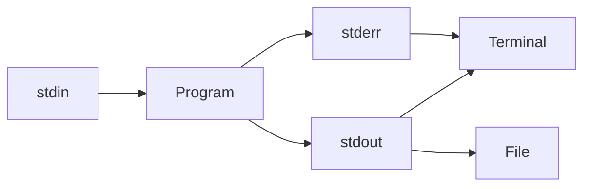
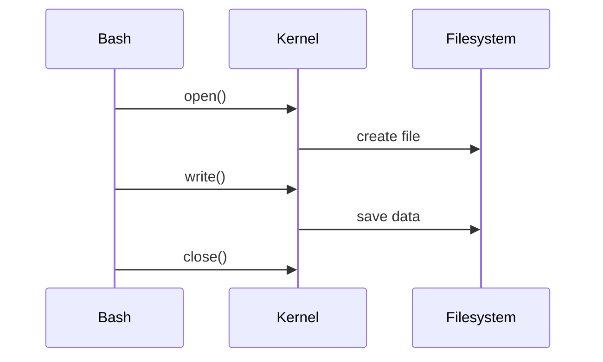

# 12 - Redirections

---

# The Journey Of Data Inside Linux

Suppose you execute:

```bash
echo "Hello"
```

Where does "Hello" go?

Answer:

```text
stdout

↓

Terminal
```

Now suppose:

```bash
echo "Hello" > file.txt
```

Where does it go now?

```text
stdout

↓

file.txt
```

This simple idea powers enormous systems.

---

# Why This Topic Exists

Imagine a world without redirections.

Every program could only communicate with the screen.

Impossible.

Modern systems need to send data everywhere.

Examples:

```text
Applications

↓

Log Files

↓

Monitoring Systems

↓

Containers

↓

Cloud Platforms
```

Redirections solve this problem.

---

# Mental Model: City Plumbing System

Imagine a city.

```text
Water Plant

↓

Pipes

↓

Homes

↓

Factories

↓

Storage Tanks
```

Linux works exactly like this.

Programs generate data.

Redirections decide where that data flows.

---

# Learning Objectives

After completing this file, you should understand:

✅ Why redirections exist

✅ File descriptors

✅ stdout redirection

✅ stdin redirection

✅ stderr redirection

✅ Append operations

✅ Combined streams

✅ /dev/null

✅ Production logging

✅ Modern infrastructure usage

---

# Introduction

Redirection is data rerouting.

Instead of sending information to default locations, we send it somewhere else.

Think:

```text
Default Route

↓

Custom Route
```

---

# The Linux Data Philosophy

Everything in Linux is a stream.

```text
Data

↓

Flows

↓

Transforms

↓

Flows Again
```

Redirection controls those flows.

---

# High Level Architecture



---

# File Descriptors Review

Every process gets three channels.

| Number | Name | Purpose |
|-------|------|---------|
| 0 | stdin | Input |
| 1 | stdout | Output |
| 2 | stderr | Errors |

---

# Visual

```text
Keyboard

↓

stdin (0)

↓

Program

↓

stdout (1)

↓

Terminal


Program

↓

stderr (2)

↓

Terminal
```

---

# Why Redirection Exists

Suppose an application generates:

```text
10000 log lines
```

Displaying everything on screen is useless.

We need storage.

```text
Program

↓

File

↓

Log Analysis

↓

Monitoring
```

---

# Output Redirection (>)

Overwrite a file.

Syntax:

```bash
command > file
```

Example:

```bash
echo "Linux" > notes.txt
```

Visual:

```text
echo

↓

stdout

↓

notes.txt
```

---

# Important Behavior

If file exists:

```text
Delete Existing Content

↓

Write New Content
```

This surprises beginners.

---

# Append Redirection (>>)

Append instead of overwrite.

Example:

```bash
echo "Linux" >> logs.txt
```

Visual:

```text
Existing File

↓

Add New Content

↓

Save
```

---

# Difference

```text
>

↓

Overwrite


>>

↓

Append
```

---

# Input Redirection (<)

Change input source.

Normally:

```text
Keyboard

↓

Program
```

With input redirection:

```text
File

↓

Program
```

Example:

```bash
sort < names.txt
```

---

# Visual

```text
names.txt

↓

stdin

↓

sort

↓

stdout
```

---

# Error Redirection (2>)

Redirect errors.

Example:

```bash
ls missing.txt 2> errors.log
```

Visual:

```text
ls

↓

stderr

↓

errors.log
```

---

# Append Errors

Example:

```bash
ls missing.txt 2>> errors.log
```

---

# Redirect stdout And stderr Together

Example:

```bash
command > output.log 2>&1
```

Meaning:

```text
stdout

↓

output.log


stderr

↓

output.log
```

---

# Visual

```text
Program

├── stdout

└── stderr

↓

Single File
```

---

# Understanding 2>&1

This confuses many engineers.

Read it slowly.

```text
2

↓

stderr


>

↓

redirect


&1

↓

same place as stdout
```

Meaning:

```text
Send stderr wherever stdout goes
```

---

# Why Order Matters

Correct:

```bash
command > output.log 2>&1
```

Wrong:

```bash
command 2>&1 > output.log
```

because redirections happen left to right.

---

# The Linux Black Hole: /dev/null

Very important.

Think:

```text
Trash Bin
```

Example:

```bash
command > /dev/null
```

Output disappears.

---

# Ignore Errors

```bash
command 2> /dev/null
```

---

# Ignore Everything

```bash
command > /dev/null 2>&1
```

---

# Visual

```text
Program

↓

/dev/null

↓

Destroyed
```

---

# Here Documents (<<)

Feed multiple lines as input.

Example:

```bash
cat << EOF

Linux

Docker

Kubernetes

EOF
```

---

# Visual

```text
Text Block

↓

stdin

↓

Program
```

---

# Here Strings (<<<)

Pass a single string.

Example:

```bash
grep linux <<< "linux fundamentals"
```

---

# Linux Internals

Suppose:

```bash
echo hello > file.txt
```

Internally:

```text
Bash

↓

open()

↓

Create File Descriptor

↓

Write Data

↓

Close Descriptor
```

---

# Internal Architecture



---

# Modern World Connections

This concept powers everything.

---

# Docker

Applications don't write logs to files anymore.

They write to stdout.

```text
Application

↓

stdout

↓

Docker Engine

↓

docker logs
```

---

# Kubernetes

```text
Container

↓

stdout

↓

Container Runtime

↓

kubectl logs
```

---

# Observability Platforms

```text
Application

↓

stdout

↓

Log Collector

↓

Elastic

↓

Grafana

↓

Dashboards
```

---

# CI/CD

```text
Build

↓

stdout

↓

Log Viewer

↓

Debugging
```

---

# Production Example 1

Separate outputs.

```bash
python app.py > app.log 2> error.log
```

---

# Production Example 2

Continuous logging.

```bash
date >> backup.log
```

---

# Production Example 3

Quiet execution.

```bash
apt update > /dev/null 2>&1
```

---

# Production Example 4

Save health checks.

```bash
ping google.com > health.log
```

---

# Security Considerations

Never log secrets.

Wrong:

```bash
echo "$DATABASE_PASSWORD"
```

Correct:

```text
Never print sensitive data.
```

---

# Common Mistakes

## Mistake 1

Using > instead of >>

This can destroy files.

---

## Mistake 2

Ignoring stderr.

Wrong:

```bash
python app.py
```

Correct:

```bash
python app.py 2> errors.log
```

---

## Mistake 3

Not understanding 2>&1.

Always think:

```text
stderr

↓

Same place as stdout
```

---

## Mistake 4

Overusing /dev/null.

You may hide important errors.

---

# Troubleshooting

## Problem

Logs disappeared.

Check:

```text
>

instead of

>>
```

---

## Problem

Missing errors.

Check:

```text
stderr redirection
```

---

## Problem

Wrong output file.

Check redirection order.

---

# Production Best Practices

Always:

```text
Separate logs

Append production logs

Protect secrets

Understand file descriptors

Use /dev/null carefully
```

---

# Engineering Mindset

Do not think:

```text
Redirection = File Saving
```

Think:

```text
Redirection = Data Routing
```

Because modern infrastructure is fundamentally data routing.

---

# Interview Questions

## Beginner

What is redirection?

Difference between > and >> ?

What is stderr?

---

## Intermediate

Explain 2>&1.

What is /dev/null?

Why does order matter?

---

## Advanced

How do Docker logs work?

How does Kubernetes capture logs?

How does Bash implement redirections internally?

---

# Learning Checklist

```text
☑ Understand file descriptors

☑ Understand stdout

☑ Understand stderr

☑ Understand stdin

☑ Understand >

☑ Understand >>

☑ Understand 2>

☑ Understand 2>&1

☑ Understand /dev/null

☑ Understand production usage
```

---

# Mind Map

```text
Redirections

├── Why Redirections Exist

│

├── File Descriptors

│

├── stdout

│

├── stdin

│

├── stderr

│

├── >

│

├── >>

│

├── 2>

│

├── 2>&1

│

├── /dev/null

│

├── Docker

│

├── Kubernetes

│

├── Observability

│

├── Security

│

└── Troubleshooting
```

---

# Golden Rules

### Rule 1

Everything is a data stream.

---

### Rule 2

Redirections are data routing systems.

---

### Rule 3

Understand file descriptors.

---

### Rule 4

Use >> for logs.

---

### Rule 5

Be careful with >.

---

### Rule 6

Use /dev/null carefully.

---

### Rule 7

Think of Linux as a giant plumbing system.

---

# First Principles Recap

```text
Generate Data

↓

Route Data

↓

Store Data

↓

Analyze Data

↓

Observe Systems
```

# Key Takeaway

**Input/Output moves data.**

**Redirections route data.**

Modern infrastructure engineering is fundamentally controlling where data flows.
