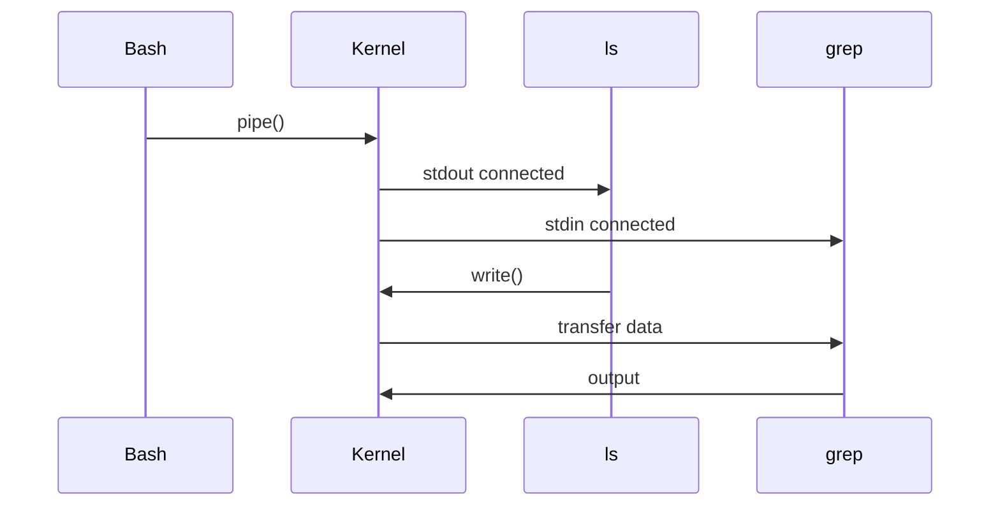
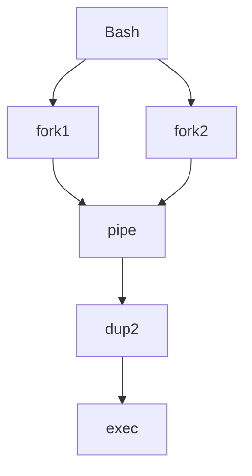

# 13 - Pipelines

---

# The Big Engineering Idea

Suppose I ask you:

How do giant systems get built?

Most people think:

```text
One Giant Program
```

Wrong.

Engineers think:

```text
Small Components

↓

Connected Together

↓

Large Systems
```

Linux introduced this philosophy decades ago.

Pipelines are one of Linux's greatest inventions.

This single idea later influenced:

```text
Microservices

↓

Containers

↓

Cloud Platforms

↓

Distributed Systems

↓

Data Engineering Pipelines
```

---

# Why This Topic Exists

Imagine a world without pipelines.

Every program would have to do everything.

```text
Read Data

↓

Filter Data

↓

Sort Data

↓

Count Data

↓

Analyze Data

↓

Display Data
```

One giant program.

This becomes impossible to maintain.

Linux solved this problem.

Linux said:

```text
Build Small Tools

↓

Connect Them Together
```

Pipelines are those connections.

---

# Learning Objectives

After completing this file, you should understand:

✅ Why pipelines exist

✅ What pipelines are

✅ How pipelines work

✅ Data streams

✅ Inter-process communication

✅ Pipeline operators

✅ Pipeline internals

✅ Error handling

✅ Production usage

✅ Modern systems connections

---

# Mental Model: Factory Assembly Line

Imagine a car factory.

Without pipelines:

```text
One Worker

↓

Build Entire Car
```

Impossible.

With pipelines:

```text
Worker 1

↓

Worker 2

↓

Worker 3

↓

Worker 4
```

Each worker performs one task.

Linux pipelines work exactly like this.

---

# First Principles Thinking

Linux philosophy:

```text
Do One Thing

↓

Do It Well

↓

Combine Everything
```

Pipelines implement this philosophy.

---

# What Is A Pipeline?

Definition:

A pipeline connects the output of one process to the input of another process.

Visual:

```text
Program A

↓

Output

↓

Program B

↓

Output

↓

Program C
```

---

# The Pipeline Operator

The symbol:

```bash
|
```

creates a pipeline.

Think:

```text
Send Data Forward
```

---

# Basic Example

```bash
ls | wc -l
```

Question:

What is happening?

Answer:

```text
ls

↓

Generate File Names

↓

wc -l

↓

Count Them
```

---

# Visual

```text
ls

↓

file1

file2

file3

↓

wc -l

↓

3
```

---

# Linux Philosophy In One Sentence

Programs should not know about each other.

Programs should only know about data.

---

# High Level Architecture


---

# Input And Output Review

Every program gets:

```text
stdin (0)

stdout (1)

stderr (2)
```

Pipelines connect:

```text
stdout

↓

stdin
```

---

# Visual

```text
Program A

↓

stdout

↓

stdin

↓

Program B
```

---

# Example 1

```bash
echo "Linux" | wc -c
```

Execution:

```text
echo

↓

Linux

↓

wc

↓

6
```

---

# Example 2

```bash
ps aux | grep nginx
```

Execution:

```text
ps

↓

List Processes

↓

grep

↓

Filter nginx
```

---

# Example 3

```bash
cat users.txt | sort
```

Execution:

```text
Read File

↓

Sort Data
```

---

# Example 4

```bash
cat users.txt | sort | uniq
```

Execution:

```text
File

↓

Sort

↓

Remove Duplicates
```

---

# Pipeline Data Flow


---

# The Unix Superpower

Imagine these tools.

```text
cat

grep

sort

uniq

head

tail

awk

sed

wc
```

Individually:

```text
Simple
```

Together:

```text
Extremely Powerful
```

---

# Thinking Like An Engineer

Don't ask:

```text
Which tool solves my problem?
```

Ask:

```text
Which small tools can I combine?
```

---

# Pipeline Internals

Suppose:

```bash
ls | grep txt
```

Internally:

Step 1

```text
Bash creates Pipe()
```

Step 2

```text
Kernel allocates memory buffer
```

Step 3

```text
ls writes data
```

Step 4

```text
grep reads data
```

Step 5

```text
Output displayed
```

---

# Internal Architecture



---

# What Is pipe() ?

Linux system call:

```c
pipe()
```

creates a communication channel.

Think:

```text
Memory Buffer

↓

Shared Between Processes
```

---

# Visual

```text
Process A

↓

Kernel Buffer

↓

Process B
```

---

# Pipe Buffer

Linux creates temporary memory.

```text
Process A

↓

Buffer

↓

Process B
```

This buffer usually has limited size.

Important concept.

Because:

```text
Slow Consumers

↓

Can Block Fast Producers
```

---

# Pipeline Parallelism

Many beginners don't know this.

Pipelines run simultaneously.

Not:

```text
Command1 Finished

↓

Command2 Starts
```

Actually:

```text
Command1 Running

↓

Command2 Running

↓

Data Flows
```

at the same time.

---

# Visual

```text
Producer

↓

Consumer

↓

Consumer
```

All active together.

---

# Error Handling Problem

Pipelines only connect:

```text
stdout

↓

stdin
```

Not:

```text
stderr
```

Example:

```bash
command | grep test
```

Errors still appear on terminal.

---

# Capturing Errors

```bash
command 2>&1 | grep test
```

Now:

```text
stderr

↓

stdout

↓

Pipeline
```

---

# Pipefail

Very important in production.

Problem:

```bash
command1 | command2 | command3
```

What if:

```text
command1 fails
```

Pipeline may still appear successful.

---

# Solution

```bash
set -o pipefail
```

Now:

```text
Any Failure

↓

Entire Pipeline Fails
```

---

# Example

```bash
set -o pipefail

cat missing.txt | grep linux
```

Now Bash detects failure.

---

# Linux Internals Deep Dive

Internally:

```text
fork()

↓

fork()

↓

pipe()

↓

dup2()

↓

exec()

↓

execute
```

---

# Internal Architecture



---

# Modern World Connection

This idea exists everywhere.

---

# Docker

```text
Application

↓

stdout

↓

Docker Engine

↓

Logs
```

---

# Kubernetes

```text
Container

↓

Logs

↓

Collectors

↓

Storage
```

---

# Microservices

```text
Service A

↓

Service B

↓

Service C
```

This is a distributed pipeline.

---

# Cloud Systems

```text
API Gateway

↓

Authentication

↓

Business Logic

↓

Database
```

Pipeline thinking.

---

# Data Engineering

```text
Raw Data

↓

Cleaning

↓

Transformation

↓

Aggregation

↓

Storage
```

Data pipelines are inspired by Linux.

---

# CI/CD

```text
Build

↓

Test

↓

Package

↓

Deploy

↓

Verify
```

This is a deployment pipeline.

---

# Production Example 1

Count active SSH connections.

```bash
ss -tunp | grep ssh | wc -l
```

---

# Production Example 2

Find largest directories.

```bash
du -h | sort -hr | head -10
```

---

# Production Example 3

Analyze logs.

```bash
cat app.log | grep ERROR | wc -l
```

---

# Production Example 4

Find duplicate IPs.

```bash
cat access.log | awk '{print $1}' | sort | uniq -c
```

---

# Security Considerations

Never trust pipeline input.

Validate data.

Wrong:

```bash
cat input | execute
```

Always sanitize data.

---

# Common Mistakes

## Mistake 1

Building giant scripts.

Wrong mindset:

```text
One Giant Tool
```

Correct:

```text
Many Small Tools
```

---

## Mistake 2

Ignoring pipefail.

Always use:

```bash
set -o pipefail
```

in production.

---

## Mistake 3

Ignoring stderr.

Remember:

```text
Pipelines

↓

stdout only
```

---

## Mistake 4

Creating unnecessarily long pipelines.

Keep them readable.

---

# Troubleshooting

## Problem

Pipeline succeeds unexpectedly.

Check:

```bash
set -o pipefail
```

---

## Problem

Missing errors.

Check:

```bash
stderr
```

---

## Problem

Slow pipeline.

Check:

```text
Large Data

↓

Slow Consumer
```

---

# Production Best Practices

Always:

```text
Build small tools

Combine tools

Use pipefail

Handle errors

Think in streams
```

---

# Engineering Mindset

Do not think:

```text
Pipelines = Command Chaining
```

Think:

```text
Pipelines = Composable Systems
```

Because composability is one of the foundations of software engineering.

---

# Interview Questions

## Beginner

What is a pipeline?

Why do pipelines exist?

What does | do?

---

## Intermediate

How do pipelines work internally?

What is pipefail?

How do pipelines use stdin and stdout?

---

## Advanced

How does Linux implement pipe()?

Why do pipelines run simultaneously?

How did Linux pipelines influence distributed systems?

---

# Learning Checklist

```text
☑ Understand pipelines

☑ Understand pipe()

☑ Understand data streams

☑ Understand stdout

☑ Understand pipefail

☑ Understand composability

☑ Understand production usage
```

---

# Mind Map

```text
Pipelines

├── Why Pipelines Exist

│

├── Data Streams

│

├── pipe()

│

├── stdin

│

├── stdout

│

├── Composability

│

├── pipefail

│

├── Production Usage

│

├── Docker

│

├── Kubernetes

│

├── Cloud

│

├── Distributed Systems

│

├── Security

│

└── Troubleshooting
```

---

# Golden Rules

### Rule 1

Build small tools.

---

### Rule 2

Connect tools together.

---

### Rule 3

Data is more important than programs.

---

### Rule 4

Use pipefail in production.

---

### Rule 5

Pipelines are composability systems.

---

### Rule 6

Think in streams.

---

### Rule 7

Linux pipelines influenced modern architecture.

---

# First Principles Recap

```text
Small Components

↓

Connected Components

↓

Composable Systems

↓

Scalable Systems

↓

Distributed Systems
```

# Key Takeaway

**Redirections route data.**

**Pipelines compose systems.**

The entire modern software world is built upon composability.
