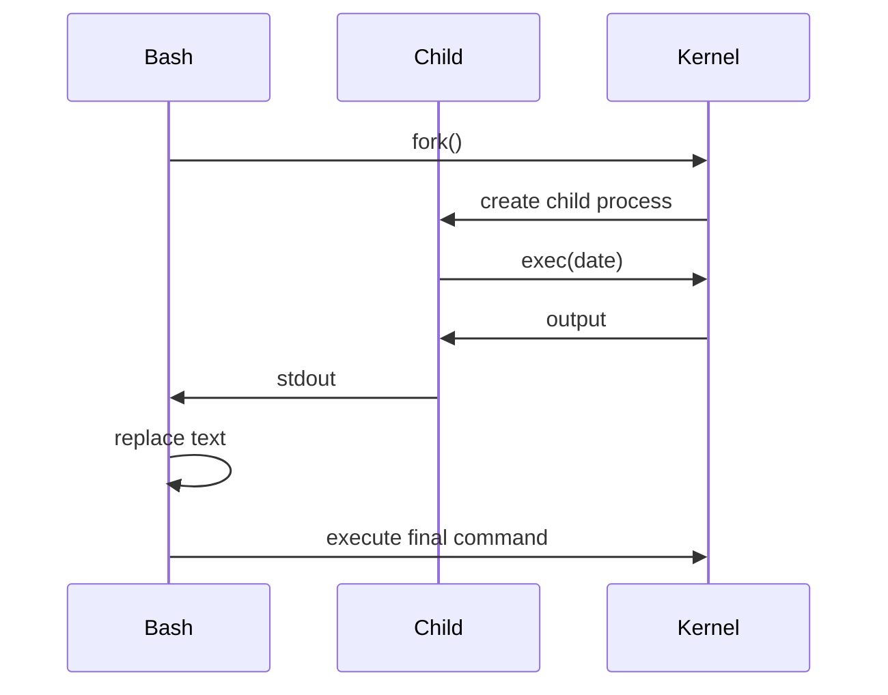

# 14 - Command Substitution

---

# The Big Engineering Idea

Imagine two worlds.

Static world:

```bash
username="vip"

today="Monday"

ip="10.0.0.1"
```

Everything is manually written.

Dynamic world:

```bash
username=$(whoami)

today=$(date)

ip=$(hostname -I)
```

Information is collected automatically.

Command substitution transforms systems from static to adaptive.

---

# Why This Topic Exists

Computers constantly change.

Examples:

```text
Current User

Current Time

CPU Usage

Memory Usage

Disk Usage

Network State

Running Processes
```

Hardcoding these values is impossible.

Systems need a way to ask Linux questions.

Command substitution solves this problem.

---

# Learning Objectives

After completing this file, you should understand:

✅ Why command substitution exists

✅ How command substitution works

✅ Modern syntax

✅ Legacy syntax

✅ Nested substitution

✅ Execution flow

✅ Runtime data collection

✅ Production usage

✅ Modern infrastructure connections

---

# Mental Model: Asking Linux Questions

Imagine Linux is a giant library.

You ask:

```text
Who is logged in?

↓

What time is it?

↓

How much memory is available?

↓

What is my IP address?
```

Linux responds.

Command substitution inserts those answers into your script.

---

# First Principles Thinking

Static systems are fragile.

Dynamic systems adapt.

Without command substitution:

```text
Static Data

↓

Static Systems
```

With command substitution:

```text
Runtime Data

↓

Adaptive Systems
```

---

# What Is Command Substitution?

Definition:

Command substitution executes a command and replaces it with its output.

Think:

```text
Execute

↓

Capture Output

↓

Replace Command

↓

Continue Execution
```

---

# Basic Syntax

Modern syntax:

```bash
$(command)
```

Example:

```bash
echo $(date)
```

---

# Visual

```text
date

↓

Execute

↓

Sun Jun 21

↓

Replace

↓

echo Sun Jun 21
```

---

# High Level Architecture


---

# Example 1

```bash
echo $(whoami)
```

Execution:

```text
whoami

↓

vip

↓

echo vip
```

Output:

```text
vip
```

---

# Example 2

```bash
echo $(pwd)
```

Execution:

```text
pwd

↓

/home/vip

↓

echo /home/vip
```

---

# Example 3

```bash
echo $(hostname)
```

---

# Storing Dynamic Data

Example:

```bash
today=$(date)

echo "$today"
```

Visual:

```text
date

↓

Output

↓

Variable

↓

Reuse
```

---

# Why Variables + Command Substitution Are Powerful

Think:

```text
Linux State

↓

Collect

↓

Store

↓

Reuse
```

This is the foundation of automation.

---

# Nested Example

```bash
backup_file="backup-$(date +%F).tar.gz"
```

Output:

```text
backup-2026-06-20.tar.gz
```

---

# Nested Inside Strings

Example:

```bash
echo "Current user: $(whoami)"
```

Execution:

```text
whoami

↓

vip

↓

Current user: vip
```

---

# Multiple Command Substitutions

Example:

```bash
echo "$(whoami) $(hostname)"
```

Execution:

```text
whoami

↓

vip


hostname

↓

server01


Combine
```

Output:

```text
vip server01
```

---

# Nested Command Substitution

Possible.

Example:

```bash
echo $(basename $(pwd))
```

Execution:

```text
pwd

↓

/home/vip/linux

↓

basename

↓

linux
```

---

# Visual

```text
pwd

↓

Output

↓

basename

↓

Output
```

---

# Legacy Syntax

Old style:

```bash
`date`
```

Avoid using this.

Problems:

```text
Hard To Read

Hard To Nest

Hard To Debug
```

Always prefer:

```bash
$(command)
```

---

# Why $( ) Is Better

Bad:

```bash
echo `date`
```

Good:

```bash
echo $(date)
```

---

# Quoting Is Extremely Important

Wrong:

```bash
echo $(cat names.txt)
```

May cause word splitting.

Better:

```bash
echo "$(cat names.txt)"
```

---

# Command Substitution And Expansion

Remember:

Bash executes expansions first.

Pipeline:

```text
Input

↓

Expansion

↓

Command Substitution

↓

Word Splitting

↓

Execution
```

---

# Linux Internals

Suppose:

```bash
echo $(date)
```

Internally:

```text
Bash

↓

fork()

↓

exec()

↓

Capture stdout

↓

Replace Text

↓

Execute Parent Command
```

---

# Internal Architecture



---

# Visualizing The Transformation

Input:

```bash
echo $(date)
```

Bash sees:

```text
echo

↓

$(date)
```

Transforms to:

```bash
echo Sun Jun 20
```

Then executes.

---

# Runtime Information Collection

Examples:

Current User:

```bash
$(whoami)
```

Current Directory:

```bash
$(pwd)
```

Current Date:

```bash
$(date)
```

IP Address:

```bash
$(hostname -I)
```

CPU Architecture:

```bash
$(uname -m)
```

---

# Production Example 1

Create timestamped backups.

```bash
backup_name="backup-$(date +%F).tar.gz"
```

---

# Production Example 2

Dynamic logs.

```bash
log_file="app-$(date +%H).log"
```

---

# Production Example 3

Dynamic host information.

```bash
echo "Running on $(hostname)"
```

---

# Production Example 4

Health Reports.

```bash
report="$(uptime)"

echo "$report"
```

---

# Docker Connection

Entrypoint scripts.

Example:

```bash
export HOST_IP=$(hostname -I)
```

Containers use runtime information.

---

# Kubernetes Connection

Startup scripts gather information dynamically.

```text
Pod

↓

Runtime Info

↓

Configuration
```

---

# Cloud Connection

Cloud systems constantly gather runtime data.

```text
Machine

↓

Metadata

↓

Configure System
```

---

# CI/CD Connection

Pipelines generate dynamic values.

Example:

```bash
BUILD_ID=$(date +%s)
```

---

# Dynamic Infrastructure Thinking

Old thinking:

```text
Hardcode Everything
```

Modern thinking:

```text
Ask System

↓

Collect Data

↓

Configure Dynamically
```

---

# Security Considerations

Never execute untrusted input.

Dangerous:

```bash
echo $(user_input)
```

Never do this.

---

# Common Mistakes

## Mistake 1

Using backticks.

Wrong:

```bash
`date`
```

Correct:

```bash
$(date)
```

---

## Mistake 2

Ignoring quotes.

Wrong:

```bash
echo $(cat file.txt)
```

Correct:

```bash
echo "$(cat file.txt)"
```

---

## Mistake 3

Overusing command substitution.

Bad:

```bash
echo $(echo $(echo hello))
```

Keep it simple.

---

## Mistake 4

Using command substitution inside loops unnecessarily.

This can be slow.

---

# Performance Considerations

Expensive:

```bash
for i in {1..1000}
do

echo $(date)

done
```

This executes:

```text
1000 Processes
```

Be careful.

---

# Troubleshooting

## Problem

Unexpected spaces.

Check:

```bash
Quotes
```

---

## Problem

Wrong output.

Check:

```bash
Run command separately
```

---

## Problem

Slow script.

Check:

```text
Too many substitutions
```

---

# Production Best Practices

Always:

```text
Use $( )

Quote outputs

Keep substitutions simple

Avoid unnecessary nesting

Cache expensive commands
```

---

# Engineering Mindset

Do not think:

```text
Command Substitution = Short Syntax
```

Think:

```text
Command Substitution = Runtime Data Collection
```

Because modern systems are built around runtime information.

---

# Interview Questions

## Beginner

What is command substitution?

Why does it exist?

Why is $( ) preferred?

---

## Intermediate

How does Bash execute command substitution?

Why should we quote outputs?

What is nested substitution?

---

## Advanced

How does command substitution use fork() and exec()?

Why can excessive command substitution hurt performance?

How is this concept used in cloud systems?

---

# Learning Checklist

```text
☑ Understand command substitution

☑ Use $( )

☑ Avoid backticks

☑ Quote outputs

☑ Build dynamic systems

☑ Understand internals

☑ Understand production usage
```

---

# Mind Map

```text
Command Substitution

├── Why It Exists

│

├── Runtime Data

│

├── $( )

│

├── Nested Substitution

│

├── Variable Integration

│

├── Internals

│

├── Performance

│

├── Production Usage

│

├── Docker

│

├── Kubernetes

│

├── Cloud

│

├── CI/CD

│

├── Security

│

└── Troubleshooting
```

---

# Golden Rules

### Rule 1

Use $( ) instead of backticks.

---

### Rule 2

Always quote outputs.

---

### Rule 3

Think in runtime data.

---

### Rule 4

Avoid excessive nesting.

---

### Rule 5

Cache expensive commands.

---

### Rule 6

Never execute untrusted input.

---

### Rule 7

Build adaptive systems, not static systems.

---

# First Principles Recap

```text
Ask Linux

↓

Collect Information

↓

Store Information

↓

Use Information

↓

Automate Systems
```

# Key Takeaway

**Pipelines connect systems.**

**Command substitution allows systems to understand themselves.**

This is one of the foundations of dynamic infrastructure engineering.
