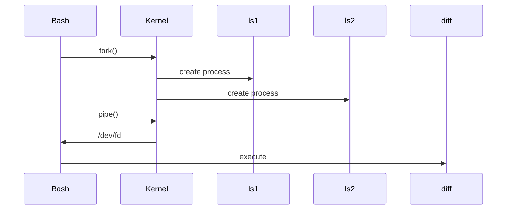

# 15 - Process Substitution

---

# The Big Engineering Idea

Imagine I ask you:

Can a running process pretend to be a file?

Most people would say:

```text
Impossible
```

Linux says:

```text
Yes.
```

This is process substitution.

One of Linux's superpowers.

Linux can make a process appear as a temporary file.

This idea is extremely powerful.

---

# Why This Topic Exists

Many Linux programs expect files.

Examples:

```text
diff

comm

vim

sort

join

paste
```

But modern systems often generate data dynamically.

Problem:

```text
Program

↓

Generates Data

↓

Another Program Needs File

↓

No Actual File Exists
```

Process substitution solves this.

---

# Learning Objectives

After completing this file, you should understand:

✅ Why process substitution exists

✅ How it works

✅ Input process substitution

✅ Output process substitution

✅ Named pipes

✅ /dev/fd

✅ Linux internals

✅ Production usage

✅ Modern systems connections

---

# Mental Model: Temporary Virtual Files

Imagine this.

Normally:

```text
File

↓

Program
```

With process substitution:

```text
Running Process

↓

Pretend To Be File

↓

Program
```

Think:

```text
Virtual File
```

---

# First Principles Thinking

Programs often require files.

But files are expensive.

```text
Create File

↓

Write Data

↓

Read File

↓

Delete File
```

Many unnecessary steps.

Linux optimizes this.

---

# Traditional Workflow

Without process substitution:

```text
Command

↓

Temporary File

↓

Another Command
```

Visual:

```text
ls dir1

↓

output1.txt

↓

diff

↓

output2.txt

↓

delete files
```

This is inefficient.

---

# Better Workflow

With process substitution:

```text
Command

↓

Virtual File

↓

Program
```

No temporary files needed.

---

# What Is Process Substitution?

Definition:

Process substitution allows the output or input of a process to appear as a file.

Think:

```text
Process

↓

Virtual File

↓

Another Process
```

---

# Syntax

Input process substitution:

```bash
<(command)
```

Output process substitution:

```bash
>(command)
```

---

# High Level Architecture


---

# Understanding <()

Think:

```text
Run Command

↓

Create Temporary Pipe

↓

Expose As File

↓

Pass To Program
```

---

# Example 1

```bash
diff <(ls dir1) <(ls dir2)
```

Execution:

```text
ls dir1

↓

Virtual File A


ls dir2

↓

Virtual File B


diff

↓

Compare
```

---

# Visual

```text
dir1

↓

ls

↓

Virtual File


dir2

↓

ls

↓

Virtual File


diff
```

---

# Example 2

```bash
comm <(sort a.txt) <(sort b.txt)
```

Execution:

```text
a.txt

↓

sort

↓

Virtual File A


b.txt

↓

sort

↓

Virtual File B


comm
```

---

# Example 3

```bash
cat <(date)
```

Execution:

```text
date

↓

Virtual File

↓

cat
```

---

# What Does Linux Actually Create?

Try:

```bash
echo <(date)
```

Output:

```text
/dev/fd/63
```

or

```text
/proc/self/fd/63
```

depending on Linux.

Interesting.

This looks like a file.

But it isn't a regular file.

It is a file descriptor.

---

# Visual

```text
date

↓

Pipe

↓

File Descriptor

↓

/dev/fd/63

↓

cat
```

---

# Input Process Substitution Deep Dive

Syntax:

```bash
<(command)
```

Purpose:

```text
Convert Output

↓

Into File
```

---

# Output Process Substitution

Syntax:

```bash
>(command)
```

Purpose:

```text
Convert Input

↓

Into Another Process
```

---

# Example

```bash
echo "Linux" > >(cat)
```

Execution:

```text
echo

↓

Virtual Pipe

↓

cat
```

Output:

```text
Linux
```

---

# Example

```bash
echo "Hello" | tee >(wc -c)
```

Execution:

```text
echo

↓

tee

↓

stdout

↓

wc
```

---

# Visual

```text
Input

↓

tee

├── Screen

└── wc
```

---

# Process Substitution vs Pipelines

Pipelines:

```text
stdout

↓

stdin
```

Linear.

Process substitution:

```text
stdout

↓

Virtual File

↓

Any Program
```

Flexible.

---

# Comparison

| Feature | Pipeline | Process Substitution |
|---------|----------|---------------------|
| Data Stream | Yes | Yes |
| Creates Virtual File | No | Yes |
| Multiple Inputs | Limited | Excellent |
| Flexible | Medium | High |

---

# Linux Internals

Suppose:

```bash
diff <(ls dir1) <(ls dir2)
```

Internally:

Step 1

```text
fork()
```

Create child process.

Step 2

```text
pipe()
```

Create communication channel.

Step 3

```text
dup2()
```

Connect file descriptors.

Step 4

```text
Expose /dev/fd/*
```

Step 5

```text
diff executes
```

---

# Internal Architecture



---

# Named Pipes Relationship

Process substitution often uses:

```text
FIFO

↓

Named Pipes

↓

File Descriptors
```

under the hood.

Not always.

Depends on the shell and system.

---

# Visual

```text
Process

↓

Pipe

↓

File Descriptor

↓

Program
```

---

# Production Example 1

Compare Kubernetes pods.

```bash
diff <(kubectl get pods -A) <(kubectl get pods -A)
```

---

# Production Example 2

Compare environments.

```bash
diff <(env | sort) <(ssh server env | sort)
```

---

# Production Example 3

Compare package installations.

```bash
diff <(apt list --installed) <(ssh server apt list --installed)
```

---

# Production Example 4

Monitor multiple logs.

```bash
diff <(tail log1) <(tail log2)
```

---

# Docker Connection

Container outputs become streams.

```text
Container

↓

stdout

↓

Collectors
```

Virtualization mindset.

---

# Kubernetes Connection

Logs are virtual streams.

```text
Pod

↓

Container Runtime

↓

Streams

↓

Observability
```

---

# Cloud Connection

Cloud systems virtualize everything.

```text
Storage

↓

Networks

↓

Processes

↓

Resources
```

Process substitution teaches this mindset early.

---

# Observability Connection

Modern observability systems work similarly.

```text
Service

↓

Metrics

↓

Collectors

↓

Dashboards
```

Dynamic streams.

---

# Performance Considerations

Avoid this:

```bash
diff file1 file2
```

when files already exist.

Use process substitution only when data is dynamic.

---

# Security Considerations

Never execute untrusted commands.

Dangerous:

```bash
<(user_input)
```

Always validate input.

---

# Common Mistakes

## Mistake 1

Confusing with command substitution.

Wrong:

```text
$( )

↓

Virtual File
```

No.

Correct:

```text
$( )

↓

Text Replacement


<( )

↓

Virtual File
```

---

## Mistake 2

Using it when files already exist.

Unnecessary complexity.

---

## Mistake 3

Thinking it is Bash only.

It is Linux concepts plus Bash features.

---

## Mistake 4

Overengineering scripts.

Keep solutions simple.

---

# Troubleshooting

## Problem

Syntax error.

Check:

```bash
<(command)
```

Requires Bash.

---

## Problem

Not working in sh.

Cause:

```text
Shell limitation
```

Verify:

```bash
echo $SHELL
```

---

## Problem

Unexpected /dev/fd paths.

Normal behavior.

---

# Production Best Practices

Always:

```text
Use for dynamic data

Avoid temporary files

Keep commands readable

Validate inputs

Prefer simplicity
```

---

# Engineering Mindset

Do not think:

```text
Process Substitution = Weird Bash Syntax
```

Think:

```text
Process Substitution = Resource Virtualization
```

Because Linux engineers constantly virtualize resources.

---

# Interview Questions

## Beginner

What is process substitution?

Why does it exist?

Difference from command substitution?

---

## Intermediate

Difference from pipelines?

What is /dev/fd ?

How does Bash implement it?

---

## Advanced

How do pipe(), fork(), and dup2() work together?

Why is process substitution considered virtualization?

How does this mindset connect to cloud systems?

---

# Learning Checklist

```text
☑ Understand <()

☑ Understand >()

☑ Understand virtual files

☑ Understand /dev/fd

☑ Understand Linux internals

☑ Understand production usage

☑ Understand virtualization concepts
```

---

# Mind Map

```text
Process Substitution

├── Why It Exists

│

├── <()

│

├── >()

│

├── Virtual Files

│

├── /dev/fd

│

├── Named Pipes

│

├── Linux Internals

│

├── Production Usage

│

├── Docker

│

├── Kubernetes

│

├── Cloud

│

├── Observability

│

├── Security

│

└── Troubleshooting
```

---

# Golden Rules

### Rule 1

Use process substitution for dynamic data.

---

### Rule 2

Do not create unnecessary temporary files.

---

### Rule 3

Remember:

```text
Pipelines

↓

Linear


Process Substitution

↓

Virtual Files
```

---

### Rule 4

Use when programs require files.

---

### Rule 5

Keep solutions simple.

---

### Rule 6

Understand /dev/fd.

---

### Rule 7

Think in virtualization.

---

# First Principles Recap

```text
Dynamic Data

↓

Virtual Resources

↓

Composable Systems

↓

Modern Infrastructure
```

# Key Takeaway

**Command substitution makes systems dynamic.**

**Process substitution makes processes virtual.**

This is one of the first places where Bash starts teaching cloud engineering principles.
