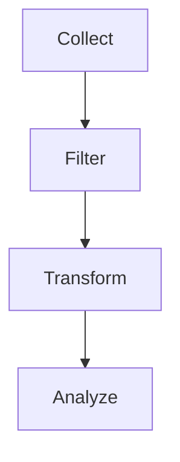
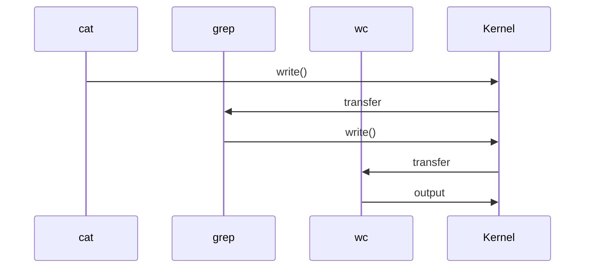

# 16 - Text Processing Overview

---

# The Big Engineering Idea

Imagine I ask you:

What do modern systems actually do?

Most beginners answer:

```text
Run Programs
```

Wrong.

Modern systems mostly do this:

```text
Generate Data

↓

Move Data

↓

Transform Data

↓

Analyze Data

↓

Store Data
```

In simple words:

```text
Modern Systems = Data Processing Systems
```

Linux understood this long before cloud computing existed.

This is why Linux text processing tools are so powerful.

---

# Why This Topic Exists

Every system generates data.

Examples:

Applications:

```text
Requests

↓

Responses

↓

Logs
```

Databases:

```text
Queries

↓

Results
```

Servers:

```text
CPU

↓

Memory

↓

Network

↓

Disk
```

Cloud:

```text
Events

↓

Metrics

↓

Logs
```

Linux needed a way to process all this information.

Text processing solves this problem.

---

# Learning Objectives

After completing this file, you should understand:

✅ Why text processing exists

✅ Linux data philosophy

✅ Structured vs unstructured data

✅ Text processing pipelines

✅ Core text processing tools

✅ Production usage

✅ Observability connections

✅ Modern infrastructure connections

---

# Mental Model: Water Treatment Plant

Imagine a city.

Raw water enters.

```text
Dirty Water

↓

Filter

↓

Clean

↓

Store

↓

Distribute
```

Linux works the same way.

```text
Raw Data

↓

Transform

↓

Analyze

↓

Store

↓

Use
```

Text processing is data treatment.

---

# First Principles Thinking

Everything eventually becomes data.

Examples:

Browser:

```text
Click

↓

Request

↓

Text
```

Database:

```text
Query

↓

Result

↓

Text
```

Server:

```text
Metrics

↓

Text
```

Containers:

```text
Logs

↓

Text
```

Everything becomes text.

---

# The Linux Data Philosophy

Linux believes:

```text
Everything Is A Stream
```

Data continuously flows.

```text
Input

↓

Transform

↓

Output
```

This idea powers Linux.

---

# The Data Journey


---

# What Is Text Processing?

Definition:

Text processing is the manipulation and transformation of textual data.

Think:

```text
Raw Data

↓

Useful Data
```

---

# The Four Stages Of Data Processing

Every system does these four things.

```text
Collect

↓

Filter

↓

Transform

↓

Analyze
```

---

# Stage 1: Collect Data

Examples:

```bash
ps aux

cat app.log

docker logs app

kubectl logs pod
```

---

# Stage 2: Filter Data

Examples:

```bash
grep ERROR

grep nginx

grep user
```

Purpose:

```text
Find Relevant Data
```

---

# Stage 3: Transform Data

Examples:

```bash
awk

sed

cut

tr
```

Purpose:

```text
Reshape Data
```

---

# Stage 4: Analyze Data

Examples:

```bash
sort

uniq

wc
```

Purpose:

```text
Generate Insights
```

---

# High Level Architecture



---

# The Core Linux Text Processing Ecosystem

```text
Text Processing

├── grep

├── sed

├── awk

├── cut

├── sort

├── uniq

├── tr

├── paste

├── join

├── xargs

└── wc
```

Each tool has one responsibility.

---

# Why Linux Uses Many Small Tools

Linux philosophy:

```text
Do One Thing

↓

Do It Well

↓

Combine Everything
```

Examples:

grep:

```text
Find Data
```

sed:

```text
Edit Data
```

awk:

```text
Analyze Data
```

sort:

```text
Order Data
```

uniq:

```text
Remove Duplicates
```

xargs:

```text
Convert Data To Commands
```

---

# Visual

```text
Data

↓

grep

↓

sort

↓

uniq

↓

awk

↓

Result
```

---

# Structured vs Unstructured Data

Unstructured:

```text
Hello world

Server down

Error occurred
```

Structured:

```text
timestamp,user,status

10:00,vip,success

10:01,john,failed
```

Structured data is easier to process.

---

# Data Formats Engineers See Everyday

Logs:

```text
2026-06-20 INFO Server started
```

CSV:

```text
name,age,city
```

JSON:

```json
{
 "user":"vip"
}
```

YAML:

```yaml
user: vip
```

Environment Variables:

```text
APP_PORT=3000
```

Everything is text.

---

# Thinking Like Data Engineers

Stop thinking:

```text
Commands
```

Start thinking:

```text
Data Sources
```

Example:

```text
Application Logs

↓

Filter Errors

↓

Count Failures

↓

Create Dashboard
```

---

# Real World Pipeline Example

Suppose:

```text
Find top 10 IP addresses.
```

Pipeline:

```bash
cat access.log \
| awk '{print $1}' \
| sort \
| uniq -c \
| sort -nr \
| head
```

---

# Visual

```text
Logs

↓

Extract IP

↓

Sort

↓

Count

↓

Rank

↓

Top 10
```

---

# Linux Internals

Suppose:

```bash
cat app.log | grep ERROR | wc -l
```

Internally:

```text
fork()

↓

pipe()

↓

exec()

↓

transfer data

↓

count
```

---

# Internal Architecture



---

# Why Text Processing Is Extremely Important

Because every engineering discipline uses it.

Backend:

```text
Logs

↓

Analytics
```

DevOps:

```text
Metrics

↓

Alerts
```

Security:

```text
Logs

↓

Threat Detection
```

Cloud:

```text
Events

↓

Monitoring
```

AI:

```text
Datasets

↓

Training
```

Observability:

```text
Logs

↓

Metrics

↓

Traces
```

Everything eventually becomes text processing.

---

# Docker Connection

Containers generate logs.

```text
Container

↓

stdout

↓

Docker Engine

↓

Logs
```

---

# Kubernetes Connection

```text
Pod

↓

Container

↓

Logs

↓

Collectors
```

---

# Cloud Connection

```text
Cloud Events

↓

Transform

↓

Storage

↓

Dashboards
```

---

# Observability Connection

Observability is giant-scale text processing.

```text
Services

↓

Logs

↓

Metrics

↓

Collectors

↓

Dashboards
```

---

# Data Engineering Connection

This same idea powers:

```text
Kafka

↓

Spark

↓

Flink

↓

Airflow
```

Linux text processing is their ancestor.

---

# Security Connection

SIEM systems work similarly.

```text
Logs

↓

Filter

↓

Analyze

↓

Alert
```

---

# Production Example 1

Count nginx errors.

```bash
grep ERROR nginx.log | wc -l
```

---

# Production Example 2

Find top users.

```bash
awk '{print $1}' access.log \
| sort \
| uniq -c
```

---

# Production Example 3

Monitor failed SSH logins.

```bash
grep "Failed password" auth.log
```

---

# Production Example 4

Find high memory processes.

```bash
ps aux | sort -nrk4 | head
```

---

# Modern World Evolution

Linux Text Processing evolved into:

```text
grep

↓

Logstash

↓

Kafka

↓

Spark

↓

Streaming Platforms
```

The ideas stayed the same.

Only scale changed.

---

# Security Considerations

Never trust input data.

Always sanitize.

Avoid:

```bash
cat input | execute
```

Validate first.

---

# Common Mistakes

## Mistake 1

Memorizing commands.

Wrong mindset:

```text
Tool Memorization
```

Correct mindset:

```text
Data Transformation
```

---

## Mistake 2

Using one giant script.

Wrong.

Compose small tools.

---

## Mistake 3

Ignoring pipelines.

Pipelines are the superpower.

---

## Mistake 4

Ignoring data formats.

Understand your input first.

---

# Troubleshooting

## Problem

Unexpected output.

Check:

```text
Input Data Format
```

---

## Problem

Pipeline too slow.

Check:

```text
Data Size
```

---

## Problem

Wrong analysis.

Check:

```text
Transformation Order
```

---

# Production Best Practices

Always:

```text
Understand your data

Filter early

Transform carefully

Analyze last

Keep pipelines readable
```

---

# Engineering Mindset

Do not think:

```text
Text Processing = Linux Commands
```

Think:

```text
Text Processing = Data Engineering
```

Because modern infrastructure is fundamentally data processing at scale.

---

# Interview Questions

## Beginner

What is text processing?

Why does Linux use many small tools?

What are common text processing commands?

---

## Intermediate

Explain Linux's data philosophy.

Why are pipelines important?

What is structured data?

---

## Advanced

How did Linux text processing influence big data systems?

Why are observability systems giant text processors?

How do modern cloud platforms process logs?

---

# Learning Checklist

```text
☑ Understand text processing

☑ Understand Linux data philosophy

☑ Understand structured data

☑ Understand transformation pipelines

☑ Understand production usage

☑ Understand observability

☑ Understand modern systems
```

---

# Mind Map

```text
Text Processing

├── Why It Exists

│

├── Data Collection

│

├── Filtering

│

├── Transformation

│

├── Analysis

│

├── Pipelines

│

├── Logs

│

├── Metrics

│

├── Observability

│

├── Cloud

│

├── Data Engineering

│

├── Security

│

└── Troubleshooting
```

---

# Golden Rules

### Rule 1

Everything eventually becomes data.

---

### Rule 2

Data is more important than commands.

---

### Rule 3

Think in pipelines.

---

### Rule 4

Filter early.

---

### Rule 5

Transform carefully.

---

### Rule 6

Analyze last.

---

### Rule 7

Linux text processing is the ancestor of modern data engineering.

---

# First Principles Recap

```text
Generate Data

↓

Collect Data

↓

Filter Data

↓

Transform Data

↓

Analyze Data

↓

Create Insights

↓

Build Systems
```

# Key Takeaway

**Redirections route data.**

**Pipelines compose systems.**

**Command substitution creates dynamic systems.**

**Process substitution creates virtual systems.**

**Text processing transforms data into knowledge.**
