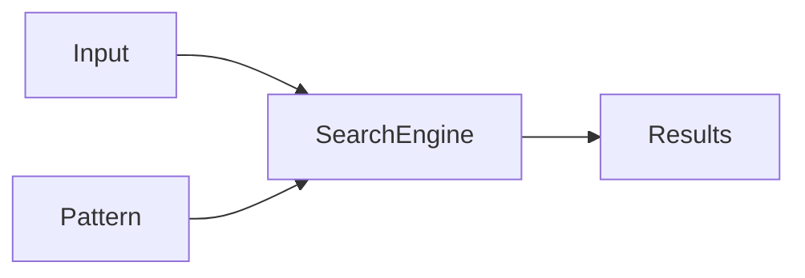
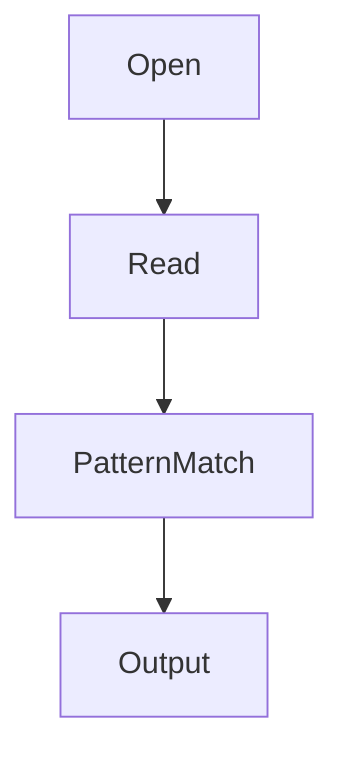

# 17 - grep

---

# The Big Engineering Idea

Imagine a system generating:

```text
100 logs

↓

1000 logs

↓

10000 logs

↓

100000 logs

↓

1000000 logs
```

How will humans find useful information?

Impossible.

Linux solved this problem decades ago.

The solution:

```text
Search

↓

Filter

↓

Find Signals

↓

Ignore Noise
```

That tool is grep.

---

# Why This Topic Exists

Modern systems generate enormous amounts of information.

Examples:

```text
Application Logs

Server Logs

Database Logs

Network Events

Security Events

Container Logs

Cloud Events
```

Most of this data is useless at any given moment.

Engineers need to find only the relevant information.

grep solves this problem.

---

# Learning Objectives

After completing this file, you should understand:

✅ Why grep exists

✅ How grep works

✅ Pattern matching

✅ Regular expressions

✅ Recursive searching

✅ Production debugging

✅ Log analysis

✅ Security analysis

✅ Performance considerations

✅ Modern infrastructure usage

---

# Mental Model: Search Engine For Linux

Think about Google.

```text
Billions Of Pages

↓

Search

↓

Relevant Results
```

grep does exactly this.

```text
Millions Of Lines

↓

Search

↓

Relevant Data
```

---

# First Principles Thinking

Data is useless without filtering.

Without grep:

```text
1000000 lines

↓

Read Manually

↓

Impossible
```

With grep:

```text
1000000 lines

↓

Find 10 lines

↓

Easy
```

grep is a signal extraction system.

---

# What Is grep?

Definition:

grep searches text and returns matching lines.

Think:

```text
Input Data

↓

Pattern

↓

Matching Results
```

---

# What Does grep Mean?

Historically:

```text
g

↓

global


re

↓

regular expression


p

↓

print
```

Meaning:

```text
Globally Search Regular Expression And Print Matches
```

---

# High Level Architecture



---

# Basic Syntax

```bash
grep PATTERN file
```

Example:

```bash
grep nginx app.log
```

---

# Visual

```text
app.log

↓

Search nginx

↓

Matching Lines
```

---

# Example Data

Suppose:

```text
server.log

INFO Server Started

INFO User Login

ERROR Database Down

INFO User Logout
```

Command:

```bash
grep ERROR server.log
```

Output:

```text
ERROR Database Down
```

---

# Search Multiple Files

Example:

```bash
grep ERROR app.log db.log nginx.log
```

---

# Ignore Case

Example:

```bash
grep -i linux notes.txt
```

Matches:

```text
linux

Linux

LINUX
```

---

# Count Matches

Example:

```bash
grep -c ERROR app.log
```

Output:

```text
15
```

---

# Show Line Numbers

Example:

```bash
grep -n ERROR app.log
```

Output:

```text
12:ERROR Database Down
```

---

# Invert Search

Find everything except a pattern.

Example:

```bash
grep -v INFO app.log
```

Visual:

```text
All Data

↓

Remove INFO

↓

Remaining Data
```

---

# Recursive Search

Search entire directories.

Example:

```bash
grep -r ERROR .
```

Execution:

```text
Current Directory

↓

All Files

↓

Search ERROR
```

---

# Search Only File Names

Example:

```bash
grep -l ERROR *.log
```

Output:

```text
app.log

db.log
```

---

# Search Exact Words

Example:

```bash
grep -w root users.txt
```

This avoids:

```text
administrator
```

matching unintentionally.

---

# Extended Regular Expressions

Example:

```bash
grep -E "ERROR|WARNING" app.log
```

Meaning:

```text
ERROR

or

WARNING
```

---

# Search Numbers

Example:

```bash
grep '[0-9]' file.txt
```

---

# Search Start Of Line

Example:

```bash
grep '^ERROR' app.log
```

Visual:

```text
ERROR Login

ERROR Disk

INFO User
```

Matches:

```text
ERROR Login

ERROR Disk
```

---

# Search End Of Line

Example:

```bash
grep 'failed$' app.log
```

---

# Dot Character

```bash
grep 'a.c'
```

Matches:

```text
abc

axc

a9c
```

---

# Character Classes

Search lowercase:

```bash
grep '[a-z]'
```

Uppercase:

```bash
grep '[A-Z]'
```

Digits:

```bash
grep '[0-9]'
```

---

# grep + Pipelines

This is where grep becomes powerful.

Example:

```bash
ps aux | grep nginx
```

Execution:

```text
Processes

↓

Filter nginx

↓

Result
```

---

# Visual

```text
ps aux

↓

100 Processes

↓

grep nginx

↓

2 Results
```

---

# grep + sort

```bash
grep ERROR app.log | sort
```

---

# grep + uniq

```bash
grep ERROR app.log | sort | uniq
```

---

# grep + awk

```bash
grep ERROR app.log | awk '{print $5}'
```

---

# grep + wc

```bash
grep ERROR app.log | wc -l
```

Count errors.

---

# Linux Internals

Suppose:

```bash
grep ERROR app.log
```

Internally:

```text
Open File

↓

Read Chunks

↓

Search Pattern

↓

Print Matches
```

---

# Internal Architecture



---

# Pattern Matching Internals

grep builds finite state machines.

Think:

```text
Characters

↓

States

↓

Matches
```

This makes grep extremely fast.

---

# Algorithm Overview

```text
File

↓

Character Stream

↓

Regex Engine

↓

Matches
```

---

# Why grep Is Fast

Because grep is optimized in C.

Features:

```text
Buffered Reading

↓

Optimized Algorithms

↓

Compiled Regex

↓

Minimal Memory Usage
```

---

# grep vs cat | grep

Wrong:

```bash
cat app.log | grep ERROR
```

Correct:

```bash
grep ERROR app.log
```

Why?

Because:

```text
Extra Process Created
```

This is called:

```text
UUOC

↓

Useless Use Of Cat
```

---

# Production Example 1

Find failed SSH attempts.

```bash
grep "Failed password" auth.log
```

---

# Production Example 2

Find Docker errors.

```bash
docker logs app | grep ERROR
```

---

# Production Example 3

Find Kubernetes crashes.

```bash
kubectl logs pod | grep exception
```

---

# Production Example 4

Find nginx 500 errors.

```bash
grep "500" access.log
```

---

# Production Example 5

Find memory issues.

```bash
dmesg | grep memory
```

---

# Security Connection

Security teams constantly use grep.

Examples:

```text
Failed Passwords

↓

Suspicious IPs

↓

Privilege Escalation

↓

Unauthorized Access
```

---

# SIEM Connection

Modern security systems work similarly.

```text
Logs

↓

Filter

↓

Correlate

↓

Alert
```

grep teaches these ideas.

---

# Docker Connection

Containers generate logs.

```text
Container

↓

stdout

↓

grep

↓

Insights
```

---

# Kubernetes Connection

```text
Pods

↓

Logs

↓

grep

↓

Debugging
```

---

# Cloud Connection

Cloud systems generate millions of events.

```text
Events

↓

Search

↓

Analyze
```

grep thinking still applies.

---

# Observability Connection

Observability systems are giant grep systems.

```text
Logs

↓

Filter

↓

Aggregate

↓

Dashboard
```

---

# Performance Considerations

Avoid:

```bash
grep -r /
```

Very expensive.

Limit search scope.

Good:

```bash
grep -r ERROR /var/log/nginx
```

---

# Security Considerations

Never run:

```bash
grep -r .
```

on unknown systems without understanding the size.

Sensitive files may appear.

---

# Common Mistakes

## Mistake 1

Using cat unnecessarily.

Wrong:

```bash
cat file | grep text
```

Correct:

```bash
grep text file
```

---

## Mistake 2

Ignoring case sensitivity.

Use:

```bash
-i
```

when needed.

---

## Mistake 3

Searching entire disks.

Very expensive.

---

## Mistake 4

Using grep for structured JSON.

Prefer:

```text
jq
```

for JSON.

---

# Troubleshooting

## Problem

No matches found.

Check:

```text
Case sensitivity
```

Use:

```bash
grep -i
```

---

## Problem

Too much output.

Use:

```bash
grep -n
```

or

```bash
grep -m
```

---

## Problem

Very slow search.

Reduce scope.

Avoid:

```bash
grep -r /
```

---

# Production Best Practices

Always:

```text
Filter early

Reduce search scope

Use pipelines

Avoid useless cat

Use line numbers

Understand regex
```

---

# Engineering Mindset

Do not think:

```text
grep = Search Command
```

Think:

```text
grep = Signal Extraction Engine
```

Because engineering is mostly finding useful signals inside enormous amounts of noise.

---

# Interview Questions

## Beginner

What is grep?

Why does grep exist?

Difference between grep and find?

---

## Intermediate

What is grep -r ?

What is grep -v ?

Why is grep so fast?

---

## Advanced

How does grep internally work?

What are finite state machines?

Why is grep heavily used in observability?

How did grep influence modern systems?

---

# Learning Checklist

```text
☑ Understand grep

☑ Understand pattern matching

☑ Understand regex basics

☑ Understand recursive search

☑ Understand production debugging

☑ Understand observability usage

☑ Understand Linux internals
```

---

# Mind Map

```text
grep

├── Why It Exists

│

├── Pattern Matching

│

├── Regex

│

├── Recursive Search

│

├── Pipelines

│

├── Log Analysis

│

├── Security

│

├── Docker

│

├── Kubernetes

│

├── Observability

│

├── Performance

│

├── Troubleshooting

│

└── Production Usage
```

---

# Golden Rules

### Rule 1

grep is a search engine.

---

### Rule 2

Find signals, ignore noise.

---

### Rule 3

Avoid unnecessary `cat`.

---

### Rule 4

Filter early.

---

### Rule 5

Reduce search scope.

---

### Rule 6

Learn regex gradually.

---

### Rule 7

grep thinking scales to modern systems.

---

# First Principles Recap

```text
Generate Data

↓

Search Data

↓

Filter Data

↓

Extract Signals

↓

Build Insights

↓

Build Systems
```

# Key Takeaway

**Text processing transforms data into knowledge.**

**grep transforms noise into signals.**

This is one of the most important engineering skills you'll ever learn.
