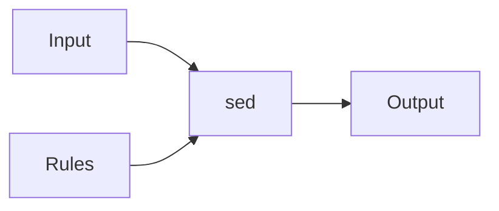
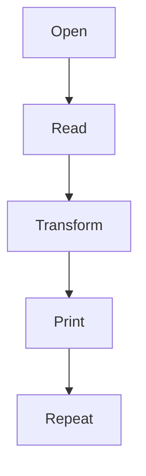

# 18 - sed (Stream Editor)

---

# The Big Engineering Idea

Imagine you have:

```text
100 lines

↓

1000 lines

↓

10000 lines

↓

100000 lines

↓

1000000 lines
```

Now imagine changing something manually.

Impossible.

Linux solved this problem decades ago.

The idea:

```text
Read Data

↓

Transform Data

↓

Output Data
```

That tool is sed.

sed is one of Linux's most powerful automation engines.

---

# Why This Topic Exists

Modern systems constantly transform information.

Examples:

```text
Update IP Addresses

↓

Replace Environment Variables

↓

Modify Configuration Files

↓

Mask Sensitive Data

↓

Transform Logs

↓

Prepare Deployments
```

Manual editing doesn't scale.

sed solves this.

---

# Learning Objectives

After completing this file, you should understand:

✅ Why sed exists

✅ Stream editing philosophy

✅ Substitutions

✅ Deletion

✅ Printing

✅ Multiple operations

✅ Regex integration

✅ Production usage

✅ Linux internals

✅ Modern infrastructure usage

---

# Mental Model: Data Conveyor Belt

Imagine a factory.

Raw products enter.

```text
Input

↓

Machine

↓

Modified Output
```

sed is that machine.

It sits in the middle of a data pipeline.

---

# First Principles Thinking

Linux systems constantly transform data.

Without sed:

```text
Read File

↓

Open Editor

↓

Modify

↓

Save

↓

Repeat
```

Very inefficient.

With sed:

```text
Data

↓

Rules

↓

Transform

↓

Output
```

---

# What Is sed?

Definition:

sed is a stream editor that reads data, transforms it, and outputs the result.

Think:

```text
Input

↓

Transformation Rules

↓

Output
```

---

# Why Is It Called Stream Editor?

Because it edits streams.

Streams can be:

```text
Files

↓

Logs

↓

Pipelines

↓

Application Output

↓

Network Data
```

---

# High Level Architecture



---

# The Linux Philosophy Behind sed

Linux philosophy:

```text
Input

↓

Transform

↓

Output
```

sed is one of Linux's transformation engines.

---

# Basic Syntax

```bash
sed 'operation' file
```

Example:

```bash
sed 's/linux/docker/' notes.txt
```

---

# Understanding s

```text
s

↓

substitute
```

Syntax:

```bash
s/old/new/
```

---

# Example

Input:

```text
I love linux
```

Command:

```bash
sed 's/linux/docker/'
```

Output:

```text
I love docker
```

---

# Visual

```text
linux

↓

docker
```

---

# First Match Only

By default:

```text
One Line

↓

First Match Only
```

Example:

Input:

```text
linux linux linux
```

Command:

```bash
sed 's/linux/docker/'
```

Output:

```text
docker linux linux
```

---

# Replace All Matches

Use:

```bash
g
```

Example:

```bash
sed 's/linux/docker/g'
```

Output:

```text
docker docker docker
```

---

# Visual

```text
linux linux linux

↓

docker docker docker
```

---

# Ignore Case

Example:

```bash
sed 's/linux/docker/I'
```

Matches:

```text
Linux

LINUX

linux
```

---

# Multiple Operations

Example:

```bash
sed -e 's/linux/docker/' -e 's/python/go/'
```

Execution:

```text
linux

↓

docker

↓

python

↓

go
```

---

# Delete Lines

Syntax:

```bash
sed 'Nd'
```

Example:

```bash
sed '2d' file.txt
```

Delete line 2.

---

# Delete Multiple Lines

Example:

```bash
sed '2,5d' file.txt
```

Delete:

```text
2

↓

5
```

---

# Print Specific Lines

Normally sed prints everything.

Use:

```bash
sed -n '2p'
```

Print line 2 only.

---

# Print Range

Example:

```bash
sed -n '5,10p'
```

---

# Search And Delete

Example:

```bash
sed '/ERROR/d'
```

Execution:

```text
Find ERROR

↓

Delete Line
```

---

# Replace Entire Line

Example:

```bash
sed '/ERROR/c CRITICAL FAILURE'
```

---

# Insert Before Line

Example:

```bash
sed '2i NEW LINE'
```

---

# Append After Line

Example:

```bash
sed '2a NEW LINE'
```

---

# Regular Expressions

sed is regex powered.

---

# Beginning Of Line

Example:

```bash
sed 's/^ERROR/WARNING/'
```

---

# End Of Line

Example:

```bash
sed 's/failed$/success/'
```

---

# Digits

Example:

```bash
sed 's/[0-9]/X/g'
```

---

# Character Classes

Replace lowercase:

```bash
sed 's/[a-z]/X/g'
```

---

# Alternative Delimiters

Sometimes:

```bash
/
```

is annoying.

Use:

```bash
sed 's|/usr/bin|/opt/bin|'
```

Cleaner.

---

# In Place Editing

Very important.

Example:

```bash
sed -i 's/8080/9090/' app.conf
```

File changes permanently.

---

# Warning About -i

Always backup important files.

Good:

```bash
sed -i.bak 's/8080/9090/' app.conf
```

Creates:

```text
app.conf

app.conf.bak
```

---

# sed With Pipelines

Example:

```bash
cat app.log | sed 's/ERROR/WARNING/'
```

---

# Better

```bash
sed 's/ERROR/WARNING/' app.log
```

Avoid useless cat.

---

# sed + grep

Example:

```bash
grep ERROR app.log | sed 's/ERROR/CRITICAL/'
```

---

# sed + awk

Example:

```bash
awk '{print $1}' app.log | sed 's/2026/2027/'
```

---

# Linux Internals

Suppose:

```bash
sed 's/linux/docker/' file.txt
```

Internally:

```text
Open File

↓

Read Line

↓

Apply Rule

↓

Output

↓

Repeat
```

---

# Internal Architecture



---

# The sed Cycle

Every line follows this loop.

```text
Read

↓

Store In Pattern Space

↓

Apply Rules

↓

Output

↓

Next Line
```

This is extremely important.

---

# Pattern Space

sed creates temporary memory.

```text
Current Line

↓

Pattern Space

↓

Transform
```

---

# Hold Space

sed also has another memory.

```text
Temporary Storage
```

Advanced sed scripts use this.

---

# Visual

```text
Input

↓

Pattern Space

↓

Rules

↓

Output
```

---

# Production Example 1

Mask IP addresses.

```bash
sed 's/[0-9]\+\.[0-9]\+\.[0-9]\+\.[0-9]\+/REDACTED/g'
```

---

# Production Example 2

Update ports.

```bash
sed -i 's/3000/8080/' app.env
```

---

# Production Example 3

Update Kubernetes manifests.

```bash
sed 's/dev/prod/'
```

---

# Production Example 4

Update Docker images.

```bash
sed 's/latest/v1.0.0/'
```

---

# Production Example 5

Mask secrets.

```bash
sed 's/password=.*/password=****/'
```

---

# Docker Connection

Containers constantly inject variables.

```text
Template

↓

sed

↓

Container Config
```

---

# Kubernetes Connection

Manifest generation.

```text
Template

↓

sed

↓

Deployment
```

---

# Cloud Connection

Cloud infrastructure transforms configurations.

```text
Environment

↓

Transform

↓

Provision
```

---

# CI/CD Connection

Pipelines constantly replace variables.

```text
Template

↓

Build Variables

↓

Deployment
```

---

# Infrastructure As Code Connection

Many systems use templating engines inspired by this idea.

```text
Terraform

Helm

Ansible

CloudFormation
```

---

# Performance Considerations

sed is extremely fast.

Why?

Because:

```text
Streaming

↓

Line By Line

↓

Low Memory
```

---

# Security Considerations

Never blindly run:

```bash
sed -i
```

on production systems.

Always create backups.

---

# Common Mistakes

## Mistake 1

Using cat unnecessarily.

Wrong:

```bash
cat file | sed
```

Correct:

```bash
sed ... file
```

---

## Mistake 2

Forgetting global flag.

Wrong:

```bash
s/linux/docker/
```

Correct:

```bash
s/linux/docker/g
```

---

## Mistake 3

Using -i without backups.

Dangerous.

---

## Mistake 4

Creating unreadable sed expressions.

Keep them simple.

---

# Troubleshooting

## Problem

Only first match replaced.

Add:

```bash
g
```

---

## Problem

Nothing changed.

Check regex.

---

## Problem

File got corrupted.

Check:

```bash
-i
```

Always create backups.

---

# Production Best Practices

Always:

```text
Backup before editing

Keep commands readable

Prefer pipelines

Understand regex

Test first
```

---

# Engineering Mindset

Do not think:

```text
sed = Search And Replace
```

Think:

```text
sed = Stream Transformation Engine
```

Because infrastructure engineering is continuous data transformation.

---

# Interview Questions

## Beginner

What is sed?

Why is it called stream editor?

What is s?

---

## Intermediate

Difference between grep and sed?

What is -i ?

What is g?

---

## Advanced

What is pattern space?

How does sed process data internally?

Why is sed heavily used in CI/CD?

---

# Learning Checklist

```text
☑ Understand sed

☑ Understand substitutions

☑ Understand regex

☑ Understand deletion

☑ Understand in-place editing

☑ Understand Linux internals

☑ Understand production usage
```

---

# Mind Map

```text
sed

├── Why It Exists

│

├── Stream Editing

│

├── Substitutions

│

├── Deletion

│

├── Printing

│

├── Regex

│

├── Pattern Space

│

├── Hold Space

│

├── CI/CD

│

├── Docker

│

├── Kubernetes

│

├── Cloud

│

├── Security

│

└── Troubleshooting
```

---

# Golden Rules

### Rule 1

sed transforms streams.

---

### Rule 2

Think line by line.

---

### Rule 3

Always backup before `-i`.

---

### Rule 4

Avoid unnecessary `cat`.

---

### Rule 5

Learn regex gradually.

---

### Rule 6

Keep sed commands readable.

---

### Rule 7

sed is a transformation engine, not a text editor.

---

# First Principles Recap

```text
Data

↓

Transform

↓

Automate

↓

Deploy

↓

Scale

↓

Systems Engineering
```

# Key Takeaway

**grep finds signals.**

**sed transforms signals.**

Modern infrastructure engineering is largely searching and transforming data continuously.
