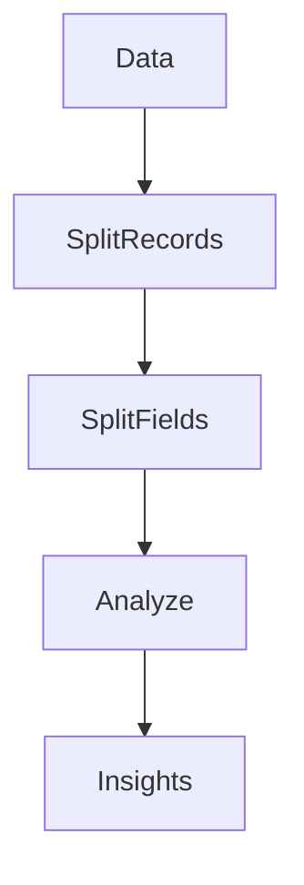
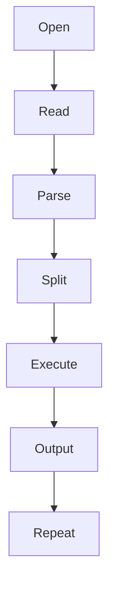

# 19 - awk

---

# The Big Engineering Problem

Imagine you are responsible for a production system.

Every second, systems generate data.

```text
Users

↓

Applications

↓

Databases

↓

Containers

↓

Servers

↓

Cloud Services
```

Now imagine millions of rows of data.

Example:

```text
2026-06-20 vip SUCCESS 120ms

2026-06-20 john FAILED 300ms

2026-06-20 alex SUCCESS 100ms
```

How do we answer questions like:

```text
Which user failed most?

↓

Average response time?

↓

How many requests today?

↓

Which IP appears most?

↓

Which server consumes most memory?
```

Reading manually is impossible.

Linux solved this decades ago.

The solution is:

```text
awk
```

---

# Why Does awk Exist?

Because computers generate huge amounts of structured text.

Examples:

```text
CPU Metrics

Memory Metrics

Logs

CSV Files

Application Events

Network Statistics

Database Results

Cloud Events
```

We need a way to analyze them.

awk solves this.

---

# What Is awk?

Simple definition:

```text
awk = Linux Data Analysis Engine
```

Traditional definition:

```text
awk = Pattern scanning and processing language
```

Both are correct.

But for engineers:

```text
Data

↓

Analyze

↓

Extract Insights
```

This is awk.

---

# Mental Model: Excel For Linux

Suppose this data exists.

```text
Name Age Salary

Vip 22 5000

John 25 7000

Alex 30 9000
```

Excel lets us do:

```text
Columns

↓

Rows

↓

Calculations

↓

Filtering
```

awk does exactly this.

Think:

```text
Excel

↓

But In Linux Terminal
```

---

# First Principles Thinking

Every data analysis system follows the same architecture.

```text
Collect Data

↓

Parse Data

↓

Extract Fields

↓

Analyze Fields

↓

Generate Insights
```

This is exactly how:

```text
awk

↓

SQL

↓

Pandas

↓

Spark

↓

BigQuery

↓

Data Warehouses
```

all work.

awk teaches this mindset early.

---

# Where awk Sits In Modern Engineering

```text
Linux

↓

Text Processing

↓

Data Analysis

↓

Observability

↓

Data Engineering

↓

Cloud Analytics

↓

Distributed Systems
```

---

# The Linux Data Philosophy

Linux believes:

```text
Everything Is Data
```

awk believes:

```text
Every Line Is A Record

↓

Every Record Has Fields
```

This is extremely important.

---

# High Level Architecture



---

# The Core awk Idea

Imagine this file:

```text
users.txt

Vip 22 India

John 25 USA

Alex 30 Germany
```

awk automatically sees:

```text
Record 1

↓

Field1

Field2

Field3
```

Visual:

```text
Vip 22 India

↓

$1    $2    $3
```

---

# Understanding Records And Fields

This is the most important concept.

## Record

Every line is a record.

```text
Line 1

↓

Record 1
```

```text
Line 2

↓

Record 2
```

---

## Field

Every record is divided into fields.

Input:

```text
Vip 22 India
```

awk sees:

```text
$1 → Vip

$2 → 22

$3 → India
```

---

# Visual

```text
Raw Data

↓

Vip 22 India

↓

Split

↓

$1 $2 $3
```

---

# Basic Syntax

```bash
awk 'instructions' file
```

Example:

```bash
awk '{print $1}' users.txt
```

Output:

```text
Vip

John

Alex
```

---

# Internal Thinking

awk does:

```text
Read Line

↓

Split Fields

↓

Execute Logic

↓

Print Result

↓

Next Line
```

---

# The Three Building Blocks Of awk

```text
Pattern

↓

Action

↓

Fields
```

Syntax:

```bash
awk 'pattern { action }' file
```

---

# Visual

```text
Input

↓

Pattern Check

↓

Action

↓

Output
```

---

# Print Entire Record

```bash
awk '{print}' file
```

or

```bash
awk '{print $0}' file
```

---

# Understanding $0

```text
$0

↓

Entire Line
```

Example:

```text
Vip 22 India
```

Output:

```text
Vip 22 India
```

---

# Print First Column

```bash
awk '{print $1}' users.txt
```

Output:

```text
Vip

John

Alex
```

---

# Print Multiple Columns

```bash
awk '{print $1,$3}' users.txt
```

Output:

```text
Vip India

John USA

Alex Germany
```

---

# Print Last Column

```bash
awk '{print $NF}'
```

What is NF?

```text
Number Of Fields
```

Visual:

```text
Vip 22 India

↓

NF=3

↓

$3

↓

India
```

---

# Built-in Variables

awk has powerful built-in variables.

| Variable | Meaning |
|----------|---------|
| $0 | Entire Record |
| $1 | First Field |
| $2 | Second Field |
| NF | Number Of Fields |
| NR | Record Number |
| FNR | File Record Number |
| FS | Field Separator |
| OFS | Output Field Separator |

---

# Understanding NR

NR = current line number.

Example:

```bash
awk '{print NR,$0}'
```

Output:

```text
1 Vip 22 India

2 John 25 USA

3 Alex 30 Germany
```

---

# Understanding FS (Field Separator)

Default:

```text
Space
```

But CSV uses:

```text
Comma
```

Example:

```text
vip,22,india
```

Command:

```bash
awk -F ',' '{print $1}'
```

Output:

```text
vip
```

---

# Visual

```text
vip,22,india

↓

Split By ,

↓

vip

22

india
```

---

# Filtering Data

Suppose:

```text
Name Age Salary

Vip 22 5000

John 25 7000

Alex 30 9000
```

Show age > 24.

```bash
awk '$2 > 24'
```

Output:

```text
John

Alex
```

---

# Conditional Logic

Example:

```bash
awk '$3 > 6000'
```

Output:

```text
John

Alex
```

---

# BEGIN Block

Runs before data processing.

Example:

```bash
awk '

BEGIN{

print "Report"

}

{print $1}

'
```

Output:

```text
Report

Vip

John

Alex
```

---

# END Block

Runs after processing.

Example:

```bash
awk '

{print $1}

END{

print "Done"

}

'
```

---

# Visual

```text
BEGIN

↓

Data

↓

END
```

---

# Calculations

Input:

```text
Vip 5000

John 7000

Alex 9000
```

Command:

```bash
awk '{sum+=$2}

END{

print sum

}'
```

Output:

```text
21000
```

---

# Average Example

```bash
awk '

{

sum+=$2

count++

}

END{

print sum/count

}

'
```

---

# Linux Internals

Suppose:

```bash
awk '{print $1}' users.txt
```

Internally:

```text
Open File

↓

Read Line

↓

Split Fields

↓

Store Variables

↓

Execute Logic

↓

Print Output

↓

Next Line
```

---

# Internal Architecture



---

# The awk Processing Loop

This is the heart of awk.

```text
For Every Line

↓

Split Into Fields

↓

Execute Instructions

↓

Repeat
```

---

# Production Example 1

Find highest memory process.

```bash
ps aux | awk '{print $4,$11}'
```

---

# Production Example 2

Find top IPs.

```bash
awk '{print $1}' access.log
```

---

# Production Example 3

Calculate response times.

```bash
awk '{sum+=$5}

END{

print sum/NR

}'
```

---

# Production Example 4

Docker log analysis.

```bash
docker logs app | awk '/ERROR/'
```

---

# Production Example 5

Kubernetes monitoring.

```bash
kubectl get pods | awk '{print $1}'
```

---

# How awk Connects To Modern Tools

awk teaches ideas used by:

SQL:

```sql
SELECT name

FROM users
```

Pandas:

```python
df["name"]
```

Spark:

```python
df.select()
```

All use the same philosophy.

---

# Docker Connection

```text
Containers

↓

Logs

↓

awk

↓

Insights
```

---

# Kubernetes Connection

```text
Pods

↓

Metrics

↓

awk

↓

Monitoring
```

---

# Cloud Connection

```text
Events

↓

Analysis

↓

Insights
```

---

# Observability Connection

Observability is giant-scale awk thinking.

```text
Logs

↓

Fields

↓

Analysis

↓

Dashboards
```

---

# Security Connection

Security teams analyze:

```text
IP

↓

User

↓

Failures

↓

Threats
```

awk helps automate this.

---

# Performance Considerations

awk is very efficient.

Because:

```text
Streaming

↓

Line By Line

↓

Low Memory Usage
```

---

# Security Considerations

Always validate input data.

Never assume fields always exist.

Bad:

```bash
$7
```

if field 7 doesn't exist.

Always verify data first.

---

# Common Mistakes

## Mistake 1

Memorizing syntax.

Wrong.

Learn:

```text
Records

↓

Fields

↓

Analysis
```

---

## Mistake 2

Using awk for JSON.

Prefer:

```text
jq
```

---

## Mistake 3

Ignoring field separators.

Always understand input format.

---

## Mistake 4

Writing huge one-liners.

Break complex logic into scripts.

---

# Troubleshooting

## Problem

Wrong columns.

Check:

```bash
awk '{print NF}'
```

---

## Problem

CSV not working.

Check:

```bash
-F ','
```

---

## Problem

Unexpected output.

Inspect data first.

---

# Production Best Practices

Always:

```text
Understand data format

Think in records

Think in fields

Keep scripts readable

Validate input
```

---

# Engineering Mindset

Do not think:

```text
awk = Column Tool
```

Think:

```text
awk = Linux Data Analytics Engine
```

Because most modern systems are giant data analytics systems.

---

# Interview Questions

## Beginner

What is awk?

What is a record?

What is a field?

---

## Intermediate

What is NF?

What is NR?

What is FS?

Difference between BEGIN and END?

---

## Advanced

How does awk internally process data?

How does awk connect to SQL?

How does awk connect to observability systems?

---

# Learning Checklist

```text
☑ Understand records

☑ Understand fields

☑ Understand variables

☑ Understand filtering

☑ Understand calculations

☑ Understand BEGIN

☑ Understand END

☑ Understand production usage
```

---

# Mind Map

```text
awk

├── Why It Exists

│

├── Records

│

├── Fields

│

├── Variables

│

├── Filtering

│

├── Calculations

│

├── BEGIN

│

├── END

│

├── Analytics

│

├── Observability

│

├── Docker

│

├── Kubernetes

│

├── Security

│

└── Troubleshooting
```

---

# Golden Rules

### Rule 1

Every line is a record.

---

### Rule 2

Every record contains fields.

---

### Rule 3

Think like a data analyst.

---

### Rule 4

Understand the input first.

---

### Rule 5

Validate field separators.

---

### Rule 6

Keep awk readable.

---

### Rule 7

awk teaches modern data engineering concepts.

---

# First Principles Recap

```text
Generate Data

↓

Parse Data

↓

Analyze Data

↓

Generate Insights

↓

Build Systems
```

# Key Takeaway

**grep finds data.**

**sed transforms data.**

**awk analyzes data.**

These three tools together form the core of Linux data engineering.
