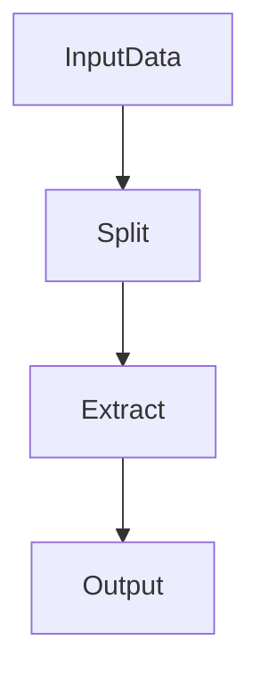
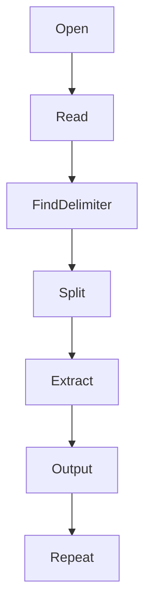

# 20 - cut

---

# The Big Engineering Problem

Imagine you are a backend engineer.

Your application generates this log.

```text
2026-06-20 10:00:00 INFO USER_LOGIN vip 192.168.1.10 SUCCESS

2026-06-20 10:01:00 INFO USER_LOGIN john 192.168.1.20 FAILED

2026-06-20 10:02:00 INFO USER_LOGIN alex 192.168.1.30 SUCCESS
```

Now someone asks:

```text
Show only usernames.

↓

Show only IP addresses.

↓

Show only timestamps.

↓

Show only status.
```

Do you need the entire data?

No.

You only need specific pieces.

This is where `cut` exists.

---

# Why Does cut Exist?

Real systems generate enormous data.

Examples:

```text
CSV Files

↓

Log Files

↓

Database Exports

↓

Environment Variables

↓

Metrics

↓

Configuration Files
```

Most of the time we don't need everything.

We only need:

```text
Specific Columns

↓

Specific Characters

↓

Specific Bytes
```

cut solves this problem.

---

# Learning Objectives

After completing this file, you should understand:

✅ Why cut exists

✅ Data extraction philosophy

✅ Fields

✅ Delimiters

✅ Characters

✅ Bytes

✅ Production usage

✅ Linux internals

✅ Modern infrastructure connections

---

# Mental Model: Pizza Slicer

Imagine a pizza.

```text
Whole Pizza

↓

Slice

↓

Take Only What You Need
```

Linux data works similarly.

```text
Large Data

↓

Extract

↓

Useful Data
```

cut is a data slicer.

---

# First Principles Thinking

Most systems repeatedly do this:

```text
Generate Data

↓

Extract Data

↓

Transform Data

↓

Analyze Data

↓

Store Data
```

Data extraction is one of the most important engineering skills.

---

# Where cut Sits In Modern Engineering

```text
Linux

↓

Text Processing

↓

Data Extraction

↓

ETL

↓

Data Engineering

↓

Cloud Analytics

↓

Distributed Systems
```

---

# The Linux Data Philosophy

Everything is data.

Most data has structure.

Example:

```text
vip,22,india
```

Linux sees:

```text
Field1

↓

Field2

↓

Field3
```

cut extracts those fields.

---

# High Level Architecture



---

# What Is cut?

Definition:

```text
cut extracts selected portions of data.
```

Think:

```text
Large Data

↓

Select Small Data

↓

Useful Information
```

---

# The Three Extraction Modes

cut has three primary modes.

```text
Character Extraction

↓

Byte Extraction

↓

Field Extraction
```

These are extremely important concepts.

---

# Understanding Fields

Suppose:

```text
vip,22,india
```

Visual:

```text
vip,22,india

↓

Field1

Field2

Field3
```

---

# Field Extraction

Most common usage.

Syntax:

```bash
cut -d DELIMITER -f FIELD
```

---

# Understanding -d

```text
-d

↓

Delimiter
```

A delimiter separates fields.

Examples:

Comma:

```text
vip,22,india
```

Colon:

```text
root:x:0:0
```

Space:

```text
vip 22 india
```

---

# Understanding -f

```text
-f

↓

Field Number
```

---

# Example

Input:

```text
vip,22,india
```

Command:

```bash
cut -d ',' -f1
```

Output:

```text
vip
```

---

# Visual

```text
vip,22,india

↓

Split By ,

↓

1 2 3

↓

Select 1

↓

vip
```

---

# Extract Multiple Fields

Example:

```bash
cut -d ',' -f1,3
```

Output:

```text
vip,india
```

---

# Extract Field Range

Example:

```bash
cut -d ',' -f1-3
```

Output:

```text
vip,22,india
```

---

# Extract From A Position

Example:

```bash
cut -d ',' -f2-
```

Output:

```text
22,india
```

---

# Character Extraction

Sometimes we don't have fields.

We only need positions.

Input:

```text
linux-fundamentals
```

Command:

```bash
cut -c1-5
```

Output:

```text
linux
```

---

# Visual

```text
linux-fundamentals

↓

1 2 3 4 5

↓

linux
```

---

# Extract Specific Characters

Example:

```bash
cut -c1,3,5
```

---

# Byte Extraction

Sometimes systems work at byte level.

Syntax:

```bash
cut -b1-5
```

---

# Character vs Byte

ASCII:

```text
1 character

↓

1 byte
```

Unicode:

```text
1 character

↓

Multiple bytes
```

This distinction becomes important later.

---

# Real Data Example

File:

```text
name,age,country

vip,22,india

john,25,usa
```

Extract names:

```bash
cut -d ',' -f1
```

Output:

```text
name

vip

john
```

---

# /etc/passwd Example

This is one of the most common production examples.

Data:

```text
root:x:0:0:root:/root:/bin/bash
```

Visual:

```text
root

x

0

0

root

/root

/bin/bash
```

Extract usernames.

```bash
cut -d ':' -f1 /etc/passwd
```

---

# Environment Variables Example

Input:

```text
DATABASE_URL=postgres

API_KEY=123

PORT=3000
```

Command:

```bash
cut -d '=' -f1
```

Output:

```text
DATABASE_URL

API_KEY

PORT
```

---

# cut + grep

Find nginx process names.

```bash
ps aux | grep nginx | cut -d ' ' -f1
```

---

# Better Version

```bash
ps aux | awk '{print $1}'
```

Interesting.

This teaches an engineering lesson.

Sometimes tools overlap.

Choose wisely.

---

# cut vs awk

This is very important.

Use cut when:

```text
Simple Extraction
```

Use awk when:

```text
Complex Analysis
```

---

# Comparison

| Feature | cut | awk |
|---------|-----|-----|
| Speed | Very Fast | Fast |
| Extraction | Excellent | Excellent |
| Calculations | No | Yes |
| Conditions | No | Yes |
| Complexity | Low | High |

---

# Linux Internals

Suppose:

```bash
cut -d ',' -f1 users.csv
```

Internally:

```text
Open File

↓

Read Line

↓

Find Delimiter

↓

Split Data

↓

Select Field

↓

Print Result

↓

Repeat
```

---

# Internal Architecture



---

# The cut Processing Loop

Every line follows this loop.

```text
Read

↓

Locate Delimiter

↓

Split

↓

Extract

↓

Print

↓

Repeat
```

---

# Production Example 1

Extract usernames.

```bash
cut -d ':' -f1 /etc/passwd
```

---

# Production Example 2

Extract pod names.

```bash
kubectl get pods | cut -d ' ' -f1
```

---

# Production Example 3

Extract image versions.

```bash
docker images | cut -d ' ' -f2
```

---

# Production Example 4

Extract IP addresses.

```bash
awk '{print $1}' access.log
```

Actually awk is better here.

Knowing when NOT to use cut is also engineering.

---

# Production Example 5

Extract environment variable names.

```bash
cut -d '=' -f1 .env
```

---

# ETL Connection

ETL means:

```text
Extract

↓

Transform

↓

Load
```

cut teaches the first stage.

---

# Docker Connection

Containers produce logs.

```text
Logs

↓

Extract Fields

↓

Analyze
```

---

# Kubernetes Connection

```text
Pods

↓

Metrics

↓

Extract

↓

Monitor
```

---

# Cloud Connection

Cloud systems constantly extract information.

```text
Events

↓

Extract

↓

Analyze
```

---

# Observability Connection

Observability systems do this at massive scale.

```text
Logs

↓

Extract Fields

↓

Aggregate

↓

Dashboard
```

---

# Performance Considerations

cut is extremely fast.

Because:

```text
Simple Logic

↓

Minimal Memory

↓

Streaming
```

---

# Security Considerations

Always inspect data first.

Wrong assumptions about delimiters produce wrong results.

---

# Common Mistakes

## Mistake 1

Using cut for complex calculations.

Use awk instead.

---

## Mistake 2

Using wrong delimiter.

Verify input first.

---

## Mistake 3

Ignoring spaces.

Spaces can behave unexpectedly.

---

## Mistake 4

Using cut on irregular data.

It works best on structured data.

---

# Troubleshooting

## Problem

Wrong output.

Check delimiter.

---

## Problem

Missing fields.

Inspect data.

---

## Problem

Unexpected spaces.

Normalize data first.

---

# Production Best Practices

Always:

```text
Understand input structure

Verify delimiters

Keep extraction simple

Use awk for complex analysis

Validate output
```

---

# Engineering Mindset

Do not think:

```text
cut = Column Command
```

Think:

```text
cut = Data Extraction Engine
```

Because modern systems constantly extract useful information from huge amounts of data.

---

# Interview Questions

## Beginner

What is cut?

What is a delimiter?

What is field extraction?

---

## Intermediate

Difference between cut and awk?

Difference between bytes and characters?

Why is cut so fast?

---

## Advanced

How does cut process data internally?

Why is cut part of ETL thinking?

How does cut connect to observability systems?

---

# Learning Checklist

```text
☑ Understand extraction

☑ Understand delimiters

☑ Understand fields

☑ Understand characters

☑ Understand bytes

☑ Understand production usage

☑ Understand internals
```

---

# Mind Map

```text
cut

├── Why It Exists

│

├── Data Extraction

│

├── Delimiters

│

├── Fields

│

├── Characters

│

├── Bytes

│

├── ETL

│

├── Docker

│

├── Kubernetes

│

├── Observability

│

├── Security

│

└── Troubleshooting
```

---

# Golden Rules

### Rule 1

Understand your input first.

---

### Rule 2

Data extraction is an engineering skill.

---

### Rule 3

Verify delimiters.

---

### Rule 4

Use cut for simple extraction.

---

### Rule 5

Use awk for complex analysis.

---

### Rule 6

Think in ETL pipelines.

---

### Rule 7

Always inspect data before processing.

---

# First Principles Recap

```text
Generate Data

↓

Extract Data

↓

Transform Data

↓

Analyze Data

↓

Store Insights

↓

Build Systems
```

# Key Takeaway

```text
grep

↓

Find Data

↓

sed

↓

Transform Data

↓

awk

↓

Analyze Data

↓

cut

↓

Extract Data
```

These four tools together form the foundation of Linux data engineering.
