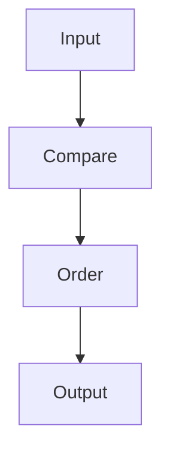
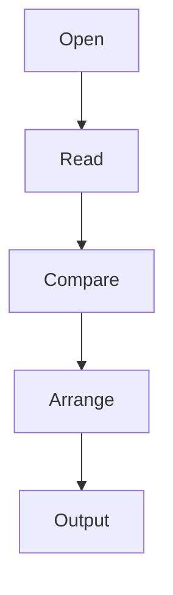
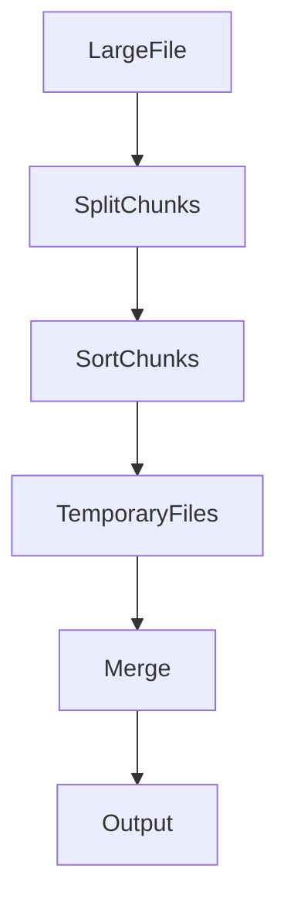

# 21 - sort

---

# The Big Engineering Problem

Imagine you have this data.

```text
vip

alex

john

maria

bob
```

Can humans understand it?

Yes.

Now imagine:

```text
100 rows

↓

1000 rows

↓

10000 rows

↓

100000 rows

↓

1000000 rows
```

Suddenly, understanding becomes difficult.

Why?

Because chaos does not scale.

Linux solved this problem decades ago.

The solution:

```text
Organize Data

↓

Create Order

↓

Generate Insights
```

That tool is `sort`.

---

# Why Does sort Exist?

Modern systems generate enormous amounts of information.

Examples:

```text
Logs

Metrics

Transactions

Database Results

Network Events

Security Events

Cloud Events

Monitoring Data
```

Unordered information is hard to analyze.

Ordered information is useful.

sort exists to create order from chaos.

---

# What Is sort?

Simple definition:

```text
sort = Linux Data Organization Engine
```

Traditional definition:

```text
sort = Sort lines of text files
```

For engineers, think bigger.

```text
Chaos

↓

Order

↓

Insights
```

---

# Mental Model: Organizing A Library

Imagine a library.

Without sorting:

```text
Random Books Everywhere
```

Impossible to navigate.

With sorting:

```text
Books

↓

Alphabetical Order

↓

Easy Search
```

Linux works similarly.

---

# First Principles Thinking

Most systems repeatedly do this.

```text
Generate Data

↓

Organize Data

↓

Analyze Data

↓

Make Decisions
```

Without organization:

```text
Data

↓

Noise
```

With organization:

```text
Data

↓

Information

↓

Knowledge
```

---

# Where sort Sits In Modern Engineering

```text
Linux

↓

Data Organization

↓

Data Analysis

↓

Observability

↓

Databases

↓

Distributed Systems

↓

Data Engineering
```

---

# The Linux Data Philosophy

Everything is data.

Data without order is difficult to analyze.

sort creates order.

---

# High Level Architecture



---

# What Does sort Actually Do?

Suppose we have:

```text
john

alex

vip
```

sort performs:

```text
Read Data

↓

Compare Values

↓

Arrange Values

↓

Produce Ordered Output
```

Output:

```text
alex

john

vip
```

---

# Basic Syntax

```bash
sort file.txt
```

Example:

Input:

```text
john

alex

vip
```

Command:

```bash
sort names.txt
```

Output:

```text
alex

john

vip
```

---

# Visual

```text
Unsorted Data

↓

sort

↓

Ordered Data
```

---

# Understanding Lexicographical Order

This is extremely important.

sort does not initially think in numbers.

It thinks in characters.

Example:

```text
apple

banana

cat
```

Visual:

```text
a

↓

b

↓

c
```

---

# Interesting Example

Input:

```text
100

20

3
```

Command:

```bash
sort numbers.txt
```

Output:

```text
100

20

3
```

This surprises beginners.

Why?

Because:

```text
1

↓

2

↓

3
```

Character comparison.

Not numeric comparison.

---

# Numeric Sorting

Use:

```bash
sort -n
```

Example:

```text
100

20

3
```

Output:

```text
3

20

100
```

---

# Visual

```text
Character Sort

↓

100

20

3


Numeric Sort

↓

3

20

100
```

---

# Reverse Sorting

Use:

```bash
sort -r
```

Example:

```bash
sort -r names.txt
```

Output:

```text
vip

john

alex
```

---

# Numeric Reverse Sort

Use:

```bash
sort -nr
```

Output:

```text
100

20

3
```

---

# Unique Sorting

Use:

```bash
sort -u
```

Input:

```text
alex

john

alex

vip

john
```

Output:

```text
alex

john

vip
```

---

# Visual

```text
Duplicates

↓

Sort

↓

Remove Duplicates
```

---

# Sorting CSV Data

Input:

```text
vip,22

john,25

alex,30
```

Sort by age.

```bash
sort -t ',' -k2
```

---

# Understanding -t

```text
-t

↓

Delimiter
```

---

# Understanding -k

```text
-k

↓

Key

↓

Field To Sort
```

---

# Visual

```text
vip,22

↓

Field1

Field2

↓

Sort Field2
```

---

# Human Readable Sorting

Very useful.

Input:

```text
1K

500M

2G
```

Use:

```bash
sort -h
```

Output:

```text
1K

500M

2G
```

---

# Month Sorting

Example:

```text
Jan

Mar

Feb
```

Use:

```bash
sort -M
```

Output:

```text
Jan

Feb

Mar
```

---

# Check If Already Sorted

Example:

```bash
sort -c file.txt
```

Useful in automation.

---

# Pipeline Thinking

sort becomes powerful with pipelines.

Example:

```bash
ps aux | sort
```

---

# Example

Find highest memory consumers.

```bash
ps aux | sort -nrk4 | head
```

Execution:

```text
Processes

↓

Sort By Memory

↓

Top Consumers
```

---

# Visual

```text
Processes

↓

Sort

↓

Top Processes
```

---

# sort + uniq

Classic combination.

```bash
sort names.txt | uniq
```

Why?

Because uniq only works properly on sorted data.

Very important.

---

# sort + grep

```bash
grep ERROR app.log | sort
```

---

# sort + awk

```bash
awk '{print $1}' access.log | sort
```

---

# Linux Internals

Suppose:

```bash
sort names.txt
```

Internally:

```text
Open File

↓

Read Data

↓

Store Records

↓

Compare Records

↓

Arrange Records

↓

Print Output
```

---

# Internal Architecture



---

# How Does sort Compare Data?

Internally:

```text
Line A

↓

Line B

↓

Character By Character Comparison
```

This process repeats continuously.

---

# Large File Problem

What if the file is:

```text
100GB
```

Can it fit in RAM?

Maybe not.

Linux handles this elegantly.

It uses:

```text
Chunk Data

↓

Temporary Files

↓

Merge Data
```

This is called:

```text
External Sorting
```

Very important engineering concept.

---

# Internal Architecture For Huge Data



---

# The Evolution Ladder

This is extremely important.

```text
sort

↓

Database ORDER BY

↓

MapReduce Shuffle

↓

Spark Sort

↓

Distributed Sorting

↓

Big Data Systems
```

Same idea.

Different scale.

---

# Production Example 1

Find top memory consumers.

```bash
ps aux | sort -nrk4 | head
```

---

# Production Example 2

Find top CPU consumers.

```bash
ps aux | sort -nrk3 | head
```

---

# Production Example 3

Find top IP addresses.

```bash
awk '{print $1}' access.log | sort | uniq -c
```

---

# Production Example 4

Docker analysis.

```bash
docker ps | sort
```

---

# Production Example 5

Kubernetes analysis.

```bash
kubectl get pods | sort
```

---

# Database Connection

SQL:

```sql
SELECT *

FROM users

ORDER BY age;
```

Same idea.

---

# Docker Connection

```text
Containers

↓

Logs

↓

Sort

↓

Insights
```

---

# Kubernetes Connection

```text
Pods

↓

Metrics

↓

Sort

↓

Prioritize
```

---

# Cloud Connection

```text
Events

↓

Order

↓

Analyze
```

---

# Observability Connection

Observability systems constantly sort.

```text
Logs

↓

Sort

↓

Aggregate

↓

Dashboard
```

---

# Distributed Systems Connection

Sorting is everywhere.

```text
Map

↓

Shuffle

↓

Sort

↓

Reduce
```

---

# Performance Considerations

Small files:

```text
Memory Sort
```

Large files:

```text
External Sort
```

Very large distributed systems:

```text
Distributed Sort
```

---

# Security Considerations

Sorting huge sensitive logs may create temporary files.

Understand your environment.

---

# Common Mistakes

## Mistake 1

Forgetting numeric sort.

Wrong:

```bash
sort
```

Correct:

```bash
sort -n
```

---

## Mistake 2

Using uniq without sort.

Wrong:

```bash
uniq
```

Correct:

```bash
sort | uniq
```

---

## Mistake 3

Ignoring delimiters.

Always inspect input.

---

## Mistake 4

Sorting huge files without considering memory.

---

# Troubleshooting

## Problem

Numbers sorted incorrectly.

Use:

```bash
sort -n
```

---

## Problem

Duplicates still exist.

Use:

```bash
sort -u
```

or

```bash
sort | uniq
```

---

## Problem

CSV sorting is wrong.

Use:

```bash
-t

-k
```

---

# Production Best Practices

Always:

```text
Understand data type

Use numeric sorting for numbers

Use human sorting for sizes

Sort before uniq

Inspect data first
```

---

# Engineering Mindset

Do not think:

```text
sort = Arrange Text
```

Think:

```text
sort = Organization Primitive
```

Because every large-scale system eventually organizes information.

---

# Interview Questions

## Beginner

What is sort?

Difference between sort and sort -n?

What is reverse sorting?

---

## Intermediate

What is -k ?

What is -t ?

Why does uniq need sort?

---

## Advanced

How does sort handle huge files?

What is external sorting?

How does sorting appear in distributed systems?

---

# Learning Checklist

```text
☑ Understand organization

☑ Understand numeric sorting

☑ Understand keys

☑ Understand delimiters

☑ Understand external sorting

☑ Understand production usage

☑ Understand distributed systems connections
```

---

# Mind Map

```text
sort

├── Why It Exists

│

├── Organization

│

├── Numeric Sort

│

├── Reverse Sort

│

├── Unique Sort

│

├── Keys

│

├── Delimiters

│

├── External Sort

│

├── Databases

│

├── Distributed Systems

│

├── Observability

│

├── Performance

│

└── Troubleshooting
```

---

# Golden Rules

### Rule 1

Chaos does not scale.

---

### Rule 2

Organized data creates insights.

---

### Rule 3

Always know your data type.

---

### Rule 4

Numbers require `-n`.

---

### Rule 5

sort before uniq.

---

### Rule 6

Large systems eventually sort data.

---

### Rule 7

Sorting is a fundamental engineering primitive.

---

# First Principles Recap

```text
Generate Data

↓

Organize Data

↓

Analyze Data

↓

Generate Insights

↓

Build Systems
```

# Key Takeaway

```text
grep

↓

Search Primitive

↓

sed

↓

Transformation Primitive

↓

awk

↓

Analytics Primitive

↓

cut

↓

Extraction Primitive

↓

sort

↓

Organization Primitive
```

These are not Linux commands anymore.

These are engineering primitives used throughout modern software systems.
