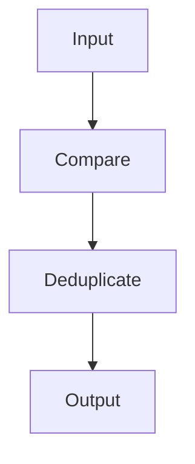
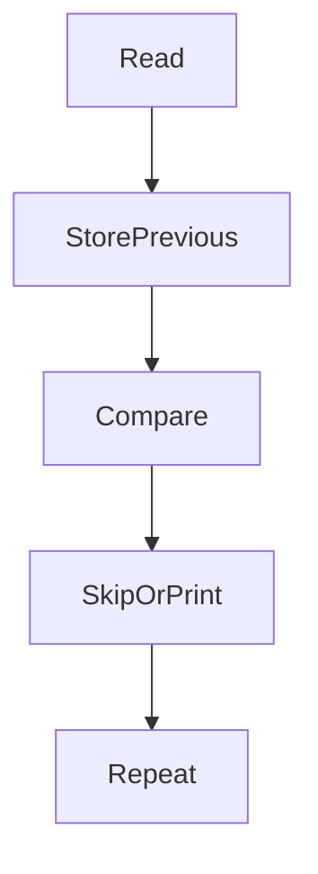

# 22 - uniq

---

# The Big Engineering Problem

Imagine a production server.

Every second it generates logs.

```text
10 logs

↓

100 logs

↓

1000 logs

↓

10000 logs

↓

100000 logs
```

Now imagine this.

```text
ERROR

ERROR

ERROR

ERROR

ERROR

ERROR

ERROR
```

Do we need all these repeated values?

No.

We need meaningful information.

Linux solved this problem decades ago.

The solution:

```text
Remove Redundancy

↓

Keep Meaningful Information
```

That tool is `uniq`.

---

# Why Does uniq Exist?

Modern systems generate duplicate information.

Examples:

```text
Repeated IP Addresses

Repeated Usernames

Repeated Errors

Repeated Events

Repeated Metrics

Repeated Requests
```

Duplicates increase noise.

Engineers need signals.

uniq helps remove redundancy.

---

# What Is uniq?

Simple definition:

```text
uniq = Linux Deduplication Engine
```

Traditional definition:

```text
uniq = Report or omit repeated lines
```

For engineers:

```text
Repeated Data

↓

Deduplicate

↓

Generate Insights
```

---

# Mental Model: Security Guard At A Gate

Imagine a stadium.

Thousands of people enter.

Some people try to enter multiple times.

The guard says:

```text
Already Seen

↓

Skip
```

Linux does the same thing.

---

# First Principles Thinking

Modern systems repeatedly do this.

```text
Generate Data

↓

Organize Data

↓

Remove Duplicates

↓

Analyze Data
```

Deduplication is a fundamental engineering primitive.

---

# Why Is Deduplication Important?

Imagine these logs.

```text
192.168.1.10

192.168.1.10

192.168.1.10

192.168.1.20

192.168.1.20
```

Without deduplication:

```text
Noise
```

With deduplication:

```text
192.168.1.10

192.168.1.20
```

Suddenly the data becomes useful.

---

# Where uniq Sits In Modern Engineering

```text
Linux

↓

Data Cleaning

↓

Observability

↓

Analytics

↓

Distributed Systems

↓

Big Data Systems
```

---

# The Linux Data Philosophy

Linux believes:

```text
Data

↓

Order

↓

Insights
```

uniq adds another step.

```text
Data

↓

Sort

↓

Deduplicate

↓

Insights
```

---

# High Level Architecture



---

# Very Important Concept

`uniq` only compares **adjacent lines**.

This is one of the most important concepts.

Input:

```text
alex

john

alex

vip
```

Command:

```bash
uniq file.txt
```

Output:

```text
alex

john

alex

vip
```

Nothing changed.

Why?

Because:

```text
Duplicates Were Not Adjacent
```

---

# The Famous Rule

Always remember.

```text
sort

↓

uniq
```

These two are best friends.

---

# Visual

```text
Unsorted Data

↓

sort

↓

uniq

↓

Deduplicated Data
```

---

# Basic Syntax

```bash
uniq file.txt
```

---

# Example

Input:

```text
alex

alex

john

john

vip
```

Command:

```bash
uniq file.txt
```

Output:

```text
alex

john

vip
```

---

# Visual

```text
alex

alex

↓

alex
```

---

# Count Duplicates

Very useful.

Command:

```bash
uniq -c
```

Input:

```text
alex

alex

john

john

john

vip
```

Output:

```text
2 alex

3 john

1 vip
```

---

# Visual

```text
alex

alex

↓

2 alex
```

---

# Show Only Duplicate Lines

Command:

```bash
uniq -d
```

Output:

```text
alex

john
```

---

# Show Only Unique Lines

Command:

```bash
uniq -u
```

Output:

```text
vip
```

---

# Ignore Case

Command:

```bash
uniq -i
```

Input:

```text
linux

Linux

LINUX
```

Output:

```text
linux
```

---

# Skip Fields

Useful for structured data.

Command:

```bash
uniq -f1
```

Meaning:

```text
Ignore First Field
```

---

# Skip Characters

Command:

```bash
uniq -s3
```

Meaning:

```text
Ignore First 3 Characters
```

---

# Pipeline Thinking

This is where uniq becomes powerful.

Example:

```bash
cat access.log \
| awk '{print $1}' \
| sort \
| uniq
```

Execution:

```text
Logs

↓

Extract IP

↓

Sort

↓

Remove Duplicates
```

---

# Visual

```text
Logs

↓

Extract

↓

Sort

↓

Deduplicate

↓

Insights
```

---

# Find Most Active IPs

```bash
awk '{print $1}' access.log \
| sort \
| uniq -c \
| sort -nr
```

---

# Example Execution

```text
Logs

↓

IPs

↓

Sort

↓

Count

↓

Rank
```

---

# Linux Internals

Suppose:

```bash
sort file.txt | uniq
```

Internally:

```text
Read Line

↓

Store Previous Line

↓

Compare Current Line

↓

If Same

↓

Skip

↓

If Different

↓

Print
```

---

# Internal Architecture



---

# The uniq Algorithm

This is important.

Pseudo flow:

```text
Read First Line

↓

Save It

↓

Read Next Line

↓

Compare

↓

Same?

↓

Skip

↓

Different?

↓

Print

↓

Update Memory
```

---

# Why uniq Is Fast

Because it only stores:

```text
Current Line

↓

Previous Line
```

Memory usage stays very low.

---

# The Evolution Ladder

This is extremely important.

```text
uniq

↓

Database DISTINCT

↓

Data Cleaning

↓

Deduplication Systems

↓

Distributed Systems

↓

Big Data Pipelines
```

Same idea.

Different scale.

---

# SQL Connection

SQL:

```sql
SELECT DISTINCT country

FROM users;
```

This is uniq thinking.

---

# Database Connection

Databases constantly remove duplicates.

Examples:

```text
Unique Constraints

Indexes

Distinct Queries
```

---

# Docker Connection

Container logs:

```text
Millions Of Events

↓

Deduplicate

↓

Analyze
```

---

# Kubernetes Connection

```text
Pod Events

↓

Deduplicate

↓

Monitor
```

---

# Cloud Connection

Cloud systems constantly deduplicate.

```text
Events

↓

Deduplicate

↓

Alert
```

---

# Observability Connection

Observability systems constantly do:

```text
Logs

↓

Deduplicate

↓

Aggregate

↓

Dashboard
```

---

# Distributed Systems Connection

Distributed systems fight duplication all the time.

Examples:

```text
Duplicate Events

Duplicate Messages

Duplicate Requests
```

This is called:

```text
Idempotency
```

Very important engineering concept.

---

# Production Example 1

Find unique users.

```bash
cut -d ':' -f1 /etc/passwd | sort | uniq
```

---

# Production Example 2

Find top IPs.

```bash
awk '{print $1}' access.log | sort | uniq -c
```

---

# Production Example 3

Find duplicate Docker containers.

```bash
docker ps | sort | uniq
```

---

# Production Example 4

Find repeated Kubernetes events.

```bash
kubectl get events | sort | uniq -c
```

---

# Production Example 5

Find most common errors.

```bash
grep ERROR app.log \
| sort \
| uniq -c \
| sort -nr
```

---

# Performance Considerations

uniq is extremely efficient.

Because:

```text
Streaming

↓

Line By Line

↓

Minimal Memory
```

---

# Security Considerations

Repeated failed logins often indicate attacks.

Example:

```text
Failed password

↓

Count

↓

Alert
```

uniq helps detect patterns.

---

# Common Mistakes

## Mistake 1

Using uniq without sort.

Wrong:

```bash
uniq file.txt
```

Correct:

```bash
sort file.txt | uniq
```

---

## Mistake 2

Thinking uniq scans the whole file.

It only compares adjacent lines.

---

## Mistake 3

Using uniq for unsorted logs.

Sort first.

---

## Mistake 4

Using uniq for huge analytics.

Sometimes databases are better.

---

# Troubleshooting

## Problem

Duplicates still appear.

Cause:

```text
Data Not Sorted
```

Fix:

```bash
sort | uniq
```

---

## Problem

Case sensitive duplicates.

Use:

```bash
uniq -i
```

---

## Problem

Wrong counts.

Inspect input first.

---

# Production Best Practices

Always:

```text
Sort before uniq

Inspect data

Count duplicates

Use pipelines

Understand adjacent comparison
```

---

# Engineering Mindset

Do not think:

```text
uniq = Remove Duplicates
```

Think:

```text
uniq = Deduplication Primitive
```

Because modern systems constantly fight redundancy.

---

# Interview Questions

## Beginner

What is uniq?

Why does uniq need sort?

What does uniq -c do?

---

## Intermediate

Why does uniq only work on adjacent lines?

Difference between uniq and sort -u?

What does uniq -d do?

---

## Advanced

How does uniq internally work?

How does uniq connect to SQL DISTINCT?

How does deduplication appear in distributed systems?

---

# Learning Checklist

```text
☑ Understand deduplication

☑ Understand adjacent comparison

☑ Understand sort | uniq

☑ Understand counting

☑ Understand distributed systems connections

☑ Understand production usage
```

---

# Mind Map

```text
uniq

├── Why It Exists

│

├── Deduplication

│

├── Adjacent Comparison

│

├── Counting

│

├── SQL DISTINCT

│

├── Observability

│

├── Distributed Systems

│

├── Security

│

├── Performance

│

└── Troubleshooting
```

---

# Golden Rules

### Rule 1

uniq only compares adjacent lines.

---

### Rule 2

Always remember:

```text
sort

↓

uniq
```

---

### Rule 3

Deduplication is an engineering primitive.

---

### Rule 4

Count duplicates before removing them.

---

### Rule 5

Understand your input first.

---

### Rule 6

Redundancy does not scale.

---

### Rule 7

Distributed systems constantly fight duplication.

---

# First Principles Recap

```text
Generate Data

↓

Organize Data

↓

Deduplicate Data

↓

Analyze Data

↓

Generate Insights

↓

Build Systems
```

# Key Takeaway

```text
grep

↓

Search Primitive

↓

sed

↓

Transformation Primitive

↓

awk

↓

Analytics Primitive

↓

cut

↓

Extraction Primitive

↓

sort

↓

Organization Primitive

↓

uniq

↓

Deduplication Primitive
```

These are not commands anymore.

These are foundational engineering building blocks.
