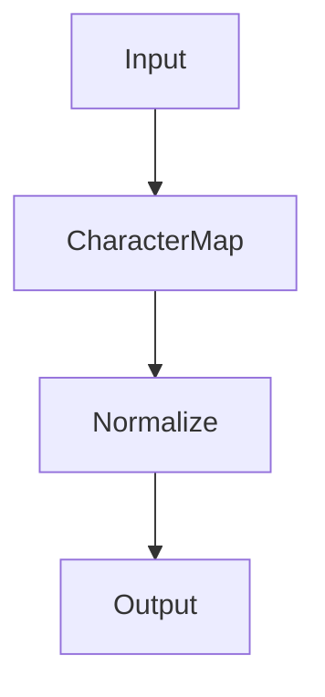
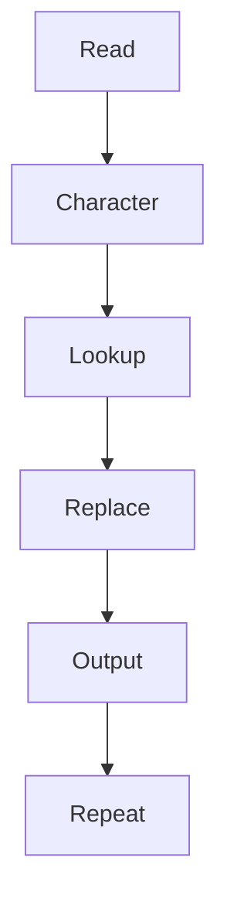

# 23 - tr

---

# The Big Engineering Problem

Imagine millions of users entering data.

```text
VIP

Vip

vip

ViP

vIp
```

For humans:

```text
Same Thing
```

For computers:

```text
Different Values
```

This is a huge problem.

Modern systems continuously solve this problem.

The solution:

```text
Normalize Data
```

Linux solved this decades ago.

That tool is:

```text
tr
```

---

# Why Does tr Exist?

Real systems generate inconsistent data.

Examples:

```text
Uppercase Text

Lowercase Text

Extra Spaces

Tabs

Special Characters

Newlines

Control Characters
```

Before analysis, systems normalize data.

tr solves this.

---

# What Is tr?

Simple definition:

```text
tr = Linux Data Normalization Engine
```

Traditional definition:

```text
Translate Or Delete Characters
```

Both are correct.

But for engineers:

```text
Messy Data

↓

Normalize Data

↓

Consistent Data
```

---

# Mental Model: Data Cleaning Factory

Imagine a factory.

Dirty products arrive.

```text
Input

↓

Cleaning Machine

↓

Standardized Output
```

tr is that cleaning machine.

---

# First Principles Thinking

Every modern system repeatedly does this.

```text
Generate Data

↓

Normalize Data

↓

Store Data

↓

Analyze Data
```

Without normalization:

```text
Chaos
```

With normalization:

```text
Consistency
```

---

# Where tr Sits In Modern Engineering

```text
Linux

↓

Data Cleaning

↓

Data Engineering

↓

Observability

↓

Machine Learning

↓

Distributed Systems
```

---

# The Linux Data Philosophy

Linux believes:

```text
Small Tools

↓

Single Responsibility

↓

Composable Systems
```

tr has one responsibility.

```text
Normalize Characters
```

---

# High Level Architecture



---

# What Is Character Translation?

Suppose we have:

```text
linux
```

We want:

```text
LINUX
```

tr does:

```text
l → L

i → I

n → N

u → U

x → X
```

Character by character transformation.

---

# Basic Syntax

```bash
tr SET1 SET2
```

Example:

```bash
echo "linux" | tr 'a-z' 'A-Z'
```

Output:

```text
LINUX
```

---

# Visual

```text
linux

↓

tr

↓

LINUX
```

---

# How tr Thinks

This is important.

tr does NOT work on words.

It works on:

```text
Character

↓

Character

↓

Character
```

---

# Character Mapping

Example:

```bash
echo "abc" | tr 'abc' 'xyz'
```

Visual:

```text
a → x

b → y

c → z
```

Output:

```text
xyz
```

---

# Convert Lowercase To Uppercase

```bash
echo "linux fundamentals" \
| tr 'a-z' 'A-Z'
```

Output:

```text
LINUX FUNDAMENTALS
```

---

# Convert Uppercase To Lowercase

```bash
echo "LINUX" \
| tr 'A-Z' 'a-z'
```

Output:

```text
linux
```

---

# Delete Characters

Use:

```bash
tr -d
```

Example:

```bash
echo "linux123" \
| tr -d '0-9'
```

Output:

```text
linux
```

---

# Visual

```text
linux123

↓

Delete Numbers

↓

linux
```

---

# Delete Spaces

Example:

```bash
echo "linux fundamentals" \
| tr -d ' '
```

Output:

```text
linuxfundamentals
```

---

# Squeeze Repeated Characters

Very important.

Use:

```bash
tr -s
```

Input:

```text
linux      fundamentals
```

Command:

```bash
echo "linux      fundamentals" \
| tr -s ' '
```

Output:

```text
linux fundamentals
```

---

# Visual

```text
Many Spaces

↓

One Space
```

---

# Replace Spaces With Newlines

Example:

```bash
echo "linux docker kubernetes" \
| tr ' ' '\n'
```

Output:

```text
linux

docker

kubernetes
```

---

# Visual

```text
One Line

↓

Multiple Lines
```

---

# Remove Newlines

Example:

```bash
tr -d '\n'
```

---

# Character Classes

Instead of ranges, Linux provides classes.

Examples:

Lowercase:

```bash
[:lower:]
```

Uppercase:

```bash
[:upper:]
```

Digits:

```bash
[:digit:]
```

Spaces:

```bash
[:space:]
```

Alphabetic:

```bash
[:alpha:]
```

Alphanumeric:

```bash
[:alnum:]
```

---

# Example

```bash
echo "linux" \
| tr '[:lower:]' '[:upper:]'
```

---

# Important Limitation

tr only works on characters.

It does NOT work on:

```text
Words

Columns

Patterns

Records
```

---

# Comparison

| Tool | Responsibility |
|------|----------------|
| grep | Search |
| sed | Transform |
| awk | Analyze |
| cut | Extract |
| sort | Organize |
| uniq | Deduplicate |
| tr | Normalize |

---

# Pipeline Thinking

tr becomes powerful in pipelines.

Example:

```bash
cat names.txt \
| tr 'A-Z' 'a-z' \
| sort \
| uniq
```

Execution:

```text
Normalize

↓

Organize

↓

Deduplicate
```

---

# Visual

```text
Messy Data

↓

Normalize

↓

Sort

↓

Deduplicate

↓

Insights
```

---

# Linux Internals

Suppose:

```bash
echo linux | tr 'a-z' 'A-Z'
```

Internally:

```text
Read Stream

↓

Read Character

↓

Lookup Mapping

↓

Replace

↓

Output

↓

Repeat
```

---

# Internal Architecture



---

# Why Is tr So Fast?

Because it uses:

```text
Lookup Tables
```

Visual:

```text
a → A

b → B

c → C
```

Instead of complex algorithms.

Very efficient.

---

# The Evolution Ladder

This is extremely important.

```text
tr

↓

Data Cleaning

↓

ETL

↓

Data Warehouses

↓

Machine Learning Pipelines

↓

AI Systems
```

Same idea.

Different scale.

---

# Production Example 1

Normalize usernames.

```bash
echo "VIP" \
| tr 'A-Z' 'a-z'
```

---

# Production Example 2

Normalize environment variables.

```bash
cat .env \
| tr -s ' '
```

---

# Production Example 3

Word frequency analysis.

```bash
cat book.txt \
| tr 'A-Z' 'a-z' \
| tr ' ' '\n' \
| sort \
| uniq -c
```

---

# Production Example 4

Container log normalization.

```bash
docker logs app \
| tr 'A-Z' 'a-z'
```

---

# Production Example 5

Kubernetes event normalization.

```bash
kubectl get events \
| tr -s ' '
```

---

# Machine Learning Connection

ML spends enormous effort cleaning data.

```text
Raw Data

↓

Normalize

↓

Train Model
```

tr teaches this early.

---

# Docker Connection

```text
Containers

↓

Logs

↓

Normalize

↓

Analyze
```

---

# Kubernetes Connection

```text
Events

↓

Normalize

↓

Monitor
```

---

# Cloud Connection

```text
Events

↓

Normalize

↓

Store
```

---

# Observability Connection

Observability systems normalize constantly.

```text
Logs

↓

Normalize

↓

Aggregate

↓

Dashboard
```

---

# Distributed Systems Connection

Distributed systems fight inconsistency.

```text
Different Services

↓

Different Formats

↓

Normalize

↓

Communicate
```

---

# ETL Connection

ETL:

```text
Extract

↓

Transform

↓

Load
```

Normalization is one of the most important transformations.

---

# Performance Considerations

tr is extremely efficient.

Because:

```text
Streaming

↓

Character Based

↓

Lookup Tables

↓

Minimal Memory
```

---

# Security Considerations

Normalize logs before analysis.

Attackers often exploit inconsistent formatting.

---

# Common Mistakes

## Mistake 1

Thinking tr works on words.

Wrong.

It only works on characters.

---

## Mistake 2

Using tr for pattern matching.

Use:

```text
grep

sed

awk
```

instead.

---

## Mistake 3

Ignoring character classes.

They improve readability.

---

## Mistake 4

Using tr for JSON.

Use jq instead.

---

# Troubleshooting

## Problem

Nothing changed.

Check:

```text
Input Character Set
```

---

## Problem

Unexpected output.

Remember:

```text
Character Based Tool
```

---

## Problem

Complex transformations.

Use sed or awk instead.

---

# Production Best Practices

Always:

```text
Normalize early

Keep pipelines simple

Understand your data

Use character classes

Combine tools wisely
```

---

# Engineering Mindset

Do not think:

```text
tr = Character Command
```

Think:

```text
tr = Data Normalization Primitive
```

Because every modern system normalizes data.

---

# Interview Questions

## Beginner

What is tr?

What does tr stand for?

What is character translation?

---

## Intermediate

What is tr -d ?

What is tr -s ?

Difference between tr and sed?

---

## Advanced

How does tr internally work?

Why is tr so fast?

How does normalization appear in ML systems?

---

# Learning Checklist

```text
☑ Understand normalization

☑ Understand character mapping

☑ Understand deletion

☑ Understand squeezing

☑ Understand pipelines

☑ Understand production usage

☑ Understand modern systems connections
```

---

# Mind Map

```text
tr

├── Why It Exists

│

├── Normalization

│

├── Translation

│

├── Deletion

│

├── Squeezing

│

├── Character Classes

│

├── ETL

│

├── Machine Learning

│

├── Observability

│

├── Distributed Systems

│

├── Security

│

└── Troubleshooting
```

---

# Golden Rules

### Rule 1

tr works on characters, not words.

---

### Rule 2

Normalize early.

---

### Rule 3

Use character classes.

---

### Rule 4

Keep transformations simple.

---

### Rule 5

Combine small tools.

---

### Rule 6

Consistency scales.

---

### Rule 7

Modern systems continuously normalize data.

---

# First Principles Recap

```text
Generate Data

↓

Normalize Data

↓

Organize Data

↓

Analyze Data

↓

Generate Insights

↓

Build Systems
```

# Key Takeaway

```text
grep

↓

Search Primitive

↓

sed

↓

Transformation Primitive

↓

awk

↓

Analytics Primitive

↓

cut

↓

Extraction Primitive

↓

sort

↓

Organization Primitive

↓

uniq

↓

Deduplication Primitive

↓

tr

↓

Normalization Primitive
```

These Linux tools are actually the foundations of modern data engineering systems.
