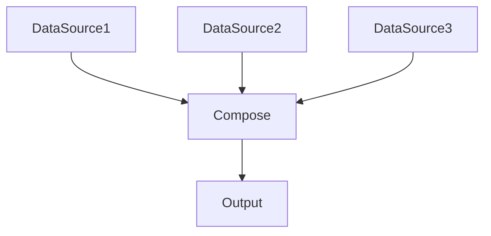
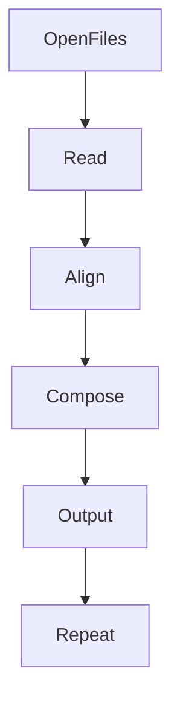

# 24 - paste

---

# The Big Engineering Problem

Imagine you have three systems.

System A:

```text
vip

john

alex
```

System B:

```text
22

25

30
```

System C:

```text
india

usa

germany
```

Humans immediately understand:

```text
vip → 22 → india

john → 25 → usa

alex → 30 → germany
```

Computers do not.

They see isolated pieces of information.

Modern systems constantly solve this problem.

The solution:

```text
Compose Data
```

Linux solved this decades ago.

That tool is:

```text
paste
```

---

# Why Does paste Exist?

Modern systems rarely work with a single source.

Examples:

```text
CPU Metrics

Memory Metrics

Disk Metrics

↓

Health Dashboard
```

or

```text
Users

Permissions

Roles

↓

Identity System
```

or

```text
Microservice A

Microservice B

Microservice C

↓

API Response
```

Systems continuously combine information.

paste solves this.

---

# What Is paste?

Simple definition:

```text
paste = Linux Data Composition Engine
```

Traditional definition:

```text
Merge lines of files
```

For engineers:

```text
Independent Data

↓

Combine Together

↓

Generate Meaning
```

---

# Mental Model: LEGO Blocks

Imagine LEGO pieces.

Individually:

```text
□

△

○
```

They are useful.

But when assembled:

```text
□△○
```

They become something larger.

paste does this for data.

---

# First Principles Thinking

Most systems repeatedly do this.

```text
Generate Data

↓

Compose Data

↓

Analyze Data

↓

Generate Insights
```

Composition is a fundamental engineering primitive.

---

# Why Composition Matters

Imagine an e-commerce platform.

Data exists separately.

```text
User Service

↓

Order Service

↓

Payment Service
```

But users want:

```text
Single Dashboard
```

The system composes everything together.

---

# Where paste Sits In Modern Engineering

```text
Linux

↓

Data Composition

↓

Backend Systems

↓

API Aggregation

↓

Microservices

↓

Distributed Systems
```

---

# The Linux Data Philosophy

Linux philosophy:

```text
Small Tools

↓

Composable Systems
```

paste literally embodies this philosophy.

---

# High Level Architecture



---

# What Does paste Actually Do?

Suppose:

file1.txt

```text
vip

john

alex
```

file2.txt

```text
22

25

30
```

paste does:

```text
vip + 22

john + 25

alex + 30
```

Output:

```text
vip     22

john    25

alex    30
```

---

# Basic Syntax

```bash
paste file1 file2
```

---

# Visual

```text
File1

↓

vip

john

alex


File2

↓

22

25

30


paste

↓

vip 22

john 25

alex 30
```

---

# Understanding The Default Delimiter

By default:

```text
TAB
```

is inserted.

Visual:

```text
vip[TAB]22
```

---

# Custom Delimiter

Use:

```bash
paste -d ',' file1 file2
```

Output:

```text
vip,22

john,25

alex,30
```

---

# Visual

```text
Data A

+

Data B

↓

Delimiter

↓

Combined Data
```

---

# Multiple Files

Example:

file1:

```text
vip

john

alex
```

file2:

```text
22

25

30
```

file3:

```text
india

usa

germany
```

Command:

```bash
paste file1 file2 file3
```

Output:

```text
vip 22 india

john 25 usa

alex 30 germany
```

---

# Serial Mode

Very useful.

Use:

```bash
paste -s
```

Input:

```text
linux

docker

kubernetes
```

Output:

```text
linux docker kubernetes
```

Visual:

```text
Vertical Data

↓

Horizontal Data
```

---

# Multiple Delimiters

Example:

```bash
paste -d ',:' file1 file2 file3
```

Linux cycles delimiters.

Output:

```text
vip,22:india
```

---

# Real World Example

users.txt

```text
vip

john

alex
```

emails.txt

```text
vip@gmail.com

john@gmail.com

alex@gmail.com
```

Command:

```bash
paste users.txt emails.txt
```

Output:

```text
vip vip@gmail.com

john john@gmail.com

alex alex@gmail.com
```

---

# The Concept Of Data Correlation

This is important.

paste assumes:

```text
Line 1 ↔ Line 1

Line 2 ↔ Line 2

Line 3 ↔ Line 3
```

Position matters.

This idea appears everywhere.

---

# Visual

```text
Dataset A

↓

Position 1

↓

Position 2

↓

Position 3


Dataset B

↓

Position 1

↓

Position 2

↓

Position 3


Compose
```

---

# paste vs cat

cat:

```text
Concatenate Vertically
```

paste:

```text
Merge Horizontally
```

Very different.

---

# Visual

cat:

```text
File1

↓

File2

↓

Vertical
```

paste:

```text
File1 + File2

↓

Horizontal
```

---

# Comparison

| Tool | Responsibility |
|------|----------------|
| cat | Vertical Combination |
| paste | Horizontal Combination |

---

# Pipeline Thinking

Example:

```bash
paste users.txt ages.txt
```

---

# Example

```bash
paste users.txt ages.txt \
| sort
```

Execution:

```text
Compose

↓

Organize
```

---

# Linux Internals

Suppose:

```bash
paste file1 file2
```

Internally:

```text
Open File1

↓

Open File2

↓

Read Line 1

↓

Read Line 1

↓

Merge

↓

Output

↓

Repeat
```

---

# Internal Architecture



---

# Alignment Is The Core Concept

paste is fundamentally an alignment engine.

```text
Data A

↓

Position

↓

Data B

↓

Position

↓

Combine
```

---

# The Evolution Ladder

Very important.

```text
paste

↓

Data Composition

↓

API Aggregation

↓

Microservices

↓

Distributed Systems
```

Same idea.

Different scale.

---

# Backend Engineering Connection

Backend APIs constantly do this.

```text
User Service

↓

Order Service

↓

Payment Service

↓

Compose Response
```

---

# Database Connection

Databases also compose data.

SQL:

```sql
SELECT users.name,

orders.total

FROM users

JOIN orders
```

This is composition thinking.

---

# Docker Connection

```text
CPU Metrics

↓

Memory Metrics

↓

Container Metrics

↓

Compose Dashboard
```

---

# Kubernetes Connection

```text
Pods

↓

Services

↓

Events

↓

Compose Cluster State
```

---

# Cloud Connection

Cloud dashboards constantly compose data.

```text
Metrics

↓

Events

↓

Logs

↓

Dashboard
```

---

# Observability Connection

Observability systems are giant composition systems.

```text
Logs

+

Metrics

+

Traces

↓

Single View
```

---

# Distributed Systems Connection

Distributed systems constantly compose information.

```text
Node A

↓

Node B

↓

Node C

↓

Global State
```

---

# Performance Considerations

paste is efficient because:

```text
Streaming

↓

Line By Line

↓

Minimal Memory
```

---

# Security Considerations

Never assume files are aligned.

Validate data before composing.

Wrong alignment causes bad outputs.

---

# Common Mistakes

## Mistake 1

Confusing paste with cat.

Wrong.

```text
cat

↓

Vertical


paste

↓

Horizontal
```

---

## Mistake 2

Assuming different file lengths work perfectly.

Misaligned data causes issues.

---

## Mistake 3

Ignoring delimiters.

---

## Mistake 4

Ignoring positional relationships.

---

# Troubleshooting

## Problem

Output looks wrong.

Check:

```text
File Alignment
```

---

## Problem

Missing values.

Check file lengths.

---

## Problem

Unexpected separators.

Use:

```bash
-d
```

---

# Production Best Practices

Always:

```text
Validate file lengths

Understand data relationships

Keep composition simple

Verify alignment

Inspect output
```

---

# Engineering Mindset

Do not think:

```text
paste = Merge Command
```

Think:

```text
paste = Data Composition Primitive
```

Because modern systems continuously compose information.

---

# Interview Questions

## Beginner

What is paste?

What delimiter does paste use?

Difference between paste and cat?

---

## Intermediate

What does -d do?

What does -s do?

Why is alignment important?

---

## Advanced

How does paste internally work?

How does paste connect to API aggregation?

How does composition appear in distributed systems?

---

# Learning Checklist

```text
☑ Understand composition

☑ Understand alignment

☑ Understand delimiters

☑ Understand serial mode

☑ Understand production usage

☑ Understand distributed systems connections
```

---

# Mind Map

```text
paste

├── Why It Exists

│

├── Composition

│

├── Alignment

│

├── Delimiters

│

├── Serial Mode

│

├── API Aggregation

│

├── Microservices

│

├── Distributed Systems

│

├── Observability

│

├── Security

│

└── Troubleshooting
```

---

# Golden Rules

### Rule 1

paste composes data.

---

### Rule 2

Alignment is everything.

---

### Rule 3

Validate file lengths.

---

### Rule 4

Understand relationships.

---

### Rule 5

Composition is a core engineering primitive.

---

### Rule 6

Modern systems continuously compose information.

---

### Rule 7

Small systems combine into bigger systems.

---

# First Principles Recap

```text
Generate Data

↓

Compose Data

↓

Analyze Data

↓

Generate Insights

↓

Build Systems
```

# Key Takeaway

```text
grep

↓

Search Primitive

↓

sed

↓

Transformation Primitive

↓

awk

↓

Analytics Primitive

↓

cut

↓

Extraction Primitive

↓

sort

↓

Organization Primitive

↓

uniq

↓

Deduplication Primitive

↓

tr

↓

Normalization Primitive

↓

paste

↓

Composition Primitive
```

Linux is quietly teaching the foundations of modern systems engineering.
