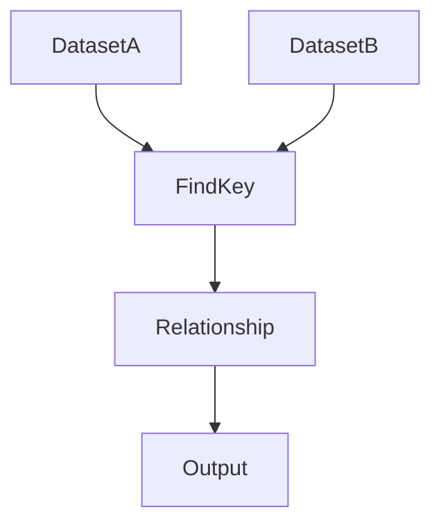
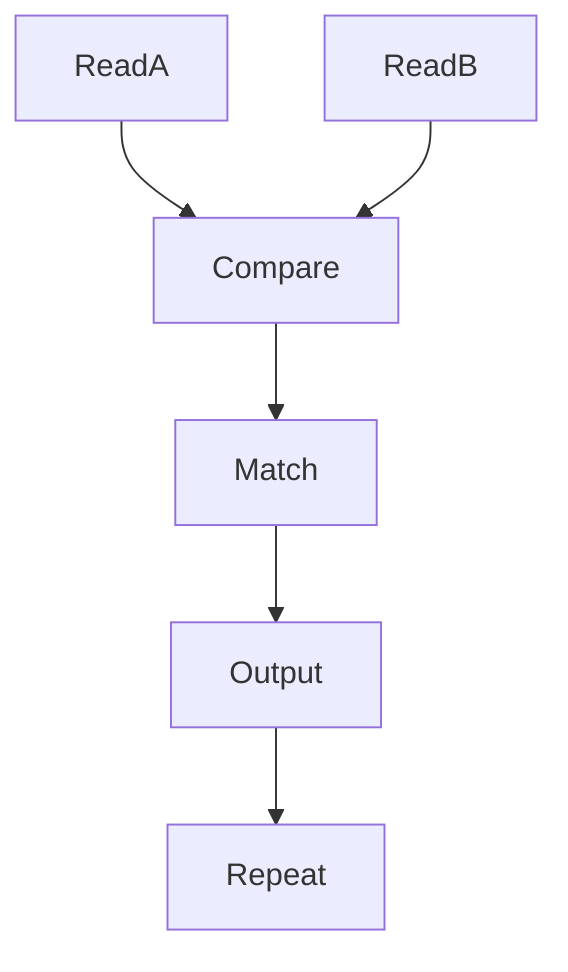
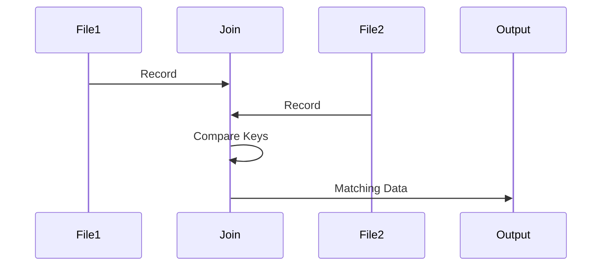

# 25 - join

---

# The Big Engineering Problem

Imagine you have two systems.

User System:

```text
1 vip

2 john

3 alex
```

Order System:

```text
1 laptop

2 phone

3 keyboard
```

Humans immediately understand.

```text
vip → laptop

john → phone

alex → keyboard
```

Computers don't.

They only see isolated data.

Modern systems continuously solve this problem.

The solution:

```text
Find Relationships
```

Linux solved this decades ago.

That tool is:

```text
join
```

---

# Why Does join Exist?

Modern systems are built from separate services.

Examples:

```text
User Service

↓

Order Service

↓

Payment Service

↓

Inventory Service
```

Data is intentionally separated.

But eventually it must be connected.

join solves this.

---

# What Is join?

Simple definition:

```text
join = Linux Data Relationship Engine
```

Traditional definition:

```text
Join lines of two files on a common field
```

For engineers:

```text
Separate Data

↓

Find Common Keys

↓

Build Relationships

↓

Generate Meaning
```

---

# Mental Model: Puzzle Pieces

Imagine two puzzle pieces.

Piece A:

```text
User ID
```

Piece B:

```text
Order ID
```

The matching value connects them.

Visual:

```text
User

↓

ID

↓

Order
```

join finds these connections.

---

# First Principles Thinking

Most systems repeatedly do this.

```text
Generate Data

↓

Separate Data

↓

Connect Data

↓

Generate Insights
```

Relationships are everywhere.

---

# Why Relationships Matter

Suppose Netflix exists.

Can one database table solve everything?

No.

Systems separate concerns.

```text
Users

Movies

Ratings

Subscriptions
```

But users expect:

```text
Single Experience
```

Relationships solve this.

---

# Where join Sits In Modern Engineering

```text
Linux

↓

Relationships

↓

Databases

↓

Backend Systems

↓

Microservices

↓

Distributed Systems
```

---

# The Linux Philosophy

Linux philosophy:

```text
Independent Components

↓

Compose Together
```

join follows the same idea.

---

# High Level Architecture



---

# The Core Concept

This is extremely important.

join is NOT merge.

join is:

```text
Find Matching Keys
```

This is the entire idea.

---

# Visual Example

users.txt

```text
1 vip

2 john

3 alex
```

orders.txt

```text
1 laptop

2 phone

3 keyboard
```

Command:

```bash
join users.txt orders.txt
```

Output:

```text
1 vip laptop

2 john phone

3 alex keyboard
```

---

# Visual

```text
Dataset A

1 vip

2 john

3 alex


Dataset B

1 laptop

2 phone

3 keyboard


Matching Key

↓

1

↓

Output

1 vip laptop
```

---

# Basic Syntax

```bash
join file1 file2
```

---

# Understanding The Join Key

Input:

```text
1 vip
```

Linux sees:

```text
Field1 → 1

Field2 → vip
```

Default join key:

```text
Field1
```

Very important.

---

# Real World Example

employees.txt

```text
101 vip

102 john

103 alex
```

departments.txt

```text
101 engineering

102 finance

103 security
```

Command:

```bash
join employees.txt departments.txt
```

Output:

```text
101 vip engineering

102 john finance

103 alex security
```

---

# Very Important Rule

join expects sorted input.

This is mandatory.

Always do:

```bash
sort file1

sort file2

join file1 file2
```

Visual:

```text
Sort

↓

Sort

↓

Join
```

---

# Why Does join Need Sorting?

Because Linux optimizes performance.

Instead of:

```text
Every Row

↓

Compare Every Row
```

It does:

```text
Sorted Data

↓

Move Sequentially
```

Much faster.

---

# Visual

Bad:

```text
N x N Comparisons
```

Good:

```text
Sequential Matching
```

---

# Internal Algorithm

Suppose:

```text
1 vip

2 john
```

and

```text
1 laptop

2 phone
```

Linux does:

```text
Pointer A

↓

Pointer B

↓

Compare Keys

↓

Match

↓

Output

↓

Move Forward
```

---

# Internal Architecture



---

# Understanding Different Fields

Sometimes the key isn't field1.

Example:

users.txt

```text
vip 101
```

departments.txt

```text
engineering 101
```

Specify fields.

```bash
join -1 2 -2 2 users.txt departments.txt
```

Meaning:

```text
File1 → Field2

File2 → Field2
```

---

# Visual

```text
File1

↓

Field2


File2

↓

Field2


Match
```

---

# Understanding -1

```text
-1

↓

Join Field For File1
```

---

# Understanding -2

```text
-2

↓

Join Field For File2
```

---

# Outer Join Thinking

By default:

```text
Only Matching Rows
```

But sometimes we want:

```text
All Rows
```

Use:

```bash
join -a 1

join -a 2
```

---

# Visual

Inner Join:

```text
A ∩ B
```

Outer Join:

```text
A + B
```

---

# SQL Connection

This is extremely important.

SQL:

```sql
SELECT *

FROM users

JOIN orders

ON users.id=orders.id;
```

This is exactly the same idea.

---

# Visual

```text
join

↓

SQL JOIN

↓

Database Thinking
```

---

# The Evolution Ladder

Very important.

```text
join

↓

SQL JOIN

↓

Backend APIs

↓

Microservices

↓

Distributed Systems
```

Same idea.

Different scale.

---

# Backend Engineering Connection

Suppose:

```text
User Service

↓

Order Service

↓

Compose Dashboard
```

This is join thinking.

---

# Microservices Connection

Microservices constantly perform joins.

```text
Service A

↓

Service B

↓

Correlate

↓

Response
```

---

# Observability Connection

Observability systems constantly correlate.

```text
Logs

↓

Metrics

↓

Traces

↓

Relationships
```

This is giant-scale join thinking.

---

# Cloud Connection

Cloud systems correlate.

```text
VM

↓

Disk

↓

Network

↓

Relationship
```

---

# Distributed Systems Connection

Distributed systems are giant relationship systems.

```text
Node A

↓

Node B

↓

Node C

↓

Global State
```

---

# Linux Internals

Suppose:

```bash
join users.txt orders.txt
```

Internally:

```text
Open Files

↓

Read Records

↓

Compare Keys

↓

Match Keys

↓

Compose Output

↓

Repeat
```

---

# Internal Working Process

Step 1

```text
Open File1
```

Step 2

```text
Open File2
```

Step 3

```text
Read Current Lines
```

Step 4

```text
Compare Keys
```

Step 5

```text
If Match

↓

Print
```

Step 6

```text
Advance Pointer
```

Repeat.

---

# Internal Architecture Diagram



---

# Production Example 1

Combine users and departments.

```bash
join users.txt departments.txt
```

---

# Production Example 2

Combine pod names and node names.

```text
Pod Data

↓

Node Data

↓

Cluster Mapping
```

---

# Production Example 3

Correlate logs.

```text
Request ID

↓

User ID

↓

Session ID
```

---

# Production Example 4

Combine metrics.

```text
CPU

↓

Memory

↓

Disk
```

---

# Production Example 5

API aggregation.

```text
User Service

↓

Order Service

↓

Payment Service
```

---

# Performance Considerations

Without sorting:

```text
N² Complexity
```

With sorting:

```text
Linear Sequential Matching
```

Huge improvement.

---

# Security Considerations

Incorrect joins create dangerous outputs.

Always validate:

```text
Keys

↓

Data Quality

↓

Relationships
```

---

# Common Mistakes

## Mistake 1

Forgetting sorting.

Wrong:

```bash
join file1 file2
```

Correct:

```bash
sort file1

sort file2

join file1 file2
```

---

## Mistake 2

Thinking join is paste.

Wrong.

```text
paste

↓

Position Based


join

↓

Relationship Based
```

---

## Mistake 3

Ignoring join keys.

---

## Mistake 4

Poor data quality.

Bad relationships create bad outputs.

---

# Troubleshooting

## Problem

No output.

Check:

```text
Sorted Data
```

---

## Problem

Wrong relationships.

Check:

```text
Join Keys
```

---

## Problem

Missing data.

Check:

```text
Data Consistency
```

---

# Production Best Practices

Always:

```text
Sort First

Validate Keys

Understand Relationships

Verify Outputs

Inspect Data
```

---

# Engineering Mindset

Do not think:

```text
join = Merge Command
```

Think:

```text
join = Relationship Primitive
```

Because modern systems are giant relationship engines.

---

# Interview Questions

## Beginner

What is join?

Why does join exist?

Why must data be sorted?

---

## Intermediate

Difference between paste and join?

What are join keys?

What do -1 and -2 do?

---

## Advanced

How does join internally work?

Why is sorting required?

How does join connect to databases?

---

# Learning Checklist

```text
☑ Understand relationships

☑ Understand join keys

☑ Understand sorting

☑ Understand SQL connections

☑ Understand microservices connections

☑ Understand distributed systems connections
```

---

# Mind Map

```text
join

├── Why It Exists

│

├── Relationships

│

├── Join Keys

│

├── Sorting

│

├── SQL

│

├── Microservices

│

├── Distributed Systems

│

├── Observability

│

├── Performance

│

├── Security

│

└── Troubleshooting
```

---

# Golden Rules

### Rule 1

join is relationship building.

---

### Rule 2

Always sort first.

---

### Rule 3

Understand keys before joining.

---

### Rule 4

Relationships create meaning.

---

### Rule 5

Bad data creates bad relationships.

---

### Rule 6

Modern systems are relationship engines.

---

### Rule 7

Database thinking starts here.

---

# First Principles Recap

```text
Generate Data

↓

Separate Data

↓

Find Relationships

↓

Generate Meaning

↓

Build Systems
```

# Key Takeaway

```text
grep

↓

Search Primitive

↓

sed

↓

Transformation Primitive

↓

awk

↓

Analytics Primitive

↓

cut

↓

Extraction Primitive

↓

sort

↓

Organization Primitive

↓

uniq

↓

Deduplication Primitive

↓

tr

↓

Normalization Primitive

↓

paste

↓

Composition Primitive

↓

join

↓

Relationship Primitive
```

These are no longer Linux commands.

These are engineering primitives used throughout modern software systems.
