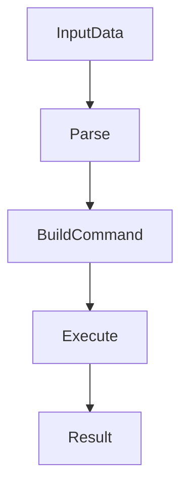
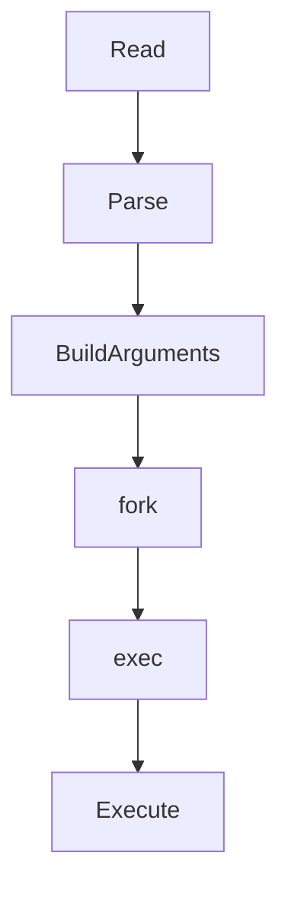

# 26 - xargs

---

# The Big Engineering Problem

Imagine Linux gives you this.

```text
server1

server2

server3

server4
```

Now somebody says:

```text
Ping all servers.

↓

Collect logs from all servers.

↓

Restart all servers.

↓

Deploy code to all servers.
```

How?

Humans think:

```text
Take Data

↓

Perform Action
```

Linux originally had a problem.

Pipelines are good at moving data.

But many commands expect arguments instead of streams.

Example:

This works:

```bash
echo hello
```

But suppose:

```bash
echo "file1 file2 file3"

↓

rm ?
```

How do we convert data into command arguments?

Linux solved this problem.

That tool is:

```text
xargs
```

---

# Why Does xargs Exist?

Modern systems continuously do this.

```text
Generate Data

↓

Convert Data Into Work

↓

Execute Work
```

Examples:

```text
Logs

↓

Delete Files

Users

↓

Send Emails

Servers

↓

Deploy Applications

Containers

↓

Restart Services
```

Automation requires action.

xargs exists to bridge:

```text
Data

↓

Actions
```

---

# What Is xargs?

Simple definition:

```text
xargs = Linux Automation Engine
```

Traditional definition:

```text
Build and execute command lines from standard input
```

For engineers:

```text
Input Data

↓

Build Commands

↓

Execute Commands
```

---

# Mental Model: Factory Robot

Imagine a factory.

Products arrive.

```text
Product

↓

Robot

↓

Action
```

xargs is that robot.

---

# First Principles Thinking

Most modern systems repeatedly do this.

```text
Generate Events

↓

Convert Events To Actions

↓

Execute Actions

↓

Automate Infrastructure
```

Automation is one of the biggest ideas in engineering.

---

# Where xargs Sits In Modern Engineering

```text
Linux

↓

Automation

↓

DevOps

↓

CI/CD

↓

Cloud

↓

Platform Engineering

↓

Distributed Systems
```

---

# The Linux Philosophy

Linux philosophy:

```text
Data Flows

↓

Actions Happen
```

xargs converts:

```text
Data

↓

Commands
```

---

# High Level Architecture



---

# The Core Problem

Suppose:

```bash
echo "file1 file2 file3"
```

produces:

```text
file1

file2

file3
```

Now we want:

```bash
rm file1 file2 file3
```

xargs builds that automatically.

---

# Visual

```text
Data

↓

xargs

↓

Commands

↓

Execution
```

---

# Basic Syntax

```bash
command | xargs action
```

---

# Example 1

```bash
echo "linux docker kubernetes" \
| xargs echo
```

Output:

```text
linux docker kubernetes
```

---

# What Actually Happened?

```text
Input Data

↓

Build Command

↓

echo linux docker kubernetes
```

---

# Example 2

Create directories.

```bash
echo "frontend backend database"

| xargs mkdir
```

Execution:

```text
mkdir frontend backend database
```

---

# Example 3

Delete files.

```bash
find . -name "*.log"

| xargs rm
```

Execution:

```text
Find Files

↓

Delete Files
```

---

# Visual

```text
find

↓

file1.log

file2.log

↓

xargs

↓

rm file1.log file2.log
```

---

# Example 4

Display file information.

```bash
find . -name "*.md"

| xargs ls -lh
```

---

# The Placeholder Problem

Sometimes commands need one item at a time.

Use:

```bash
-I {}
```

---

# Example

```bash
echo "vip john alex"

| xargs -n1 -I {} echo "User: {}"
```

Output:

```text
User: vip

User: john

User: alex
```

---

# Understanding {}

```text
{}

↓

Placeholder

↓

Current Item
```

---

# Visual

```text
vip

↓

{}

↓

User: vip
```

---

# Understanding -n

This is important.

```bash
-n
```

means:

```text
Number Of Arguments Per Command
```

---

# Example

```bash
echo "1 2 3 4 5"

| xargs -n2 echo
```

Output:

```text
1 2

3 4

5
```

---

# Visual

```text
1 2 3 4 5

↓

Split

↓

1 2

3 4

5
```

---

# Understanding -P

This is huge.

```bash
-P
```

means:

```text
Parallel Execution
```

---

# Example

```bash
echo "server1 server2 server3"

| xargs -n1 -P3 ping
```

Visual:

```text
server1

↓

Ping


server2

↓

Ping


server3

↓

Ping
```

All at once.

---

# Why Is Parallelism Important?

Modern systems love parallelism.

Without parallelism:

```text
Task1

↓

Task2

↓

Task3
```

Slow.

With parallelism:

```text
Task1

Task2

Task3

↓

Together
```

Fast.

---

# Real World Example

Restart multiple Docker containers.

```bash
docker ps -q

| xargs docker restart
```

---

# Real World Example

Delete stopped containers.

```bash
docker ps -aq

| xargs docker rm
```

---

# Real World Example

Delete old logs.

```bash
find /var/log -name "*.old"

| xargs rm
```

---

# xargs vs Loops

Many beginners do:

```bash
for file in $(find .)

do

rm "$file"

done
```

xargs is often better.

Because:

```text
Optimized

↓

Batch Processing
```

---

# Visual

Loop:

```text
Item

↓

Action

↓

Item

↓

Action
```

xargs:

```text
Batch

↓

Action
```

---

# xargs vs Pipes

This is important.

Pipes move data.

```text
Data

↓

Data
```

xargs moves actions.

```text
Data

↓

Commands

↓

Actions
```

---

# Linux Internals

Suppose:

```bash
find . -name "*.log"

| xargs rm
```

Internally:

```text
Read Input

↓

Parse Input

↓

Build Arguments

↓

fork()

↓

exec()

↓

Execute
```

---

# Internal Architecture



---

# The xargs Processing Loop

```text
Read Input

↓

Split Data

↓

Build Command

↓

Execute

↓

Repeat
```

---

# The Evolution Ladder

This is extremely important.

```text
xargs

↓

Automation

↓

DevOps

↓

CI/CD

↓

Cloud Automation

↓

Platform Engineering

↓

Distributed Systems
```

Same idea.

Different scale.

---

# CI/CD Connection

CI/CD systems do this continuously.

```text
Build

↓

Test

↓

Deploy

↓

Verify
```

Everything is action automation.

---

# Docker Connection

Docker automation:

```text
Containers

↓

Actions

↓

Automation
```

---

# Kubernetes Connection

Kubernetes is giant-scale xargs thinking.

```text
Pods

↓

Desired State

↓

Actions
```

---

# Cloud Connection

Cloud systems constantly execute actions.

```text
Events

↓

Automation

↓

Infrastructure Changes
```

---

# Platform Engineering Connection

Platform engineering is massive automation.

```text
Inputs

↓

Policies

↓

Actions

↓

Systems
```

---

# Distributed Systems Connection

Distributed systems execute actions everywhere.

```text
Node1

↓

Node2

↓

Node3

↓

Automation
```

---

# Performance Considerations

Without batching:

```text
10000 Items

↓

10000 Commands
```

Slow.

With batching:

```text
10000 Items

↓

50 Commands
```

Fast.

---

# Security Considerations (VERY IMPORTANT)

Never blindly do this.

Dangerous:

```bash
find . | xargs rm
```

Always verify first.

Safe approach:

```bash
find . -name "*.log"

| xargs ls
```

Verify.

Then:

```bash
xargs rm
```

---

# Common Mistakes

## Mistake 1

Ignoring filenames with spaces.

Wrong:

```bash
find . | xargs rm
```

Correct:

```bash
find . -print0

| xargs -0 rm
```

This is extremely important.

---

# Why -0 Exists

Suppose:

```text
linux fundamentals.pdf
```

Space breaks parsing.

Use:

```text
NULL Character
```

instead.

Visual:

```text
find

↓

-print0

↓

xargs -0
```

---

## Mistake 2

Blindly executing destructive commands.

Always inspect first.

---

## Mistake 3

Ignoring parallelism.

Use:

```bash
-P
```

when appropriate.

---

## Mistake 4

Using loops unnecessarily.

Sometimes xargs is simpler.

---

# Troubleshooting

## Problem

Files with spaces break.

Fix:

```bash
-print0

xargs -0
```

---

## Problem

Too many arguments.

Use:

```bash
-n
```

---

## Problem

Slow execution.

Use:

```bash
-P
```

---

# Production Best Practices

Always:

```text
Validate Inputs

Use -0

Batch Operations

Use Parallelism Carefully

Test Before Executing
```

---

# Engineering Mindset

Do not think:

```text
xargs = Utility Command
```

Think:

```text
xargs = Automation Primitive
```

Because modern systems are giant automation engines.

---

# Interview Questions

## Beginner

What is xargs?

Why does xargs exist?

Difference between pipes and xargs?

---

## Intermediate

What is -n ?

What is -I {} ?

What is -P ?

---

## Advanced

Why is -0 important?

How does xargs internally work?

How does xargs connect to cloud systems?

---

# Learning Checklist

```text
☑ Understand automation

☑ Understand batching

☑ Understand placeholders

☑ Understand parallelism

☑ Understand -0

☑ Understand production usage

☑ Understand cloud connections
```

---

# Mind Map

```text
xargs

├── Why It Exists

│

├── Automation

│

├── Placeholders

│

├── Batching

│

├── Parallelism

│

├── DevOps

│

├── CI/CD

│

├── Cloud

│

├── Platform Engineering

│

├── Security

│

└── Troubleshooting
```

---

# Golden Rules

### Rule 1

xargs converts data into actions.

---

### Rule 2

Automation scales systems.

---

### Rule 3

Always use `-0` with `find`.

---

### Rule 4

Validate before executing destructive actions.

---

### Rule 5

Batch operations when possible.

---

### Rule 6

Parallelism is powerful.

---

### Rule 7

Modern infrastructure is giant-scale automation.

---

# First Principles Recap

```text
Generate Data

↓

Convert Data Into Actions

↓

Execute Actions

↓

Automate Systems

↓

Scale Infrastructure
```

# Key Takeaway

```text
grep

↓

Search Primitive

↓

sed

↓

Transformation Primitive

↓

awk

↓

Analytics Primitive

↓

cut

↓

Extraction Primitive

↓

sort

↓

Organization Primitive

↓

uniq

↓

Deduplication Primitive

↓

tr

↓

Normalization Primitive

↓

paste

↓

Composition Primitive

↓

join

↓

Relationship Primitive

↓

xargs

↓

Automation Primitive ⭐⭐⭐⭐⭐
```

This is no longer Bash.

This is the foundation of modern infrastructure engineering.
