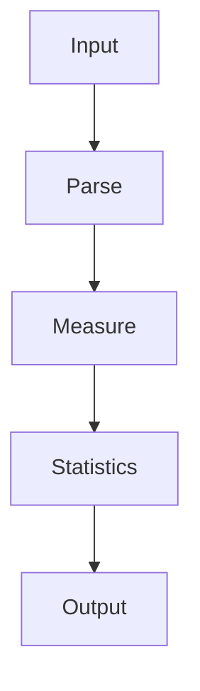
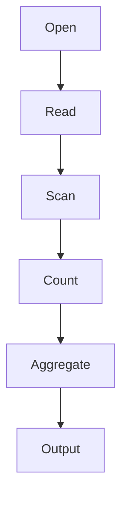

# 27 - wc

---

# The Big Engineering Problem

Imagine you're running a production system.

Someone asks:

```text
How many logs were generated today?

↓

How many users signed up?

↓

How many requests failed?

↓

How many lines are in this file?

↓

How much data are we processing?
```

You cannot optimize what you cannot measure.

Linux solved this decades ago.

The solution:

```text
Measure Everything
```

That tool is:

```text
wc
```

---

# Why Does wc Exist?

Modern systems generate huge amounts of information.

Examples:

```text
Files

Logs

Source Code

API Responses

Events

Metrics

Documents
```

Before analysis comes measurement.

wc exists to answer:

```text
How much?
```

---

# What Is wc?

Simple definition:

```text
wc = Linux Measurement Engine
```

Traditional definition:

```text
Print newline, word and byte counts
```

For engineers:

```text
Data

↓

Measure

↓

Understand Scale
```

---

# Mental Model: Digital Measuring Tape

Imagine building a house.

You measure:

```text
Length

↓

Width

↓

Height
```

Before building.

Linux does the same.

```text
Data

↓

Measure

↓

Understand

↓

Operate
```

---

# First Principles Thinking

Every modern system repeatedly does this.

```text
Generate Data

↓

Measure Data

↓

Analyze Data

↓

Make Decisions

↓

Optimize Systems
```

Measurement always comes before optimization.

---

# Why Is Measurement So Important?

Suppose your application is slow.

Can you fix it immediately?

No.

First you measure.

```text
Requests

↓

Latency

↓

Memory

↓

CPU

↓

Errors
```

This mindset is everywhere.

---

# Where wc Sits In Modern Engineering

```text
Linux

↓

Measurement

↓

Observability

↓

Monitoring

↓

SRE

↓

Distributed Systems
```

---

# The Linux Philosophy

Linux philosophy:

```text
Observe

↓

Measure

↓

Understand

↓

Improve
```

wc teaches this early.

---

# High Level Architecture



---

# What Does wc Actually Measure?

wc can measure:

```text
Lines

Words

Characters

Bytes
```

Think:

```text
Data

↓

Dimensions

↓

Statistics
```

---

# Basic Syntax

```bash
wc file.txt
```

---

# Example

File:

```text
Linux Fundamentals

Docker Kubernetes

Cloud Computing
```

Command:

```bash
wc notes.txt
```

Output:

```text
3 6 49 notes.txt
```

Meaning:

```text
3 Lines

6 Words

49 Bytes
```

---

# Visual

```text
File

↓

Measure

↓

Statistics
```

---

# Understanding -l

```bash
wc -l file.txt
```

Meaning:

```text
Count Lines
```

---

# Visual

```text
Line1

Line2

Line3

↓

3
```

---

# Understanding -w

```bash
wc -w file.txt
```

Meaning:

```text
Count Words
```

---

# Visual

```text
Linux

Docker

Kubernetes

↓

3 Words
```

---

# Understanding -c

```bash
wc -c file.txt
```

Meaning:

```text
Count Bytes
```

---

# Understanding -m

```bash
wc -m file.txt
```

Meaning:

```text
Count Characters
```

---

# Bytes vs Characters

This is very important.

ASCII:

```text
1 Character

↓

1 Byte
```

Unicode:

```text
1 Character

↓

Multiple Bytes
```

---

# Visual

```text
A

↓

1 Byte


न

↓

3 Bytes
```

---

# Understanding Standard Input

wc also works with streams.

Example:

```bash
echo "linux docker kubernetes"

| wc -w
```

Output:

```text
3
```

---

# Pipeline Thinking

This is where wc becomes powerful.

```bash
cat access.log

| wc -l
```

Execution:

```text
Logs

↓

Count

↓

Traffic Size
```

---

# Visual

```text
Large Data

↓

wc

↓

Measurements
```

---

# Linux Internals

Suppose:

```bash
wc file.txt
```

Internally:

```text
Open File

↓

Read Data

↓

Scan Characters

↓

Detect Spaces

↓

Detect Newlines

↓

Increment Counters

↓

Output Statistics
```

---

# Internal Architecture



---

# Internal Working Process

Linux continuously tracks:

```text
Characters

Words

Lines

Bytes
```

through counters.

Visual:

```text
Character Counter

↓

Word Counter

↓

Line Counter

↓

Byte Counter
```

---

# The Evolution Ladder

This is extremely important.

```text
wc

↓

Metrics

↓

Monitoring

↓

Observability

↓

SRE

↓

Distributed Systems
```

Same idea.

Different scale.

---

# Real World Example 1

Count log entries.

```bash
wc -l access.log
```

---

# Real World Example 2

Count source code size.

```bash
find . -name "*.js"

| xargs wc -l
```

---

# Real World Example 3

Count Docker containers.

```bash
docker ps

| wc -l
```

---

# Real World Example 4

Count Kubernetes pods.

```bash
kubectl get pods

| wc -l
```

---

# Real World Example 5

Count active users.

```bash
cat users.txt

| wc -l
```

---

# xargs + wc (Very Powerful)

```bash
find . -name "*.md"

| xargs wc -l
```

Execution:

```text
Find Files

↓

Measure Files
```

---

# The Engineering Story

```text
find

↓

Locate Data

↓

xargs

↓

Execute Actions

↓

wc

↓

Measure Data
```

---

# Observability Connection

Observability is giant-scale measurement.

```text
Logs

↓

Metrics

↓

Traces

↓

Dashboards
```

Everything begins with counting.

---

# Monitoring Connection

Monitoring asks:

```text
How many?

How often?

How large?

How fast?
```

wc teaches this philosophy.

---

# SRE Connection

SRE teams measure everything.

Examples:

```text
Requests Per Second

Latency

Availability

Error Rates
```

Measurement is fundamental.

---

# Docker Connection

```text
Containers

↓

Metrics

↓

Measurement
```

---

# Kubernetes Connection

```text
Pods

↓

Measurements

↓

Cluster Health
```

---

# Cloud Connection

Cloud systems are giant measurement systems.

```text
CPU

↓

Memory

↓

Network

↓

Storage
```

---

# Distributed Systems Connection

Distributed systems constantly measure.

```text
Node A

↓

Node B

↓

Node C

↓

Global Metrics
```

---

# Performance Considerations

wc is efficient because it uses:

```text
Streaming

↓

Sequential Reading

↓

Counters
```

Memory usage stays low.

---

# Security Considerations

Security teams count anomalies.

Examples:

```text
Failed Logins

↓

Count

↓

Alert
```

Measurement often detects attacks.

---

# Common Mistakes

## Mistake 1

Thinking wc only counts lines.

Wrong.

It measures multiple dimensions.

---

## Mistake 2

Confusing bytes with characters.

Very common.

---

## Mistake 3

Ignoring pipelines.

wc becomes powerful with pipelines.

---

## Mistake 4

Ignoring measurement mindset.

Measurement is foundational.

---

# Troubleshooting

## Problem

Wrong line count.

Check file formatting.

---

## Problem

Wrong word count.

Inspect delimiters.

---

## Problem

Unexpected byte counts.

Check encoding.

---

# Production Best Practices

Always:

```text
Measure First

Optimize Later

Use Pipelines

Understand Encodings

Track Trends
```

---

# Engineering Mindset

Do not think:

```text
wc = Counting Command
```

Think:

```text
wc = Measurement Primitive
```

Because modern systems are giant measurement engines.

---

# Interview Questions

## Beginner

What is wc?

What does wc stand for?

Difference between -l and -w?

---

## Intermediate

Difference between -c and -m?

How does wc process files?

Why is measurement important?

---

## Advanced

How does wc connect to observability?

How does measurement appear in SRE?

Why can't systems scale without measurement?

---

# Learning Checklist

```text
☑ Understand measurement

☑ Understand line counting

☑ Understand word counting

☑ Understand byte counting

☑ Understand observability connections

☑ Understand production usage

☑ Understand distributed systems connections
```

---

# Mind Map

```text
wc

├── Why It Exists

│

├── Measurement

│

├── Lines

│

├── Words

│

├── Bytes

│

├── Characters

│

├── Observability

│

├── Monitoring

│

├── SRE

│

├── Distributed Systems

│

├── Security

│

└── Troubleshooting
```

---

# Golden Rules

### Rule 1

You cannot optimize what you cannot measure.

---

### Rule 2

Measure before optimizing.

---

### Rule 3

Understand bytes vs characters.

---

### Rule 4

Everything eventually becomes metrics.

---

### Rule 5

Measurement drives engineering decisions.

---

### Rule 6

Modern systems continuously measure themselves.

---

### Rule 7

Observability begins with counting.

---

# First Principles Recap

```text
Generate Data

↓

Measure Data

↓

Analyze Data

↓

Understand Systems

↓

Optimize Systems

↓

Scale Systems
```

# Key Takeaway

```text
grep

↓

Search Primitive

↓

sed

↓

Transformation Primitive

↓

awk

↓

Analytics Primitive

↓

cut

↓

Extraction Primitive

↓

sort

↓

Organization Primitive

↓

uniq

↓

Deduplication Primitive

↓

tr

↓

Normalization Primitive

↓

paste

↓

Composition Primitive

↓

join

↓

Relationship Primitive

↓

xargs

↓

Automation Primitive

↓

wc

↓

Measurement Primitive ⭐⭐⭐⭐⭐
```

At this point, your Bash folder is no longer Bash scripting.

It is becoming a **Systems Data Engineering Handbook**.
