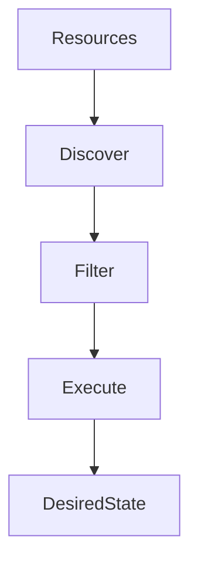
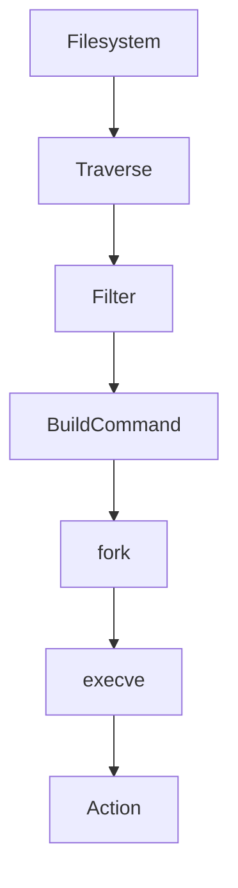

# 28 - find and exec

---

# The Big Engineering Problem

Imagine you are managing a server.

Inside the server:

```text
200 files

↓

2000 files

↓

20000 files

↓

200000 files

↓

2000000 files
```

Now somebody asks:

```text
Delete all old logs.

↓

Change permissions.

↓

Compress backups.

↓

Analyze source code.

↓

Scan security issues.

↓

Deploy configurations.
```

Can humans manually do this?

No.

Modern infrastructure doesn't scale through manual operations.

It scales through automation.

Linux solved this decades ago.

The solution:

```text
Discover Resources

↓

Apply Rules

↓

Execute Actions
```

That system is:

```text
find + exec
```

---

# Why Does find + exec Exist?

Modern systems continuously perform this workflow.

```text
Resources Exist

↓

Find Resources

↓

Evaluate Rules

↓

Execute Actions

↓

Maintain Systems
```

Examples:

```text
Find Logs

↓

Delete Logs


Find Containers

↓

Restart Containers


Find Old Backups

↓

Compress Backups


Find Source Files

↓

Analyze Code
```

---

# What Is find + exec?

Simple definition:

```text
find + exec = Infrastructure Automation Engine
```

Traditional definition:

```text
Find files and execute commands on them.
```

For engineers:

```text
Resource Discovery

↓

Policy Evaluation

↓

Action Execution
```

---

# Mental Model: Autonomous Robot

Imagine a warehouse robot.

```text
Scan Warehouse

↓

Find Boxes

↓

Apply Rules

↓

Perform Action
```

Linux does exactly this.

---

# First Principles Thinking

Most large systems repeatedly perform this.

```text
Discover Resources

↓

Evaluate Conditions

↓

Take Actions

↓

Maintain Desired State
```

This idea exists everywhere.

---

# This Is Bigger Than Linux

This same pattern exists in:

```text
Linux find + exec

↓

CI/CD Pipelines

↓

Cloud Automation

↓

Kubernetes Controllers

↓

Terraform

↓

Platform Engineering
```

---

# Where find + exec Sits In Systems Engineering

```text
Linux

↓

Automation

↓

Infrastructure Management

↓

Cloud

↓

Platform Engineering

↓

Distributed Systems
```

---

# The Core Idea

This is extremely important.

find + exec is NOT:

```text
Find Files
```

find + exec is:

```text
Find Resources

↓

Apply Policies

↓

Execute Actions
```

---

# High Level Architecture



---

# Understanding find

Suppose:

```text
project/

src/

logs/

images/

config/
```

find does:

```text
Traverse

↓

Discover

↓

Return Resources
```

---

# Understanding exec

exec does:

```text
Take Resource

↓

Execute Action
```

---

# Visual

```text
find

↓

Resources

↓

exec

↓

Actions
```

---

# Basic Syntax

```bash
find PATH CONDITION -exec COMMAND {} \;
```

---

# Understanding {}

This is extremely important.

```text
{}

↓

Current Resource
```

Visual:

```text
app.log

↓

{}

↓

rm app.log
```

---

# Understanding \;

This means:

```text
End Of Command
```

Linux needs this delimiter.

---

# Example 1

Delete old logs.

```bash
find . -name "*.log" -exec rm {} \;
```

---

# Execution Flow

```text
Find File

↓

Pass To rm

↓

Delete

↓

Repeat
```

---

# Visual

```text
error.log

↓

rm error.log

↓

Delete
```

---

# Example 2

Display file information.

```bash
find . -name "*.md" -exec ls -lh {} \;
```

---

# Example 3

Change permissions.

```bash
find . -type f -exec chmod 644 {} \;
```

---

# Example 4

Change ownership.

```bash
find . -type d -exec chown ubuntu:ubuntu {} \;
```

---

# Example 5

Compress backups.

```bash
find backups -name "*.sql" \
-exec gzip {} \;
```

---

# The Engineering Pipeline

```text
Discover

↓

Select

↓

Execute
```

This pattern appears everywhere.

---

# Understanding + Instead Of \;

This is one of the most important optimizations.

Traditional:

```bash
find . -exec rm {} \;
```

means:

```text
1 Resource

↓

1 Command

↓

Repeat
```

Very expensive.

---

# Visual

```text
file1

↓

rm file1


file2

↓

rm file2


file3

↓

rm file3
```

---

# Optimized Version

```bash
find . -exec rm {} +
```

Now Linux does:

```text
file1

file2

file3

↓

rm file1 file2 file3
```

Batch execution.

Much faster.

---

# Performance Comparison

Traditional:

```text
10000 Files

↓

10000 Processes
```

Optimized:

```text
10000 Files

↓

50 Processes
```

Huge difference.

---

# Internal Linux Mechanism

Suppose:

```bash
find . -name "*.log"

-exec rm {} \;
```

Internally:

```text
Traverse Filesystem

↓

Evaluate Rules

↓

Build Command

↓

fork()

↓

execve()

↓

Execute
```

---

# Internal Architecture



---

# How find Traverses Directories

Linux recursively visits.

```text
Root

↓

Directory

↓

Subdirectory

↓

Files
```

Visual:

```text
project/

├── src/

├── config/

└── logs/
```

---

# The Policy Engine Analogy

find behaves like a policy engine.

```text
IF

File Is Log

↓

Delete
```

This is exactly how cloud policies work.

---

# Cloud Connection

AWS Automation:

```text
Find Resources

↓

Apply Rules

↓

Execute Actions
```

Same idea.

---

# Kubernetes Connection

Kubernetes Controllers:

```text
Current State

↓

Desired State

↓

Actions
```

This is giant-scale find + exec.

---

# CI/CD Connection

CI/CD pipelines continuously do:

```text
Find Artifacts

↓

Test Artifacts

↓

Deploy Artifacts
```

---

# Platform Engineering Connection

Platform teams automate:

```text
Resources

↓

Policies

↓

Actions
```

---

# Security Connection

Security teams continuously do:

```text
Find Secrets

↓

Find Vulnerabilities

↓

Find Misconfigurations

↓

Fix Problems
```

---

# Observability Connection

Observability systems do:

```text
Find Logs

↓

Analyze Logs

↓

Generate Alerts
```

---

# Infrastructure As Code Connection

Terraform:

```text
Discover Resources

↓

Compare State

↓

Apply Changes
```

Same philosophy.

---

# Distributed Systems Connection

Distributed systems continuously do:

```text
Find Nodes

↓

Find Services

↓

Apply Actions
```

---

# Production Example 1

Delete logs older than 30 days.

```bash
find /var/log -mtime +30 \
-exec rm {} +
```

---

# Production Example 2

Find large files.

```bash
find / -size +500M
```

---

# Production Example 3

Backup databases.

```bash
find backups -name "*.sql" \
-exec gzip {} +
```

---

# Production Example 4

Audit permissions.

```bash
find /var/www \
-type f \
-exec ls -l {} +
```

---

# Production Example 5

Analyze source code.

```bash
find . -name "*.js" \
-exec wc -l {} +
```

---

# Security Considerations (VERY IMPORTANT)

This is dangerous.

Never blindly run:

```bash
find / -exec rm {} \;
```

This can destroy systems.

Always test first.

Safe workflow:

```bash
find

↓

Inspect

↓

Execute
```

---

# Common Mistakes

## Mistake 1

Blind deletion.

Dangerous.

---

## Mistake 2

Using \; instead of +

When batching is possible.

---

## Mistake 3

Searching entire root unnecessarily.

```bash
find /
```

Can be expensive.

---

## Mistake 4

Ignoring permissions.

Some directories are protected.

---

# Troubleshooting

## Problem

Permission denied.

Check:

```bash
sudo
```

---

## Problem

Very slow.

Reduce search scope.

---

## Problem

Too many files.

Use:

```text
Batch Execution
```

---

## Problem

Accidental deletion.

Always dry run first.

---

# Production Best Practices

Always:

```text
Narrow Search Scope

Validate Results

Use Batch Execution

Avoid Blind Deletion

Apply Least Privilege
```

---

# Engineering Mindset

Do not think:

```text
find + exec = File Utility
```

Think:

```text
find + exec = Policy Driven Infrastructure Engine
```

Because modern infrastructure continuously performs:

```text
Discovery

↓

Evaluation

↓

Actions
```

---

# Interview Questions

## Beginner

What is find + exec?

What does {} mean?

What does \; mean?

---

## Intermediate

Difference between \; and + ?

Why is batching faster?

How does find traverse directories?

---

## Advanced

How does find + exec connect to Kubernetes?

How does it connect to cloud automation?

Why is this a policy engine?

---

# Learning Checklist

```text
☑ Understand resource discovery

☑ Understand action execution

☑ Understand placeholders

☑ Understand batching

☑ Understand internals

☑ Understand cloud connections

☑ Understand platform engineering
```

---

# Mind Map

```text
find + exec

├── Why It Exists

│

├── Resource Discovery

│

├── Policy Evaluation

│

├── Action Execution

│

├── Batching

│

├── CI/CD

│

├── Kubernetes

│

├── Cloud

│

├── Platform Engineering

│

├── Security

│

└── Troubleshooting
```

---

# Golden Rules

### Rule 1

Everything starts with resource discovery.

---

### Rule 2

Automate repetitive work.

---

### Rule 3

Batch operations whenever possible.

---

### Rule 4

Never execute blindly.

---

### Rule 5

Infrastructure is policies plus actions.

---

### Rule 6

Modern systems continuously reconcile state.

---

### Rule 7

Kubernetes is giant-scale find + exec thinking.

---

# First Principles Recap

```text
Resources Exist

↓

Discover Resources

↓

Evaluate Rules

↓

Execute Actions

↓

Maintain Systems

↓

Scale Infrastructure
```

# Key Takeaway

```text
grep

↓

Search Primitive

↓

sed

↓

Transformation Primitive

↓

awk

↓

Analytics Primitive

↓

cut

↓

Extraction Primitive

↓

sort

↓

Organization Primitive

↓

uniq

↓

Deduplication Primitive

↓

tr

↓

Normalization Primitive

↓

paste

↓

Composition Primitive

↓

join

↓

Relationship Primitive

↓

xargs

↓

Automation Primitive

↓

find + exec

↓

Policy Driven Infrastructure Primitive ⭐⭐⭐⭐⭐
```

**This file is one of the bridges between Linux and Platform Engineering.**
