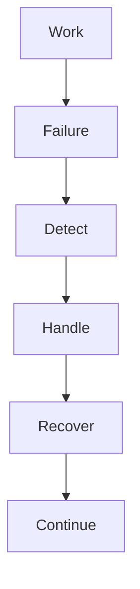
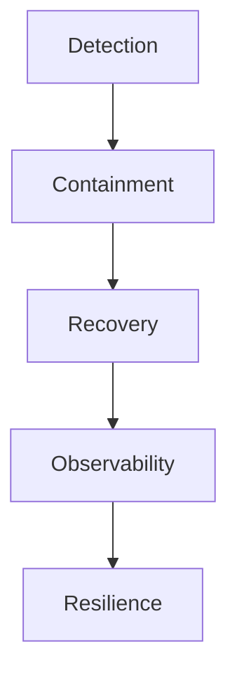
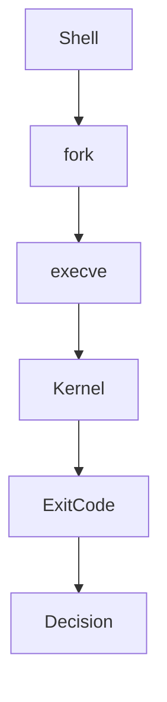

# 29 - Error Handling

---

# The Big Engineering Problem

Imagine you're running a production company.

Every second:

```text
Servers Fail

↓

Networks Fail

↓

Disks Fail

↓

Databases Fail

↓

Containers Crash

↓

Services Timeout

↓

Users Enter Invalid Data
```

Failures are not exceptions.

Failures are normal.

This is one of the biggest mindset shifts in engineering.

Beginners think:

```text
Code

↓

Success
```

Engineers think:

```text
Code

↓

Failure Is Guaranteed
```

Linux solved this decades ago.

The solution:

```text
Expect Failure

↓

Detect Failure

↓

Handle Failure

↓

Recover Safely
```

This is error handling.

---

# Why Does Error Handling Exist?

Computers live in imperfect environments.

Nothing is guaranteed.

Examples:

```text
File Does Not Exist

↓

Disk Is Full

↓

Permission Denied

↓

API Timeout

↓

Server Crash

↓

Memory Exhaustion
```

Systems must survive uncertainty.

Error handling exists because reality is unreliable.

---

# What Is Error Handling?

Simple definition:

```text
Error Handling = Failure Management System
```

Traditional definition:

```text
Mechanisms for detecting and responding to errors.
```

For engineers:

```text
Failure

↓

Detection

↓

Decision

↓

Recovery
```

---

# Mental Model: Airplane Systems

Imagine an airplane.

Engineers never assume:

```text
Everything Will Work
```

Instead:

```text
Primary System

↓

Backup System

↓

Emergency System

↓

Recovery System
```

Linux scripts should be built the same way.

---

# First Principles Thinking

Every modern system repeatedly does this.

```text
Work

↓

Failure Happens

↓

Detect Failure

↓

Respond

↓

Recover

↓

Continue Operating
```

---

# The Biggest Engineering Mindset Shift

Do NOT think:

```text
How do I make my script work?
```

Think:

```text
How will my script fail?
```

This mindset changes everything.

---

# Failure Is Everywhere

Examples:

```text
Filesystem Failure

↓

Network Failure

↓

Authentication Failure

↓

Dependency Failure

↓

Resource Exhaustion

↓

Human Error
```

---

# Where Error Handling Sits In Modern Engineering

```text
Linux

↓

Automation

↓

Reliability Engineering

↓

SRE

↓

Cloud

↓

Distributed Systems
```

---

# Error Handling Lifecycle



---

# The Four Pillars Of Error Handling

Every system needs:

```text
Detection

↓

Containment

↓

Recovery

↓

Observability
```

---

# Pillar 1: Detection

Something failed.

```text
Can We Detect It?
```

---

# Pillar 2: Containment

Prevent cascading failures.

```text
One Failure

↓

Does Not Destroy Everything
```

---

# Pillar 3: Recovery

How do we continue?

```text
Retry

↓

Fallback

↓

Exit Safely
```

---

# Pillar 4: Observability

Can humans understand what happened?

```text
Logs

↓

Metrics

↓

Alerts
```

---

# Bash Exit Codes

This is one of the most important Linux concepts.

Every Linux command returns a number.

```text
0

↓

Success
```

Anything else:

```text
Failure
```

---

# Visual

```text
Command

↓

Exit Code

↓

Decision
```

---

# Example

```bash
mkdir project
```

Check result:

```bash
echo $?
```

Output:

```text
0
```

---

# Example Failure

```bash
cat missing.txt
```

Check:

```bash
echo $?
```

Output:

```text
1
```

---

# Understanding $?

```text
$?

↓

Previous Command Status
```

---

# The Linux Decision Engine

```text
Command

↓

Exit Code

↓

Success?

↓

Continue

OR

Handle Error
```

---

# Basic Error Handling

Example:

```bash
mkdir project || echo "Failed"
```

Visual:

```text
mkdir

↓

Failed?

↓

Print Message
```

---

# Understanding ||

This means:

```text
OR

Execute If Previous Failed
```

---

# Understanding &&

This means:

```text
AND

Execute If Previous Succeeded
```

---

# Visual

```text
Success

↓

Next Step
```

---

# Example

```bash
mkdir logs && cd logs
```

---

# Why This Matters

Without checking:

```text
mkdir fails

↓

cd executes

↓

Everything breaks
```

---

# Explicit Error Checking

Example:

```bash
if ! mkdir logs

then

echo "Creation failed"

exit 1

fi
```

---

# Understanding exit

```bash
exit 1
```

means:

```text
Stop Program

↓

Return Error
```

---

# Standard Exit Code Convention

| Exit Code | Meaning |
|-----------|---------|
| 0 | Success |
| 1 | General Error |
| 2 | Misuse |
| 126 | Permission Problem |
| 127 | Command Not Found |
| 130 | Interrupted |

---

# The Problem With Pipelines

Example:

```bash
cat missing.txt | grep linux
```

What failed?

Difficult to know.

---

# Enter pipefail

```bash
set -o pipefail
```

This is extremely important.

---

# Visual

Without pipefail:

```text
Command1 Fails

↓

Command2 Succeeds

↓

Pipeline Looks Successful
```

Dangerous.

---

# With pipefail

```text
Any Failure

↓

Pipeline Fails
```

---

# Understanding set -e

```bash
set -e
```

Means:

```text
Stop On First Failure
```

---

# Visual

```text
Step1

↓

Step2

↓

Failure

↓

STOP
```

---

# Understanding set -u

```bash
set -u
```

Means:

```text
Undefined Variables Are Errors
```

---

# Example

Wrong:

```bash
echo $USERNAME
```

If missing:

```text
Unexpected Behavior
```

With:

```bash
set -u
```

Linux stops immediately.

---

# Understanding set -x

Very important for debugging.

```bash
set -x
```

Shows:

```text
Commands

↓

Execution Flow
```

---

# The Golden Production Combination

Almost every production Bash script starts with:

```bash
set -euo pipefail
```

This means:

```text
-e

↓

Stop On Error


-u

↓

Undefined Variables Fail


-o pipefail

↓

Pipelines Fail Properly
```

---

# Visual

```text
Safer Script

↓

Fewer Surprises

↓

Better Reliability
```

---

# Trap: The Hidden Superpower

This is one of the most important Bash features.

Suppose your script crashes.

Can we clean up resources?

Yes.

```bash
trap cleanup EXIT
```

---

# Example

```bash
cleanup() {

rm -f temp.txt

}

trap cleanup EXIT
```

---

# Visual

```text
Script Ends

↓

cleanup()

↓

Resources Removed
```

---

# Why Is This Important?

Imagine:

```text
Temporary Files

↓

Database Connections

↓

Locks

↓

Resources
```

They must be cleaned.

---

# The Reliability Pyramid



---

# Production Error Pattern 1

Retry Logic.

```text
Failure

↓

Wait

↓

Retry

↓

Success
```

---

# Production Error Pattern 2

Fallback Logic.

```text
Primary System

↓

Failure

↓

Backup System
```

---

# Production Error Pattern 3

Graceful Exit.

```text
Failure

↓

Save State

↓

Exit Safely
```

---

# Production Script Template

```bash
#!/bin/bash

set -euo pipefail

cleanup() {

echo "Cleaning"

}

trap cleanup EXIT

echo "Starting"

if ! mkdir logs

then

echo "Failed"

exit 1

fi

echo "Done"
```

---

# Linux Internals

Suppose:

```bash
mkdir project
```

Internally:

```text
Shell

↓

fork()

↓

execve()

↓

Kernel

↓

Return Exit Code

↓

Shell Receives Result
```

---

# Internal Architecture



---

# Cloud Connection

Cloud systems constantly do:

```text
Failure

↓

Retry

↓

Recover
```

---

# Kubernetes Connection

Kubernetes is giant-scale error handling.

```text
Pod Crashes

↓

Detect

↓

Restart
```

---

# Docker Connection

Docker continuously does:

```text
Container Fails

↓

Restart Policy
```

---

# SRE Connection

SRE teams build:

```text
Reliable Systems

↓

Failure Recovery
```

---

# Distributed Systems Connection

Distributed systems assume failure.

Always.

```text
Node Fails

↓

Recover

↓

Continue
```

---

# Performance Considerations

Avoid:

```text
Infinite Retries
```

Always:

```text
Retry With Limits
```

---

# Security Considerations

Never hide failures.

Bad:

```bash
command > /dev/null 2>&1
```

Good:

```text
Log Failures

↓

Investigate Failures
```

---

# Common Mistakes

## Mistake 1

Ignoring exit codes.

---

## Mistake 2

Not using:

```bash
set -euo pipefail
```

---

## Mistake 3

Ignoring cleanup.

---

## Mistake 4

Hiding errors.

---

## Mistake 5

Assuming success.

---

# Troubleshooting Framework

```text
Failure

↓

Observe

↓

Diagnose

↓

Fix

↓

Verify

↓

Document
```

---

# Production Best Practices

Always:

```text
Assume Failure

Fail Fast

Fail Safely

Log Everything

Cleanup Resources

Use Retries Carefully
```

---

# Engineering Mindset

Do not think:

```text
Error Handling = Error Messages
```

Think:

```text
Error Handling = Failure Engineering
```

Because all modern systems eventually fail.

Reliable systems are systems that recover.

---

# Interview Questions

## Beginner

What is an exit code?

What is `$?`

What does `||` do?

---

## Intermediate

What is `set -e`?

What is `pipefail`?

What is `trap`?

---

## Advanced

How does Kubernetes use error handling?

Why is failure inevitable?

How do distributed systems handle failures?

---

# Learning Checklist

```text
☑ Understand exit codes

☑ Understand failure engineering

☑ Understand set -e

☑ Understand set -u

☑ Understand pipefail

☑ Understand trap

☑ Understand recovery
```

---

# Mind Map

```text
Error Handling

├── Failure Engineering

│

├── Exit Codes

│

├── Detection

│

├── Recovery

│

├── pipefail

│

├── trap

│

├── SRE

│

├── Cloud

│

├── Kubernetes

│

├── Security

│

└── Troubleshooting
```

---

# Golden Rules

### Rule 1

Failures are normal.

---

### Rule 2

Always assume failure.

---

### Rule 3

Use:

```bash
set -euo pipefail
```

---

### Rule 4

Never hide failures.

---

### Rule 5

Cleanup resources.

---

### Rule 6

Observability is mandatory.

---

### Rule 7

Reliable systems are recoverable systems.

---

# First Principles Recap

```text
Failure Happens

↓

Detect Failure

↓

Contain Failure

↓

Recover

↓

Continue Operating

↓

Scale Systems
```

# Key Takeaway

```text
grep

↓

Search Primitive

↓

sed

↓

Transformation Primitive

↓

awk

↓

Analytics Primitive

↓

cut

↓

Extraction Primitive

↓

sort

↓

Organization Primitive

↓

uniq

↓

Deduplication Primitive

↓

tr

↓

Normalization Primitive

↓

paste

↓

Composition Primitive

↓

join

↓

Relationship Primitive

↓

xargs

↓

Automation Primitive

↓

find + exec

↓

Infrastructure Primitive

↓

Error Handling

↓

Failure Engineering Primitive ⭐⭐⭐⭐⭐
```

**At this point your Bash module is no longer Bash scripting. It is becoming Reliability Engineering (SRE) fundamentals.**
