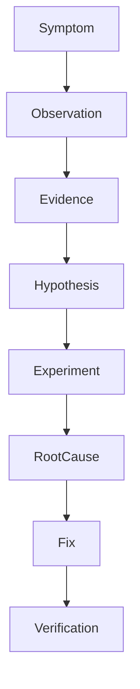
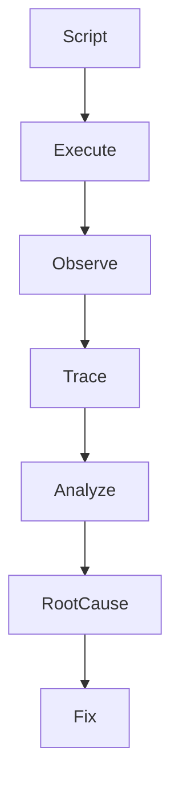
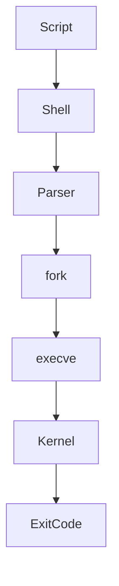

# 30 - Debugging

---

# The Big Engineering Problem

Imagine a production system.

Everything worked yesterday.

Today:

```text
API returns 500

↓

Users cannot login

↓

Database connections fail

↓

Containers restart

↓

Memory usage spikes

↓

Latency increases
```

What happened?

Nobody knows.

This is debugging.

Most beginners think:

```text
Code Broken

↓

Fix Code
```

This is wrong.

Great engineers think:

```text
Reality Exists

↓

Something Changed

↓

Discover The Truth
```

Debugging is the process of discovering reality.

---

# Why Does Debugging Exist?

Because systems are complex.

Complexity creates uncertainty.

Examples:

```text
Wrong Variable

↓

Wrong Permissions

↓

Missing Dependency

↓

Bad Configuration

↓

Network Failure

↓

Human Error

↓

Race Condition
```

Something will eventually fail.

Debugging exists because systems are imperfect.

---

# What Is Debugging?

Simple definition:

```text
Debugging = Discovering Why Reality Differs From Expectations
```

Traditional definition:

```text
The process of finding and fixing bugs.
```

For engineers:

```text
Expectation

↓

Reality

↓

Difference

↓

Root Cause

↓

Solution
```

---

# Mental Model: Detective Work

Imagine a detective.

A detective does not guess.

A detective gathers evidence.

```text
Observe

↓

Collect Evidence

↓

Build Hypothesis

↓

Test Hypothesis

↓

Find Truth
```

Debugging works exactly the same way.

---

# First Principles Thinking

Every debugging process is:

```text
Symptom

↓

Observation

↓

Hypothesis

↓

Experiment

↓

Evidence

↓

Root Cause

↓

Fix

↓

Verification
```

Never skip steps.

---

# The Biggest Beginner Mistake

Beginners do:

```text
See Error

↓

Panic

↓

Randomly Change Things
```

This creates bigger problems.

Engineers do:

```text
See Error

↓

Slow Down

↓

Observe

↓

Investigate

↓

Fix
```

---

# The Debugging Pyramid



---

# The Golden Rule Of Debugging

Never ask:

```text
How do I fix this?
```

Always ask:

```text
What is actually happening?
```

This question changes everything.

---

# The Universal Debugging Workflow

```text
1. Observe

↓

2. Reproduce

↓

3. Isolate

↓

4. Investigate

↓

5. Verify

↓

6. Fix

↓

7. Prevent Recurrence
```

---

# Step 1: Observe

Do not immediately change anything.

Observe.

Ask:

```text
What broke?

↓

When?

↓

Where?

↓

Who is affected?

↓

What changed?
```

---

# Step 2: Reproduce

Can you reproduce the issue?

```text
Yes

↓

Good

↓

Can Debug
```

or

```text
No

↓

Collect More Evidence
```

---

# Step 3: Isolate

Find the smallest failing component.

Example:

```text
Entire Application Down
```

Break it apart.

```text
Frontend

↓

Backend

↓

Database

↓

Network
```

Find where failure begins.

---

# The Isolation Tree

```text
Application

├── Frontend

├── Backend

├── Database

└── Network
```

---

# Step 4: Build Hypotheses

Never guess.

Always build hypotheses.

Example:

```text
API Failed

↓

Maybe Database Is Down

↓

Let's Verify
```

---

# Step 5: Verify

Collect evidence.

Evidence beats assumptions.

---

# Step 6: Fix

Only after verification.

---

# Step 7: Prevent Recurrence

Always ask:

```text
Why did this happen?

↓

How do we stop it forever?
```

---

# Debugging In Bash

Suppose:

```bash
#!/bin/bash

mkdir logs

cd log

echo done
```

It fails.

Why?

Observe.

---

# Enable Debug Mode

This is one of the most important commands.

```bash
set -x
```

---

# Example

```bash
#!/bin/bash

set -x

mkdir logs

cd log

echo done
```

Output:

```text
+ mkdir logs

+ cd log

cd: log: No such file

+ echo done
```

Now reality is visible.

---

# Understanding set -x

Think:

```text
Hidden Execution

↓

Visible Execution
```

---

# Visual

```text
Commands

↓

Execution Trace

↓

Reality
```

---

# Understanding set +x

Turn debugging off.

```bash
set +x
```

---

# Debug Only Certain Sections

```bash
set -x

critical_function

set +x
```

---

# Logging Is Debugging

Engineers constantly log.

Bad:

```bash
deploy_app
```

Good:

```bash
echo "Deploy started"

deploy_app

echo "Deploy finished"
```

---

# Debugging Variables

Print variables.

```bash
echo "$USER"

echo "$PATH"

echo "$HOME"
```

---

# Validate Variables

Example:

```bash
echo "PORT=$PORT"
```

---

# The "Echo Everywhere" Technique

Very common.

```bash
echo "Step 1"

echo "Step 2"

echo "Step 3"
```

---

# Error Line Detection

This is powerful.

```bash
trap 'echo "Error at line $LINENO"' ERR
```

---

# Example

```bash
#!/bin/bash

set -e

trap 'echo "Failed at line $LINENO"' ERR

mkdir logs

cd missing

echo done
```

Output:

```text
Failed at line 7
```

---

# Bash Syntax Validation

This is one of the most important commands.

```bash
bash -n script.sh
```

Meaning:

```text
Validate Syntax

↓

Do Not Execute
```

---

# Visual

```text
Script

↓

Check Grammar

↓

Report Errors
```

---

# Debugging Architecture



---

# The Five Levels Of Debugging

## Level 1

Print statements.

```text
echo
```

---

## Level 2

Execution tracing.

```text
set -x
```

---

## Level 3

Syntax checking.

```text
bash -n
```

---

## Level 4

Error trapping.

```text
trap ERR
```

---

## Level 5

Systems debugging.

```text
Logs

↓

Metrics

↓

Tracing
```

---

# The 5 Whys Technique

Keep asking:

```text
Why?
```

Example:

```text
App crashed

↓

Why?

Database unavailable

↓

Why?

Container restarted

↓

Why?

Out Of Memory

↓

Why?

Memory leak
```

Root cause found.

---

# Production Debugging Workflow

```text
Incident

↓

Logs

↓

Metrics

↓

Traces

↓

Hypothesis

↓

Verification

↓

Fix
```

---

# Linux Internals

Suppose:

```bash
./deploy.sh
```

Internally:

```text
Shell

↓

Parse Script

↓

fork()

↓

execve()

↓

Kernel

↓

Return Status

↓

Shell
```

---

# Internal Architecture



---

# Docker Connection

Container debugging.

```text
Container

↓

Logs

↓

Processes

↓

Resources
```

---

# Kubernetes Connection

Kubernetes debugging.

```text
Pod

↓

Events

↓

Logs

↓

Containers

↓

Network
```

---

# Cloud Connection

Cloud debugging.

```text
Compute

↓

Storage

↓

Network

↓

IAM
```

---

# Observability Connection

Observability is giant-scale debugging.

```text
Logs

↓

Metrics

↓

Traces

↓

Reality
```

---

# Distributed Systems Connection

Distributed systems are debugging machines.

```text
Node A

↓

Node B

↓

Node C

↓

Global Reality
```

---

# Common Mistakes

## Mistake 1

Changing things randomly.

---

## Mistake 2

Skipping observation.

---

## Mistake 3

Ignoring logs.

---

## Mistake 4

Guessing.

---

## Mistake 5

Fixing symptoms.

---

# Troubleshooting Framework

```text
Observe

↓

Reproduce

↓

Isolate

↓

Investigate

↓

Verify

↓

Fix

↓

Prevent
```

---

# Production Best Practices

Always:

```text
Collect Evidence

Build Hypotheses

Verify Assumptions

Document Findings

Automate Prevention
```

---

# Engineering Mindset

Do not think:

```text
Debugging = Fixing Errors
```

Think:

```text
Debugging = Modeling Reality
```

Because systems are simply reality waiting to be understood.

---

# Interview Questions

## Beginner

What is debugging?

What does `set -x` do?

What does `bash -n` do?

---

## Intermediate

What does `trap ERR` do?

What is root cause analysis?

What are the 5 Whys?

---

## Advanced

How does observability relate to debugging?

Why do distributed systems make debugging difficult?

How do SRE teams debug production systems?

---

# Learning Checklist

```text
☑ Understand debugging mindset

☑ Understand root causes

☑ Understand set -x

☑ Understand bash -n

☑ Understand trap ERR

☑ Understand evidence collection

☑ Understand production debugging
```

---

# Mind Map

```text
Debugging

├── Observation

│

├── Reproduction

│

├── Isolation

│

├── Hypothesis

│

├── Verification

│

├── Root Cause Analysis

│

├── Observability

│

├── Distributed Systems

│

├── Prevention

│

└── Troubleshooting
```

---

# Golden Rules

### Rule 1

Do not guess.

---

### Rule 2

Evidence beats assumptions.

---

### Rule 3

Always reproduce the problem.

---

### Rule 4

Isolate before fixing.

---

### Rule 5

Fix root causes, not symptoms.

---

### Rule 6

Logs are your friends.

---

### Rule 7

Debugging is discovering reality.

---

# First Principles Recap

```text
Reality Exists

↓

Observe Reality

↓

Build Hypotheses

↓

Verify Hypotheses

↓

Find Root Cause

↓

Fix Systems

↓

Prevent Future Failures
```

# Key Takeaway

```text
grep

↓

Search Primitive

↓

awk

↓

Analytics Primitive

↓

sort

↓

Organization Primitive

↓

uniq

↓

Deduplication Primitive

↓

xargs

↓

Automation Primitive

↓

Error Handling

↓

Failure Engineering Primitive

↓

Debugging

↓

Reality Modeling Primitive ⭐⭐⭐⭐⭐
```

**Senior engineers are not faster typists.**

**Senior engineers build accurate mental models of reality.**
