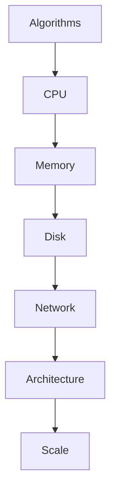
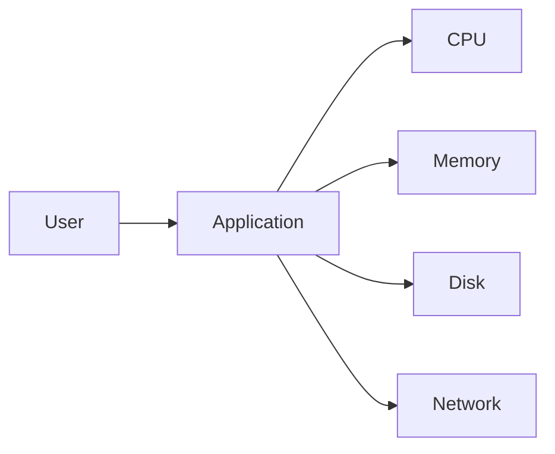
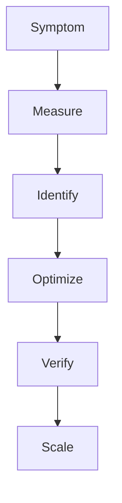
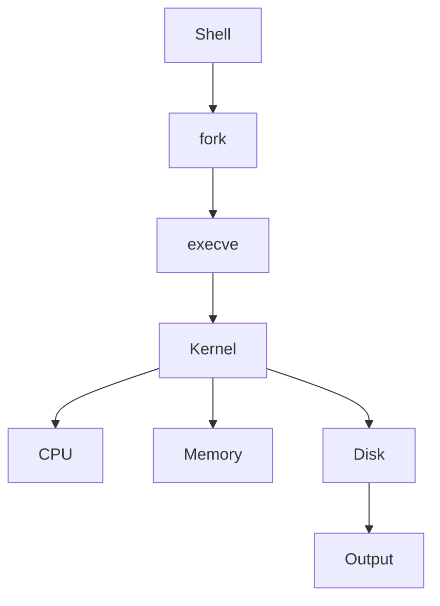

# 31 - Performance Optimization

---

# The Big Engineering Problem

Imagine a system.

Initially:

```text
10 users
```

Everything works.

Then:

```text
100 users
```

Still works.

Then:

```text
1000 users
```

Slight slowdown.

Then:

```text
10000 users
```

Problems begin.

Then:

```text
100000 users
```

Systems start failing.

Then:

```text
1000000 users
```

Everything breaks.

Why?

Because performance is not about code.

Performance is about scale.

Linux engineers eventually face this question:

```text
Why Is My System Slow?
```

This file answers that question.

---

# Why Does Performance Optimization Exist?

Because resources are finite.

Computers have limits.

Examples:

```text
CPU Limits

Memory Limits

Disk Limits

Network Limits

File Descriptor Limits

Database Limits
```

Performance optimization exists because demand eventually exceeds supply.

---

# What Is Performance Optimization?

Simple definition:

```text
Performance Optimization = Efficient Resource Utilization
```

Traditional definition:

```text
Improving execution speed and resource efficiency.
```

For engineers:

```text
Resources

↓

Measure

↓

Identify Bottlenecks

↓

Optimize

↓

Scale
```

---

# Mental Model: Water Pipes

Imagine water flowing.

```text
Water Source

↓

Pipe

↓

Valve

↓

Destination
```

If one pipe becomes narrow:

```text
Entire System Slows
```

This is called:

```text
Bottleneck
```

Every system has bottlenecks.

---

# First Principles Thinking

Every system is simply:

```text
Work

↓

Resources

↓

Constraints

↓

Tradeoffs
```

Optimization means:

```text
Remove Constraints
```

---

# The Biggest Beginner Mistake

Beginners optimize this:

```text
Code

↓

Code

↓

Code
```

Engineers optimize this:

```text
CPU

↓

Memory

↓

Disk

↓

Network

↓

Algorithms

↓

Architecture
```

Code is only a small piece.

---

# The Universal Performance Formula

```text
Performance

=

Useful Work

/

Time
```

Better systems do:

```text
More Work

↓

Less Time
```

---

# The Performance Pyramid



---

# The Five Resource Pillars

Every computer is built from:

```text
CPU

Memory

Disk

Network

Time
```

Everything eventually maps here.

---

# Resource Flow Diagram



---

# The Optimization Lifecycle

```text
Observe

↓

Measure

↓

Identify Bottleneck

↓

Optimize

↓

Verify

↓

Repeat
```

Never optimize blindly.

---

# Rule #1

Never optimize first.

Always measure first.

---

# The Golden Rule

```text
Measure

↓

Don't Guess
```

---

# Bottlenecks

A bottleneck is:

```text
The Slowest Component In A System
```

Examples:

```text
CPU Bottleneck

Memory Bottleneck

Disk Bottleneck

Network Bottleneck

Database Bottleneck
```

---

# Visual

```text
Fast

↓

Fast

↓

Slow

↓

Fast

↓

Fast
```

Entire system speed:

```text
Slow
```

---

# Amdahl's Law (Very Important)

This law appears everywhere.

Formula:

```text
System Speed

↓

Limited By Slowest Component
```

Example:

```text
90% Fast

10% Slow
```

Overall system:

```text
Still Slow
```

---

# Performance Engineering Workflow



---

# Bash Performance Thinking

Bad:

```bash
for file in $(find .)

do

echo "$file"

done
```

Good:

```bash
find . -print0

| while read -r -d '' file

do

echo "$file"

done
```

---

# Avoid Useless cat

Bad:

```bash
cat file.txt | grep ERROR
```

Good:

```bash
grep ERROR file.txt
```

Reason:

```text
Extra Process

↓

Extra Overhead
```

---

# Use Native Tools

Bad:

```bash
while read line

do

echo "$line"

done
```

Sometimes:

```bash
awk

sed

grep
```

are much faster.

---

# Batch Operations

Bad:

```text
10000 Files

↓

10000 Commands
```

Good:

```text
10000 Files

↓

100 Commands
```

---

# xargs Optimization

Bad:

```text
1 File

↓

1 Process
```

Good:

```bash
find . -print0

| xargs -0 -P4
```

---

# Parallelism

Modern systems love parallelism.

Sequential:

```text
Task1

↓

Task2

↓

Task3
```

Parallel:

```text
Task1

Task2

Task3

↓

Together
```

---

# CPU Optimization

CPU optimization means:

```text
Reduce Work

↓

Reduce Repetition

↓

Use Better Algorithms
```

---

# Memory Optimization

Memory optimization means:

```text
Reduce Copies

↓

Reduce Temporary Objects

↓

Stream Data
```

---

# Streaming Philosophy

Bad:

```text
Load Everything

↓

Process Everything
```

Good:

```text
Read

↓

Process

↓

Discard

↓

Repeat
```

Linux is built around streaming.

---

# Disk Optimization

Disks are slower than RAM.

Avoid:

```text
Frequent Small Writes
```

Prefer:

```text
Batch Writes
```

---

# Network Optimization

Networks are expensive.

Reduce:

```text
Requests
```

Increase:

```text
Batching
```

---

# The Process Cost

Every process has overhead.

```text
fork()

↓

Memory Allocation

↓

Scheduling

↓

Execution
```

Too many processes hurt performance.

---

# Pipeline Cost

This is important.

Every pipe creates work.

```text
Command

↓

Pipe

↓

Command

↓

Pipe

↓

Command
```

Optimize carefully.

---

# Linux Internals

Suppose:

```bash
grep ERROR app.log
```

Internally:

```text
Shell

↓

fork()

↓

execve()

↓

Kernel

↓

Read File

↓

Return Data
```

Every command costs resources.

---

# Internal Architecture



---

# The Systems Thinking Ladder

This is extremely important.

```text
Slow Script

↓

Slow Process

↓

Slow System

↓

Slow Infrastructure

↓

Slow Business
```

Performance affects everything.

---

# Docker Connection

Containers compete for resources.

```text
CPU

↓

Memory

↓

Disk

↓

Network
```

---

# Kubernetes Connection

Kubernetes constantly optimizes:

```text
Pods

↓

Resources

↓

Scheduling
```

---

# Cloud Connection

Cloud optimization means:

```text
Performance

↓

Cost Optimization
```

Very important.

---

# Database Connection

Databases optimize:

```text
Indexes

↓

Queries

↓

Connections

↓

Caching
```

---

# Distributed Systems Connection

Distributed systems optimize:

```text
Latency

↓

Throughput

↓

Consistency

↓

Availability
```

---

# Observability Connection

Observability exists to optimize systems.

```text
Logs

↓

Metrics

↓

Traces

↓

Insights
```

---

# The Four Golden Metrics

Learn these forever.

```text
Latency

↓

Traffic

↓

Errors

↓

Saturation
```

These power SRE.

---

# Latency

Question:

```text
How Fast?
```

---

# Throughput

Question:

```text
How Much Work?
```

---

# Errors

Question:

```text
How Often Does It Fail?
```

---

# Saturation

Question:

```text
How Close Are We To Limits?
```

---

# The Optimization Loop

```text
Measure

↓

Optimize

↓

Measure

↓

Optimize

↓

Repeat Forever
```

---

# Common Mistakes

## Mistake 1

Optimizing before measuring.

---

## Mistake 2

Optimizing tiny code.

---

## Mistake 3

Ignoring bottlenecks.

---

## Mistake 4

Ignoring algorithms.

---

## Mistake 5

Ignoring architecture.

---

# Troubleshooting Framework

```text
Slow System

↓

Measure

↓

Locate Bottleneck

↓

Optimize

↓

Verify
```

---

# Production Best Practices

Always:

```text
Measure First

Optimize Bottlenecks

Use Streaming

Batch Operations

Avoid Premature Optimization

Monitor Continuously
```

---

# Engineering Mindset

Do not think:

```text
Performance Optimization = Faster Code
```

Think:

```text
Performance Optimization = Efficient Resource Allocation
```

Because computers are finite systems.

---

# Interview Questions

## Beginner

What is a bottleneck?

Why should we measure first?

What is latency?

---

## Intermediate

Why is batching faster?

Why are streams efficient?

What is parallelism?

---

## Advanced

What is Amdahl's Law?

How do distributed systems optimize performance?

Why is observability important?

---

# Learning Checklist

```text
☑ Understand bottlenecks

☑ Understand measurement

☑ Understand batching

☑ Understand streaming

☑ Understand parallelism

☑ Understand observability

☑ Understand distributed systems optimization
```

---

# Mind Map

```text
Performance Optimization

├── Measurement

│

├── Bottlenecks

│

├── CPU

│

├── Memory

│

├── Disk

│

├── Network

│

├── Parallelism

│

├── Observability

│

├── Cloud

│

├── Distributed Systems

│

└── Troubleshooting
```

---

# Golden Rules

### Rule 1

Never optimize before measuring.

---

### Rule 2

Every system has bottlenecks.

---

### Rule 3

Optimize constraints, not code.

---

### Rule 4

Streaming scales.

---

### Rule 5

Batch operations are powerful.

---

### Rule 6

Observability is optimization.

---

### Rule 7

Performance is a systems problem.

---

# First Principles Recap

```text
Systems Grow

↓

Resources Become Limited

↓

Bottlenecks Appear

↓

Measure Systems

↓

Optimize Constraints

↓

Scale Systems
```

# Key Takeaway

```text
grep

↓

Search Primitive

↓

awk

↓

Analytics Primitive

↓

sort

↓

Organization Primitive

↓

uniq

↓

Deduplication Primitive

↓

xargs

↓

Automation Primitive

↓

Error Handling

↓

Failure Engineering Primitive

↓

Debugging

↓

Reality Modeling Primitive

↓

Performance Optimization

↓

Systems Optimization Primitive ⭐⭐⭐⭐⭐
```

**Senior engineers are not people who write faster code.**

**Senior engineers are people who know where time is being lost.**
