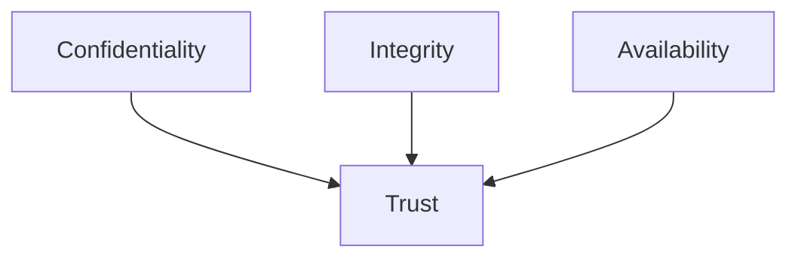
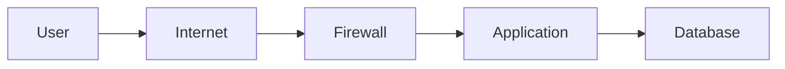
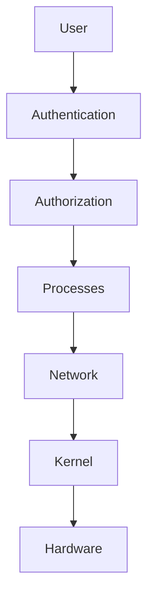
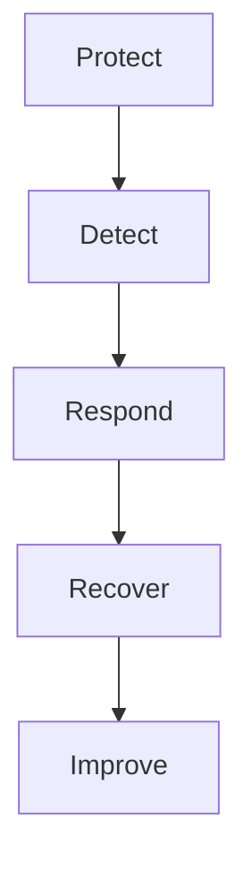
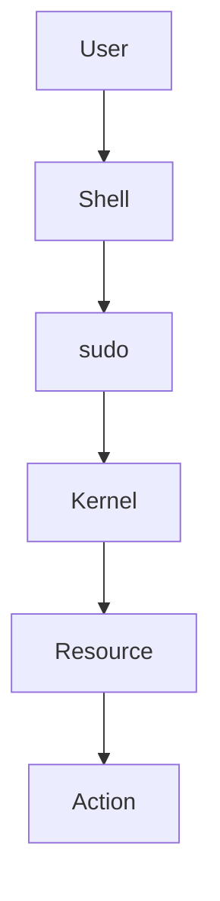

# 32 - Security Best Practices

---

# The Big Engineering Problem

Imagine you build a system.

It works perfectly.

Then someone asks:

```text
Who can access it?

↓

Who can modify it?

↓

Who can execute it?

↓

Who can destroy it?

↓

Who can steal data?

↓

Who can impersonate users?
```

Suddenly everything changes.

Building software is easy.

Building trustworthy software is difficult.

Security exists because computers cannot trust anything by default.

---

# Why Does Security Exist?

Because computers operate in hostile environments.

Examples:

```text
Human Mistakes

↓

Misconfigurations

↓

Credential Leaks

↓

Malicious Actors

↓

Compromised Systems

↓

Software Vulnerabilities
```

Security is not optional.

It is a survival mechanism.

---

# What Is Security?

Simple definition:

```text
Security = Trust Management
```

Traditional definition:

```text
Protecting systems from unauthorized access and damage.
```

For engineers:

```text
Assets

↓

Threats

↓

Risk

↓

Protection

↓

Verification
```

---

# Mental Model: A Castle

Imagine a castle.

A castle is not one giant wall.

It has layers.

```text
Moat

↓

Outer Wall

↓

Inner Wall

↓

Guard Tower

↓

Vault
```

Modern systems work the same way.

---

# First Principles Thinking

Every secure system answers five questions.

```text
What Are We Protecting?

↓

Who Are We Protecting Against?

↓

How Can It Be Attacked?

↓

How Can It Be Reduced?

↓

How Can We Detect Attacks?
```

---

# The Biggest Beginner Mistake

Beginners think:

```text
Security

↓

Install Antivirus
```

Engineers think:

```text
Security

↓

Continuous Risk Management
```

---

# Security Is Everywhere

This is important.

```text
Laptop

↓

Linux Server

↓

Containers

↓

Cloud

↓

Microservices

↓

Distributed Systems
```

Security never disappears.

It only changes form.

---

# The CIA Triad

One of the most important security models.

```text
Confidentiality

Integrity

Availability
```

---

# Confidentiality

Question:

```text
Who Can See Data?
```

Examples:

```text
Passwords

Secrets

API Keys

Customer Data
```

---

# Integrity

Question:

```text
Who Can Modify Data?
```

Examples:

```text
Configurations

Databases

Source Code

Logs
```

---

# Availability

Question:

```text
Can The System Continue Working?
```

Examples:

```text
Servers

Databases

Networks

Applications
```

---

# Visual



---

# Security Is Trust Boundaries

This concept is extremely important.

Every system contains boundaries.

Example:

```text
Internet

↓

Load Balancer

↓

Application

↓

Database
```

Each transition is a trust boundary.

---

# Trust Boundary Diagram



Every arrow must be protected.

---

# The Principle Of Least Privilege

One of the most important engineering principles.

Never give more access than necessary.

Bad:

```text
Everyone

↓

Administrator Access
```

Good:

```text
User

↓

Minimal Access
```

---

# Visual

```text
Too Much Permission

↓

Huge Risk


Minimal Permission

↓

Small Risk
```

---

# Linux Security Layers

Linux security is built in layers.

```text
Users

↓

Groups

↓

Permissions

↓

Sudo

↓

Capabilities

↓

SELinux/AppArmor

↓

Firewall
```

---

# Layered Security Architecture



---

# Authentication vs Authorization

This is one of the most important distinctions.

Authentication:

```text
Who Are You?
```

Authorization:

```text
What Are You Allowed To Do?
```

---

# Password Security

Never:

```text
Hardcode Passwords
```

Bad:

```bash
PASSWORD=admin123
```

Good:

```bash
PASSWORD=$DB_PASSWORD
```

---

# Environment Variables

Use:

```text
Secrets Manager

↓

Environment Variables

↓

Vault Systems
```

Never commit secrets.

---

# The Secret Leakage Problem

Never do this.

```bash
echo $DATABASE_PASSWORD
```

inside logs.

Logs live forever.

---

# Input Validation

Never trust input.

Assume:

```text
All Input Is Untrusted
```

Always validate.

---

# Example

Bad:

```bash
rm $USER_INPUT
```

Good:

```bash
rm -- "$USER_INPUT"
```

---

# Quote Variables

This is extremely important.

Bad:

```bash
rm $file
```

Good:

```bash
rm "$file"
```

---

# Why?

Suppose:

```text
linux fundamentals.pdf
```

Without quotes:

```text
linux

fundamentals.pdf
```

Broken behavior.

---

# Use Safe Bash Defaults

Almost every production script should start with:

```bash
set -euo pipefail
```

This gives:

```text
Stop On Errors

↓

Undefined Variables Fail

↓

Pipeline Errors Fail
```

---

# Temporary Files

Bad:

```bash
TEMP=/tmp/data.txt
```

Good:

```bash
mktemp
```

Because:

```text
Predictable Names

↓

Security Risk
```

---

# Safe Temporary File Workflow

```bash
temp_file=$(mktemp)

trap 'rm -f "$temp_file"' EXIT
```

---

# Sudo Best Practices

Avoid:

```bash
sudo everything
```

Prefer:

```text
Small Scoped Permissions
```

---

# The Root User Problem

Root can do everything.

Therefore:

```text
Root

=

Huge Blast Radius
```

Minimize root usage.

---

# File Permissions

Follow:

```text
Least Privilege
```

Examples:

Files:

```text
644
```

Directories:

```text
755
```

Secrets:

```text
600
```

---

# Security Logging

Always log:

```text
Authentication Events

↓

Permission Changes

↓

Failures

↓

Unexpected Actions
```

---

# Security Lifecycle



---

# Bash Injection Problem

Bad:

```bash
eval "$USER_INPUT"
```

Never do this.

This is dangerous.

---

# Dangerous Commands

Be extremely careful.

```bash
eval

bash -c

sudo rm -rf

curl | bash
```

These are high-risk patterns.

---

# Secure Automation Workflow

```text
Validate

↓

Sanitize

↓

Authorize

↓

Execute

↓

Log
```

---

# Linux Internals

Suppose:

```bash
sudo systemctl restart nginx
```

Internally:

```text
User

↓

sudo

↓

Authentication

↓

Kernel Permission Check

↓

Action
```

---

# Internal Architecture



---

# Docker Connection

Containers are security boundaries.

```text
Container

↓

Namespaces

↓

cgroups

↓

Isolation
```

---

# Kubernetes Connection

Kubernetes security:

```text
Pods

↓

RBAC

↓

Secrets

↓

Network Policies
```

---

# Cloud Connection

Cloud security becomes:

```text
IAM

↓

Networking

↓

Encryption

↓

Policies
```

---

# Platform Engineering Connection

Platforms automate trust.

```text
Policies

↓

Permissions

↓

Guardrails
```

---

# Distributed Systems Connection

Distributed systems continuously ask:

```text
Who Can Talk To Whom?
```

---

# Zero Trust Architecture

Modern systems increasingly use:

```text
Trust Nothing

↓

Verify Everything
```

---

# Security Engineering Workflow

```text
Assets

↓

Threats

↓

Risk Analysis

↓

Protection

↓

Detection

↓

Recovery
```

---

# Common Mistakes

## Mistake 1

Hardcoding secrets.

---

## Mistake 2

Ignoring permissions.

---

## Mistake 3

Using root everywhere.

---

## Mistake 4

Trusting user input.

---

## Mistake 5

Ignoring logs.

---

## Mistake 6

Using unsafe temp files.

---

## Mistake 7

Blindly running:

```bash
curl URL | bash
```

---

# Troubleshooting Framework

```text
Incident

↓

Detect

↓

Investigate

↓

Contain

↓

Recover

↓

Document

↓

Improve
```

---

# Production Best Practices

Always:

```text
Use Least Privilege

Validate Input

Quote Variables

Protect Secrets

Enable Logging

Avoid Root

Use Layers Of Defense
```

---

# Engineering Mindset

Do not think:

```text
Security = Protection
```

Think:

```text
Security = Managing Trust Boundaries
```

Because every system is ultimately a collection of trust decisions.

---

# Interview Questions

## Beginner

What is the CIA triad?

Difference between authentication and authorization?

What is least privilege?

---

## Intermediate

Why should you avoid hardcoded secrets?

Why is `set -euo pipefail` important?

What is a trust boundary?

---

## Advanced

What is Zero Trust?

How does Kubernetes implement security?

Why is security a systems problem?

---

# Learning Checklist

```text
☑ Understand CIA triad

☑ Understand trust boundaries

☑ Understand least privilege

☑ Understand secret management

☑ Understand secure scripting

☑ Understand layered security

☑ Understand modern security systems
```

---

# Mind Map

```text
Security Engineering

├── Trust Boundaries

│

├── CIA Triad

│

├── Authentication

│

├── Authorization

│

├── Least Privilege

│

├── Secret Management

│

├── Logging

│

├── Zero Trust

│

├── Cloud

│

├── Kubernetes

│

└── Troubleshooting
```

---

# Golden Rules

### Rule 1

Trust nothing by default.

---

### Rule 2

Always verify.

---

### Rule 3

Least privilege everywhere.

---

### Rule 4

Secrets are not code.

---

### Rule 5

Every system has trust boundaries.

---

### Rule 6

Layered security wins.

---

### Rule 7

Security is continuous risk management.

---

# First Principles Recap

```text
Assets Exist

↓

Threats Exist

↓

Trust Is Limited

↓

Protect Systems

↓

Detect Problems

↓

Recover Systems

↓

Continuously Improve
```

# Key Takeaway

```text
Search Primitive

↓

Automation Primitive

↓

Failure Engineering Primitive

↓

Reality Modeling Primitive

↓

Systems Optimization Primitive

↓

Security Engineering Primitive ⭐⭐⭐⭐⭐
```

**Senior engineers are not people who lock systems down.**

**Senior engineers are people who design trustworthy systems.**
