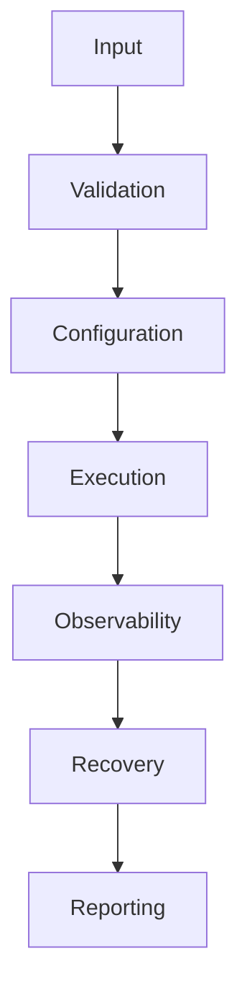
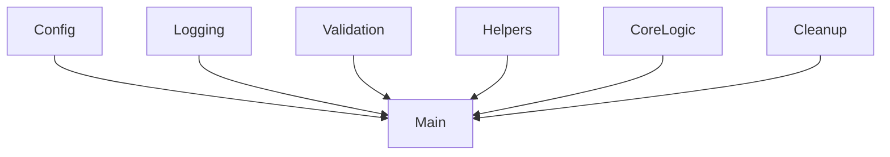
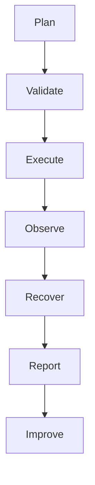
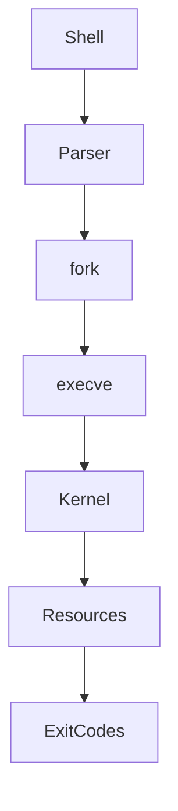

# 33 - Production Bash Patterns

---

# The Big Engineering Problem

Imagine a startup.

Initially:

```text
1 server

↓

1 script

↓

1 engineer
```

Everything is simple.

Then growth happens.

```text
10 servers

↓

100 servers

↓

1000 servers

↓

10000 servers
```

Suddenly simple scripts become dangerous.

Problems appear.

```text
Duplicate scripts

↓

Inconsistent behavior

↓

Hidden failures

↓

Poor logging

↓

No recovery

↓

Security risks

↓

Human errors
```

At scale, Bash scripts become infrastructure.

Infrastructure must be engineered.

This is why production Bash patterns exist.

---

# Why Does Production Bash Exist?

Because infrastructure eventually becomes automation.

Examples:

```text
Deploy Applications

↓

Backup Databases

↓

Rotate Logs

↓

Restart Services

↓

Monitor Systems

↓

Audit Security

↓

Manage Servers
```

Humans cannot scale.

Automation must scale.

---

# What Are Production Bash Patterns?

Simple definition:

```text
Production Bash Patterns = Reusable Infrastructure Design Patterns
```

Traditional definition:

```text
Best practices for building maintainable Bash scripts.
```

For engineers:

```text
Automation

↓

Reliability

↓

Security

↓

Observability

↓

Scalability
```

---

# Mental Model: Bash Is A Small Operating System

Beginners think:

```text
Bash

↓

Commands
```

Engineers think:

```text
Input

↓

Decision Engine

↓

Automation Engine

↓

Execution Engine

↓

Observability Engine

↓

Recovery Engine
```

A production Bash script is a mini-system.

---

# First Principles Thinking

Every production automation system repeatedly does:

```text
Input

↓

Validate

↓

Authorize

↓

Execute

↓

Observe

↓

Recover

↓

Report
```

---

# The Evolution Of Bash

```text
Commands

↓

Scripts

↓

Automation

↓

Infrastructure

↓

Platforms

↓

Systems Engineering
```

---

# The Production Bash Architecture



---

# Pattern 1: The Safe Script Template ⭐⭐⭐⭐⭐

Every production script should start with:

```bash
#!/usr/bin/env bash

set -euo pipefail

IFS=$'\n\t'

readonly SCRIPT_NAME=$(basename "$0")

readonly TIMESTAMP=$(date +%F_%T)
```

---

# Why?

```text
Fail Fast

↓

Prevent Hidden Errors

↓

Safer Parsing

↓

Predictable Behavior
```

---

# Pattern 2: Configuration Pattern ⭐⭐⭐⭐⭐

Never hardcode values.

Bad:

```bash
DB_HOST=localhost
```

Good:

```bash
DB_HOST=${DB_HOST:-localhost}
```

Visual:

```text
Environment

↓

Configuration

↓

Script
```

---

# Pattern 3: Centralized Logging Pattern ⭐⭐⭐⭐⭐

Bad:

```bash
echo "Deploying"
```

Good:

```bash
log_info() {

echo "[INFO] $*"

}

log_error() {

echo "[ERROR] $*" >&2

}
```

Visual:

```text
Actions

↓

Logs

↓

Humans
```

---

# Pattern 4: Structured Logging ⭐⭐⭐⭐⭐

Instead of:

```text
Deploying...
```

Do:

```text
2026-06-20 INFO Deployment Started
```

---

# Visual

```text
Timestamp

↓

Level

↓

Event

↓

Message
```

---

# Pattern 5: Validation Layer ⭐⭐⭐⭐⭐

Never trust input.

Example:

```bash
validate_file() {

[[ -f "$1" ]]

}
```

---

# Validation Pipeline

```text
Input

↓

Validate

↓

Reject Or Accept
```

---

# Pattern 6: Dependency Checking ⭐⭐⭐⭐⭐

Always verify tools exist.

```bash
require_command() {

command -v "$1" >/dev/null

}
```

Usage:

```bash
require_command docker

require_command jq
```

---

# Pattern 7: Cleanup Pattern ⭐⭐⭐⭐⭐

Always clean resources.

```bash
cleanup() {

rm -f "$TEMP_FILE"

}

trap cleanup EXIT
```

---

# Pattern 8: Error Handler Pattern ⭐⭐⭐⭐⭐

```bash
handle_error() {

echo "Failed at line $1"

}

trap 'handle_error $LINENO' ERR
```

---

# Pattern 9: Retry Pattern ⭐⭐⭐⭐⭐

Production systems retry.

```text
Failure

↓

Wait

↓

Retry

↓

Success
```

Example:

```bash
retry() {

for i in {1..3}

do

"$@" && return 0

sleep 2

done

return 1

}
```

---

# Pattern 10: Health Check Pattern ⭐⭐⭐⭐⭐

Always verify systems.

```bash
health_check() {

curl -sf http://localhost:3000

}
```

---

# Pattern 11: Lock File Pattern ⭐⭐⭐⭐⭐

Prevent multiple executions.

```bash
LOCK=/tmp/myscript.lock

if [[ -f "$LOCK" ]]

then

exit 1

fi

touch "$LOCK"

trap 'rm -f "$LOCK"' EXIT
```

---

# Visual

```text
Script1 Running

↓

Lock Created

↓

Script2 Blocked
```

---

# Pattern 12: Dry Run Pattern ⭐⭐⭐⭐⭐

Very important.

Never immediately execute.

```bash
DRY_RUN=true
```

Visual:

```text
Plan

↓

Verify

↓

Execute
```

---

# Pattern 13: Idempotency Pattern ⭐⭐⭐⭐⭐

This is one of the biggest concepts.

Running twice should not break things.

Bad:

```bash
mkdir logs
```

Good:

```bash
mkdir -p logs
```

---

# Visual

```text
Run Once

↓

Works


Run Twice

↓

Still Works
```

---

# Pattern 14: Separation Of Concerns ⭐⭐⭐⭐⭐

Do not build giant scripts.

Separate:

```text
Configuration

↓

Validation

↓

Business Logic

↓

Logging

↓

Cleanup
```

---

# Recommended Script Structure

```text
script.sh

├── Config

├── Constants

├── Logging

├── Validation

├── Helpers

├── Core Logic

├── Cleanup

└── Main
```

---

# Visual Architecture



---

# Pattern 15: Main Function Pattern ⭐⭐⭐⭐⭐

Avoid:

```bash
100 lines

100 lines

100 lines
```

Do:

```bash
main() {

validate

deploy

verify

}

main "$@"
```

---

# Pattern 16: The 3 Layer Architecture ⭐⭐⭐⭐⭐

```text
Input Layer

↓

Logic Layer

↓

Infrastructure Layer
```

---

# Pattern 17: Observability Pattern ⭐⭐⭐⭐⭐

Every automation should answer:

```text
What Happened?

↓

When?

↓

Why?

↓

Who Triggered It?
```

---

# Pattern 18: Timeout Pattern ⭐⭐⭐⭐⭐

Never wait forever.

Bad:

```bash
curl api
```

Good:

```bash
curl --max-time 10 api
```

---

# Pattern 19: Resource Limiting Pattern ⭐⭐⭐⭐⭐

Protect systems.

```text
CPU

Memory

Disk

Network
```

must have limits.

---

# Pattern 20: Exit Codes Pattern ⭐⭐⭐⭐⭐

Create predictable behavior.

```text
0

↓

Success

1

↓

Failure
```

---

# The Production Automation Lifecycle



---

# Linux Internals

Suppose:

```bash
./deploy.sh
```

Internally:

```text
Shell

↓

Parser

↓

fork()

↓

execve()

↓

Kernel

↓

Resources

↓

Exit Codes
```

---

# Internal Architecture



---

# Docker Connection

Production containers need:

```text
Health Checks

↓

Logging

↓

Restart Policies

↓

Resource Limits
```

---

# Kubernetes Connection

Kubernetes controllers implement these patterns at scale.

```text
Desired State

↓

Validation

↓

Execution

↓

Observability

↓

Recovery
```

---

# Cloud Connection

Cloud automation is giant-scale Bash.

```text
Resources

↓

Policies

↓

Automation

↓

Recovery
```

---

# Platform Engineering Connection

Platform teams build:

```text
Reusable Automation

↓

Guardrails

↓

Golden Paths
```

---

# SRE Connection

SRE teams automate reliability.

```text
Observe

↓

Detect

↓

Recover
```

---

# Distributed Systems Connection

Distributed systems repeatedly do:

```text
Coordinate

↓

Execute

↓

Observe

↓

Recover
```

---

# Production Anti-Patterns 🚫

Never do:

```text
Giant Scripts

Hardcoded Secrets

Blind sudo

No Logging

No Validation

No Recovery

No Cleanup

No Timeouts
```

---

# Production Bash Checklist

```text
☑ set -euo pipefail

☑ Logging

☑ Validation

☑ Dependency Checks

☑ Cleanup

☑ Retries

☑ Timeouts

☑ Health Checks

☑ Lock Files

☑ Idempotency

☑ Main Function

☑ Observability
```

---

# Engineering Mindset

Do not think:

```text
Bash = Scripts
```

Think:

```text
Bash = Infrastructure Automation Platform
```

Because every company eventually automates infrastructure.

---

# Interview Questions

## Beginner

Why use `set -euo pipefail`?

What is idempotency?

What is a lock file?

---

## Intermediate

Why do we need retries?

Why separate configuration from logic?

Why are health checks important?

---

## Advanced

How does Kubernetes implement these patterns?

How does SRE use these ideas?

How does Platform Engineering automate them?

---

# Learning Checklist

```text
☑ Understand production architecture

☑ Understand idempotency

☑ Understand retries

☑ Understand health checks

☑ Understand lock files

☑ Understand observability

☑ Understand infrastructure automation
```

---

# Mind Map

```text
Production Bash Patterns

├── Safety

├── Validation

├── Logging

├── Cleanup

├── Retries

├── Health Checks

├── Idempotency

├── Observability

├── Cloud

├── SRE

└── Platform Engineering
```

---

# Golden Rules

### Rule 1

Scripts become infrastructure.

---

### Rule 2

Infrastructure must be reliable.

---

### Rule 3

Always validate inputs.

---

### Rule 4

Automation must be observable.

---

### Rule 5

Recovery is mandatory.

---

### Rule 6

Idempotency is power.

---

### Rule 7

Production Bash is systems engineering.

---

# First Principles Recap

```text
Infrastructure Grows

↓

Humans Cannot Scale

↓

Automation Becomes Infrastructure

↓

Infrastructure Needs Engineering

↓

Reliable Patterns Emerge

↓

Systems Become Platforms
```

# Key Takeaway

```text
Commands

↓

Scripts

↓

Automation

↓

Infrastructure

↓

Platform Engineering ⭐⭐⭐⭐⭐
```

**Senior engineers do not write bigger scripts.**

**Senior engineers build reliable automation systems.**
