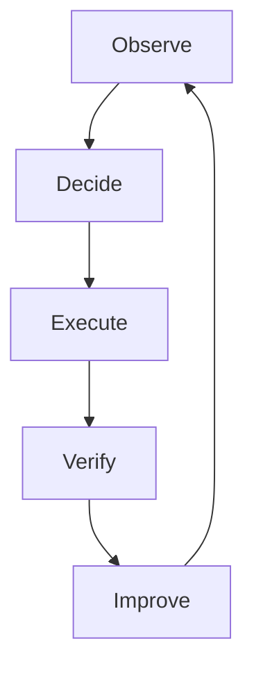
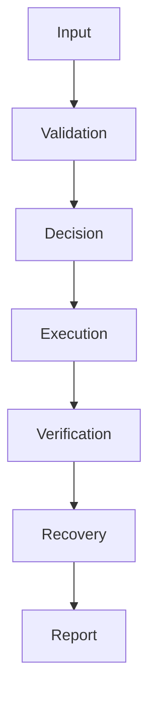
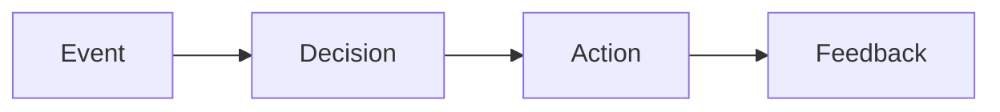
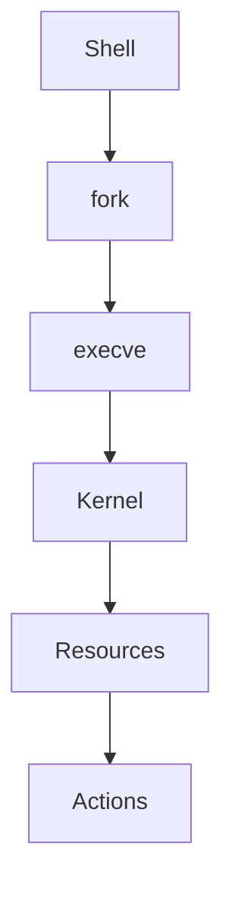

# 34 - Automation Engineering

---

# The Big Engineering Problem

Imagine a company.

Initially:

```text
1 Developer

↓

1 Server

↓

1 Application
```

Life is simple.

Then growth happens.

```text
10 Servers

↓

100 Servers

↓

1000 Servers

↓

10000 Servers

↓

100000 Servers
```

Suddenly humans become the bottleneck.

Problems appear.

```text
Manual Deployments

↓

Human Errors

↓

Slow Incident Response

↓

Inconsistent Configurations

↓

Repeated Work

↓

Operational Overhead
```

At scale, humans cannot operate systems manually.

Systems must operate themselves.

This is automation engineering.

---

# Why Does Automation Engineering Exist?

Because humans do not scale.

Everything eventually becomes repetitive.

Examples:

```text
Deploy Applications

↓

Restart Services

↓

Rotate Logs

↓

Backup Databases

↓

Provision Infrastructure

↓

Monitor Systems

↓

Recover Failures
```

Repeating work is expensive.

Automation solves this.

---

# What Is Automation Engineering?

Simple definition:

```text
Automation Engineering = Designing Systems That Perform Work Without Humans
```

Traditional definition:

```text
The engineering discipline of automating repetitive tasks and processes.
```

For engineers:

```text
Inputs

↓

Rules

↓

Actions

↓

Feedback

↓

Continuous Improvement
```

---

# Mental Model: The Factory

Imagine a modern factory.

Humans do not build every car manually.

The factory operates itself.

```text
Raw Materials

↓

Assembly Line

↓

Quality Checks

↓

Finished Product
```

Automation systems work the same way.

---

# First Principles Thinking

Every automation system repeatedly performs:

```text
Observe

↓

Decide

↓

Execute

↓

Verify

↓

Improve
```

This loop powers everything.

---

# The Evolution Of Engineering

```text
Manual Work

↓

Scripts

↓

Automation

↓

Infrastructure

↓

Platforms

↓

Self Operating Systems
```

---

# Automation Is Everywhere

You already use it daily.

```text
GitHub Actions

↓

Docker

↓

Kubernetes

↓

Terraform

↓

Cloud Platforms

↓

Monitoring Systems
```

All are automation systems.

---

# The Universal Automation Loop



This is one of the most important diagrams in engineering.

---

# The Five Pillars Of Automation Engineering

Every automation system needs:

```text
Inputs

↓

Decision Logic

↓

Execution Engine

↓

Observability

↓

Recovery
```

---

# Pillar 1: Inputs

Systems consume information.

Examples:

```text
Files

Events

Metrics

APIs

Schedules

User Requests
```

---

# Pillar 2: Decision Engine

Automation must answer:

```text
Should We Act?
```

Example:

```text
CPU > 90%

↓

Scale Servers
```

---

# Pillar 3: Execution Engine

This is where Bash lives.

Examples:

```text
Run Commands

↓

Restart Services

↓

Deploy Applications
```

---

# Pillar 4: Observability

Every automation system must answer:

```text
What Happened?

↓

When?

↓

Why?

↓

Did It Succeed?
```

---

# Pillar 5: Recovery

Failures are guaranteed.

Systems must recover.

```text
Failure

↓

Retry

↓

Fallback

↓

Alert
```

---

# The Automation Lifecycle



---

# Automation Is A Feedback Loop

This is extremely important.

Automation is NOT:

```text
Input

↓

Output
```

Automation is:

```text
Input

↓

Action

↓

Feedback

↓

Improvement
```

---

# Levels Of Automation

## Level 0: Manual Systems

```text
Humans Do Everything
```

---

## Level 1: Script Automation

```text
Human

↓

Script

↓

Task
```

---

## Level 2: Scheduled Automation

```text
Cron

↓

Script

↓

Task
```

---

## Level 3: Event Driven Automation

```text
Event

↓

Automation

↓

Action
```

---

## Level 4: Self Healing Systems

```text
Failure

↓

Detect

↓

Recover
```

---

## Level 5: Autonomous Platforms

```text
Observe

↓

Decide

↓

Execute

↓

Improve
```

---

# Event Driven Architecture

Modern systems are event driven.

```text
CPU Spike

↓

Scale Pods

↓

Traffic Reduced
```

---

# Architecture Diagram



---

# The Automation Hierarchy

```text
Commands

↓

Scripts

↓

Jobs

↓

Pipelines

↓

Platforms

↓

Autonomous Systems
```

---

# Bash's Role In Automation

Bash is the glue.

It connects everything.

```text
Filesystems

↓

Networking

↓

Containers

↓

Cloud APIs

↓

Services
```

---

# The Automation Building Blocks

Every automation system uses these.

```text
Inputs

Conditions

Loops

Functions

Pipelines

Retries

Logging

Recovery
```

You already learned them.

---

# Automation Pattern 1: Scheduled Automation

Examples:

```text
Daily Backups

↓

Log Rotation

↓

Database Cleanup
```

Tools:

```text
cron

systemd timers
```

---

# Automation Pattern 2: Event Driven Automation

Examples:

```text
Git Push

↓

CI Pipeline
```

---

# Automation Pattern 3: Infrastructure Automation

Examples:

```text
Provision Servers

↓

Configure Systems

↓

Deploy Applications
```

---

# Automation Pattern 4: Self Healing Automation

Examples:

```text
Pod Crashes

↓

Restart Pod
```

---

# Automation Pattern 5: Policy Based Automation

Examples:

```text
If CPU > 80%

↓

Scale Infrastructure
```

---

# The Automation Maturity Model

```text
Reactive

↓

Repeatable

↓

Reliable

↓

Predictable

↓

Autonomous
```

---

# Linux Internals

Suppose:

```bash
./backup.sh
```

Internally:

```text
Shell

↓

fork()

↓

execve()

↓

Kernel

↓

Filesystem

↓

Exit Codes
```

Everything is execution orchestration.

---

# Internal Architecture



---

# CI/CD Connection

CI/CD is automation engineering.

```text
Code

↓

Build

↓

Test

↓

Deploy

↓

Verify
```

---

# Docker Connection

Docker automates packaging.

```text
Source Code

↓

Image

↓

Container
```

---

# Kubernetes Connection

Kubernetes is giant-scale automation engineering.

```text
Observe

↓

Desired State

↓

Actions

↓

Recovery
```

---

# Cloud Connection

Cloud systems automate infrastructure.

```text
Infrastructure

↓

Policies

↓

Actions
```

---

# Terraform Connection

Terraform automates infrastructure creation.

```text
Code

↓

Resources

↓

Cloud Infrastructure
```

---

# Platform Engineering Connection

Platform engineering automates developer workflows.

```text
Golden Paths

↓

Guardrails

↓

Self Service Platforms
```

---

# SRE Connection

SRE automates reliability.

```text
Observe

↓

Detect

↓

Recover
```

---

# Distributed Systems Connection

Distributed systems automate coordination.

```text
Nodes

↓

Consensus

↓

Actions

↓

Recovery
```

---

# The Future Of Automation

The world is moving toward:

```text
AI Systems

↓

Agent Systems

↓

Autonomous Infrastructure

↓

Self Healing Platforms
```

Automation engineering is becoming more important every year.

---

# Anti Patterns 🚫

Never build systems that are:

```text
Manual

Fragile

Hidden

Unobservable

Non Recoverable

Inconsistent
```

---

# Automation Engineering Checklist

```text
☑ Inputs

☑ Validation

☑ Decision Engine

☑ Logging

☑ Retries

☑ Recovery

☑ Monitoring

☑ Feedback Loops

☑ Documentation

☑ Continuous Improvement
```

---

# Engineering Mindset

Do not think:

```text
Automation = Scripts
```

Think:

```text
Automation = Designing Self Operating Systems
```

---

# Interview Questions

## Beginner

Why does automation exist?

What is an event driven system?

What is a feedback loop?

---

## Intermediate

Difference between scheduled and event driven automation?

Why is observability important?

What is self healing?

---

## Advanced

How does Kubernetes automate infrastructure?

How does SRE use automation?

Why is automation a systems engineering discipline?

---

# Learning Checklist

```text
☑ Understand automation lifecycle

☑ Understand event driven systems

☑ Understand feedback loops

☑ Understand self healing systems

☑ Understand platform engineering

☑ Understand cloud automation

☑ Understand autonomous systems
```

---

# Mind Map

```text
Automation Engineering

├── Inputs

├── Decision Engines

├── Execution

├── Feedback Loops

├── Recovery

├── Cloud

├── Kubernetes

├── Platform Engineering

├── SRE

└── Distributed Systems
```

---

# Golden Rules

### Rule 1

Humans do not scale.

---

### Rule 2

Automation is a feedback loop.

---

### Rule 3

Everything eventually becomes infrastructure.

---

### Rule 4

Infrastructure eventually becomes platforms.

---

### Rule 5

Platforms eventually become autonomous systems.

---

### Rule 6

Observability is mandatory.

---

### Rule 7

Reliable automation is more valuable than clever automation.

---

# First Principles Recap

```text
Manual Work Exists

↓

Humans Become Bottlenecks

↓

Automation Emerges

↓

Automation Becomes Infrastructure

↓

Infrastructure Becomes Platforms

↓

Platforms Become Autonomous Systems
```

# Key Takeaway

```text
Commands

↓

Scripts

↓

Automation

↓

Infrastructure

↓

Platform Engineering

↓

Automation Engineering ⭐⭐⭐⭐⭐
```

**Senior engineers do not automate tasks.**

**Senior engineers design systems that automate systems.**
